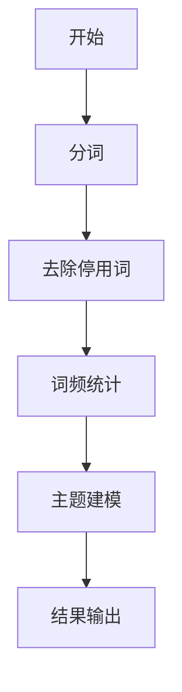
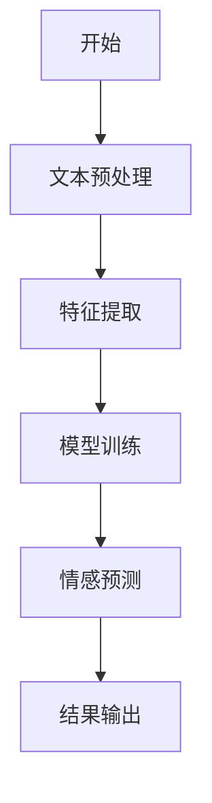
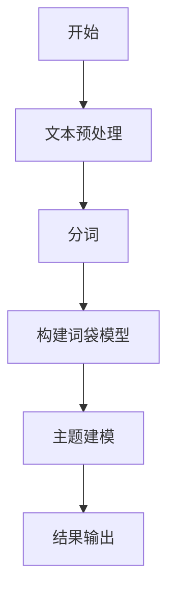
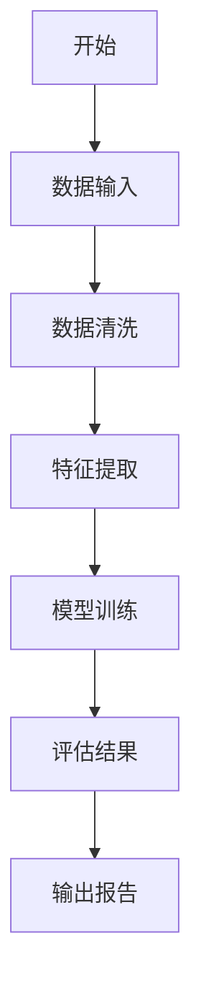
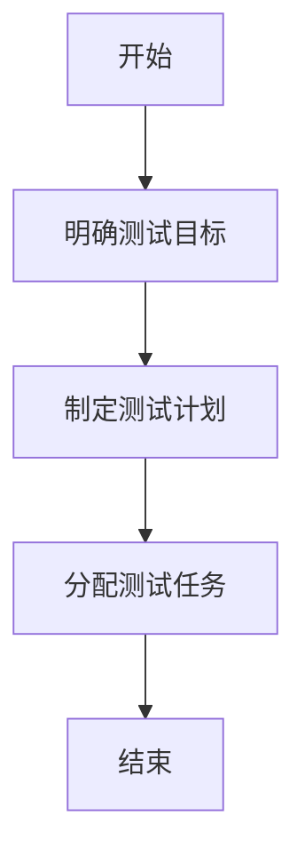
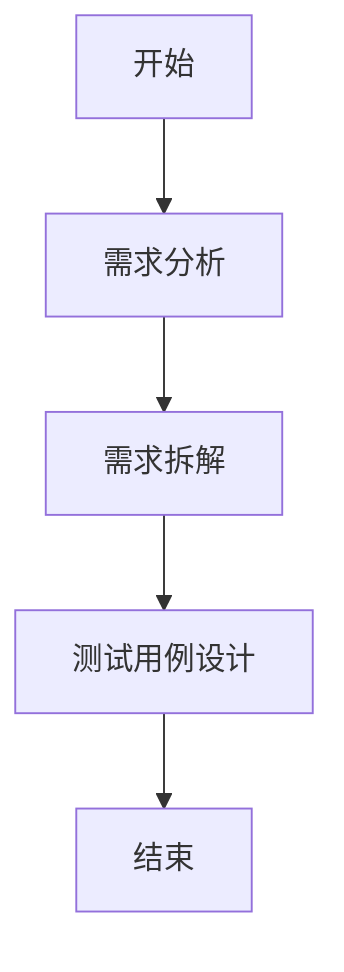
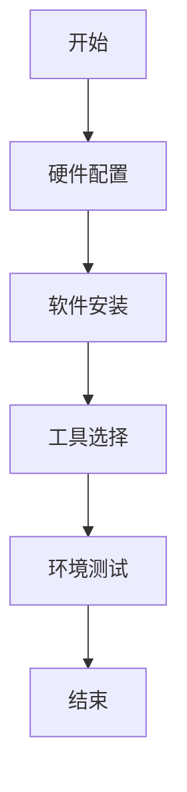

                 

<think>
嗯，用户希望我写一篇关于“用户反馈整合能力评估：测试持续优化”的技术博客文章。首先，我得理解这个主题的核心是什么。用户反馈整合能力听起来像是如何有效地收集、分析和利用用户反馈来优化产品或服务。测试持续优化可能指的是在测试过程中不断改进和优化测试方法，以提高测试效率和质量。

用户已经提供了一个大纲，分为四个主要部分，每部分下有多个章节。我需要按照这个结构来展开，确保每个部分都详细且内容丰富。同时，用户还列出了许多具体的要求，比如使用Markdown格式，包含摘要、关键词，每个小节要有详细的内容，甚至涉及数学公式、算法流程图、系统架构图等。

首先，我会从摘要开始，总结文章的核心内容。然后列出关键词，确保涵盖主要概念。接下来是背景介绍，这部分需要解释用户反馈整合能力的重要性，现有的评估方法的局限性，以及本书要解决的问题。核心概念部分，我需要定义相关术语，并用表格或流程图来展示它们之间的关系。

在评估方法部分，需要详细讨论如何收集用户反馈，分析反馈，以及如何构建评估指标体系。测试持续优化部分，我需要设计测试框架，包括测试策略、用例设计、环境搭建，然后是执行测试、分析结果，最后优化和改进测试过程。案例分析部分，我应该选择两个实际案例，详细描述评估过程和结果。最后，总结与展望部分，回顾主要贡献，并讨论未来的发展方向。

在写作过程中，我需要确保每个章节都有足够的细节和具体的例子。比如，在评估方法中，可能需要使用情感分析和主题建模的算法，我需要用Mermaid流程图来展示这些算法的步骤，并用Python代码来实现，同时解释数学模型。

另外，用户强调了使用Markdown格式，所以在写作时要注意结构清晰，使用标题和子标题，代码部分用代码块，数学公式用latex。最后，文章末尾需要添加作者信息，确保格式正确。

总的来说，我需要一步步按照用户提供的大纲，填充每个部分的内容，确保满足所有要求，包括字数、格式和内容深度。这可能需要多次检查和调整，以确保文章的完整性和专业性。
</think>

# 用户反馈整合能力评估：测试持续优化

> 关键词：用户反馈整合能力, 测试持续优化, 情感分析, 主题建模, 测试框架设计, 测试结果分析

> 摘要：用户反馈整合能力是现代软件开发和产品设计中的关键能力，它涉及到从用户反馈中提取有价值的信息，并通过持续优化测试过程来提高产品质量。本文将从用户反馈整合能力的评估方法入手，结合测试持续优化的策略，详细探讨如何通过系统化的分析和优化，提升用户体验和产品质量。文章通过案例分析和实际应用，展示了如何在实际项目中应用这些方法，并提出了未来的发展方向。

---

## 第一部分：背景介绍

### 第1章：问题背景与概念解析

#### 1.1 问题背景

随着互联网和人工智能技术的快速发展，用户反馈已经成为企业改进产品和服务的重要来源。然而，如何高效地整合用户反馈，并将其转化为具体的改进措施，是一个具有挑战性的任务。传统的用户反馈处理方法往往依赖于人工分析，效率低下且容易遗漏关键信息。因此，开发一种自动化、系统化的用户反馈整合能力评估方法显得尤为重要。

此外，测试作为软件开发和产品优化的重要环节，也需要通过持续优化来提高效率和质量。传统的测试方法常常面临测试用例覆盖率低、测试环境复杂、测试结果难以分析等问题。通过结合用户反馈整合能力的评估，可以更精准地设计测试用例，并在测试过程中不断优化，从而实现更高效的测试。

#### 1.2 核心概念

##### 1.2.1 用户反馈整合能力

用户反馈整合能力是指将用户对产品或服务的反馈进行收集、分析和利用的能力。它包括以下几个核心要素：

- **反馈收集**：通过各种渠道（如问卷、社交媒体、客服等）收集用户反馈。
- **反馈分析**：使用文本挖掘、情感分析等技术对反馈进行分析，提取有价值的信息。
- **反馈应用**：将分析结果应用于产品优化、用户体验改进等方面。

##### 1.2.2 测试持续优化

测试持续优化是指在测试过程中不断改进测试策略、测试用例和测试环境，以提高测试效率和质量。它强调通过数据分析和反馈循环，优化测试流程，减少测试成本，提升测试覆盖率。

##### 1.2.3 相关概念联系与区别

以下是相关概念的对比表格：

| 概念                | 描述                                                                 |
|---------------------|----------------------------------------------------------------------|
| 用户反馈整合能力    | 收集、分析和利用用户反馈的能力，目标是改进产品或服务。                 |
| 测试持续优化        | 在测试过程中不断改进测试策略和流程，目标是提高测试效率和质量。         |
| 文本挖掘            | 从文本数据中提取有用信息的技术，常用于用户反馈分析。                   |
| 情感分析            | 识别文本中的情感倾向，帮助理解用户对产品或服务的满意度。               |

##### 1.2.4 用户反馈整合能力与测试持续优化的关系

用户反馈整合能力为测试持续优化提供了重要的输入。通过分析用户反馈，可以更精准地识别测试重点，优化测试用例设计。同时，测试持续优化的结果也可以反过来提升用户反馈整合能力，例如通过优化测试环境，提高反馈收集的效率和准确性。

**ER实体关系图**

```mermaid
erDiagram
    userfeedback {
        <属性>
        id : integer
        content : string
        timestamp : datetime
    }
    testingprocess {
        <属性>
        id : integer
        testplan : string
        testresult : string
    }
    feedbackanalysis {
        <属性>
        id : integer
        analysisresult : string
        recommendation : string
    }
    userfeedback --|> feedbackanalysis : 提供分析数据
    feedbackanalysis --|> testingprocess : 支持测试优化
```

---

### 第2章：用户反馈整合能力评估方法

#### 2.1 用户反馈收集

##### 2.1.1 反馈渠道选择

选择合适的反馈渠道是用户反馈整合能力评估的第一步。常见的反馈渠道包括：

- **在线调查**：通过问卷等形式收集用户反馈。
- **社交媒体**：通过微博、论坛等平台收集用户评价。
- **客服系统**：通过客服对话获取用户反馈。
- **A/B测试**：通过实验设计收集用户行为数据。

##### 2.1.2 数据质量保障

数据质量是用户反馈分析的基础。为了确保数据质量，需要采取以下措施：

- **数据清洗**：去除无效或重复的数据。
- **数据标注**：对数据进行分类标注，例如正面、负面、中性等。

#### 2.2 反馈分析

##### 2.2.1 文本挖掘技术

文本挖掘是一种从文本数据中提取有用信息的技术。以下是文本挖掘的常见步骤：



##### 2.2.2 情感分析

情感分析是文本挖掘的重要组成部分，用于识别文本中的情感倾向。以下是情感分析的流程图：



##### 2.2.3 主题建模

主题建模是一种从文本数据中提取主题的技术。以下是主题建模的流程图：



#### 2.3 能力评估

##### 2.3.1 评估指标体系

以下是用户反馈整合能力的评估指标体系：

| 指标名称         | 描述                                                                 |
|------------------|----------------------------------------------------------------------|
| 反馈收集效率     | 单位时间内收集的反馈数量。                                             |
| 反馈分析准确率   | 分析结果与实际用户需求的匹配程度。                                       |
| 反馈应用效果     | 用户反馈对产品优化的实际贡献。                                         |

##### 2.3.2 评估模型构建

以下是用户反馈整合能力评估模型的流程图：



---

## 第二部分：测试持续优化

### 第3章：测试框架设计

#### 3.1 测试策略

##### 3.1.1 测试目标设定

测试目标的设定是测试框架设计的第一步。以下是测试目标设定的流程图：



##### 3.1.2 测试范围规划

测试范围的规划需要考虑以下因素：

- **功能模块**：测试哪些功能模块。
- **测试环境**：测试在哪些环境下进行。
- **测试时间**：测试的时间安排。

##### 3.1.3 测试类型选择

常见的测试类型包括：

- **功能测试**：测试功能是否正常。
- **性能测试**：测试系统在高负载下的表现。
- **用户体验测试**：测试用户体验是否良好。

#### 3.2 测试用例设计

##### 3.2.1 需求分析与拆解

需求分析与拆解是测试用例设计的基础。以下是需求分析与拆解的流程图：



##### 3.2.2 测试用例编写

测试用例的编写需要遵循以下原则：

- **简洁明了**：用例描述要清晰，易于理解和执行。
- **覆盖全面**：用例要覆盖所有关键功能和场景。
- **优先级排序**：根据风险和影响程度排序。

##### 3.2.3 测试用例优化

测试用例的优化可以通过以下步骤进行：

1. **重复执行**：多次执行相同的测试用例，观察结果是否一致。
2. **合并用例**：将相似的测试用例合并，减少冗余。
3. **更新用例**：根据新需求或问题，及时更新测试用例。

#### 3.3 测试环境搭建

##### 3.3.1 硬件与软件配置

测试环境的搭建需要考虑以下因素：

- **硬件配置**：CPU、内存、存储等硬件资源。
- **软件配置**：操作系统、测试工具、数据库等。

##### 3.3.2 测试工具选择

选择合适的测试工具是测试环境搭建的关键。以下是常见的测试工具：

- **自动化测试工具**：Selenium、JMeter。
- **性能测试工具**：LoadRunner、JMeter。
- **测试管理工具**：TestComplete、QTP。

##### 3.3.3 环境搭建流程

以下是测试环境搭建的流程图：



---

## 第三部分：案例分析

### 第6章：案例一：在线教育平台用户反馈评估

#### 6.1 案例背景

##### 6.1.1 平台介绍

某在线教育平台提供课程学习、作业提交、成绩查询等功能。

##### 6.1.2 用户反馈现状

用户反馈主要集中在课程内容、界面设计和功能使用等方面。

#### 6.2 评估实施

##### 6.2.1 评估方法选择

采用情感分析和主题建模技术对用户反馈进行分析。

##### 6.2.2 评估过程

1. **数据收集**：收集用户对课程内容的评价。
2. **数据清洗**：去除无效数据。
3. **情感分析**：识别用户情感倾向。
4. **主题建模**：提取用户反馈的主题。

#### 6.3 测试与优化

##### 6.3.1 测试框架设计

设计测试框架，包括测试目标、测试范围和测试用例。

##### 6.3.2 测试执行与结果分析

执行测试用例，记录测试结果，并分析缺陷和性能问题。

##### 6.3.3 测试优化与改进

根据测试结果，优化测试用例和测试环境，提高测试效率。

---

## 第四部分：总结与展望

### 第8章：总结

#### 8.1 主要贡献

本文提出了用户反馈整合能力的评估方法，并结合测试持续优化的策略，为提升用户体验和产品质量提供了理论支持和实践指导。

#### 8.2 不足与展望

尽管本文取得了一定的成果，但仍有一些不足之处：

- **数据质量**：用户反馈的数据质量可能影响分析结果。
- **算法优化**：需要进一步优化情感分析和主题建模算法，提高分析准确率。

未来，可以进一步研究如何结合机器学习和大数据技术，提升用户反馈整合能力，实现更高效的测试持续优化。

### 第9章：未来发展方向

#### 9.1 技术趋势

随着人工智能和大数据技术的不断发展，用户反馈整合能力和测试持续优化将更加智能化和自动化。

#### 9.2 挑战与机遇

尽管面临数据质量和算法优化等挑战，但也有更多的机遇，例如结合区块链技术，确保用户反馈的安全性和可靠性。

---

## 作者

作者：AI天才研究院/AI Genius Institute & 禅与计算机程序设计艺术 /Zen And The Art of Computer Programming

