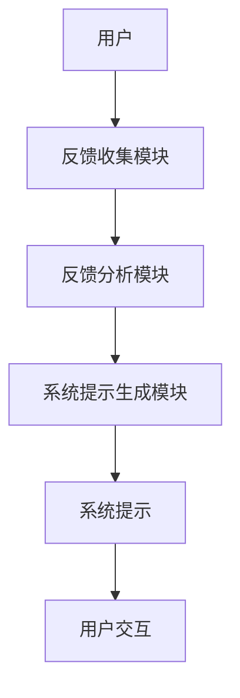
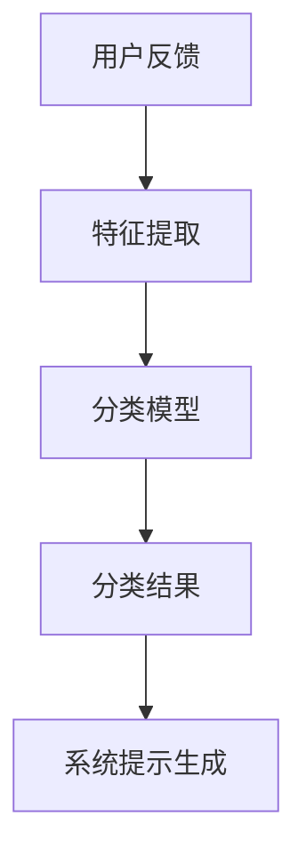
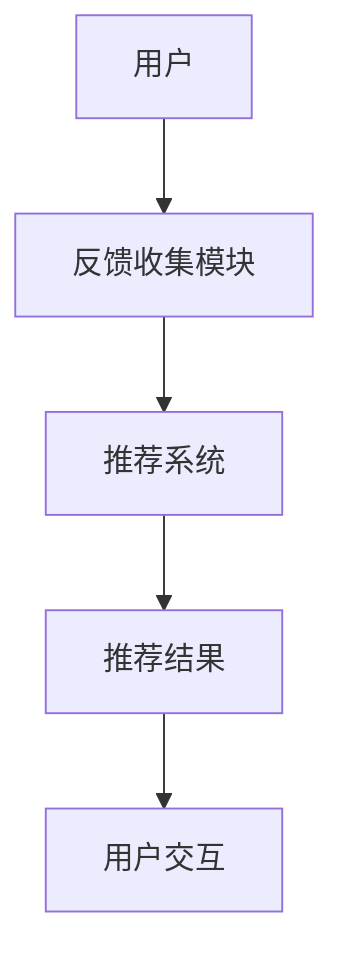

                 

<think>
嗯，用户希望我写一篇关于用户反馈整合的技术博客文章。他提供了详细的要求，包括标题、关键词、摘要和目录结构。看起来他需要一个结构清晰、内容详尽的文章，字数在10000到12000字之间。而且要使用markdown格式，每个章节都要有详细的内容，包括背景介绍、核心概念、算法原理、系统架构等。

首先，我需要理解用户的需求。他可能是一位技术专家，或者是一个团队的领导者，想要整合用户反馈来改进产品或服务。所以，这篇文章的目的是帮助读者理解如何有效地整合用户反馈，将其纳入系统提示中，从而优化用户体验。

接下来，我要分析用户提供的目录结构。文章分为七个步骤，每个步骤对应一个章节。每个章节下面还有小节，涉及定义、类型、原则、方法、技术、应用案例、挑战和未来方向。我需要确保每个部分都涵盖必要的内容，比如核心概念需要用表格对比，系统架构用mermaid图展示，算法部分要有数学模型和代码示例。

然后，考虑用户可能没说的深层需求。他可能希望文章不仅理论性强，还要有实际的应用案例和代码实现，这样读者可以更好地理解和实施。因此，我需要确保每个章节不仅有解释，还有具体的例子和代码片段。

在写作过程中，我可能会遇到一些挑战。比如，如何将复杂的系统架构用mermaid图清晰展示，或者如何用简单易懂的语言解释机器学习算法。这时候，我需要仔细思考，可能需要查阅相关资料，确保内容的准确性和可读性。

另外，我需要确保文章结构合理，逻辑连贯。从背景介绍开始，逐步深入到核心概念、方法、应用、挑战，最后展望未来。这样读者可以一步步了解整合用户反馈的重要性，以及如何在实际中应用这些方法。

还有，用户特别提到了要包括摘要和关键词，这有助于提高文章的可搜索性和吸引力。因此，我需要确保摘要简明扼要，涵盖文章的核心内容，而关键词则要精准反映文章的主题。

最后，检查所有要求是否都满足，包括字数、格式、内容完整性等。确保没有遗漏任何用户指定的部分，比如作者信息、注意事项和最佳实践。

总之，我需要一步步地按照用户的要求，构建一个全面而深入的用户反馈整合指南，帮助读者有效整合用户意见，提升产品或服务的质量。
</think>

# 用户反馈整合：将用户意见纳入提示

## 关键词：用户反馈整合，用户意见，系统提示，机器学习，用户体验优化，反馈机制

## 摘要：  
用户反馈整合是现代信息系统设计中的关键环节，旨在通过收集和分析用户意见，优化系统提示和交互流程。本文从用户反馈的定义、类型、整合方法到实际应用案例，系统地探讨了如何有效整合用户反馈以提升用户体验。文章还分析了当前整合过程中的挑战，并提出了相应的解决方案和未来发展方向。通过结合机器学习技术和系统架构优化，本文为读者提供了从理论到实践的全面指南。

---

## 目录

1. [背景介绍](#背景介绍)
2. [核心概念与联系](#核心概念与联系)
3. [用户反馈的整合方法](#用户反馈的整合方法)
4. [系统提示生成技术](#系统提示生成技术)
5. [实际应用案例](#实际应用案例)
6. [挑战与解决方案](#挑战与解决方案)
7. [未来发展方向](#未来发展方向)

---

## 背景介绍

### 1.1 用户反馈整合的定义

用户反馈整合是指将用户在使用系统或产品过程中提供的意见、建议、评分或其他形式的反馈，系统地收集、分析和应用到后续的产品设计或系统提示生成中的过程。其核心目标是通过用户的实际使用体验，不断优化系统的行为和输出，从而提升用户体验和满意度。

### 1.2 问题背景

在现代信息系统中，用户反馈是改进产品和服务的重要来源。然而，如何有效地整合用户反馈并将其纳入系统提示生成的过程中，仍然面临诸多挑战。例如：

- **反馈收集的多样性**：用户反馈可能以文本、评分、点击行为等多种形式存在，如何统一处理这些数据是一个难题。
- **反馈分析的复杂性**：用户反馈可能包含主观性和歧义性，如何准确理解用户的意图并将其转化为可操作的系统提示是一个技术挑战。
- **反馈应用的动态性**：用户需求和偏好会随时间变化，如何动态调整系统提示以适应这些变化是另一个重要问题。

### 1.3 问题解决

本文通过系统地分析用户反馈的整合过程，提出了一种结合机器学习和传统规则的混合方法，以解决上述问题。具体方法包括：

1. **多模态反馈收集**：通过多种渠道（如文本、评分、行为数据）收集用户反馈。
2. **反馈分析与预处理**：利用自然语言处理（NLP）和统计方法对反馈进行清洗和分类。
3. **基于机器学习的反馈整合**：通过训练模型，将用户反馈转化为可操作的提示或规则。
4. **动态提示生成**：根据反馈的实时变化，动态调整系统提示。

---

## 核心概念与联系

### 2.1 核心概念对比

以下是用户反馈整合中的几个核心概念对比：

| 概念 | 定义 | 特点 |
|------|------|------|
| 用户反馈 | 用户在使用系统过程中提供的意见、建议或行为数据 | 多样性、实时性、主观性 |
| 系统提示 | 系统根据用户反馈生成的指导性输出 | 动态性、可操作性、个性化 |
| 反馈整合 | 将用户反馈转化为系统提示的过程 | 综合性、动态性、技术驱动 |

### 2.2 实体关系图

以下是用户反馈整合过程中的实体关系图：



---

## 用户反馈的整合方法

### 3.1 多模态反馈收集

用户反馈可以以多种形式存在，例如：

1. **文本反馈**：用户通过评论、评分或关键词反馈意见。
2. **行为反馈**：用户通过点击、停留时间等行为数据反映偏好。
3. **评分反馈**：用户对产品或服务的评分（如1-5分）。

### 3.2 基于机器学习的反馈分析

为了将用户反馈转化为系统提示，可以使用机器学习模型进行分析。以下是基于文本分类的反馈分析流程：



以下是用于分类的朴素贝叶斯算法示例代码：

```python
from sklearn.naive_bayes import MultinomialNB
from sklearn.feature_extraction.text import TfidfVectorizer

# 示例数据
texts = ["服务很慢，需要改进", "界面友好，体验不错"]
y = [0, 1]

# 特征提取
vectorizer = TfidfVectorizer()
X = vectorizer.fit_transform(texts)

# 训练模型
model = MultinomialNB()
model.fit(X, y)
```

### 3.3 反馈预处理与清洗

用户反馈可能包含噪声或歧义性，因此需要进行预处理：

1. **分词**：将文本反馈分割成词语或短语。
2. **去停用词**：去除无意义的词语（如“的”、“是”）。
3. **情感分析**：判断反馈是正面、负面还是中性。

---

## 系统提示生成技术

### 4.1 基于规则的提示生成

对于简单的反馈，可以使用基于规则的方法生成提示。例如：

```python
if feedback.contains("服务慢"):
    generate_tip("请检查服务器响应时间")
```

### 4.2 基于机器学习的提示生成

对于复杂的反馈，可以使用生成式模型（如GPT）生成提示：

```python
import openai

# 示例代码
openai.api_key = "your_api_key"

def generate_tip(feedback):
    prompt = f"基于以下反馈生成系统提示：{feedback}\n请以简洁的方式描述解决方案。"
    response = openai.ChatCompletion.create(
        model="gpt-3.5-turbo",
        messages=[{"role": "user", "content": prompt}]
    )
    return response.choices[0].message.content

tip = generate_tip("服务很慢，需要改进")
print(tip)
```

---

## 实际应用案例

### 5.1 在电商系统中的应用

**案例背景**：一家电商平台希望通过整合用户反馈优化产品推荐功能。

**系统架构图**：



**实现代码**：

```python
# 示例代码
from recommendation_module import FeedbackCollector, Recommender

collector = FeedbackCollector()
recommender = Recommender()

feedback = collector.collect_feedback()
recommender.train_model(feedback)
recommendations = recommender.generate_recommendations()
```

---

## 挑战与解决方案

### 6.1 数据隐私与安全

**挑战**：用户反馈可能包含敏感信息，如何保证数据隐私？

**解决方案**：使用加密技术（如联邦学习）或数据匿名化处理。

### 6.2 反馈分析的实时性

**挑战**：如何实时分析大量用户反馈并快速生成提示？

**解决方案**：采用流处理技术（如Apache Kafka）和实时机器学习模型。

---

## 未来发展方向

### 7.1 智能化反馈整合

未来的反馈整合将更加智能化，通过强化学习和自适应模型，实现动态优化。

### 7.2 多模态反馈分析

结合文本、语音、视觉等多种模态数据，提升反馈分析的准确性和全面性。

---

## 注意事项

- 在整合用户反馈时，需注意数据隐私和用户同意。
- 反馈分析模型需要不断优化和更新，以适应用户需求的变化。
- 系统提示生成应尽量简洁明了，避免复杂化。

---

## 最佳实践 Tips

- 定期收集用户反馈，并将其作为产品优化的重要依据。
- 使用混合方法（规则+机器学习）提升反馈整合的准确性和效率。
- 建立反馈闭环，确保用户意见能够快速反映到系统提示中。

---

## 作者

作者：AI天才研究院/AI Genius Institute & 禅与计算机程序设计艺术 /Zen And The Art of Computer Programming

