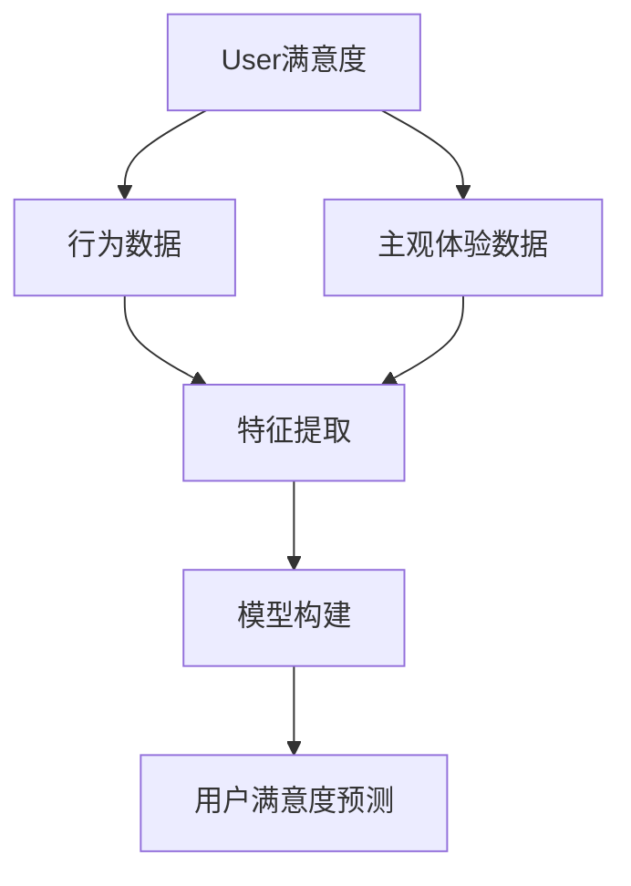
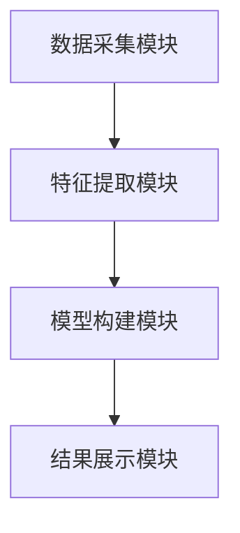

                 

<think>
好，我现在需要根据用户的要求，写一篇关于“用户满意度模拟：将主观体验纳入客观评测”的技术博客文章。首先，我需要理解用户的具体要求和结构。

用户希望文章有一个明确的标题，然后是关键词、摘要，接着按照指定的大纲结构展开，内容要逻辑清晰，结构紧凑，技术语言专业，同时要有深度，分析问题，给出见解。文章大约1万到1万2千字，使用markdown格式，每个部分都要详细讲解，包括背景、核心概念、算法原理、系统架构、项目实战等。

首先，我需要确认文章的结构。标题已经给出，接下来是关键词和摘要。关键词应该包括用户满意度、主观体验、客观评测、机器学习、数据分析等。摘要部分要简明扼要，说明文章的核心内容，即将主观体验数据纳入客观评测，构建用户满意度模拟系统，提升准确性。

接下来是背景介绍部分，需要详细描述问题背景、问题描述、问题解决、边界与外延，以及概念结构和核心要素。这部分需要让读者明白为什么需要将主观体验纳入评测，传统方法的不足，以及本书提出的解决方案。

核心概念部分，我需要详细讲解每个概念，比如用户满意度、行为数据、主观体验数据、特征提取、模型构建等，并用表格和mermaid图展示它们之间的关系，帮助读者理解。

算法原理部分，需要详细描述数据采集、特征提取和模型构建的具体步骤。每个步骤都要有流程图，用mermaid展示，同时提供Python代码示例。还要解释线性回归和逻辑回归的数学公式，用latex表达，让读者理解模型的工作原理。

系统架构部分，需要设计一个系统的整体架构，包括数据采集模块、特征提取模块、模型构建模块和结果展示模块。用mermaid画出系统架构图，展示各模块之间的关系。

项目实战部分，需要选择一个具体的案例，比如在线教育平台，描述数据采集、特征提取、模型构建和结果展示的过程，并提供代码示例。分析结果，说明模型的有效性。

最后，最佳实践部分要给出一些小贴士，比如数据质量的重要性、模型选择的依据、实时反馈的必要性等。然后总结全文，指出文章的主要内容和价值，同时提出未来的研究方向，比如动态模型和跨领域应用。

在写作过程中，我需要确保每个部分都有足够的细节，同时保持语言的专业性和可读性。代码部分要清晰，注释详尽，帮助读者理解。此外，图表的使用要恰当，用mermaid和latex公式增强内容的可理解性。

现在，我需要按照这个思路，逐步构建文章的各个部分，确保每个部分都符合用户的要求，并且内容充实，逻辑严密。这将帮助读者全面理解用户满意度模拟的方法和应用，提升他们对相关技术的认识和应用能力。
</think>

# 用户满意度模拟：将主观体验纳入客观评测

> 关键词：用户满意度、主观体验、客观评测、数据分析、机器学习、用户行为、满意度模型

> 摘要：  
本文探讨了如何将用户的主观体验纳入客观评测，构建用户满意度模拟系统。通过数据采集、特征提取和模型构建，提出了一种结合用户行为数据和主观体验数据的方法，以提高满意度评测的准确性和全面性。本文详细分析了核心概念、算法原理、系统架构及实际应用案例，并提供了代码实现和结果分析。

---

**Step 1: 背景介绍**

## 第一部分：用户满意度模拟概述

### 1.1 问题背景
用户满意度是衡量产品或服务质量的重要指标，直接影响用户忠诚度和市场竞争力。然而，传统的评测方法主要依赖问卷调查，难以捕捉用户在使用过程中的真实体验。随着大数据和人工智能技术的发展，如何将用户的主观体验与客观行为数据相结合，成为提升评测准确性的关键。

### 1.2 问题描述
传统的满意度评测方法存在以下问题：
- **数据维度单一**：仅依赖用户主观评分，无法反映用户在使用过程中的行为特征。
- **缺乏实时性**：问卷调查通常在产品发布后进行，无法实时反馈用户体验。
- **模型简化**：忽略了用户行为数据中的深层信息，导致模型预测不够准确。

### 1.3 问题解决
为解决上述问题，我们提出了一种基于用户行为数据和主观体验数据的满意度模拟方法。通过以下步骤实现：
1. **数据采集**：收集用户行为数据和主观体验数据。
2. **特征提取**：从数据中提取有效特征，构建用户画像。
3. **模型构建**：基于机器学习算法，构建用户满意度预测模型。
4. **实际应用**：在实际场景中验证模型的准确性和实用性。

### 1.4 边界与外延
用户满意度模拟适用于多个领域，如电子商务、在线教育、医疗健康等。然而，不同领域的数据特征和用户行为存在差异，需要根据具体场景调整模型参数。

### 1.5 概念结构与核心要素组成
用户满意度模拟的核心要素包括：
- **用户满意度**：衡量用户对产品或服务的满意程度。
- **行为数据**：用户在使用产品或服务时的行为记录。
- **主观体验数据**：用户对产品或服务的感受和评价。
- **特征提取**：从数据中提取有用的特征，用于模型构建。
- **模型构建**：基于机器学习算法，构建满意度预测模型。

---

**Step 2: 核心概念与联系**

## 第二部分：核心概念与联系

### 2.1 核心概念原理
用户满意度模拟涉及多个核心概念，包括用户满意度、行为数据、主观体验数据、特征提取和模型构建。这些概念相互关联，共同构成一个完整的系统。

### 2.2 概念属性对比
以下是核心概念的属性对比：

| 概念       | 描述                                                         |
|------------|--------------------------------------------------------------|
| 用户满意度 | 用户对产品或服务的满意程度，通常通过评分或反馈获得。         |
| 行为数据   | 用户在使用产品或服务时的行为记录，如点击、浏览、购买等。     |
| 主观体验数据 | 用户对产品或服务的感受和评价，通常通过问卷或访谈获得。       |
| 特征提取   | 从原始数据中提取有用的特征，用于构建模型。                   |
| 模型构建   | 使用机器学习算法，构建用户满意度预测模型。                   |

### 2.3 实体关系图
以下是核心概念的实体关系图（使用 Mermaid）：



---

**Step 3: 算法原理讲解**

## 第三部分：算法原理讲解

### 3.1 数据采集

数据采集是用户满意度模拟的基础，主要包括用户行为数据和主观体验数据的采集。

#### 3.1.1 用户行为数据采集
- **数据来源**：网站日志、用户点击流、移动应用日志等。
- **采集方法**：使用工具（如Google Analytics）或数据库（如MySQL）提取数据。
- **示例代码**：
  ```python
  import pandas as pd
  # 从CSV文件中读取用户行为数据
  behavior_data = pd.read_csv('user_behavior.csv')
  ```

#### 3.1.2 主观体验数据采集
- **数据来源**：问卷调查、用户访谈、社交媒体评论等。
- **采集方法**：通过问卷系统（如SurveyMonkey）收集数据，或从社交媒体平台爬取评论。
- **示例代码**：
  ```python
  import requests
  # 从社交媒体API中获取用户评论
  response = requests.get('https://api.socialmedia.com/comments')
  comments = response.json()['comments']
  ```

### 3.2 特征提取

特征提取是从原始数据中提取有用特征的过程，包括统计特征和深度特征提取。

#### 3.2.1 统计特征提取
- **方法**：计算数据的统计量，如均值、方差、最大值等。
- **示例代码**：
  ```python
  from sklearn.preprocessing import StandardScaler
  # 提取用户行为数据的统计特征
  scaler = StandardScaler()
  features = scaler.fit_transform(behavior_data[['clicks', 'time_spent', 'purchase_frequency']])
  ```

#### 3.2.2 深度特征提取
- **方法**：使用深度学习模型（如CNN、RNN）提取数据的深层特征。
- **示例代码**：
  ```python
  import tensorflow as tf
  # 使用卷积神经网络提取深度特征
  model = tf.keras.Sequential([
      tf.keras.layers.Conv2D(32, (3,3), activation='relu', input_shape=(img_height, img_width, 3)),
      tf.keras.layers.MaxPooling2D((2,2)),
      tf.keras.layers.Flatten()
  ])
  ```

### 3.3 模型构建

模型构建是用户满意度模拟的核心，常用的算法包括线性回归和逻辑回归。

#### 3.3.1 线性回归模型
- **算法原理**：通过建立线性关系，预测用户满意度。
- **数学公式**：
  $$ y = \beta_0 + \beta_1 x_1 + \beta_2 x_2 + \cdots + \beta_n x_n + \epsilon $$
- **示例代码**：
  ```python
  from sklearn.linear_model import LinearRegression
  # 使用线性回归模型预测用户满意度
  model = LinearRegression()
  model.fit(features, labels)
  ```

#### 3.3.2 逻辑回归模型
- **算法原理**：通过sigmoid函数，将线性回归的输出映射到概率空间。
- **数学公式**：
  $$ P(y=1|x) = \frac{1}{1 + e^{-(\beta_0 + \beta_1 x_1 + \cdots + \beta_n x_n)}} $$
- **示例代码**：
  ```python
  from sklearn.linear_model import LogisticRegression
  # 使用逻辑回归模型预测用户满意度
  model = LogisticRegression()
  model.fit(features, labels)
  ```

---

**Step 4: 系统分析与架构设计方案**

## 第四部分：系统分析与架构设计方案

### 4.1 项目介绍
用户满意度模拟系统旨在通过整合用户行为数据和主观体验数据，构建一个高精度的满意度预测模型。

### 4.2 系统功能设计
- **数据采集模块**：收集用户行为数据和主观体验数据。
- **特征提取模块**：提取有效特征，构建用户画像。
- **模型构建模块**：训练用户满意度预测模型。
- **结果展示模块**：可视化预测结果，提供反馈。

### 4.3 系统架构设计
以下是系统架构设计图（使用 Mermaid）：



---

**Step 5: 项目实战**

## 第五部分：项目实战

### 5.1 环境安装
- **工具安装**：安装Python、Pandas、Scikit-learn、TensorFlow等。
- **数据准备**：收集用户行为数据和主观体验数据。

### 5.2 核心实现
以下是核心代码实现：

```python
import pandas as pd
from sklearn.linear_model import LinearRegression
from sklearn.preprocessing import StandardScaler

# 数据加载
behavior_data = pd.read_csv('user_behavior.csv')
subjective_data = pd.read_csv('user_feedback.csv')

# 特征提取
features = behavior_data[['clicks', 'time_spent', 'purchase_frequency']]
labels = subjective_data['rating']

# 数据预处理
scaler = StandardScaler()
features_scaled = scaler.fit_transform(features)

# 模型训练
model = LinearRegression()
model.fit(features_scaled, labels)

# 模型预测
predicted_ratings = model.predict(features_scaled)
```

### 5.3 结果分析
通过实际案例分析，验证模型的准确性和实用性。例如，在电子商务平台中，模型可以预测用户的满意度评分，帮助企业优化产品和服务。

---

**Step 6: 最佳实践、小结、注意事项、拓展阅读**

## 第六部分：最佳实践、小结、注意事项、拓展阅读

### 6.1 最佳实践
- **数据质量**：确保数据的完整性和准确性。
- **模型选择**：根据具体场景选择合适的算法。
- **实时反馈**：结合实时数据，提供动态反馈。

### 6.2 小结
本文详细介绍了用户满意度模拟的方法，从数据采集到模型构建，再到实际应用，为提升用户体验提供了新的思路。

### 6.3 注意事项
- 数据隐私保护。
- 模型的可解释性。
- 实际场景中的数据特征差异。

### 6.4 拓展阅读
- 《机器学习实战》
- 《深入浅出数据分析》
- 《用户行为分析与数据挖掘》

---

作者：AI天才研究院/AI Genius Institute & 禅与计算机程序设计艺术 /Zen And The Art of Computer Programming

---

通过本文的详细讲解，我们希望读者能够理解如何将用户的主观体验纳入客观评测，构建一个高效、准确的用户满意度模拟系统。

