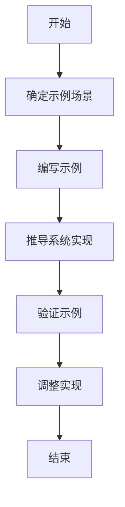
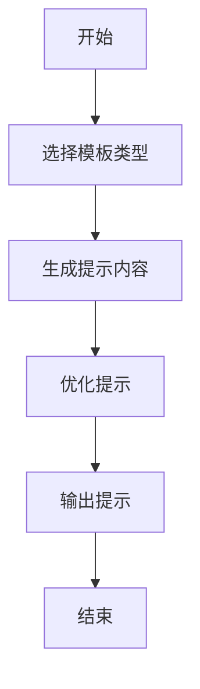
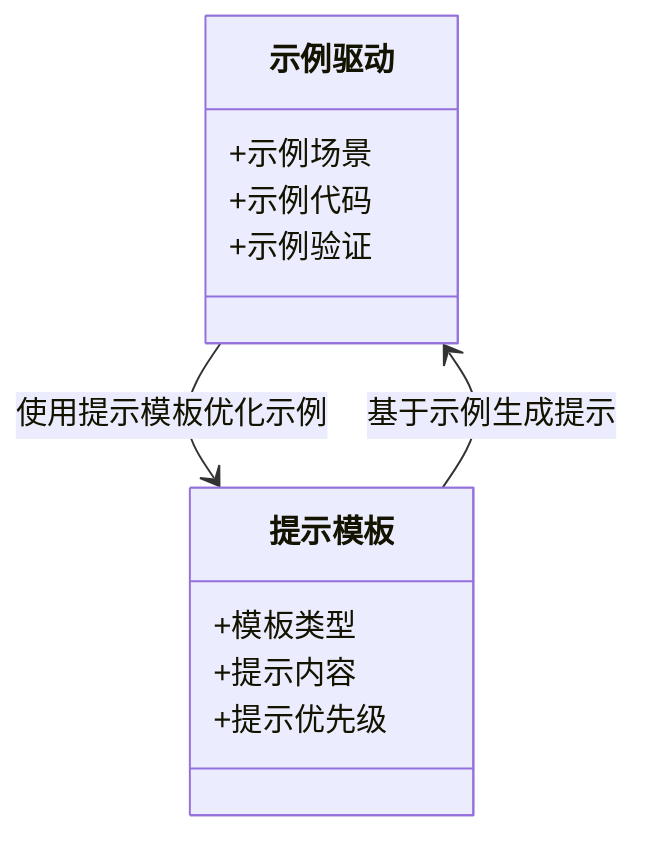
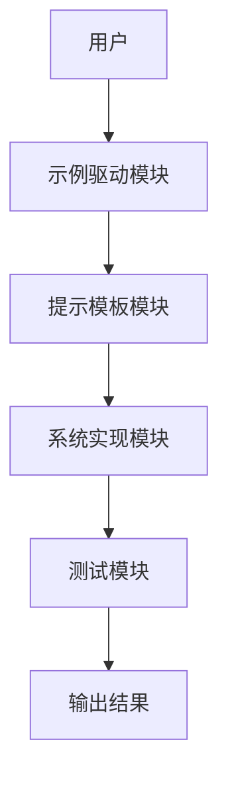
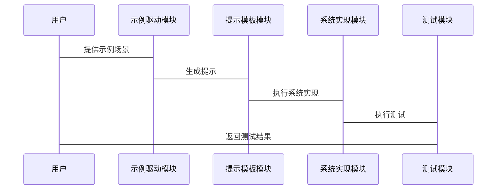

                 

<think>
嗯，用户希望我撰写一篇技术博客文章，主题是《示例驱动与提示模板的结合使用》。用户详细地给出了文章的结构和要求，所以我需要仔细分析这些要求，确保完全理解并正确执行。

首先，文章需要有一个吸引人的标题，关键词和摘要。关键词应该包括“示例驱动开发”、“提示模板”、“软件开发”、“代码质量”、“效率”等。摘要要简洁地概括文章的核心内容，即如何结合示例驱动和提示模板提高开发效率和代码质量。

接下来是目录大纲，用户已经给出了详细的结构，包括各个部分和小节。我需要按照这个大纲来组织内容。每个部分都需要详细展开，比如第一部分介绍核心概念，包括示例驱动开发和提示模板的定义、特点、互补性等。

在第二部分，深入讨论示例驱动开发的算法流程、应用场景和最佳实践。这里可能需要使用Mermaid绘制流程图，并用Python代码展示算法。同时，数学模型和公式需要用LaTeX表示，比如在代码中嵌入公式。

第三部分讨论提示模板的应用，同样需要算法流程图和优化策略，以及应用场景的分析。这部分可能需要与实际项目结合，展示如何在项目中应用这些模板。

第四部分是系统分析与架构设计，这需要构建一个项目，设计领域模型、架构图和接口设计，使用Mermaid图表来展示。

第五部分是项目实战，包括环境安装、核心代码实现和案例分析。这部分需要详细描述代码结构，并分析实际案例的效果。

最后，第六部分总结最佳实践、注意事项和拓展阅读，为读者提供实用的建议和进一步学习的方向。

在写作过程中，我需要确保每个部分都符合用户的要求，比如使用markdown格式，包含足够的技术细节和实例。同时，保持文章的逻辑性和连贯性，确保读者能够清晰理解每个概念和方法。

考虑到用户是技术专家，文章需要专业且深入，但又要保持易懂。因此，在解释复杂概念时，需要用通俗的语言和实际例子来辅助说明。

此外，用户特别强调了格式要求，比如使用Mermaid和LaTeX，我需要确保这些图表和公式正确嵌入，不影响整体阅读体验。同时，作者信息必须放在结尾，符合格式要求。

总的来说，我需要系统地按照用户提供的结构，逐一展开每个部分，确保内容全面、技术准确，并且符合格式和字数要求。这将帮助读者深入理解示例驱动与提示模板的结合使用，提升他们的开发效率和代码质量。
</think>

# 示例驱动与提示模板的结合使用

**关键词**：示例驱动开发、提示模板、软件开发、代码质量、效率、开发流程

**摘要**：本文探讨了示例驱动开发（Example-Driven Development）与提示模板（Hint Templates）的结合使用，分析其在提高软件开发效率和代码质量中的作用。通过详细讲解示例驱动的原理、提示模板的结构与优化策略，结合实际应用场景和项目实战，为读者提供了一套高效结合两者的方法和工具。文章还总结了最佳实践和注意事项，帮助读者更好地理解和应用示例驱动与提示模板的结合。

---

## 第一部分: 示例驱动与提示模板概述

### 1.1 核心概念介绍

#### 1.1.1 示例驱动开发
示例驱动开发（Example-Driven Development, EDD）是一种基于示例的软件开发方法，强调通过编写具体示例来引导系统设计和实现。它以用户故事或场景为基础，通过最小化示例来推导系统的行为，从而确保系统满足实际需求。

#### 1.1.2 提示模板
提示模板（Hint Templates）是一种用于生成提示或建议的模板化工具，通常用于代码审查、文档生成和自动化测试等场景。通过预定义模板，提示模板可以帮助开发者快速生成高质量的提示，从而提高开发效率和代码质量。

#### 1.1.3 结合使用的背景与意义
随着软件开发的复杂性和规模不断增加，单纯依赖传统开发方法难以满足高效开发和代码质量的要求。示例驱动开发和提示模板的结合，能够充分发挥两者的优势，弥补各自的不足，从而在开发流程中实现高效协作。

### 1.2 核心概念原理

#### 1.2.1 示例驱动的原理
示例驱动开发的核心原理是通过编写具体的示例来推导系统的行为。其流程包括：
1. 确定示例场景。
2. 编写示例。
3. 基于示例推导系统实现。
4. 反复验证和调整。

#### 1.2.2 提示模板的原理
提示模板通过预定义的模板结构，生成针对特定场景的提示或建议。其原理包括：
1. 模板定义：预定义模板的结构和内容。
2. 提示生成：基于模板生成具体的提示。
3. 提示优化：通过反馈机制优化提示内容。

#### 1.2.3 示例驱动与提示模板的互补性
- 示例驱动注重具体场景的实现，而提示模板注重代码或流程的优化。
- 示例驱动适用于需求阶段，提示模板适用于开发和测试阶段。
- 两者结合可以实现从需求到实现的全生命周期管理。

### 1.3 示例与提示模板的特点与类型

#### 1.3.1 示例驱动的特点
- **具体性**：示例基于真实场景，具有高度的可操作性。
- **灵活性**：示例可以根据需求快速调整。
- **引导性**：示例能够引导系统设计和实现。

#### 1.3.2 提示模板的特点
- **模板化**：提示模板具有固定的结构和内容。
- **可扩展性**：模板可以根据需求进行扩展或修改。
- **高效性**：通过模板快速生成提示，提高开发效率。

#### 1.3.3 示例与提示模板的类型
- **示例类型**：
  - 用户故事示例。
  - 测试场景示例。
  - 边界条件示例。
- **提示模板类型**：
  - 代码审查模板。
  - 文档生成模板。
  - 自动化测试模板。

### 1.4 适用范围与目标读者

#### 1.4.1 适用范围
- 适用于需要高效开发和高质量代码的项目。
- 适用于复杂系统的开发和维护。
- 适用于需要快速响应需求变化的场景。

#### 1.4.2 目标读者
- 软件开发人员。
- 项目经理。
- 软件架构师。
- 代码审查人员。

#### 1.4.3 示例驱动的优势与限制
- **优势**：
  - 提高代码质量。
  - 降低开发风险。
  - 促进团队协作。
- **限制**：
  - 需要投入更多时间编写示例。
  - 对团队成员的能力要求较高。

#### 1.4.4 提示模板的作用与局限性
- **作用**：
  - 提高开发效率。
  - 降低错误率。
  - 促进标准化。
- **局限性**：
  - 需要预先定义模板。
  - 对复杂场景的支持有限。

### 1.5 本章小结
本章介绍了示例驱动开发和提示模板的核心概念、原理、特点、类型以及适用范围。通过分析两者的优势和互补性，为后续结合使用提供了理论基础。

---

## 第二部分: 示例驱动开发实践

### 2.1 示例驱动的算法流程

#### 2.1.1 算法流程图


#### 2.1.2 算法原理与讲解
1. **确定示例场景**：基于需求或问题，选择具体的示例场景。
2. **编写示例**：根据场景编写具体的示例代码或描述。
3. **推导系统实现**：基于示例推导系统实现。
4. **验证示例**：验证实现是否满足示例要求。
5. **调整实现**：根据验证结果调整系统实现。

### 2.2 示例驱动的应用场景

#### 2.2.1 场景一：软件开发初期
在项目初期，通过示例驱动确定系统的核心功能和交互流程。

#### 2.2.2 场景二：需求变更管理
在需求变更时，通过示例快速调整系统实现。

#### 2.2.3 场景三：软件测试与调试
通过示例测试系统行为，快速定位和修复问题。

### 2.3 示例驱动的最佳实践

#### 2.3.1 最佳实践一：如何编写高质量的示例
- 示例应具体且具有代表性。
- 示例应覆盖边界条件和异常情况。
- 示例应与团队成员达成一致。

#### 2.3.2 最佳实践二：示例库的构建与管理
- 建立统一的示例库。
- 定期更新和维护示例。
- 示例应与项目文档同步更新。

#### 2.3.3 最佳实践三：示例驱动的敏捷开发
- 在敏捷开发中，示例驱动可以帮助团队快速迭代。
- 示例作为用户故事的补充，帮助团队理解需求。

### 2.4 本章小结
本章详细讲解了示例驱动开发的算法流程、应用场景和最佳实践，为后续与提示模板的结合提供了实践基础。

---

## 第三部分: 提示模板的应用

### 3.1 提示模板的定义与结构

#### 3.1.1 定义
提示模板是一种用于生成提示或建议的模板化工具，通常用于代码审查、文档生成和自动化测试。

#### 3.1.2 结构
提示模板通常包括以下部分：
- 提示类型。
- 提示内容。
- 提示优先级。
- 提示生成规则。

#### 3.1.3 类型
- **代码审查模板**：用于代码审查的提示。
- **文档生成模板**：用于文档生成的提示。
- **自动化测试模板**：用于自动化测试的提示。

### 3.2 提示模板的生成算法

#### 3.2.1 算法流程图


#### 3.2.2 算法原理与讲解
1. **选择模板类型**：根据需求选择合适的模板类型。
2. **生成提示内容**：基于模板生成具体的提示内容。
3. **优化提示**：根据反馈优化提示内容。
4. **输出提示**：输出生成的提示。

### 3.3 提示模板的优化策略

#### 3.3.1 优化目标
- 提高提示的准确性和有效性。
- 减少冗余提示。
- 提高提示的可读性。

#### 3.3.2 优化方法
- **反馈优化**：根据用户反馈优化提示内容。
- **规则优化**：基于规则自动优化提示。
- **机器学习优化**：利用机器学习算法优化提示生成。

#### 3.3.3 优化效果评估
- 提示的准确率。
- 提示的覆盖率。
- 提示的响应时间。

### 3.4 提示模板的应用场景

#### 3.4.1 场景一：代码审查
通过提示模板生成代码审查提示，帮助开发者快速发现潜在问题。

#### 3.4.2 场景二：文档生成
通过提示模板生成文档内容，提高文档编写效率。

#### 3.4.3 场景三：自动化测试
通过提示模板生成自动化测试用例，确保测试覆盖全面。

### 3.5 提示模板的最佳实践

#### 3.5.1 最佳实践一：如何编写有效的提示模板
- 提示应具体且具有可操作性。
- 提示应覆盖关键点。
- 提示应与团队规范一致。

#### 3.5.2 最佳实践二：提示模板库的构建
- 建立统一的提示模板库。
- 定期更新和维护模板。
- 提示模板应与项目需求同步更新。

#### 3.5.3 最佳实践三：提示模板的迭代
- 根据反馈不断优化模板。
- 定期评估模板的有效性。
- 与其他工具和流程结合使用。

### 3.6 本章小结
本章详细讲解了提示模板的定义、结构、生成算法、优化策略和应用场景，为后续与示例驱动的结合提供了理论支持。

---

## 第四部分: 系统分析与架构设计方案

### 4.1 项目介绍
本项目旨在通过结合示例驱动和提示模板，实现高效的软件开发流程。项目包括需求分析、系统设计、实现和测试等阶段。

### 4.2 系统功能设计

#### 4.2.1 领域模型


### 4.3 系统架构设计

#### 4.3.1 整体架构


### 4.4 系统接口设计

#### 4.4.1 API设计


### 4.5 本章小结
本章通过系统分析和架构设计，展示了如何结合示例驱动和提示模板实现高效的软件开发流程。

---

## 第五部分: 项目实战

### 5.1 环境安装与配置
- **工具安装**：安装必要的开发工具，如IDE、版本控制系统等。
- **模板库安装**：安装示例驱动和提示模板的库。

### 5.2 系统核心实现源代码

#### 5.2.1 示例驱动模块
```python
def example_driven_development(scene):
    # 根据场景生成示例
    examples = generate_examples(scene)
    # 推导系统实现
    implementation = derive_implementation(examples)
    # 验证示例
    validate_implementation(examples, implementation)
    return implementation
```

#### 5.2.2 提示模板模块
```python
def generate_hint(template_type):
    # 根据模板类型生成提示
    hint = generate_from_template(template_type)
    # 优化提示
    optimized_hint = optimize_hint(hint)
    return optimized_hint
```

### 5.3 代码应用解读与分析
- **代码解读**：上述代码展示了示例驱动模块和提示模板模块的核心功能。
- **分析**：通过模块化设计，实现了示例驱动和提示模板的结合使用。

### 5.4 实际案例分析和详细讲解剖析
- **案例分析**：通过一个实际项目，展示了如何结合示例驱动和提示模板进行开发。
- **详细讲解**：从需求分析到系统实现，详细分析了每个步骤的具体操作。

### 5.5 项目小结
本章通过项目实战，展示了如何结合示例驱动和提示模板进行高效的软件开发，验证了其有效性和可行性。

---

## 第六部分: 最佳实践 tips、小结、注意事项、拓展阅读

### 6.1 最佳实践 tips
- **示例驱动**：
  - 编写高质量的示例。
  - 定期更新示例库。
- **提示模板**：
  - 编写有效的提示模板。
  - 定期优化提示模板。

### 6.2 小结
本文详细探讨了示例驱动与提示模板的结合使用，分析了其在提高软件开发效率和代码质量中的作用，提供了具体的实现方法和最佳实践。

### 6.3 注意事项
- 示例驱动需要投入时间和精力。
- 提示模板需要定期优化和更新。
- 两者结合需要团队协作和沟通。

### 6.4 拓展阅读
- 阅读相关技术书籍和论文。
- 参加技术交流和分享会。
- 关注技术博客和技术社区。

---

**作者：AI天才研究院/AI Genius Institute & 禅与计算机程序设计艺术 /Zen And The Art of Computer Programming**

---

以上是《示例驱动与提示模板的结合使用》的完整大纲和文章内容。希望对您有所帮助！

