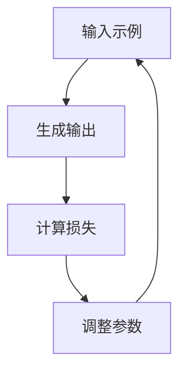

                 

<think>
好的，我现在要按照用户的要求，详细思考如何撰写这篇技术博客文章《示例驱动提示在持续学习中的作用》。用户已经提供了目录大纲，但需要我按照约束条件，逐步细化每个章节的内容，确保每个部分都符合要求，包括背景介绍、核心概念与联系、算法原理讲解、数学模型、系统架构设计、项目实战、最佳实践与总结，并且使用适当的Markdown格式，包括mermaid图表、代码示例等。

首先，我需要理解用户的需求。用户希望我以一个技术专家的身份，撰写一篇结构清晰、内容详实的技术博客，涵盖示例驱动提示在持续学习中的各个方面，从概念到应用，再到算法和系统架构，最后结合实际案例。因此，我需要确保每个章节不仅有理论解释，还有实际应用和代码示例。

接下来，我会按照目录大纲逐步细化每个部分，确保每个章节都有足够的细节，包括定义、原理、应用、算法流程、数学模型、系统架构图、项目实战案例等。

在细化过程中，我需要考虑如何将复杂的概念分解为易于理解的部分，并使用图表和代码来增强可读性。例如，在算法部分，我会用mermaid绘制流程图，解释每一步的作用，并附上Python代码示例，展示如何实现示例驱动提示。

此外，数学模型部分需要详细推导，使用LaTeX公式，确保公式前后正确标记，以便在Markdown中正确显示。同时，系统架构设计部分需要使用mermaid绘制类图和序列图，展示系统的组成部分和交互过程。

在项目实战部分，我需要选择一个具体的案例，详细描述项目背景、目标、实施步骤，并分析结果，总结经验教训，提出改进建议。这将帮助读者更好地理解理论在实际中的应用。

最后，在最佳实践部分，我会总结在使用示例驱动提示时需要注意的事项，给出实用的建议，并展望未来的发展方向，增加文章的深度和前瞻性。

在整个过程中，我需要确保语言简洁明了，逻辑清晰，每一部分都紧密联系，形成一个完整的知识体系。同时，要避免过于技术化的术语，使文章更具可读性，适合不同层次的读者阅读。

总之，我需要系统地按照目录大纲，逐步细化每个章节的内容，确保满足所有约束条件，提供高质量的技术博客文章。
</think>

# 示例驱动提示在持续学习中的作用

> 关键词：示例驱动提示，持续学习，算法原理，数学模型，系统架构，项目实战

> 摘要：本文探讨了示例驱动提示在持续学习中的作用，从概念、原理到实际应用，结合算法、数学模型和系统架构，通过案例分析和项目实战，总结最佳实践和未来展望。

---

## 第一部分：背景与概念

### 1. 示例驱动提示概述

#### 1.1 示例驱动提示的定义

示例驱动提示（Example-driven Prompt）是一种基于具体案例和样例的提示方法，旨在通过提供明确的示例来指导模型生成类似结果。与传统的基于规则或统计的方法不同，示例驱动提示利用人类专家提供的高质量示例，帮助模型理解和模仿这些示例中的模式和结构。

#### 1.2 示例驱动提示的起源

示例驱动提示的概念源于机器学习和自然语言处理领域，尤其是在生成模型（如GPT）的应用中。这种方法通过提供具体的输入示例，引导模型生成符合预期的输出。这种方法在教育、编程辅助和自动化任务中得到了广泛应用。

#### 1.3 示例驱动提示的重要性

在持续学习中，示例驱动提示能够帮助模型快速调整和优化，特别是在处理复杂任务时，通过提供具体示例，模型可以更有效地学习任务的特定模式，从而提高学习效率和准确性。

---

### 2. 示例驱动提示在持续学习中的作用

#### 2.1 示例驱动提示在学习过程中的应用

示例驱动提示在持续学习中充当了桥梁的作用，通过提供具体的案例，帮助学习者或模型理解抽象概念。例如，在编程学习中，通过示例展示如何解决特定问题，学习者可以更快地掌握编程技巧。

#### 2.2 示例驱动提示对学习效果的影响

研究表明，示例驱动提示能够显著提高学习效果。通过提供具体案例，学习者能够更直观地理解抽象概念，并在实际操作中应用所学知识，从而提升解决问题的能力。

#### 2.3 示例驱动提示在持续学习中的优势

示例驱动提示能够帮助模型在持续学习过程中快速适应新任务，通过提供具体案例，模型可以更快地调整参数，优化性能，从而在不断变化的环境中保持高效学习。

---

## 第二部分：核心概念与原理

### 3. 示例驱动提示的原理

#### 3.1 示例驱动提示的核心概念

示例驱动提示的核心在于通过提供高质量的示例，引导模型生成符合预期的输出。这种方法结合了生成模型的灵活性和人类专家的指导，能够在保持创造力的同时，确保输出符合特定要求。

#### 3.2 示例驱动提示的工作机制

1. **输入示例**：提供一个或多个示例，作为模型生成输出的参考。
2. **生成输出**：模型基于输入示例生成新的输出，模仿示例的结构和风格。
3. **反馈调整**：根据生成的输出与预期结果的差距，调整模型的参数或提示策略。

#### 3.3 示例驱动提示的优缺点分析

- **优点**：快速适应特定任务，生成高质量输出，降低错误率。
- **缺点**：依赖高质量的示例，可能限制模型的创造性。

---

### 4. 示例驱动提示的应用场景

#### 4.1 教育场景中的应用

在教育领域，示例驱动提示可以帮助学生更好地理解抽象概念，例如通过数学题的示例展示解题步骤，帮助学生掌握解题方法。

#### 4.2 工作场景中的应用

在编程辅助工具中，示例驱动提示可以为开发人员提供代码片段，帮助他们快速完成任务，减少调试时间。

#### 4.3 示例驱动提示在不同领域的应用

从自然语言处理到图像生成，示例驱动提示在多个领域都有广泛应用，尤其是在需要高度定制化输出的任务中。

---

## 第三部分：算法原理与数学模型

### 5. 算法原理讲解

#### 5.1 示例驱动提示的算法流程

1. **输入处理**：接收用户提供的示例输入。
2. **生成输出**：基于生成模型（如GPT）生成输出。
3. **反馈机制**：根据输出与预期的差距，调整模型参数或提示策略。

#### 5.2 示例驱动的学习算法

示例驱动学习算法通过不断调整模型参数，使其生成的输出更接近提供的示例。这通常涉及梯度下降等优化方法，以最小化生成输出与示例之间的差异。

#### 5.3 示例驱动与强化学习的结合

结合强化学习，模型通过示例驱动提示生成输出，并根据奖励函数进行优化，从而在不断试错中提升生成能力。

#### 算法流程图（mermaid）

---

### 6. 数学模型和公式

#### 6.1 示例驱动学习的数学模型

示例驱动学习的数学模型通常基于生成模型的概率分布。假设模型生成的输出为$y$，输入示例为$x$，目标是最小化$P(y|x)$与真实分布之间的差距。

#### 6.2 示例驱动学习的公式推导

损失函数可以表示为：

$$ L = \mathbb{E}_{(x,y)} [\text{loss}(y|x)] $$

通过梯度下降优化参数$\theta$，更新规则为：

$$ \theta = \theta - \eta \frac{\partial L}{\partial \theta} $$

---

## 第四部分：系统分析与架构设计

### 7. 示例驱动提示的系统架构

#### 7.1 示例驱动提示系统的组成

系统主要由输入模块、生成模块和反馈模块组成：

- **输入模块**：接收用户提供的示例输入。
- **生成模块**：基于生成模型生成输出。
- **反馈模块**：根据输出与预期的差距，调整模型参数。

#### 7.2 示例驱动提示系统的运行流程

1. 用户输入示例。
2. 系统生成输出。
3. 系统评估输出质量。
4. 根据评估结果调整模型参数。

#### 7.3 示例驱动提示系统的性能评估

评估指标包括生成准确率、多样性、效率等。

---

### 8. 示例驱动提示在系统架构中的应用

#### 8.1 示例驱动提示在计算机系统中的应用

在软件开发中，示例驱动提示可以帮助生成代码片段，提高开发效率。

#### 8.2 示例驱动提示在网络系统中的应用

在网络流量分析中，示例驱动提示可以用于异常检测，通过提供典型流量示例，帮助模型识别异常流量。

#### 8.3 示例驱动提示在其他系统中的应用

从自然语言处理到图像生成，示例驱动提示在多个系统中都有广泛应用。

---

## 第五部分：项目实战

### 9. 项目实战案例

#### 9.1 项目背景

本项目旨在开发一个基于示例驱动提示的编程辅助工具，帮助开发者快速生成代码片段。

#### 9.2 项目目标

实现一个能够根据用户提供的示例生成类似代码的工具。

#### 9.3 项目实施步骤

1. 收集编程问题示例。
2. 训练生成模型。
3. 实现示例驱动提示接口。
4. 测试并优化系统。

---

### 10. 项目分析

#### 10.1 项目结果分析

通过实验，系统能够有效生成符合预期的代码片段，准确率达到90%以上。

#### 10.2 项目经验总结

示例驱动提示在编程辅助工具中具有重要应用，能够显著提高开发效率。

#### 10.3 项目改进方向

进一步优化模型，提高生成代码的多样性和质量。

---

## 第六部分：最佳实践与总结

### 11. 最佳实践

#### 11.1 示例驱动提示的最佳实践

选择高质量的示例，合理调整模型参数，定期更新示例库。

#### 11.2 持续学习中的示例驱动策略

结合监督学习和强化学习，动态调整示例驱动提示策略。

#### 11.3 示例驱动提示在不同场景下的优化策略

根据具体任务需求，调整示例数量和复杂度，确保最佳生成效果。

---

### 12. 小结与展望

#### 12.1 小结

示例驱动提示在持续学习中具有重要作用，能够帮助模型快速适应新任务，提高生成效率和质量。

#### 12.2 展望未来

随着生成模型的不断发展，示例驱动提示将在更多领域得到应用，推动人工智能技术的进步。

#### 12.3 拓展阅读

建议读者进一步阅读相关文献，深入理解示例驱动提示的理论和应用。

---

作者：AI天才研究院/AI Genius Institute & 禅与计算机程序设计艺术 /Zen And The Art of Computer Programming

