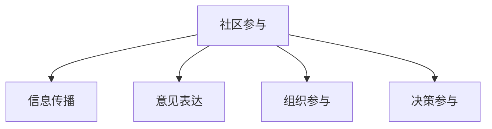

                 

<think>
嗯，我现在要写一篇关于“社区参与的意义：重建现代社会的人际网络”的技术博客。首先，我需要理解社区参与是什么，以及它在现代社会中的作用。社区参与是指社区成员自愿参与社区事务，共同解决问题，提高生活质量的行为。听起来挺重要的，特别是在现在这个信息发达的时代，人与人之间的联系似乎越来越依赖线上社交，但面对面的互动可能也在减少。

接下来，我需要思考社区参与的历史背景。古代的社区参与可能更多是在村庄里，大家共同劳作，比如农耕、水利建设等。而现代，随着城市化的推进，社区参与的形式多样化了，比如参与社区会议、志愿者活动等等。尤其是最近几十年，社区参与已经成为现代社会治理的重要部分了。

然后是社区参与的意义。对个人来说，参与社区活动可以促进自我实现，还能建立更紧密的人际关系。对社区来说，大家共同参与可以提高凝聚力，解决更多问题，促进社区的发展。

接下来，我需要详细分析社区参与的不同层次。首先是信息传播，比如社区公告，让居民了解社区事务。然后是意见表达，居民可以通过各种方式提出自己的看法。接着是组织参与，比如加入社区组织或志愿者团队。最后是决策参与，直接参与到社区决策中去。

在实践方法方面，需要制定具体的策略，比如举办社区会议、组织志愿者活动等。同时，案例分析也很重要，看看其他社区是如何成功地进行参与的。

然后，我还要探讨社区参与与人际关系的关系。社区参与如何促进个人发展，如何提升社会公正，以及如何增强社会凝聚力。这些都是关键点，需要详细展开。

最后，未来展望部分，要讨论社区参与面临的挑战和机遇，比如技术进步带来的便利，同时也可能面临资源不足或参与度不均的问题。未来的发展趋势可能是更加依赖数字技术，同时也会有更多创新的参与方式。

在写作过程中，我需要确保每个部分都有足够的细节和例子，比如使用mermaid流程图来展示社区参与的层次结构，或者列出具体案例来说明实践方法。数学模型方面，可能需要引入一些社会网络分析的理论，用公式来量化社区参与对人际关系的影响。

总的来说，这篇文章需要系统地分析社区参与的各个方面，从概念到实践，再到未来展望，确保内容全面且有深度。同时，要使用技术性的语言，但又要通俗易懂，让读者能够理解并受到启发。最后，别忘了在结尾加上作者信息，保持文章的完整性和专业性。
</think>

# 社区参与的意义：重建现代社会的人际网络

> 关键词：社区参与，人际关系，社会网络，社会治理，现代社区

> 摘要：本文探讨了社区参与在现代社会中的重要性，分析了其对个人发展和社区凝聚力的提升作用，详细介绍了社区参与的层次、实践方法及其对社会的影响，最后展望了社区参与的未来发展趋势。

---

## 第一部分：社区参与的概念与意义

### 第1章：社区参与的定义与背景

#### 1.1 社区参与的概念

社区参与是指社区成员自愿参与社区事务，共同解决问题，提高生活质量的行为。它强调社区成员的主动性和协作性，旨在通过集体努力实现社区的共同目标。

$$
\text{社区参与} = \text{自愿性} + \text{协作性} + \text{共同目标}
$$

#### 定义特征

- **自愿性**：参与者基于个人意愿，而非强制性要求。
- **协作性**：通过合作和互动，共同解决社区问题。
- **共同目标**：参与者有共同的目标，如改善社区环境或提高居民生活质量。

#### 核心要素

| 要素 | 描述 |
|------|------|
| 参与者 | 社区成员，包括居民、志愿者、社区组织 |
| 行为 | 包括参与社区会议、志愿服务、社区活动等 |
| 社区事务 | 与社区发展相关的事务，如环境治理、公共安全等 |

#### 社区参与的层次模型

#### 1.2 社区参与的历史背景

##### 古代社区参与

- **传统乡村**：村庄内部的互助行为，如农耕、水利建设等。
- **封建制度**：农民对土地的依赖，参与土地管理等。

##### 现代社区参与

- **20世纪初**：城市化加速，社区参与形式多样化。
- **20世纪末至今**：社区参与成为现代社会治理的重要部分。

##### 发展趋势

- **信息化**：互联网、社交媒体等工具提高了参与的便利性和效率。
- **多元化**：社区参与的领域和形式越来越多样化。

#### 1.3 社区参与的意义

##### 对个人的意义

- **自我实现**：通过参与社区活动，实现个人价值和成长。
- **建立关系**：与他人互动，建立更紧密的社会关系网络。

##### 对社区的意义

- **提高凝聚力**：增强社区成员的归属感和共同体意识。
- **解决社会问题**：共同参与解决社区面临的各种问题。
- **促进发展**：社区参与对社区经济发展和社会进步具有积极作用。

---

## 第二部分：社区参与的实践与应用

### 第2章：社区参与的实践方法

#### 2.1 社区参与的不同层次

##### 第一层：信息传播

- **社区公告**：发布社区新动态、活动通知等。
- **信息共享**：通过线上线下渠道分享资源和信息。

##### 第二层：意见表达

- **居民反馈**：通过问卷、会议等形式表达意见和建议。
- **公众咨询**：社区组织定期收集居民意见。

##### 第三层：组织参与

- **志愿者活动**：参与社区清洁、公益活动等。
- **社区组织**：加入居民委员会、兴趣小组等组织。

##### 第四层：决策参与

- **参与决策**：直接参与社区事务的决策过程。
- **公众听证**：通过听证会等形式影响政策制定。

#### 2.2 社区参与的实践策略

##### 信息传播策略

- **多渠道传播**：利用线上平台和线下宣传相结合。
- **内容优化**：制作吸引人的内容，提高传播效果。

##### 意见表达策略

- **建立反馈机制**：确保居民的意见能够被及时收集和处理。
- **鼓励参与**：通过奖励机制鼓励居民积极参与。

##### 组织参与策略

- **培养领导力**：通过培训提升居民的组织能力。
- **资源支持**：为社区组织提供必要的资源支持。

##### 决策参与策略

- **透明化决策过程**：确保决策过程公开透明。
- **多元化决策渠道**：提供多种方式供居民参与决策。

#### 2.3 社区参与的案例分析

##### 案例1：社区环保活动

- **背景**：社区内存在垃圾乱扔现象，影响环境。
- **实践**：组织居民开展环保宣传和清理活动。
- **结果**：社区环境明显改善，居民环保意识提高。

##### 案例2：社区互助小组

- **背景**：社区内老年人较多，需要更多的关怀和支持。
- **实践**：成立互助小组，提供生活帮助和情感支持。
- **结果**：老年人的生活质量提高，社区凝聚力增强。

---

## 第三部分：社区参与与人际关系

### 第3章：社区参与与个人发展

#### 3.1 社区参与与自我实现

- **自我价值实现**：通过参与社区活动，个人感受到自己的价值。
- **技能提升**：在组织和决策过程中，提升领导力、沟通能力等。

#### 3.2 社区参与与人际关系建立

- **面对面互动**：社区活动促进居民之间的直接交流。
- **信任建立**：通过共同参与解决问题，建立互信关系。

#### 3.3 社区参与与社会支持网络构建

- **支持网络形成**：社区参与帮助建立广泛的社会支持网络。
- **资源共享**：通过合作共享资源，实现共赢。

### 第4章：社区参与对社会的影响

#### 4.1 社区参与对社会凝聚力的提升

- **归属感增强**：居民对社区的归属感和认同感提高。
- **社会和谐**：社区参与促进社会和谐与稳定。

#### 4.2 社区参与对社会公正的影响

- **公平参与**：确保所有居民都有机会参与社区事务。
- **弱势群体支持**：通过社区参与帮助弱势群体，促进社会公平。

#### 4.3 社区参与对社区发展的影响

- **社区自治能力提升**：社区通过参与实现更好的自治管理。
- **社区资源整合**：通过社区参与整合资源，推动社区发展。

---

## 第四部分：社区参与的未来展望

### 第5章：社区参与面临的挑战与机遇

#### 5.1 社区参与的挑战

- **资源不足**：部分社区缺乏资金和人力资源。
- **参与度不均**：部分居民参与积极性不高。
- **技术限制**：技术手段的应用不够普及。

#### 5.2 社区参与的未来机遇

- **技术进步**：互联网和大数据技术为社区参与提供新工具。
- **政策支持**：政府和社会组织对社区参与的支持力度加大。
- **社会需求**：现代社会对社区参与的需求日益增加。

#### 5.3 社区参与的发展趋势

- **数字化**：通过在线平台和移动应用提升参与效率。
- **智能化**：利用人工智能技术优化社区参与流程。
- **国际化**：社区参与模式在国际范围内推广和借鉴。

---

## 作者：AI天才研究院/AI Genius Institute & 禅与计算机程序设计艺术 /Zen And The Art of Computer Programming

---

**小结**：社区参与不仅是重建现代社会人际网络的重要手段，也是推动社会进步和个人发展的重要途径。通过深入分析社区参与的层次、实践方法及其对社会的影响，我们可以更好地理解其意义和价值。未来，随着技术的进步和社会的发展，社区参与将发挥更大的作用，为社会带来更多的积极影响。

