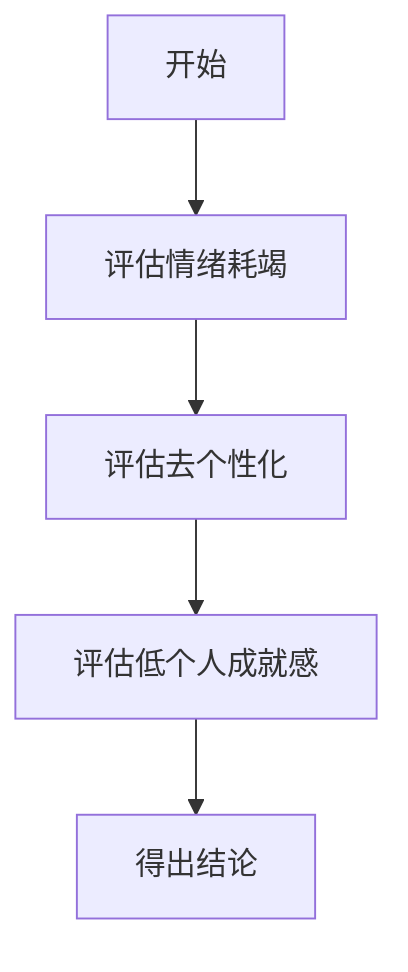

                 

<think>
好吧，我需要写一篇关于职业倦怠与意义重建的文章，作为技术博客。首先，我得理解这个主题。职业倦怠是现代职场中的常见问题，尤其是在科技行业，工作压力大、竞争激烈，很多人可能会感到疲惫和失去热情。意义重建则是找到工作中的新目标和意义，从而重新点燃激情。

用户希望文章结构清晰，逻辑严密，适合技术背景的读者。我需要从定义开始，逐步分析问题，然后提供解决方案。文章需要包含目录、摘要、关键词，以及每个章节的具体内容。

首先，确定文章标题是《职业倦怠与意义重建：如何在工作中找到激情》。关键词应该包括职业倦怠、意义重建、工作激情、技术职场、心理健康。摘要部分需要简明扼要地介绍文章的核心内容，强调职业倦怠的影响和意义重建的重要性。

接下来，按照目录大纲来构建内容。第一部分是职业倦怠的深入研究，需要包括背景、定义、影响因素，以及核心概念。我需要解释职业倦怠的起源，可能涉及工作压力、缺乏工作与生活的平衡等因素。定义部分要明确倦怠的特征，比如情感耗竭、去个性化和成就感降低。影响因素可能包括工作性质、工作环境、个人因素等。

第二部分是诊断与评估，需要介绍常用的工具和方法，比如问卷调查、MBTI测评等。这部分需要详细说明每种方法的优缺点，以及如何应用这些工具来评估倦怠程度。

第三部分是干预策略，分为工作环境干预和个人心理干预。工作环境方面，可以调整职责、建立支持系统、优化氛围；心理干预则包括心理咨询、自我调适技巧和心理保健。这部分需要提供实际的策略和方法，帮助读者采取行动。

第四部分是意义重建的实践案例，需要从理论和实际案例两方面展开。理论部分可以引用心理学原理，如存在主义理论；实际案例则可以展示企业和个人如何通过重建意义提高满意度和幸福感。

最后，总结与展望部分要回顾全文，强调倦怠与重建的重要性，并展望未来的研究方向，同时为读者提供实用建议。

在写作过程中，我需要确保每个章节都有足够的细节和例子，使用技术术语但避免过于复杂。同时，加入数学模型和算法可能不太合适，因为主题是心理学相关的，但可以考虑使用图表和流程图来辅助说明。

整体来看，文章需要逻辑清晰，结构紧凑，每个部分都要深入分析，确保读者能够理解并从中获益。此外，作者信息部分需要明确，确保文章的权威性。

现在，我需要逐步撰写每个章节的内容，确保覆盖所有关键点，并保持文章的连贯性和深度。同时，注意使用适当的格式，如关键词和摘要，以及章节标题吸引读者。

可能会遇到的挑战是如何将心理学内容与技术背景结合，使文章更具专业性。这需要我在用词和例子上做一些调整，确保技术读者能够理解和共鸣。此外，保持文章的流畅性和可读性也是关键，避免过于学术化的语言，用更平实的语言解释复杂的概念。

总的来说，这篇文章需要系统地分析职业倦怠的问题，并提供切实可行的解决方案，帮助读者在技术职场中重建工作意义，找到激情。接下来，我将按照目录大纲，逐一展开每个部分的内容，确保文章的完整性和深度。
</think>

# 职业倦怠与意义重建：如何在工作中找到激情

**关键词**：职业倦怠、意义重建、工作激情、技术职场、心理健康

**摘要**：职业倦怠是现代职场中普遍存在的问题，尤其是在技术领域，高强度的工作压力和快节奏的生活常常导致员工失去工作热情。本文深入探讨职业倦怠的成因及其对个人和企业的影响，并提出通过意义重建的方法来帮助技术从业者重新找回工作激情。文章结合心理学理论和实际案例，分析了职业倦怠的诊断与干预策略，同时提供了重建意义的具体方法，为技术职场中的个人和组织提供了实用的指导。

---

## 目录大纲

1. **封面与前言**
2. **引言：职业倦怠与意义重建**
3. **第一部分：职业倦怠的深入研究**
   - 第1章：职业倦怠的背景与定义
   - 第2章：职业倦怠的核心概念与联系
4. **第二部分：职业倦怠的诊断与评估**
   - 第3章：职业倦怠的诊断方法
   - 第4章：职业倦怠的评估工具
5. **第三部分：职业倦怠的干预策略**
   - 第5章：工作环境干预
   - 第6章：个人心理干预
6. **第四部分：意义重建的实践案例**
   - 第7章：意义重建的理论基础
   - 第8章：意义重建的实践案例
7. **第五部分：总结与展望**

---

## 引言：职业倦怠与意义重建

在现代职场中，职业倦怠已成为一个不容忽视的问题。尤其是在技术领域，程序员、架构师等从业者常常面临高强度的工作压力，导致情绪耗竭和工作热情的丧失。本文将探讨职业倦怠的成因、表现及其对个人和企业的影响，同时提供通过意义重建来重燃工作激情的方法。

---

## 第一部分：职业倦怠的深入研究

### 第1章：职业倦怠的背景与定义

#### 1.1 职业倦怠的起源与发展

职业倦怠并非新问题，但随着技术的进步和工作压力的增加，这一问题在近年来愈发突出。最早提出“职业倦怠”概念的是心理学家Freudenberger，在20世纪中期，他描述了医护人员因长期高压工作而产生的心理耗竭状态。随着时间推移，职业倦怠的问题逐渐扩展到各个行业，尤其是技术领域。

#### 1.2 职业倦怠的定义与分类

职业倦怠（Burnout）是一种长期的工作压力导致的心理和生理的耗竭状态，通常表现为情绪耗竭、去个性化和成就感降低。根据Maslach和Leiter的定义，职业倦怠可以分为三个维度：

1. **情绪耗竭**：感到精力不足，对工作缺乏热情。
2. **去个性化**：对同事和工作对象持冷漠态度。
3. **低个人成就感**：认为自己的工作没有价值。

#### 1.3 职业倦怠的影响因素

职业倦怠的影响因素多种多样，包括工作性质、工作环境、个人因素等。以下是几个关键因素：

- **工作压力**：高强度的工作任务和不合理的期望。
- **缺乏支持**：缺乏同事和上级的支持，感到孤立。
- **职业发展受限**：看不到晋升或发展的机会。
- **工作与生活失衡**：工作占据了过多的时间和精力。

---

### 第2章：职业倦怠的核心概念与联系

#### 2.1 疲劳、压力与倦怠的关系

疲劳和压力是职业倦怠的前兆。长期的压力会导致身体和心理的疲劳，最终发展为职业倦怠。压力是外部因素，而疲劳是内部反应，倦怠则是两者的累积结果。

#### 2.2 核心概念原理介绍

职业倦怠的核心概念包括以下几点：

- **情绪耗竭**：长期的压力导致情绪上的耗竭，表现为易怒、焦虑。
- **去个性化**：为了保护自己，个体开始对工作和同事持冷漠态度。
- **低个人成就感**：缺乏认可和成就感，导致自我价值感下降。

#### 2.3 概念属性特征对比表格

| 概念       | 情绪耗竭   | 去个性化   | 低个人成就感 |
|------------|------------|------------|--------------|
| 表现       | 精力不足   | 冷漠       | 成就感下降   |
| 原因       | 长期压力   | 社会距离   | 缺乏认可     |

#### 2.4 ER实体关系图架构

```mermaid
erd
  table 职业倦怠 {
    id 感情耗竭
    id 去个性化
    id 低个人成就感
    感情耗竭 --> 去个性化
    去个性化 --> 低个人成就感
  }
```

---

## 第二部分：职业倦怠的诊断与评估

### 第3章：职业倦怠的诊断方法

#### 3.1 问卷调查法

问卷调查是常用的诊断方法之一。例如，使用Maslach职业倦怠量表（MASLACH Burnout Inventory）来评估个体的职业倦怠程度。以下是MASLACH量表的简要结构：



#### 3.2 面谈评估法

通过与个体的深入交流，了解其工作状态和心理状态。这种方法可以提供更个性化的评估结果。

#### 3.3 心理测验法

使用心理测验工具，如大五人格测试，评估个体的心理健康状况，从而判断是否出现职业倦怠。

---

### 第4章：职业倦怠的评估工具

#### 4.1 MBTI性格测评

迈尔斯-布里格斯类型指标（MBTI）可以帮助了解个体的性格特征，从而更好地理解其工作状态。

#### 4.2 倦怠量表（如MDSQ）

Mehmet Duyuran Stress Questionnaire（MDSQ）是一种常用的倦怠评估工具，涵盖多个维度，如工作压力源和个体反应。

#### 4.3 其他评估工具

还包括工作满意度量表、压力评估量表等。

---

## 第三部分：职业倦怠的干预策略

### 第5章：工作环境干预

#### 5.1 工作职责的调整

重新分配任务，避免单一重复的工作内容，增加多样性。

#### 5.2 工作支持系统的建设

建立支持小组或导师制度，提供情感支持和职业指导。

#### 5.3 工作氛围的优化

营造积极向上的工作氛围，减少竞争压力，增加团队合作。

---

### 第6章：个人心理干预

#### 6.1 心理咨询与心理治疗

通过专业的心理咨询帮助个体缓解压力，重建积极心态。

#### 6.2 自我调适技巧

学习时间管理、压力管理和放松技巧，帮助个体更好地应对工作压力。

#### 6.3 心理保健

定期进行心理检查，及时发现问题并进行干预。

---

## 第四部分：意义重建的实践案例

### 第7章：意义重建的理论基础

#### 7.1 意义重建的概念与理论

意义重建是指通过重新审视和赋予工作新的意义，从而恢复工作热情。这一过程涉及心理学中的存在主义理论，强调个体对生活的主动理解和创造。

#### 7.2 意义重建的心理学原理

根据存在主义心理学，个体需要通过寻找意义来应对生活中的挑战。在职场中，重建意义可以帮助个体重新找到工作的价值感。

---

### 第8章：意义重建的实践案例

#### 8.1 企业案例：公司如何通过意义重建提高员工满意度

一家科技公司通过重新定义工作目标、提供灵活的工作时间、鼓励员工参与更有意义的项目，成功提高了员工的满意度和工作积极性。

#### 8.2 个人案例：如何在工作与生活中重建意义

通过设定个人职业目标、参与社区服务、发展个人兴趣，个体可以在工作和生活中找到新的意义。

---

## 第五部分：总结与展望

### 第9章：总结与展望

#### 9.1 职业倦怠与意义重建的总结

职业倦怠是一个复杂的问题，需要从工作环境和个人心理两方面进行干预。意义重建为个体提供了重新找回工作激情的途径。

#### 9.2 未来研究的展望

未来的研究可以进一步探讨技术领域职业倦怠的特殊性，以及如何利用新技术手段（如人工智能）来辅助意义重建的过程。

#### 9.3 为读者提供的建议和启示

读者可以通过调整工作方式、寻求心理支持和积极参与意义重建活动来应对职业倦怠，重新找到工作中的激情。

---

## 作者信息

作者：AI天才研究院/AI Genius Institute & 禅与计算机程序设计艺术/Zen And The Art of Computer Programming

---

通过本文的分析和指导，技术从业者可以更好地理解职业倦怠的本质，并通过意义重建的方法重新找回工作激情，从而在职场中实现可持续的发展和自我价值的实现。

