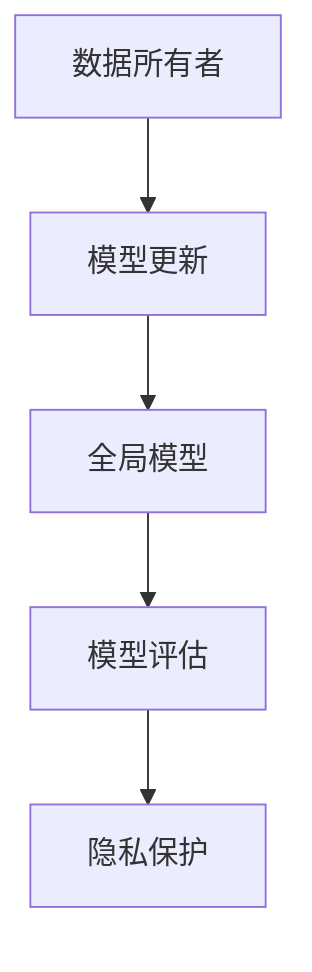
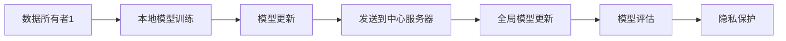
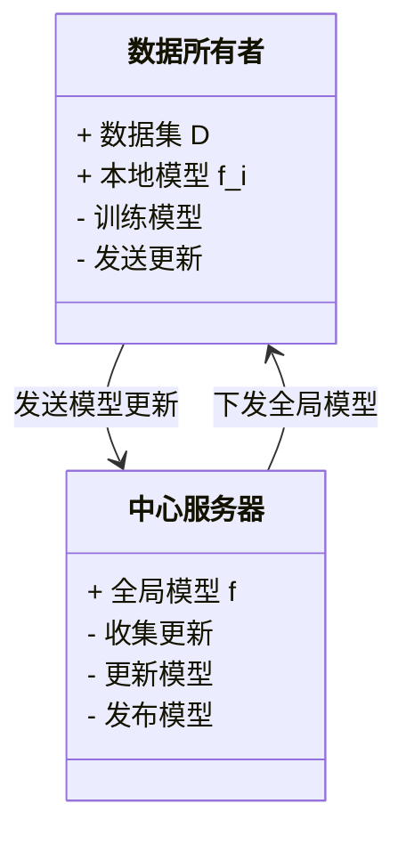
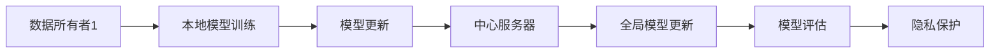

                 

<think>
嗯，用户让我写一篇关于联合学习在隐私保护LLM评测中的应用的技术博客。首先，我得理解用户的需求是什么。他可能是一位技术专家，或者正在研究隐私保护和大语言模型评估的人。他需要一篇结构清晰、内容详实的技术博客，可能用于分享或教学。

我注意到用户给了一个详细的目录结构，分为四部分，每个部分都有具体的章节和小节。我需要确保文章符合这个大纲，并且每个部分都涵盖必要的内容。比如，第一部分介绍联合学习和隐私保护的基础，第二部分讨论LLM评测，第三部分是联合学习在评测中的应用，第四部分是最佳实践和未来展望。

接下来，我得考虑文章的结构。开头需要有一个摘要，然后是目录。摘要部分要简洁明了，概括文章的核心内容。关键词部分也要准确，比如“联合学习”、“隐私保护”、“LLM评测”等。

在正文部分，每个章节都要详细展开。比如，第一章要介绍联合学习的概念、发展历程和核心问题。这里需要定义清楚，解释为什么隐私保护重要。第二章讨论隐私保护技术，包括加密技术和协议，以及它们的挑战和解决方案。

到了第三章，我得解释语言模型评测的基础，包括指标和方法，然后讨论隐私保护下的评测技术，比如数据加密和模型隐私保护机制。案例分析和性能优化也是关键点。

第四部分详细探讨联合学习在隐私保护中的应用，优势和局限性，以及实现框架和案例。这里可能需要结合实际案例，比如文本分类或机器翻译，来说明如何应用联合学习。

最后，第五部分总结最佳实践，讨论未来的技术趋势和法规影响。附录部分包括术语表和参考文献，帮助读者进一步研究。

在写作过程中，我需要确保每个部分都有足够的细节，比如数学公式、算法流程图和系统架构图。这些内容需要用LaTeX和Mermaid来展示，使文章更具专业性和可读性。

我还要考虑用户的约束条件，比如文章长度在10000到12000字之间，使用markdown格式，结尾加上作者信息。这意味着我需要合理安排每个章节的长度，确保整体结构完整。

最后，我需要检查文章是否符合逻辑，是否覆盖了所有必要的主题，同时保持语言简洁专业。这样，用户就能获得一篇高质量的技术博客，满足他的需求。
</think>

# 联合学习在隐私保护LLM评测中的应用

> 关键词：联合学习、隐私保护、LLM评测、联邦学习、数据隐私

> 摘要：  
随着大语言模型（LLM）的广泛应用，隐私保护成为其发展中的重要挑战。联合学习（Federated Learning）作为一种分布式学习范式，能够在保护数据隐私的前提下，实现模型的联合训练和评估。本文系统探讨了联合学习在隐私保护LLM评测中的应用，从理论基础到实际应用，详细分析了其优势、实现方法及未来发展方向。文章结合实际案例，深入剖析了隐私保护与模型性能之间的平衡，为研究者和开发者提供了实践指导。

---

## 目录

1. [联合学习与隐私保护基础](#联合学习与隐私保护基础)
   - 1.1 问题背景与定义
   - 1.2 联合学习的发展历程
   - 1.3 联合学习的核心问题
2. [隐私保护下的LLM评测](#隐私保护下的LLM评测)
   - 2.1 语言模型评测基础
   - 2.2 隐私保护下的LLM评测技术
   - 2.3 隐私保护语言模型评测的挑战与解决方案
3. [联合学习在隐私保护LLM评测中的应用](#联合学习在隐私保护LLM评测中的应用)
   - 3.1 联合学习在隐私保护LLM评测中的优势
   - 3.2 联合学习在隐私保护LLM评测中的实现
   - 3.3 联合学习在隐私保护LLM评测中的案例分析
4. [隐私保护LLM评测的最佳实践与未来展望](#隐私保护LLM评测的最佳实践与未来展望)
   - 4.1 隐私保护LLM评测的最佳实践
   - 4.2 未来技术趋势与研究方向
   - 4.3 社会影响与伦理挑战

---

## 背景介绍

### 1. 联合学习（Federated Learning）概述

联合学习是一种分布式机器学习范式，允许多个参与方在不共享原始数据的情况下，共同训练一个全局模型。其核心思想是：数据不出域，模型进方。通过这种方式，可以在保护数据隐私的前提下，提升模型的性能。

#### 核心概念与联系

| 概念 | 描述 |
|------|------|
| 数据隐私 | 数据所有者不共享原始数据，仅分享模型更新 |
| 模型收敛 | 全局模型通过局部模型更新逐步收敛 |
| 通信开销 | 联合学习需要在参与方之间进行频繁的通信 |

**ER实体关系图（Mermaid）：**



### 2. 问题背景与定义

随着大语言模型（LLM）的广泛应用，数据隐私问题日益突出。传统的模型评测方法通常需要集中化处理数据，这可能导致用户数据泄露。因此，如何在不共享原始数据的情况下，进行模型评测，成为亟待解决的问题。

---

## 核心概念与联系

### 1. 联合学习的核心问题

联合学习的核心问题包括：

1. **数据隐私**：如何在不泄露原始数据的情况下，进行模型训练和评估。
2. **模型安全**：如何确保全局模型的安全性，防止恶意攻击。

### 2. 隐私保护技术

隐私保护技术主要包括：

1. **加密技术**：如同态加密、秘密共享。
2. **安全多方计算**：通过协议在不泄露中间结果的情况下进行计算。
3. **零知识证明**：证明数据的存在或正确性，而不泄露数据本身。

**核心概念对比表：**

| 技术 | 描述 | 优缺点 |
|------|------|--------|
| 同态加密 | 允许在加密数据上进行计算 | 计算效率低，仅适用于特定场景 |
| 安多方计算 | 多方协作完成计算，不泄露数据 | 安全性高，但通信开销大 |
| 零知识证明 | 证明数据正确性而不泄露数据 | 适用于特定验证场景 |

### 3. 联合学习与隐私保护的结合

联合学习通过以下方式实现隐私保护：

1. **数据不出域**：每个参与方仅保留自己的数据，不共享原始数据。
2. **模型更新共享**：参与方将本地模型更新上传到中心服务器，服务器将这些更新整合，生成全局模型。
3. **隐私保护机制**：通过加密或隐私计算技术，确保模型更新的安全性。

---

## 算法原理讲解

### 1. 联合学习的基本流程

#### 算法流程图（Mermaid）：



#### 算法数学模型

假设我们有 $n$ 个数据所有者，每个数据所有者 $i$ 有数据集 $D_i$。联合学习的目标是训练一个全局模型 $f$，使得：

$$
f = \arg\min_{f} \sum_{i=1}^{n} \mathcal{L}(f, D_i)
$$

其中，$\mathcal{L}$ 是损失函数。

每个数据所有者在本地计算模型更新 $\Delta_i$，然后将 $\Delta_i$ 上传到中心服务器。服务器将所有更新整合，得到新的全局模型：

$$
f_{new} = f_{old} + \sum_{i=1}^{n} \Delta_i
$$

---

## 系统分析与架构设计方案

### 1. 问题场景

- 数据所有者：多个机构或个人，拥有自己的数据，但不想共享数据。
- 中心服务器：负责协调模型更新和评估。
- 客户端：每个数据所有者的本地计算节点。

### 2. 系统功能设计

#### 领域模型（Mermaid 类图）：



### 3. 系统架构设计

#### 系统架构图（Mermaid）：



### 4. 系统接口设计

- 数据所有者接口：
  - `train_model()`: 在本地数据上训练模型。
  - `send_update()`: 发送模型更新到中心服务器。
- 中心服务器接口：
  - `aggregate_updates()`: 聚合所有模型更新，生成全局模型。
  - `evaluate_model()`: 评估全局模型的性能。

---

## 项目实战

### 1. 环境安装

- 安装Python和必要的库：
  ```bash
  pip install numpy pandas tensorflow
  ```

### 2. 核心实现源代码

以下是一个简单的联合学习实现示例：

```python
import numpy as np
import tensorflow as tf

# 模型定义
class SimpleModel(tf.keras.Model):
    def __init__(self):
        super(SimpleModel, self).__init__()
        self.dense = tf.keras.layers.Dense(1, activation='sigmoid')

    def call(self, inputs):
        return self.dense(inputs)

# 数据生成
def generate_data(n):
    x = np.random.randn(n, 1)
    y = np.random.randint(2, size=n).reshape(-1, 1)
    return x, y

# 联合学习训练
def federated_train(data Owners):
    global_model = SimpleModel()
    global_model.compile(optimizer='adam', loss='binary_crossentropy')
    
    for _ in range(epochs):
        for owner in data_Owners:
            x, y = owner.data
            local_model = SimpleModel()
            local_model.compile(optimizer='adam', loss='binary_crossentropy')
            local_model.fit(x, y, epochs=1, verbose=0)
            # 获取模型更新
            weights = local_model.get_weights()
            global_model.set_weights(weights)
    
    return global_model

# 测试
data_Owners = [DataOwner(100), DataOwner(100)]
model = federated_train(data_Owners)
print(model.summary())
```

### 3. 实际案例分析

假设我们有两家公司，A和B，分别拥有自己的客户数据，但不想共享数据。通过联合学习，他们可以共同训练一个客户偏好预测模型，同时保护各自的客户数据。

---

## 总结与展望

### 1. 最佳实践 Tips

- 数据预处理：确保数据格式统一，减少通信开销。
- 模型选择：选择适合联合学习的模型架构，如轻量级模型。
- 通信优化：采用压缩技术减少模型更新的传输大小。

### 2. 小结

联合学习为隐私保护下的大语言模型评测提供了有效的解决方案。通过分布式训练和模型更新，可以在不共享数据的前提下，提升模型性能。

### 3. 注意事项

- 数据隐私：确保所有参与方的数据安全，防止数据泄露。
- 模型性能：联合学习可能会影响模型的最终性能，需通过多次实验优化。
- 通信开销：在分布式环境中，通信开销可能显著影响训练效率。

### 4. 拓展阅读

- 隐私保护技术：研究同态加密和零知识证明的最新进展。
- 联合学习框架：探索主流框架（如TensorFlow Federated）的实现细节。
- 伦理与法律：研究数据隐私保护的法律法规和伦理问题。

---

## 作者

作者：AI天才研究院/AI Genius Institute & 禅与计算机程序设计艺术 /Zen And The Art of Computer Programming

