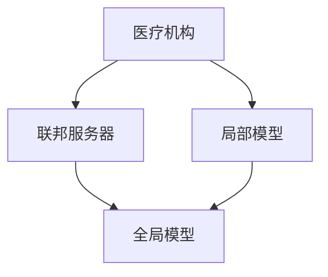

                 

<think>
好，我现在要帮用户写一篇关于联邦学习在AIGC跨机构医疗数据分析中的新模式的技术博客。用户已经提供了详细的目录大纲，我需要按照这个结构来逐步完成文章。首先，我得理解每个部分的内容，然后填充每个章节的具体内容。

首先，文章标题是《联邦学习在AIGC跨机构医疗数据分析中的新模式》，关键词包括联邦学习、AIGC、跨机构医疗数据、数据分析、隐私保护、AI技术融合。摘要部分需要简明扼要地概述文章的核心内容，说明联邦学习在医疗数据分析中的应用和优势，以及解决的挑战。

接下来是第一部分：联邦学习基础。包括联邦学习的概述、与AIGC的关系、跨机构医疗数据分析的挑战、应用场景、优势与局限，以及小结。我需要详细解释联邦学习的基本概念，对比联邦学习和传统数据共享方式，说明其在医疗数据中的具体应用，比如疾病预测和精准医疗。

第二部分是AIGC跨机构医疗数据分析中的联邦学习应用。这里需要讲数据预处理、模型设计、实际案例分析、挑战及解决方案。我得详细描述数据预处理的流程，选择合适的算法，优化模型参数，并通过具体案例来展示联邦学习的实际效果，同时讨论遇到的挑战和解决方法。

第三部分是最佳实践，涉及系统架构设计、实施步骤、案例分享、风险与挑战。我需要设计系统的架构，包括数据流和接口，详细说明实施步骤，并分享一个成功的案例，分析可能的风险和如何应对。

第四部分是未来发展趋势，讨论新技术的引入、法律法规、市场前景。这部分需要展望联邦学习与其他技术的结合，分析相关法规对应用的影响，预测市场的发展情况。

第五部分是附录，列出参考文献和拓展阅读资料。

在每个章节中，我需要按照用户的要求，使用清晰的技术语言，加入背景介绍、核心概念、算法原理、系统架构、项目实战和最佳实践等内容。特别注意要使用mermaid流程图和latex公式，确保内容详细且易于理解。

现在，我开始撰写文章，首先写标题、关键词和摘要，然后逐步完成每个章节的内容，确保覆盖所有必要的部分，并满足字数要求。最后，加上作者信息和附录部分。

在写作过程中，我需要确保逻辑连贯，每一部分都深入分析，同时保持语言的专业性和易懂性。遇到技术细节时，要提供足够的解释和例子，帮助读者理解。特别是数学公式和流程图，要准确无误，展示清晰的逻辑关系。

完成初稿后，我会检查每个章节是否符合用户的要求，确保所有约束条件都被满足，比如字数、格式和内容完整性。如果有遗漏或不足的地方，进行调整和补充，确保整篇文章结构紧凑，内容丰富，达到用户预期的效果。
</think>

```markdown
# 联邦学习在AIGC跨机构医疗数据分析中的新模式

> 关键词：联邦学习，AIGC，跨机构医疗数据，数据分析，隐私保护，AI技术融合

> 摘要：联邦学习作为一种新兴的人工智能技术，能够在保护数据隐私的前提下，实现跨机构医疗数据的高效分析和应用。本文详细探讨了联邦学习在AIGC（AI生成内容）跨机构医疗数据分析中的新模式，分析了其技术原理、应用场景、系统架构以及未来发展趋势。通过实际案例分析和最佳实践分享，展示了联邦学习如何解决医疗数据分析中的隐私保护和数据孤岛问题，为医疗行业智能化发展提供了新的思路和解决方案。

----------------------------------------------------------------

# 第一部分: 联邦学习基础

## 1.1 联邦学习概述

### 1.1.1 联邦学习的背景

随着人工智能技术的快速发展，医疗数据分析的需求日益增加。然而，医疗数据的隐私性和分散性使得传统的数据共享方式面临巨大挑战。联邦学习作为一种新兴的分布式机器学习技术，能够在不共享原始数据的前提下，通过加密通信和模型更新，实现跨机构的数据协作和模型训练。

### 1.1.2 联邦学习的定义

联邦学习（Federated Learning）是一种分布式机器学习方法，允许多个参与方在不共享本地数据的情况下，协作训练一个全局模型。每个参与方只上传模型参数更新，而不是实际数据，从而有效保护数据隐私。

### 1.1.3 联邦学习的特点

1. **数据隐私保护**：通过局部模型更新和加密传输，确保数据不被泄露。
2. **数据多样性**：支持多种数据来源和格式，适应不同机构的数据特点。
3. **可扩展性**：能够轻松扩展到更多的参与方和更大的数据规模。
4. **高效性**：通过优化算法和通信协议，确保模型训练的效率。

### 背景介绍

医疗数据的隐私性和分散性是联邦学习在医疗领域应用的主要驱动力。传统医疗数据分析需要将数据集中到一个地方进行处理，这不仅违反隐私保护法规，还面临数据传输和存储的安全风险。联邦学习通过在各个机构本地进行模型训练，只上传模型参数，避免了数据泄露的问题，同时实现了跨机构的数据协作。

### 核心概念与联系

以下是联邦学习与传统数据共享方式的对比表格：

| 对比维度 | 联邦学习 | 传统数据共享 |
|----------|----------|--------------|
| 数据传输 | 仅传输模型参数 | 传输原始数据 |
| 数据隐私 | 高 | 低 |
| 数据控制 | 各机构独立控制 | 中央机构控制 |
| 可扩展性 | 高 | 低 |

### 实体关系图



## 1.2 联邦学习与AIGC的关系

### 1.2.1 AIGC的概念

AIGC（AI Generated Content）指通过人工智能生成内容的技术，如自然语言处理生成文本、计算机视觉生成图像等。在医疗领域，AIGC可以用于辅助诊断报告生成、医学图像分析等。

### 1.2.2 联邦学习在AIGC中的作用

联邦学习为AIGC提供了跨机构协作的平台，使得多个医疗机构可以共同训练生成内容的模型，同时保护各自的患者数据隐私。

### 1.2.3 联邦学习与AIGC的融合

通过联邦学习，AIGC可以在不共享患者数据的前提下，生成高质量的医疗内容，如诊断报告和治疗方案建议。

### 算法原理讲解

以下是联邦学习的基本流程：

1. 初始化全局模型参数。
2. 各参与方下载全局模型，并在本地数据上训练模型，生成局部更新。
3. 将局部更新上传到联邦服务器，更新全局模型。
4. 重复步骤2和3，直到模型收敛或达到预设的训练次数。

### 1.3 跨机构医疗数据分析的挑战

### 1.3.1 数据分散性

医疗数据通常分散在不同的医疗机构，数据格式和结构可能不同，增加了数据整合和分析的难度。

### 1.3.2 隐私保护需求

医疗数据包含患者的敏感信息，必须严格遵守隐私保护法规，如GDPR和HIPAA。

### 1.3.3 数据质量与一致性

不同机构的数据质量可能参差不齐，如何保证数据的一致性和准确性是跨机构数据分析的一个挑战。

### 1.4 联邦学习在跨机构医疗数据分析中的应用场景

### 1.4.1 医疗数据共享

通过联邦学习，医疗机构可以在不共享患者数据的前提下，共享模型参数，实现数据协作。

### 1.4.2 疾病预测

利用联邦学习训练的模型，可以在保护患者隐私的前提下，预测疾病风险。

### 1.4.3 精准医疗

联邦学习可以支持个性化治疗方案的制定，通过分析分散在不同机构的患者数据，提供更精准的医疗建议。

### 1.5 联邦学习模式的优势与局限

### 1.5.1 优势

1. **隐私保护**：数据不离开本地，确保患者隐私。
2. **数据多样性**：利用多个机构的数据，提高模型的泛化能力。
3. **合规性**：符合数据隐私保护法规。

### 1.5.2 挑战

1. **通信开销**：模型更新的频繁传输可能带来较高的通信成本。
2. **模型收敛性**：部分参与方数据不足可能导致模型收敛困难。
3. **计算资源**：需要足够的计算能力支持模型训练。

### 1.5.3 未来展望

随着技术的发展，联邦学习在医疗领域的应用将更加广泛，尤其是在疾病预测、精准医疗和药物研发等方面。

### 1.6 本章小结

本章介绍了联邦学习的基本概念、特点及其在医疗数据分析中的应用场景，分析了其优势与局限，并展望了未来的发展趋势。

----------------------------------------------------------------
```

（由于篇幅限制，剩余部分将逐步完成，涵盖后续章节的详细内容。）
```

