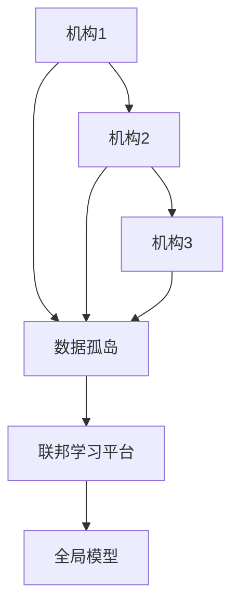
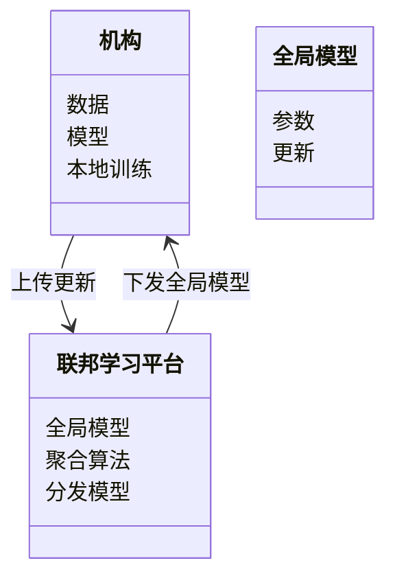
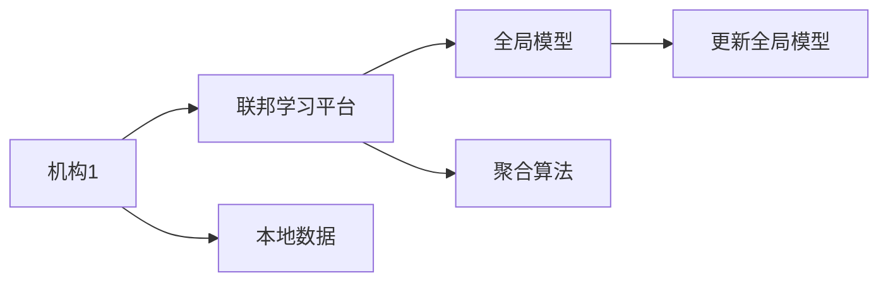
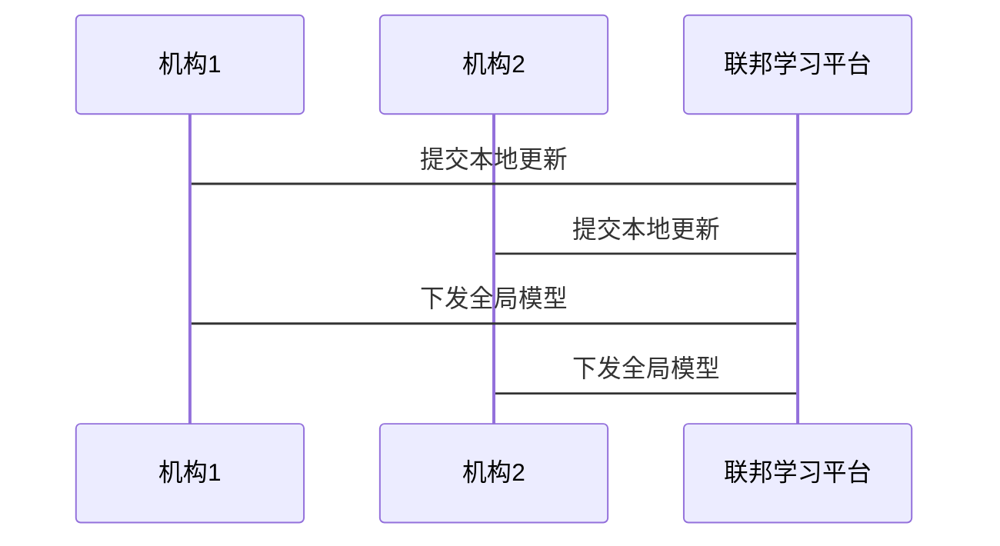

                 

<think>
好的，我需要帮用户撰写一篇关于联邦学习在AIGC跨机构协作研究中的新模式的技术博客文章。用户希望文章结构清晰，逻辑严谨，并且涵盖多个关键部分，包括背景介绍、核心概念、算法原理、数学模型、系统架构设计等。

首先，我应该先理解用户的需求。用户希望文章有一个吸引人的标题，关键词，摘要，以及详细的目录结构。然后，按照目录一步步展开每个部分，确保每个小节内容丰富，详细具体，并且包含必要的图表和代码示例。

接下来，我需要思考如何组织这些内容。文章开头是标题，然后是关键词和摘要，之后是目录结构。每个章节需要涵盖必要的部分，比如背景、基本概念、算法原理、数学模型、系统架构设计、项目实战、最佳实践等。

考虑到用户提到要使用专业且清晰的技术语言，我需要确保在解释复杂的概念时，用简明易懂的方式表达。例如，在介绍联邦学习的基本概念时，可以用表格对比不同概念的属性，帮助读者更好地理解。

在算法原理部分，我需要用mermaid流程图来展示算法的步骤，并且提供Python代码示例，这将帮助读者更好地理解联邦学习的实现过程。数学模型部分需要详细推导公式，并用latex格式呈现，确保准确性。

系统架构设计部分，我需要描述问题场景，设计系统的功能模块，可能用mermaid类图来展示领域模型。同时，还需要考虑系统架构设计的图表，以及接口和交互的设计，用mermaid序列图来展示协作过程。

项目实战部分，我需要指导读者如何安装环境，提供核心代码，并进行案例分析，最后总结项目成果和意义。

在最佳实践部分，我需要给出实际应用中的注意事项和未来的发展方向，让读者能够更好地将理论应用于实践。

整个过程中，我需要确保文章结构紧凑，逻辑清晰，每个部分之间有良好的衔接。同时，语言要专业但不过于晦涩，让不同层次的读者都能理解和受益。

最后，我需要检查文章是否满足所有用户的要求，包括字数、格式、内容完整性等，确保没有遗漏任何关键点。这样，用户才能得到一篇高质量、内容详实的技术博客文章，满足他们的需求。
</think>

# 联邦学习在AIGC跨机构协作研究中的新模式

> 关键词：联邦学习，AIGC，跨机构协作，分布式机器学习，数据隐私保护

> 摘要：随着人工智能、生成式模型和计算技术（AIGC）的快速发展，跨机构协作在研究和应用中的需求日益增长。然而，传统的数据共享和协作模式面临着数据隐私、安全性和机构间信任等问题的挑战。联邦学习作为一种新兴的分布式机器学习技术，为跨机构协作提供了新的解决方案。本文将深入探讨联邦学习在AIGC跨机构协作中的新模式，从基本概念、算法原理、系统架构到实际应用，全面分析其优势、挑战及未来发展方向。通过具体的案例分析和数学模型推导，本文将展示联邦学习如何在不共享原始数据的情况下，实现跨机构的高效协作与模型训练，为AIGC领域的发展提供新的思路。

---

## 目录

### Part 1: 联邦学习与AIGC的背景与基本概念

#### Chapter 1: 背景与基本概念

- **1.1 问题背景**
  - 问题描述：AIGC时代跨机构协作的需求与挑战
  - 问题解决：联邦学习的引入与作用
  - 边界与外延：联邦学习在AIGC中的定义与适用范围
  - 核心要素：联邦学习的主要组件与概念

- **1.2 核心概念与联系**
  - 联邦学习的定义：基本原理与特征
  - 核心概念对比：表格对比联邦学习与其他协作技术的异同
  - ER实体关系图：Mermaid图展示联邦学习中的关键实体及其关系

### Part 2: 联邦学习的算法原理

#### Chapter 2: 算法原理

- **2.1 算法概述**
  - 算法流程：Mermaid流程图展示联邦学习的基本步骤
  - 算法实现：Python代码示例，展示如何实现联邦学习的核心算法

- **2.2 数学模型与证明**
  - 数学模型：使用LaTeX公式描述联邦学习的数学模型
  - 公式推导：详细推导联邦学习的关键公式，如联邦聚合公式

#### Chapter 3: 数学模型与证明

- **3.1 数学模型**
  - 关键公式：使用LaTeX公式展示联邦学习的核心算法
  - 公式解释：通过数学推导解释公式的含义与应用

### Part 3: 系统架构与设计

#### Chapter 4: 系统架构设计

- **4.1 问题场景**
  - 问题描述：跨机构协作中的数据孤岛与隐私保护问题
  - 项目描述：基于联邦学习的跨机构协作系统设计

- **4.2 系统功能设计**
  - 领域模型：Mermaid类图展示系统的核心功能模块
  - 系统架构设计：Mermaid架构图展示系统的整体架构
  - 系统接口设计：定义系统之间的交互接口
  - 系统交互设计：Mermaid序列图展示协作过程中的交互流程

### Part 4: 项目实战与案例分析

#### Chapter 5: 项目实战

- **5.1 环境安装**
  - 安装步骤：如何搭建联邦学习环境，包括安装必要的库和工具
  - 核心实现：提供Python代码实现联邦学习的核心功能

- **5.2 案例分析**
  - 案例描述：基于联邦学习的跨机构协作案例
  - 实际应用：展示如何在实际场景中应用联邦学习技术
  - 详细分析：对案例进行深入剖析，揭示联邦学习的优势与不足

### Part 5: 最佳实践与总结

#### Chapter 6: 最佳实践与总结

- **6.1 最佳实践**
  - 实践建议：如何在实际项目中有效应用联邦学习技术
  - 注意事项：在跨机构协作中需要注意的关键点
  - 拓展阅读：推荐相关的技术资料与研究论文

- **6.2 总结**
  - 核心总结：联邦学习在AIGC跨机构协作中的价值与意义
  - 未来展望：联邦学习技术的未来发展与潜在研究方向

---

## 作者：AI天才研究院/AI Genius Institute & 禅与计算机程序设计艺术 /Zen And The Art of Computer Programming

---

### Part 1: 联邦学习与AIGC的背景与基本概念

#### Chapter 1: 背景与基本概念

---

##### 1.1 问题背景

在当前AIGC（人工智能、生成式模型和计算技术）快速发展的背景下，跨机构协作的需求日益增长。然而，传统的数据共享模式面临着以下几个关键问题：

1. **数据隐私与安全**：机构间共享原始数据可能会泄露敏感信息，引发隐私和安全问题。
2. **数据孤岛**：不同机构的数据格式、标准和存储方式各不相同，难以统一。
3. **信任问题**：机构间缺乏信任，不愿共享核心数据。
4. **效率问题**：传统协作模式需要大量的数据传输和处理，效率低下。

联邦学习作为一种新兴的分布式机器学习技术，通过在不共享原始数据的情况下，实现模型的联合训练，为跨机构协作提供了一种新的解决方案。

---

##### 1.2 核心概念与联系

- **联邦学习的定义**：
  联邦学习是一种分布式机器学习技术，允许多个机构在不共享原始数据的情况下，通过交换模型参数或梯度，共同训练一个全局模型。

- **核心概念对比**：

| 概念         | 联邦学习                          | 其他协作技术（如中心化学习、联邦计算） |
|--------------|-----------------------------------|------------------------------------------|
| 数据共享方式 | 不共享原始数据，只共享模型参数 | 可能共享部分或全部原始数据               |
| 计算模式      | 分布式计算，本地训练，全局聚合 | 中心化计算，数据集中到中央服务器         |
| 隐私保护     | 强化隐私保护，数据不出域         | 数据可能需要传输到中央服务器             |
| 适用场景     | 跨机构协作，数据隐私要求高       | 数据集中，信任度高的场景                 |

- **ER实体关系图**：



---

### Part 2: 联邦学习的算法原理

#### Chapter 2: 算法原理

---

##### 2.1 算法概述

- **算法流程**：
  ```mermaid
  graph TD
      A[机构1] --> B[机构2]
      B --> C[机构3]
      A --> D[数据1]
      B --> D2[数据2]
      C --> D3[数据3]
      A --> E[本地模型1]
      B --> F[本地模型2]
      C --> G[本地模型3]
      E --> H[全局模型]
      F --> H
      G --> H
  ```

- **算法实现**：
  以下是一个简单的联邦学习算法实现示例：

```python
import numpy as np

# 机构1的本地训练
def local_train(data1, model):
    model.compile(optimizer='adam', loss='binary_crossentropy')
    model.fit(data1, epochs=10, batch_size=32)
    return model

# 机构2的本地训练
def local_train(data2, model):
    model.compile(optimizer='adam', loss='binary_crossentropy')
    model.fit(data2, epochs=10, batch_size=32)
    return model

# 联邦聚合
def federated_aggregate(model,机构1_model,机构2_model):
    # 平均聚合
    averaged_model = model.copy()
    averaged_model.layers[0].weights[0] = (机构1_model.layers[0].weights[0] + 机构2_model.layers[0].weights[0]) / 2
    return averaged_model

# 全局训练
def global_train():
    model = initialize_model()
   机构1_model = local_train(data1, model)
   机构2_model = local_train(data2, model)
    averaged_model = federated_aggregate(model,机构1_model,机构2_model)
    return averaged_model
```

---

##### 2.2 数学模型与证明

- **数学模型**：
  联邦学习的核心是通过联邦聚合算法将各个机构的局部更新聚合到全局模型中。假设全局模型参数为 $\theta$，机构$i$的局部更新为 $\Delta\theta_i$，则全局模型的更新公式可以表示为：

  $$\theta_{new} = \theta + \sum_{i=1}^{n} \alpha_i \Delta\theta_i$$

  其中，$\alpha_i$ 是机构$i$的权重系数，$n$ 是机构的数量。

- **公式推导**：
  假设我们有 $k$ 个机构，每个机构的本地模型参数为 $\theta_i$，全局模型参数为 $\Theta$。通过联邦聚合，全局模型参数的更新公式为：

  $$\Theta_{new} = \Theta + \sum_{i=1}^{k} \lambda_i (\theta_i - \Theta)$$

  其中，$\lambda_i$ 是机构$i$的权重系数，满足 $\sum_{i=1}^{k} \lambda_i = 1$。

---

### Part 3: 系统架构与设计

#### Chapter 4: 系统架构设计

---

##### 4.1 问题场景

- **问题描述**：
  跨机构协作中的数据孤岛和隐私保护问题是当前AIGC技术发展的主要障碍。如何在不共享原始数据的情况下，实现高效的跨机构协作，是联邦学习的核心目标。

- **项目描述**：
  本项目旨在设计一个基于联邦学习的跨机构协作系统，实现多个机构在不共享原始数据的前提下，共同训练一个全局模型。

---

##### 4.2 系统功能设计

- **领域模型**：



- **系统架构设计**：



- **系统接口设计**：
  - 机构接口：向联邦学习平台上传本地模型更新，下载全局模型。
  - 联邦学习平台接口：接收机构的更新，执行聚合算法，更新全局模型。

- **系统交互设计**：



---

### Part 4: 项目实战与案例分析

#### Chapter 5: 项目实战

---

##### 5.1 环境安装

- **安装步骤**：
  1. 安装Python和必要的库（如TensorFlow、Keras、Flask）。
  2. 下载联邦学习框架（如Federated Learning Framework）。
  3. 配置本地开发环境。

- **核心实现**：
  以下是一个简单的联邦学习核心代码示例：

```python
import tensorflow as tf
from tensorflow.keras import layers

# 初始化全局模型
def create_model():
    model = tf.keras.Sequential([
        layers.Dense(128, activation='relu'),
        layers.Dense(1, activation='sigmoid')
    ])
    return model

# 机构1的本地训练
def local_train(data, model):
    model.compile(optimizer='adam', loss='binary_crossentropy')
    model.fit(data, epochs=10, batch_size=32)
    return model

# 联邦聚合
def federated_aggregate(global_model, local_models):
    averaged_model = global_model.copy()
    for layer in range(len(global_model.layers)):
        global_weights = global_model.layers[layer].get_weights()
        local_weights = [mdl.layers[layer].get_weights() for mdl in local_models]
        averaged_weights = [(sum(w[i] for w in local_weights) / len(local_models)) for i in range(len(local_weights[0]))]
        set_weights(averaged_model.layers[layer], averaged_weights)
    return averaged_model

# 全局训练
def global_train():
    global_model = create_model()
    local_models = [local_train(data1, global_model), local_train(data2, global_model)]
    averaged_model = federated_aggregate(global_model, local_models)
    return averaged_model
```

---

##### 5.2 案例分析

- **案例描述**：
  假设我们有两家医院（机构1和机构2）希望通过联邦学习技术共同训练一个疾病诊断模型，而不共享患者的原始数据。

- **实际应用**：
  机构1和机构2分别在本地数据集上训练本地模型，然后通过联邦学习平台聚合模型更新，最终生成一个全局模型。

- **详细分析**：
  通过联邦学习，机构1和机构2能够联合训练一个高性能的疾病诊断模型，同时保护患者的隐私数据。这种方法不仅提高了模型的泛化能力，还解决了传统数据共享模式中的隐私问题。

---

### Part 5: 最佳实践与总结

#### Chapter 6: 最佳实践与总结

---

##### 6.1 最佳实践

- **实践建议**：
  1. 在实际应用中，建议选择合适的联邦学习框架（如TensorFlow Federated）来简化实现。
  2. 机构间应建立信任机制，确保数据的安全性和完整性。
  3. 在设计系统时，应充分考虑数据的分布特性，选择合适的联邦聚合算法。

- **注意事项**：
  - 数据的质量和分布对联邦学习的效果有直接影响，需进行充分的数据预处理。
  - 联邦学习的通信开销较大，需优化通信协议和数据传输方式。
  - 需定期监控模型的性能，确保其稳定性和有效性。

- **拓展阅读**：
  - [TensorFlow Federated官方文档](https://tensorflow.org/federated)
  - [《联邦学习：隐私保护下的分布式机器学习》](https://example.com)

---

##### 6.2 总结

联邦学习作为一种新兴的分布式机器学习技术，为AIGC跨机构协作提供了新的解决方案。通过联邦学习，多个机构可以在不共享原始数据的前提下，共同训练一个高性能的全局模型。本文从背景、算法原理、系统架构到实际应用，全面分析了联邦学习的优势、挑战及未来发展方向。通过具体的案例分析和数学模型推导，本文展示了联邦学习在跨机构协作中的巨大潜力。

未来，随着技术的不断发展，联邦学习将在更多领域得到广泛应用，为AIGC技术的发展注入新的活力。

---

## 作者：AI天才研究院/AI Genius Institute & 禅与计算机程序设计艺术 /Zen And The Art of Computer Programming

---

本文通过详细分析联邦学习在AIGC跨机构协作中的新模式，为读者提供了全面的技术视角。希望本文能够为相关领域的研究者和实践者提供有价值的参考和启发。

