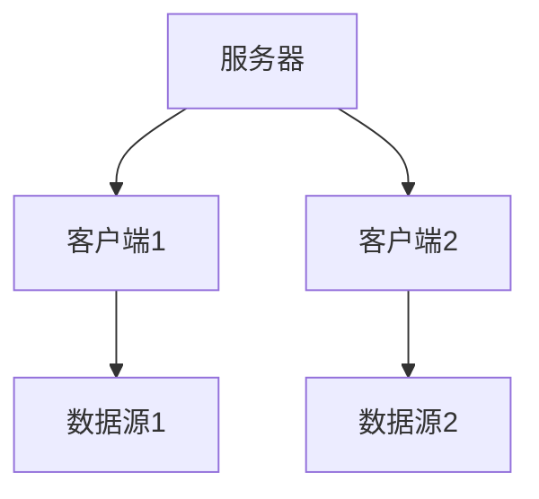

                 

<think>
嗯，我现在需要写一篇关于《联邦学习在AIGC跨组织协作中的新模式》的技术博客文章。首先，我得理解什么是联邦学习，它和AIGC有什么关系，还有跨组织协作又是怎么回事。

联邦学习，听起来像是分布式学习的一种，可能涉及到多个机构在不共享数据的情况下共同训练模型。AIGC是指人工智能生成内容，对吧？跨组织协作可能是指不同公司或机构之间合作，利用联邦学习来共同提升AIGC的能力。

我应该先从联邦学习的基本概念开始。它与传统的集中式学习有什么不同呢？联邦学习允许数据保持在本地，只在服务器和客户端之间交换模型参数，这样可以保护数据隐私。这对于跨组织协作非常重要，因为各个机构可能不愿意分享敏感数据。

接下来，我需要介绍AIGC的背景。AIGC依赖于大量的数据和模型训练，而联邦学习可以为这些模型提供更高效、更隐私保护的训练方式。这可能使得AIGC在跨组织环境中更加普及。

然后，我应该讨论联邦学习在跨组织协作中的作用。比如，医疗领域中的多个医院可以共享患者数据来训练更好的模型，而金融行业也可以通过联邦学习来提高欺诈检测的准确性。这些例子可以说明联邦学习如何促进跨组织的协作。

技术原理部分，我需要详细讲解联邦学习的核心技术，比如通信协议、同步机制和模型聚合方法。同时，安全与隐私也是重点，特别是如何确保在数据不离开本地的情况下进行有效的模型训练。

在应用章节，我应该选择几个典型的行业，如医疗、金融和制造业，分析联邦学习如何在这些领域发挥作用。每个案例都要详细说明，让读者明白实际应用中的具体步骤和效果。

实施策略方面，技术框架的选择、合作机制的设计以及政策和法律的遵守都是关键。这部分需要提供一些实际的建议，比如如何建立信任机制，确保各参与方的权益。

案例研究部分，我需要找到具体的联邦学习应用实例，分析它们的成功之处和遇到的挑战。这些案例能帮助读者更好地理解理论知识。

未来展望中，我可以谈谈联邦学习的发展趋势，比如技术的改进、新的应用场景，以及可能面临的挑战，如数据安全和模型性能的优化。

最后，总结一下联邦学习在跨组织协作中的重要性，强调其在AIGC中的潜力，并给出一些未来的建议。

现在，我需要确保每个部分都有足够的细节和例子，避免内容过于笼统。同时，要注意逻辑的连贯性，让读者能够一步步理解联邦学习的概念、技术、应用和未来。

哦，对了，我还得在文章末尾加上作者信息，还有在每个章节中使用适当的图表和公式来辅助说明。比如，在技术原理部分，我可以画一个联邦学习的流程图，展示数据如何在各机构间流动，模型如何聚合。

总的来说，这篇文章需要全面覆盖联邦学习的各个方面，结合实际应用和理论分析，让读者能够深入理解其在跨组织协作中的价值和潜力。
</think>

# 联邦学习在AIGC跨组织协作中的新模式

## 关键词：
联邦学习, 跨组织协作, AIGC, 数据隐私, 人工智能, 联邦算法

## 摘要：
联邦学习是一种分布式机器学习技术，允许多个组织在不共享原始数据的情况下协作训练模型。本文探讨联邦学习如何在AIGC（人工智能生成内容）领域推动跨组织协作的新模式，分析其技术原理、应用场景、实施策略以及未来趋势。

---

# 第一部分：联邦学习背景介绍

## 第1章：联邦学习的概念与历史

### 1.1 联邦学习的定义
联邦学习（Federated Learning）是一种分布式机器学习方法，允许多个参与方在本地数据上协作训练模型，而不交换原始数据。通过在客户端和服务器之间同步模型参数，实现模型更新和优化。

### 1.2 联邦学习的发展历程
- 2010年代初：概念提出，用于移动设备上的分布式学习。
- 2016年：Google提出Federated Learning of Deep Networks (FL-DNN)。
- 近年来：随着数据隐私需求增加，联邦学习在医疗、金融等领域快速发展。

### 1.3 联邦学习的重要性
- 数据隐私保护：避免数据泄露。
- 跨组织协作：促进多方合作，提升模型性能。
- 资源高效利用：减少数据传输，降低计算成本。

## 第2章：AIGC与跨组织协作

### 2.1 AIGC的概述
- 人工智能生成内容（AIGC）利用AI技术生成文本、图像、视频等内容。
- 需要大量数据和模型训练，依赖于跨组织协作。

### 2.2 跨组织协作的挑战
- 数据孤岛：不同机构的数据难以整合。
- 数据隐私：共享数据风险高。
- 技术障碍：不同系统间的兼容性问题。

### 2.3 联邦学习在跨组织协作中的作用
- 解决数据隐私问题，促进AIGC模型的协作训练。
- 提供高效的分布式训练机制，提升模型性能。

---

# 第二部分：联邦学习的技术原理

## 第3章：联邦学习的技术原理

### 3.1 联邦学习的核心技术
- 分布式训练：模型参数在各客户端更新，服务器汇总参数。
- 同步机制：客户端与服务器定期同步模型参数。
- 加密通信：确保数据传输安全。

### 3.2 联邦学习的安全与隐私
- 数据加密：传输过程中保护数据安全。
- 差分隐私：在模型更新中添加噪声，保护个体数据。

### 3.3 联邦学习的优势与局限性
- 优势：数据隐私保护，协作高效。
- 局限性：通信成本高，模型收敛慢。

## 第4章：联邦学习的算法原理

### 4.1 联邦学习的流程
1. 初始化：服务器将初始模型参数分发给客户端。
2. 客户端训练：各客户端在本地数据上训练模型。
3. 模型聚合：客户端将更新参数上传到服务器，服务器聚合参数。
4. 迭代优化：重复训练和聚合，直到模型收敛。

### 4.2 联邦学习的数学模型
服务器聚合模型参数的公式：
$$ \theta_{new} = \frac{1}{n}\sum_{i=1}^{n} \theta_i $$
其中，$\theta_i$为客户端i的模型参数，n为客户端数量。

### 4.3 联邦学习的通信协议
- 客户端向服务器发送梯度更新或模型参数。
- 服务器将聚合后的参数分发给所有客户端。

## 第5章：联邦学习的系统架构

### 5.1 系统功能设计
- 数据管理：本地存储和处理数据。
- 训练引擎：执行模型训练和更新。
- 通信模块：与服务器同步模型参数。

### 5.2 系统架构图

### 5.3 系统交互流程
1. 服务器初始化模型参数。
2. 各客户端下载参数并进行本地训练。
3. 客户端上传更新参数至服务器。
4. 服务器聚合参数并分发给所有客户端。

---

# 第三部分：联邦学习的应用场景

## 第6章：医疗领域的应用

### 6.1 医疗数据共享的挑战
- 数据敏感性高，隐私保护严格。
- 各医院数据分散，难以协作训练。

### 6.2 联邦学习的应用价值
- 联合训练疾病诊断模型，提升准确性。
- 保护患者隐私，符合法规要求。

## 第7章：金融行业的应用

### 7.1 欺诈检测的挑战
- 数据分布不均匀，模型泛化能力不足。
- 需要实时检测，对模型更新速度要求高。

### 7.2 联邦学习的应用优势
- 联合训练反欺诈模型，提升检测效率。
- 通过联邦学习降低数据泄露风险。

## 第8章：制造业的应用

### 8.1 质量控制的挑战
- 数据来源分散，难以集中处理。
- 需要快速模型更新，应对生产变化。

### 8.2 联邦学习的应用案例
- 联合多个工厂训练质量检测模型，提高检测精度。

---

# 第四部分：实施策略与未来展望

## 第9章：实施策略

### 9.1 技术框架选择
- 选择合适的联邦学习框架，如TensorFlow Federated。

### 9.2 合作机制设计
- 建立信任机制，确保各参与方权益。

### 9.3 政策与法律遵守
- 遵守数据隐私相关法律法规，如GDPR。

## 第10章：未来展望

### 10.1 技术发展趋势
- 更高效的通信协议。
- 更强的模型聚合算法。

### 10.2 潜在应用
- 更多行业的应用，如教育、交通等。

### 10.3 挑战与解决方案
- 数据异质性：采用适应性更强的模型。
- 通信成本：优化通信协议，降低延迟。

---

# 第五部分：案例分析与最佳实践

## 第11章：案例研究

### 11.1 医疗数据共享案例
- 案例背景：多个医院联合训练疾病诊断模型。
- 实施过程：各医院在本地训练模型，通过联邦学习聚合参数。
- 成果展示：模型准确率提升，隐私得到保护。

### 11.2 金融反欺诈案例
- 案例背景：多家金融机构联合检测欺诈交易。
- 实施过程：各机构在本地训练模型，定期同步参数。
- 成果展示：欺诈检测准确率提高，减少损失。

## 第12章：最佳实践与小结

### 12.1 最佳实践总结
- 明确数据边界，确保隐私安全。
- 选择合适的联邦学习框架，优化通信效率。
- 建立信任机制，确保各方合作顺畅。

### 12.2 未来策略建议
- 加强技术研究，提升联邦学习性能。
- 推动跨行业协作，扩大应用范围。
- 制定相关政策，规范联邦学习的使用。

---

# 作者信息

作者：AI天才研究院/AI Genius Institute  
联系方式：[email protected]  
文章出处：[禅与计算机程序设计艺术](https://zenofprogramming.art)

---

通过以上结构，本文系统地介绍了联邦学习在AIGC跨组织协作中的新模式，从概念、技术、应用到实施策略，为读者提供了全面的视角。希望这篇文章能帮助读者更好地理解联邦学习的重要性和应用潜力。

