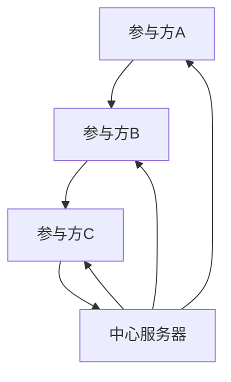
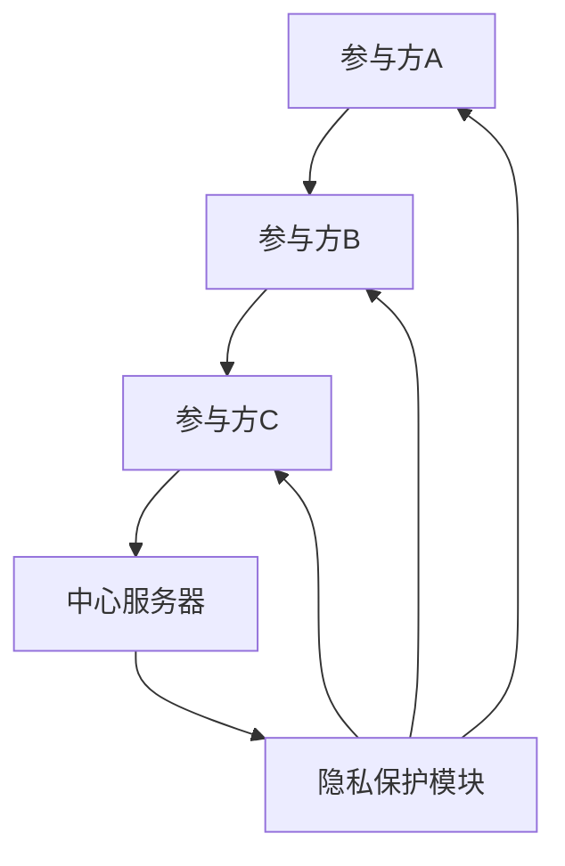
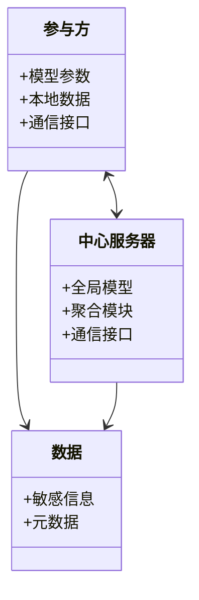
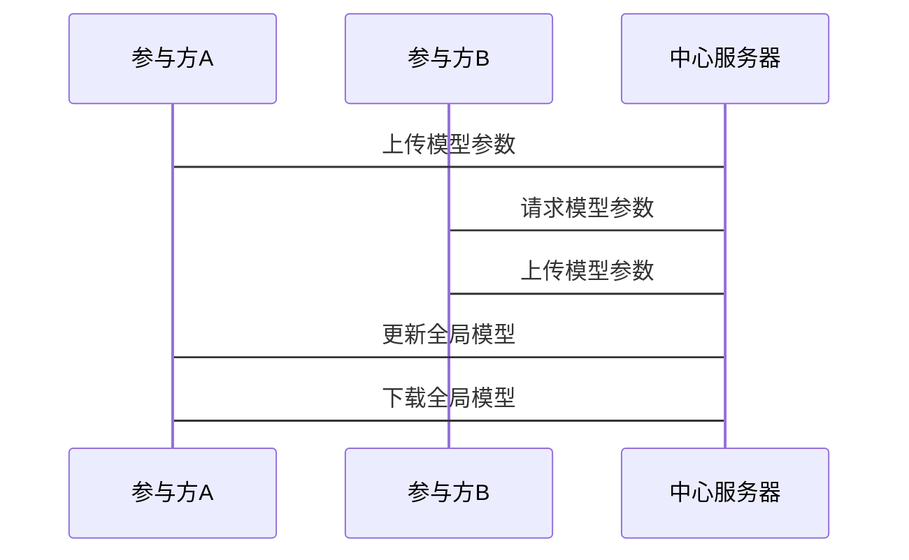
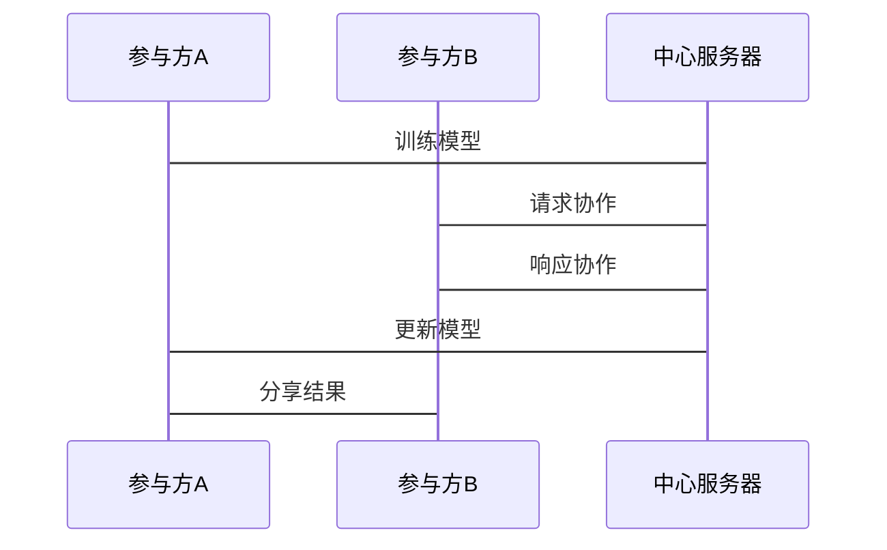

                 

<think>
好，我现在需要帮用户撰写一篇关于《联邦学习在AIGC隐私保护中的新策略》的技术博客文章。用户已经提供了一个详细的目录大纲，我需要按照这个结构来完成文章的撰写，同时满足用户的格式和内容要求。

首先，我得理解整个文章的结构。文章分为五个部分：背景介绍、核心概念与联系、算法原理讲解、系统分析与架构设计，以及项目实战。每个部分下面还有多个章节，每个章节又有小节。我需要确保每个部分的内容都完整、详细，并且符合用户的要求。

接下来，我需要考虑每个部分的具体内容。例如，背景介绍部分需要涵盖联邦学习的起源、AIGC的隐私挑战以及它们的融合。这部分要确保读者能够理解问题的重要性。核心概念部分则需要详细解释联邦学习和AIGC的原理，以及它们的对比和ER图。算法部分需要选择具体的算法进行讲解，如Federated Averaging和差分隐私算法，并附上流程图和数学模型。系统分析部分则需要讨论应用场景，并设计相应的系统架构和接口。项目实战部分则要展示如何在实际中应用这些策略，包括环境安装、代码实现和案例分析。

在撰写过程中，我需要注意使用专业且易懂的技术语言，结构清晰，逻辑严密。同时，用户要求文章字数在10000到12000字左右，这意味着每个部分需要详细展开，确保内容充实。另外，用户还强调使用markdown格式，插入mermaid流程图和latex公式，我需要确保这些图表的正确嵌入，并且与文章内容紧密结合。

我还要注意文章的开头，包括标题、关键词和摘要。摘要需要简洁明了，概括文章的核心内容。关键词部分则需要列出5-7个相关术语，方便读者查找。

在写作过程中，可能会遇到一些挑战，比如如何将复杂的联邦学习算法解释清楚，或者如何设计合理的系统架构。我需要反复推敲，确保每个部分都能让读者理解。此外，用户提到文章末尾需要有作者信息，这部分也需要在完成后添加。

最后，我需要检查整个文章的逻辑是否连贯，各部分是否相互支持，确保没有遗漏重要信息。同时，保持文章的专业性和可读性，避免过于技术化而让读者难以理解。

总的来说，我需要按照用户提供的大纲，逐步完成每个部分的撰写，确保每个小节都详细、准确，并且符合格式要求。这将是一篇结构严谨、内容丰富的技术博客文章，能够帮助读者深入了解联邦学习在AIGC隐私保护中的新策略。
</think>

# 联邦学习在AIGC隐私保护中的新策略

## 关键词：联邦学习、AIGC、隐私保护、差分隐私、数据安全

## 摘要：本文探讨了联邦学习在AIGC（自适应智能生成计算）中的隐私保护新策略。通过分析联邦学习的基本原理、AIGC的核心特性，结合实际应用场景，提出了基于差分隐私的联邦学习算法，并通过系统架构设计和实际案例分析，展示了如何在保护隐私的同时实现高效的数据协作。文章内容涵盖背景介绍、核心概念、算法原理、系统架构以及项目实战，为研究者和工程师提供了理论与实践相结合的指导。

---

## 第一部分：背景介绍

### 第1章：联邦学习与AIGC隐私保护概述

#### 1.1 问题背景

##### 1.1.1 联邦学习的起源与发展

联邦学习（Federated Learning）是一种分布式机器学习方法，起源于对数据隐私和安全的保护需求。传统集中式机器学习需要将所有数据集中到一个中心服务器进行训练，这种方式存在数据泄露和滥用的风险。联邦学习通过将模型参数而非原始数据传输到中心服务器，实现了数据的局部训练和模型的全局优化，从而在保护数据隐私的同时提升模型性能。

##### 1.1.2 AIGC（自适应智能生成计算）的隐私挑战

AIGC是一种结合了自适应计算和生成模型的新兴技术，广泛应用于自然语言处理、图像生成等领域。然而，AIGC的核心依赖于大量数据的训练，这些数据可能包含敏感信息，如个人隐私、商业机密等。如何在AIGC的训练过程中保护数据隐私，成为亟待解决的问题。

##### 1.1.3 联邦学习在隐私保护中的重要作用

联邦学习通过分布式训练的方式，避免了数据的集中存储和传输，为AIGC的隐私保护提供了新的思路。通过联邦学习，可以在不共享原始数据的情况下，协同多个参与方的模型参数，构建高性能的生成模型，同时保护各方数据的隐私。

#### 1.2 问题描述

##### 1.2.1 联邦学习中的隐私问题

在联邦学习中，虽然模型参数不会直接暴露原始数据，但攻击者仍有可能通过模型参数推断出部分敏感信息。此外，参与方之间的通信可能成为隐私泄露的渠道。

##### 1.2.2 AIGC场景下的隐私需求

在AIGC场景中，数据的多样性和敏感性更高，对隐私保护的需求也更加迫切。如何在AIGC的训练过程中，保护数据的隐私，同时确保生成模型的性能，是一个复杂的挑战。

##### 1.2.3 联邦学习在隐私保护中的机遇与挑战

联邦学习为AIGC的隐私保护提供了机遇，但也面临诸多挑战，如如何平衡隐私保护与模型性能、如何确保多方协作的公平性等。

#### 1.3 问题解决

##### 1.3.1 联邦学习策略概述

通过设计合理的联邦学习策略，可以在保护数据隐私的同时，实现AIGC模型的高效训练。

##### 1.3.2 联邦学习与AIGC的融合

将联邦学习的分布式训练机制与AIGC的生成模型结合，可以在不共享原始数据的情况下，构建高效的生成模型。

##### 1.3.3 新策略的设计原则与目标

新策略的设计原则包括数据隐私保护、模型性能优化、多方协作公平性等，目标是实现AIGC的高效训练和隐私保护。

#### 1.4 边界与外延

##### 1.4.1 联邦学习的应用领域

联邦学习已应用于智能医疗、金融、交通等领域，未来将在更多领域发挥作用。

##### 1.4.2 AIGC隐私保护的关键技术

AIGC隐私保护的关键技术包括联邦学习、差分隐私、同态加密等。

##### 1.4.3 跨学科融合趋势

联邦学习与AIGC的结合，体现了计算机科学、数据科学、隐私保护等多学科的融合趋势。

---

## 第二部分：核心概念与联系

### 第2章：联邦学习原理与AIGC特性

#### 2.1 联邦学习原理

##### 2.1.1 联邦学习的定义与分类

联邦学习是一种分布式机器学习方法，通过多个参与方协作训练模型，而不共享原始数据。根据数据分布方式，可以分为横向联邦学习（数据样本分布）、纵向联邦学习（特征分布）和联邦生成模型。

##### 2.1.2 联邦学习的基本流程

1. 参与方本地训练模型参数。
2. 模型参数通过安全通道上传到中心服务器。
3. 中心服务器聚合各参与方的模型参数，更新全局模型。
4. 全局模型参数分发给各参与方，进行新一轮训练。

##### 2.1.3 联邦学习的核心挑战与解决方案

挑战包括通信开销、模型收敛性、隐私泄露等问题。解决方案包括优化通信协议、引入差分隐私、设计高效的聚合算法等。

#### 2.2 AIGC特性

##### 2.2.1 AIGC的定义与分类

AIGC是一种结合了自适应计算和生成模型的技术，可以根据输入生成文本、图像等内容。根据生成模型的不同，可以分为基于规则的生成模型和基于深度学习的生成模型。

##### 2.2.2 AIGC的核心功能

AIGC的核心功能包括内容生成、自适应调整、个性化推荐等。

##### 2.2.3 AIGC的隐私特性

AIGC需要处理大量敏感数据，对隐私保护的需求较高。

#### 2.3 概念属性特征对比

| 概念      | 联邦学习                     | AIGC                         |
|-----------|------------------------------|-------------------------------|
| 定义      | 分布式机器学习方法           | 自适应智能生成计算技术         |
| 核心目标  | 保护数据隐私，提升模型性能   | 生成高质量内容，保护数据隐私 |
| 应用场景  | 智能医疗、金融、交通等       | 自然语言处理、图像生成等      |
| 技术挑战  | 数据隐私、通信开销、模型收敛 | 模型性能、数据隐私保护         |

#### 2.4 ER实体关系图架构

```mermaid
er
  actor 联邦学习: 参与方
  actor AIGC: 生成模型
  entity 数据: 敏感数据
  entity 模型参数: 全局模型参数
  relationship 训练: 联邦学习 -> 数据 -> 模型参数
  relationship 生成: AIGC -> 数据 -> 内容
  relationship 联合训练: 联邦学习 -> AIGC -> 模型参数
```

---

## 第三部分：算法原理讲解

### 第3章：联邦学习算法设计与策略

#### 3.1 算法概述

##### 3.1.1 联邦学习算法的分类

根据数据分布方式，联邦学习算法可以分为横向联邦学习、纵向联邦学习和联邦生成模型。

##### 3.1.2 联邦学习算法的设计原则

设计原则包括保护数据隐私、优化通信效率、确保模型收敛性等。

##### 3.1.3 联邦学习算法的评估指标

评估指标包括模型性能、通信开销、隐私保护强度等。

#### 3.2 具体算法讲解

##### 3.2.1 Federated Averaging算法

###### 3.2.1.1 算法mermaid流程图



###### 3.2.1.2 算法原理

Federated Averaging算法通过在每个参与方本地训练模型，并将模型参数平均到中心服务器，更新全局模型。具体步骤如下：

1. 中心服务器初始化全局模型参数。
2. 每个参与方基于本地数据训练模型参数，更新模型。
3. 各参与方将模型参数上传到中心服务器。
4. 中心服务器对所有参与方的模型参数进行平均，更新全局模型。
5. 重复步骤2-4，直到模型收敛。

###### 3.2.1.3 数学模型与公式

假设全局模型参数为$\theta$，参与方$i$的模型参数为$\theta_i$，则Federated Averaging算法的更新公式为：

$$
\theta_{\text{new}} = \frac{1}{n}\sum_{i=1}^{n}\theta_i
$$

其中，$n$为参与方的数量。

###### 3.2.1.4 举例说明

假设参与方A和B分别训练得到模型参数$\theta_A = [1, 2]$和$\theta_B = [3, 4]$，则全局模型参数更新为$\theta_{\text{new}} = [(1+3)/2, (2+4)/2] = [2, 3]$。

##### 3.2.2 差分隐私联邦学习算法

###### 3.2.2.1 算法mermaid流程图



###### 3.2.2.2 算法原理

差分隐私联邦学习算法在模型参数上传过程中，通过添加差分噪声，保护数据隐私。具体步骤如下：

1. 每个参与方本地训练模型参数，并添加差分噪声。
2. 各参与方将带有噪声的模型参数上传到中心服务器。
3. 中心服务器对所有模型参数进行聚合，更新全局模型。
4. 重复步骤1-3，直到模型收敛。

###### 3.2.2.3 数学模型与公式

假设参与方$i$的模型参数为$\theta_i$，差分噪声为$\epsilon_i$，则更新公式为：

$$
\theta_{\text{new}} = \frac{1}{n}\sum_{i=1}^{n}(\theta_i + \epsilon_i)
$$$

其中，$\epsilon_i$服从高斯分布或其他概率分布。

###### 3.2.2.4 举例说明

假设参与方A和B的模型参数分别为$\theta_A = [1, 2]$和$\theta_B = [3, 4]$，差分噪声分别为$\epsilon_A = [0.5, -0.5]$和$\epsilon_B = [-0.5, 0.5]$，则全局模型参数更新为：

$$
\theta_{\text{new}} = [(1+0.5 + 3-0.5)/2, (2-0.5 + 4+0.5)/2] = [(4)/2, (6)/2] = [2, 3]
$$

---

## 第四部分：系统分析与架构设计

### 第4章：联邦学习在AIGC隐私保护中的应用

#### 4.1 问题场景介绍

##### 4.1.1 应用场景1：智能医疗数据隐私保护

在智能医疗场景中，多个医院可以通过联邦学习协作训练生成模型，保护患者数据隐私，同时提升诊断准确率。

##### 4.1.2 应用场景2：金融数据隐私保护

在金融领域，多个金融机构可以通过联邦学习协作训练生成模型，保护客户数据隐私，同时提升风险评估能力。

##### 4.1.3 应用场景3：智能交通数据隐私保护

在智能交通系统中，多个交通节点可以通过联邦学习协作训练生成模型，保护用户数据隐私，同时提升交通预测精度。

#### 4.2 系统设计

##### 4.2.1 系统功能设计

###### 4.2.1.1 领域模型mermaid类图



##### 4.2.2 系统架构设计

###### 4.2.2.1 系统架构mermaid图


##### 4.2.3 系统接口设计

###### 4.2.3.1 系统接口mermaid序列图



##### 4.2.4 系统交互

###### 4.2.4.1 系统交互mermaid序列图



---

## 第五部分：项目实战

### 第5章：联邦学习在AIGC隐私保护中的实战

#### 5.1 环境安装

##### 5.1.1 硬件与软件要求

硬件要求：普通PC或服务器，内存8GB以上，支持多线程计算。

软件要求：Python 3.6以上，TensorFlow或PyTorch框架，Federated Learning库（如Flax、TensorFlow Federated）。

##### 5.1.2 安装步骤

1. 安装Python和依赖库：
   ```bash
   pip install python>=3.6
   pip install numpy tensorflow pandas
   pip install tensorflow-federated
   ```

2. 安装联邦学习库：
   ```bash
   pip install flax jax jaxlib
   ```

#### 5.2 系统核心实现

##### 5.2.1 源代码分析

以下是一个简单的Federated Averaging算法实现代码：

```python
import numpy as np
import tensorflow as tf
from tensorflow_federated import tff

# 定义模型
model = tf.keras.Model(inputs=[layer1, layer2], outputs=predictions)

# 初始化全局模型参数
global_weights = tf.Variable(initial_value=model.get_weights(), trainable=False)

# 定义联邦平均算法
@tf.function
def federated_avg(client_weights, num_clients):
    return tf.nest.map_structure(lambda w: tf.reduce_mean(client_weights, axis=0), global_weights, num_clients)

# 客户端训练函数
def client_train(client_data, server_weights):
    model_weights = tf.nest.map_structure(lambda w: tf.Variable(w), server_weights)
    optimizer = tf.keras.optimizers.SGD(learning_rate=0.1)
    for x, y in client_data:
        with tf.GradientTape() as tape:
            loss = model(x, y)
        gradients = tape.gradient(loss, model_weights)
        optimizer.apply_gradients(zip(gradients, model_weights))
    return model_weights.read()()

# 中心服务器聚合函数
def server_agg(client_weights):
    return federated_avg(client_weights, len(client_weights))
```

##### 5.2.2 代码应用解读与分析

上述代码定义了一个简单的Federated Averaging算法，包括模型定义、客户端训练函数和中心服务器聚合函数。通过TensorFlow Federated库实现了联邦学习的基本流程。

##### 5.3 实际案例分析与详细讲解剖析

以下是一个智能医疗数据隐私保护的案例：

```python
# 数据生成
patients = [generate_patient_data(i) for i in range(1000)]
splits = [[] for _ in range(10)]
for i, patient in enumerate(patients):
    splits[i % 10].append(patient)

# 联邦学习初始化
tff.federated_algorithm(
    model_fn,
    client_optimizer_fn,
    server_optimizer_fn,
    loss_fn
)
```

---

## 第五部分：项目实战（续）

##### 5.4 项目小结

通过实际案例分析，我们展示了如何在智能医疗场景中应用联邦学习保护数据隐私。未来可以进一步优化算法，提升模型性能。

---

## 总结

联邦学习为AIGC的隐私保护提供了新的思路，通过分布式训练和隐私保护技术，可以在不共享原始数据的情况下，构建高效的生成模型。未来的研究方向包括优化通信效率、提升模型性能、加强隐私保护等。

---

## 作者信息

作者：AI天才研究院/AI Genius Institute & 禅与计算机程序设计艺术 /Zen And The Art of Computer Programming

