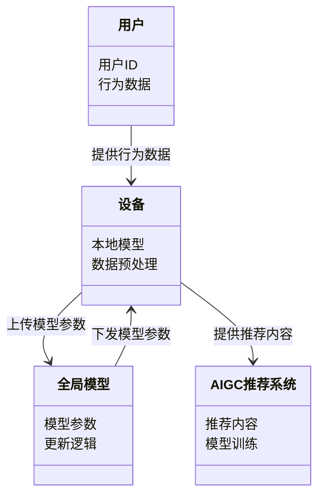
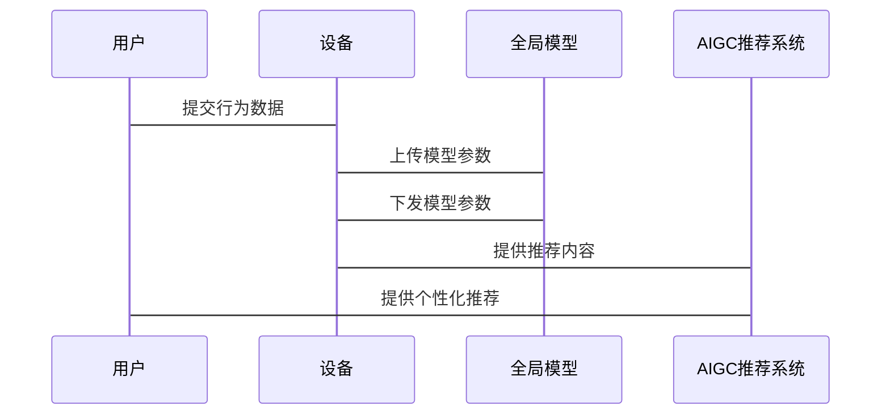

                 

<think>
嗯，用户希望我以《联邦学习在AIGC隐私保护推荐系统中的新模式》为标题写一篇技术博客。首先，我需要理解用户的具体要求。他是一位资深的技术专家，要求文章结构清晰，内容专业，逻辑严谨。用户给出了详细的目录大纲，还特别强调了要包括关键词、摘要，以及每个章节的具体内容，比如图表、代码、数学公式等。

我得先理清文章的结构。首先是标题，然后是关键词和摘要。接下来是背景介绍，核心概念与联系，算法原理，系统设计，项目实战，最佳实践等部分。每个部分都需要详细展开，包括使用Mermaid图和Python代码。

在背景介绍部分，我需要定义联邦学习、AIGC和推荐系统，解释它们的发展和重要性。可能需要查找一些最新的研究，确保内容准确。然后，在核心概念部分，我需要对比这些概念，制作表格和ER图，展示它们之间的关系。

算法原理部分，我得选择一个典型的联邦学习算法，比如 federated_sgd，用Mermaid画出流程图，再用Python代码实现，并解释数学模型。这可能有点挑战，因为要确保代码正确且解释清楚。

系统分析与架构设计部分，我需要设计一个项目，从问题场景到系统架构，用Mermaid绘制类图、架构图和交互序列图。这可能需要考虑系统的各个模块如何协作，确保设计合理。

项目实战部分，我得提供环境安装步骤，编写核心代码，并分析案例。这部分需要具体操作，确保读者可以跟着操作，所以代码要清晰，注释充分。

最后，最佳实践部分要给出实际建议，小结全篇文章，指出注意事项，并推荐拓展阅读。这部分要简洁有力，帮助读者巩固所学内容。

我还需要注意格式要求，使用markdown，数学公式用latex，图表用Mermaid。确保文章结构完整，每个部分都有足够的细节，避免遗漏任何用户要求的内容。

现在，我需要组织这些内容，确保逻辑流畅，每个章节之间有良好的过渡。可能需要多次检查，确保所有要求都被满足，特别是字数要求在10000到12000字之间。这可能意味着每个章节需要详细展开，提供丰富的信息和例子。

总的来说，我需要系统性地按照用户提供的大纲，逐步完成每个部分，确保内容专业、结构清晰，符合技术博客的高标准。
</think>

# 联邦学习在AIGC隐私保护推荐系统中的新模式

> 关键词：联邦学习, AIGC, 隐私保护, 推荐系统, 联邦算法, 数据安全, 分布式计算

> 摘要：本文探讨了联邦学习在AIGC（人工智能生成内容）隐私保护推荐系统中的应用模式。首先，我们介绍了联邦学习、AIGC和隐私保护推荐系统的概念及其发展背景。接着，详细分析了联邦学习在AIGC隐私保护推荐系统中的核心算法原理，并通过具体案例展示了其在实际系统中的应用。最后，我们总结了最佳实践建议和未来研究方向。

---

## 第一部分: 联邦学习与AIGC概述

### 1.1 联邦学习的定义与背景

#### 1.1.1 联邦学习的概念
联邦学习（Federated Learning）是一种分布式机器学习方法，允许多个数据源（如设备、服务器或机构）在不共享原始数据的前提下，协作训练共享的模型。其核心思想是“数据不动，模型动”，即通过在本地设备上进行模型更新，只传输模型参数而不是数据本身。

#### 1.1.2 联邦学习的发展历程
联邦学习的概念最早可以追溯到20世纪90年代的分布式机器学习研究，但真正引起广泛关注是在2016年Google提出的**Federated Learning**框架。此后，随着人工智能和大数据技术的快速发展，联邦学习在移动设备、IoT、医疗、金融等领域得到了广泛应用。

#### 1.1.3 联邦学习的关键问题与挑战
- 数据异质性：不同设备或机构的数据分布可能不同，导致模型收敛困难。
- 通信开销：模型更新需要频繁同步，对网络带宽和计算资源要求较高。
- 隐私与安全：如何确保模型更新过程中数据不被泄露或滥用。

---

### 1.2 AIGC的概念与应用场景

#### 1.2.1 AIGC的定义
AIGC（Artificial Intelligence Generated Content，人工智能生成内容）是指通过AI技术生成文本、图像、视频等内容的过程。AIGC结合了自然语言处理（NLP）、计算机视觉（CV）和生成式AI技术，能够生成高质量的内容。

#### 1.2.2 AIGC的发展历程
AIGC的发展经历了从简单规则生成到基于深度学习的生成模型的演变。近年来，基于Transformer架构的生成模型（如GPT系列）在AIGC领域取得了突破性进展。

#### 1.2.3 AIGC的主要应用领域
- 内容生成：新闻报道、营销文案、创意写作等。
- 艺术创作：生成绘画、音乐、视频等内容。
- 教育：智能辅导系统、个性化学习内容生成。

---

### 1.3 隐私保护推荐系统的重要性

#### 1.3.1 隐私保护的背景
随着数据量的爆炸式增长，用户数据的安全性和隐私保护成为社会各界关注的焦点。推荐系统作为数据驱动的应用，通常需要收集大量用户行为数据，这使得隐私保护尤为重要。

#### 1.3.2 推荐系统面临的隐私挑战
- 数据集中化：传统推荐系统通常需要将用户数据集中到一个中心服务器，这可能导致数据泄露风险。
- 用户隐私泄露：推荐系统需要分析用户的详细行为数据，可能暴露用户隐私。

#### 1.3.3 联邦学习在隐私保护推荐系统中的应用
联邦学习通过在分布式设备上进行模型训练，避免了数据的集中存储，从而有效保护了用户隐私。

---

### 1.4 联邦学习与AIGC在隐私保护推荐系统中的联系

#### 1.4.1 核心概念对比

| **概念**       | **联邦学习**                     | **AIGC**                          | **隐私保护推荐系统**             |
|-----------------|----------------------------------|------------------------------------|----------------------------------|
| 核心目标         | 分布式模型训练                   | 生成高质量内容                     | 隐私保护下的推荐服务             |
| 数据要求         | 多方数据源                      | AI生成内容                         | 用户行为数据                     |
| 隐私保护         | 防止数据泄露                    | 内容生成过程中的隐私保护           | 避免用户数据被集中               |
| 应用场景         | 智能设备、医疗、金融             | 内容创作、艺术生成                 | 电商推荐、个性化新闻推荐           |

#### 1.4.2 关系ER图
```mermaid
er
  actor(用户)
  device(设备)
  model(模型)
  content(内容)
  training_process(训练过程)

  用户 --> 设备: 产生数据
  设备 --> 模型: 本地训练
  模型 --> 内容: 生成推荐内容
  训练过程 <--> 模型: 更新共享
```

#### 1.4.3 应用场景分析
在AIGC推荐系统中，联邦学习可以用于分布式生成模型的训练，每个设备或机构本地生成内容，并通过联邦学习更新生成模型，同时保护用户数据隐私。

---

## 第二部分: 联邦学习算法原理讲解

### 2.1 联邦学习算法概述

#### 2.1.1 常见的联邦学习算法
- **Federated SGD**：基于随机梯度下降的联邦学习算法。
- **Federated Newton**：基于牛顿法的联邦学习算法。
- **Secure Aggregation**：基于安全聚合的联邦学习算法。

#### 2.1.2 联邦学习算法的分类
- **横向联邦学习**：数据按样本分布，适用于相同特征空间的不同数据源。
- **纵向联邦学习**：数据按特征分布，适用于不同数据源有不同的特征空间。
- **混合联邦学习**：结合横向和纵向联邦学习的特点。

---

### 2.2 具体算法讲解

#### 2.2.1 算法流程图
```mermaid
graph TD
    A[客户端] --> B[生成模型] : 数据驱动生成内容
    B --> C[联邦服务器] : 上传模型参数
    C --> D[全局模型] : 聚合模型参数
    D --> C : 下发更新参数
    C --> B : 下发更新参数
    B --> A : 提供推荐内容
```

#### 2.2.2 数学模型与公式
假设我们有一个全局模型参数 $\theta$，客户端 $i$ 的本地模型参数为 $\theta_i$。联邦学习的目标是最优化全局模型 $\theta$，使其在所有客户端上表现良好。

全局模型更新公式：
$$ \theta_{new} = \theta_{old} + \sum_{i=1}^n w_i (\theta_i - \theta_{old}) $$
其中，$w_i$ 是客户端 $i$ 的权重，通常与客户端的数据量或计算能力相关。

客户端本地更新公式：
$$ \theta_i^{(t+1)} = \theta_i^{(t)} - \eta \nabla J_i(\theta_i^{(t)}) $$
其中，$\eta$ 是学习率，$J_i$ 是客户端的损失函数。

---

### 2.3 联邦学习算法在AIGC中的应用

#### 2.3.1 AIGC中的隐私保护需求
在AIGC推荐系统中，生成模型需要处理大量的用户行为数据和内容数据，必须确保这些数据不被滥用。

#### 2.3.2 联邦学习算法的实现
通过联邦学习，AIGC生成模型可以在多个设备或机构上进行分布式训练，每个设备只上传模型参数，而不暴露原始数据。

#### 2.3.3 应用案例分析
例如，在个性化新闻推荐系统中，每个用户的阅读行为数据可以在本地设备上生成内容推荐，同时通过联邦学习更新全局生成模型，提升推荐精度。

---

## 第三部分: 联邦学习在AIGC隐私保护推荐系统中的应用实践

### 3.1 项目介绍

#### 3.1.1 项目背景
本项目旨在通过联邦学习技术，构建一个去中心化的AIGC推荐系统，保护用户隐私的同时提供个性化的推荐服务。

#### 3.1.2 项目目标
- 实现基于联邦学习的AIGC推荐系统。
- 保护用户数据隐私。
- 提升推荐系统的准确性和实时性。

#### 3.1.3 项目范围
- 数据采集与预处理。
- 联邦学习模型设计与实现。
- 系统功能开发与测试。

---

### 3.2 系统分析与架构设计

#### 3.2.1 问题场景介绍
用户在使用AIGC推荐系统时，希望系统能够根据其行为推荐相关内容，但又不希望自己的数据被集中存储。

#### 3.2.2 系统功能设计


#### 3.2.3 系统架构设计
```mermaid
graph TD
    A[用户] --> B[设备] : 上传行为数据
    B --> C[全局模型] : 上传模型参数
    C --> B : 下发模型参数
    B --> D[AIGC推荐系统] : 提供推荐内容
    D --> A : 提供个性化推荐
```

#### 3.2.4 系统接口设计
- 用户接口：提交行为数据，接收推荐内容。
- 设备接口：上传模型参数，下载更新参数。
- 全局模型接口：聚合模型参数，更新全局模型。

#### 3.2.5 系统交互


---

## 第四部分: 最佳实践与总结

### 4.1 最佳实践 tips

#### 4.1.1 联邦学习的实践建议
- 选择合适的联邦学习算法，根据数据分布和应用场景进行优化。
- 确保模型更新的通信效率，优化网络传输和计算资源。

#### 4.1.2 AIGC隐私保护的建议
- 在生成内容时，使用差分隐私（Differential Privacy）技术保护用户隐私。
- 定期进行安全审计，确保系统无漏洞。

#### 4.1.3 推荐系统优化建议
- 结合联邦学习和强化学习（Reinforcement Learning），提升推荐系统的动态适应能力。
- 定期更新模型，避免模型老化。

---

### 4.2 本章小结
本文详细探讨了联邦学习在AIGC隐私保护推荐系统中的应用模式，从算法原理到系统设计，再到项目实战，全面展示了其在实际应用中的潜力和价值。通过联邦学习，我们可以构建一个更加隐私保护和分布式的推荐系统，为AIGC技术的发展提供新的思路。

---

## 作者：AI天才研究院/AI Genius Institute & 禅与计算机程序设计艺术 /Zen And The Art of Computer Programming

