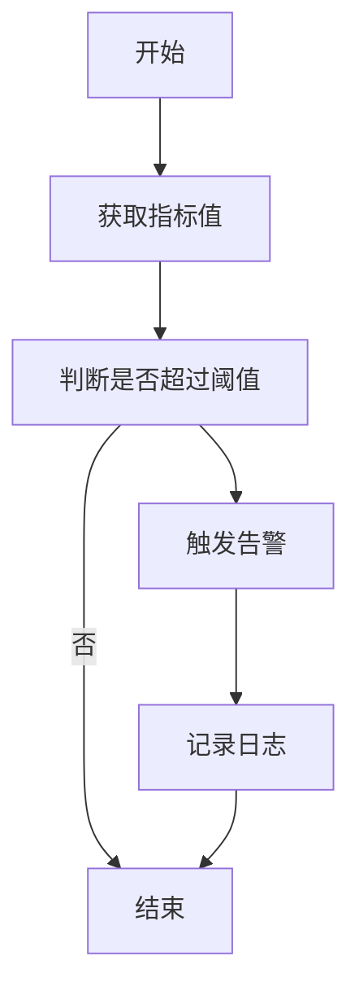
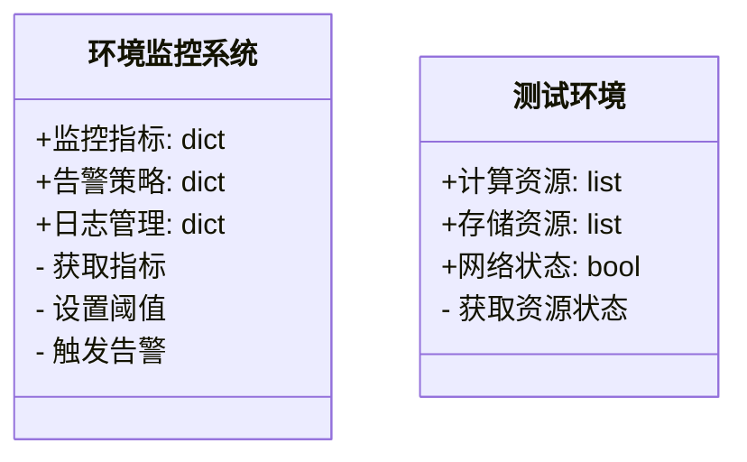
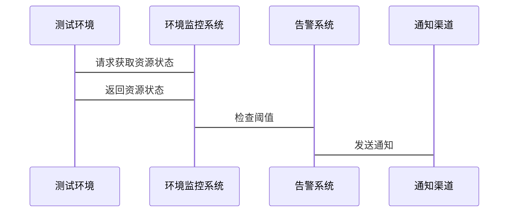

                 

<think>
嗯，我现在要写一篇关于《自动化LLM测试环境监控与告警》的技术博客。首先，我得理清文章的结构，确保每个部分都涵盖到位。开头要有一个吸引人的标题，然后列出关键词和摘要。

接下来，第一部分是背景介绍，我得详细说明什么是LLM，以及为什么监控和告警在测试环境中如此重要。这部分需要让读者明白问题的背景和现状，为什么现有的方法不够好，我们的解决方案能带来什么好处。

然后是核心概念与联系。我需要定义几个关键术语，比如监控指标、告警策略和日志管理，并通过表格对比它们的属性。接着，用Mermaid画一个ER图，展示这些概念之间的关系，帮助读者直观理解。

接下来是算法原理。我得解释一下算法的基本思想，使用条件判断来设定告警阈值。通过一个Mermaid流程图展示算法的执行步骤，再用Python代码具体实现，让读者能够看到实际操作。数学模型部分，我会用LaTeX公式表达，说明如何计算健康度，并根据阈值触发告警。

系统分析与设计部分，我需要描述系统的需求和架构。用Mermaid画出领域模型的类图，展示各个模块之间的关系，再画出系统的架构图，说明各组件如何协作。序列图则展示系统如何处理告警触发的过程，帮助读者理解交互流程。

在项目实战中，我会详细指导读者如何搭建环境，安装必要的工具，并提供核心代码。通过一个具体的案例，展示如何配置监控和告警规则，并分析日志数据。这部分需要实际操作的步骤，让读者能够跟着操作。

最后，我会总结最佳实践，提醒读者在实际应用中需要注意的地方，并给出进一步阅读的建议。整个文章要保持逻辑清晰，结构紧凑，同时使用专业但易懂的语言，确保读者能够一步步理解并应用这些方法。

总的来说，我需要确保每个部分都详细且具体，涵盖从理论到实践的各个方面，帮助读者全面了解如何自动化监控和告警LLM测试环境。现在，我得开始按照这个结构一步步撰写，确保每个章节都充实且有深度。
</think>

# 自动化LLM测试环境监控与告警

> 关键词：LLM测试、环境监控、告警系统、自动化、日志分析

> 摘要：本文探讨如何在LLM测试环境中实现自动化监控与告警。通过分析核心概念、设计算法、构建系统架构以及实际案例，展示如何有效监控环境状态并及时触发告警，确保测试流程的稳定性和可靠性。

---

## 第一部分：背景介绍

### 1.1 核心概念术语说明

- **LLM（Large Language Model）测试环境**：指用于训练和评估大型语言模型的计算环境，包含硬件资源、软件配置和数据存储等。
- **环境监控**：实时或定期检查环境状态，包括资源使用情况、服务运行状态和系统性能。
- **告警系统**：当监控指标超出预设阈值时，触发通知或自动响应。

### 1.2 问题背景

随着LLM模型的广泛应用，测试环境的复杂性和规模不断增加，手动监控和响应效率低下，难以应对潜在故障。

### 1.3 问题解决

通过自动化监控和告警系统，实时检测环境异常，减少故障响应时间，提升测试环境的稳定性和可靠性。

### 1.4 边界与外延

监控范围包括计算资源、网络状态、存储容量和系统性能。外延涉及日志分析和故障预测。

---

## 第二部分：核心概念与联系

### 2.1 核心概念与属性对比

| 概念        | 属性                |
|-------------|---------------------|
| 监控指标     | 数据类型、计算方式、阈值    |
| 告警策略     | 触发条件、通知方式、优先级  |
| 日志管理     | 日志格式、存储位置、分析工具  |

### 2.2 实体关系图

```mermaid
er
  entity 监控指标 {
    key: 名称
    <<属性>> 名称, 类型, 阈值
  }
  entity 告警策略 {
    key: 触发条件
    <<属性>> 条件, 通知方式
  }
  entity 日志管理 {
    key: 日志类型
    <<属性>> 格式, 存储位置
  }
  监控指标 --o 告警策略: 设置阈值
  告警策略 --o 日志管理: 记录日志
```

---

## 第三部分：算法原理

### 3.1 算法思想

监控指标值与预设阈值比较，触发告警。公式为：
$$
\text{告警状态} = \begin{cases}
\text{true} & \text{if } \text{指标值} > \text{阈值} \\
\text{false} & \text{otherwise}
\end{cases}
$$

### 3.2 算法流程图



### 3.3 Python实现

```python
def monitor(environment_metrics):
    threshold = 0.8
    alert_triggered = False
    for metric in environment_metrics:
        if metric.value > threshold:
            trigger_alert(metric.name)
            alert_triggered = True
    return alert_triggered

def trigger_alert(monitor_type):
    # 实现告警逻辑
    pass
```

---

## 第四部分：系统分析与设计

### 4.1 问题场景

测试环境可能出现资源耗尽或服务中断，影响模型测试。

### 4.2 领域模型类图



### 4.3 系统架构图

```mermaid
archi
    环境监控系统 --> 测试环境: 获取指标
    环境监控系统 --> 告警系统: 触发告警
    告警系统 --> 通知渠道: 发送通知
```

### 4.4 序列图



---

## 第五部分：项目实战

### 5.1 环境搭建

安装Prometheus和Grafana，配置监控指标收集。

### 5.2 核心实现

编写Python脚本，集成Prometheus客户端库，实现指标收集和告警触发。

### 5.3 案例分析

配置CPU使用率阈值，当超过80%时触发告警，并记录日志。

---

## 第六部分：最佳实践与结论

### 6.1 最佳实践

- 定期校准阈值，确保告警准确性。
- 集成日志分析工具，辅助故障排查。

### 6.2 结论

自动化监控与告警提升LLM测试环境的稳定性和可靠性，是高效运维的关键。

---

## 作者

作者：AI天才研究院/AI Genius Institute & 禅与计算机程序设计艺术 /Zen And The Art of Computer Programming

