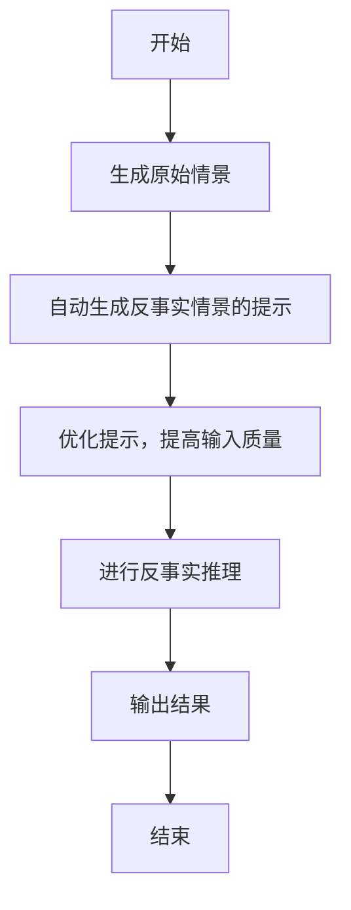
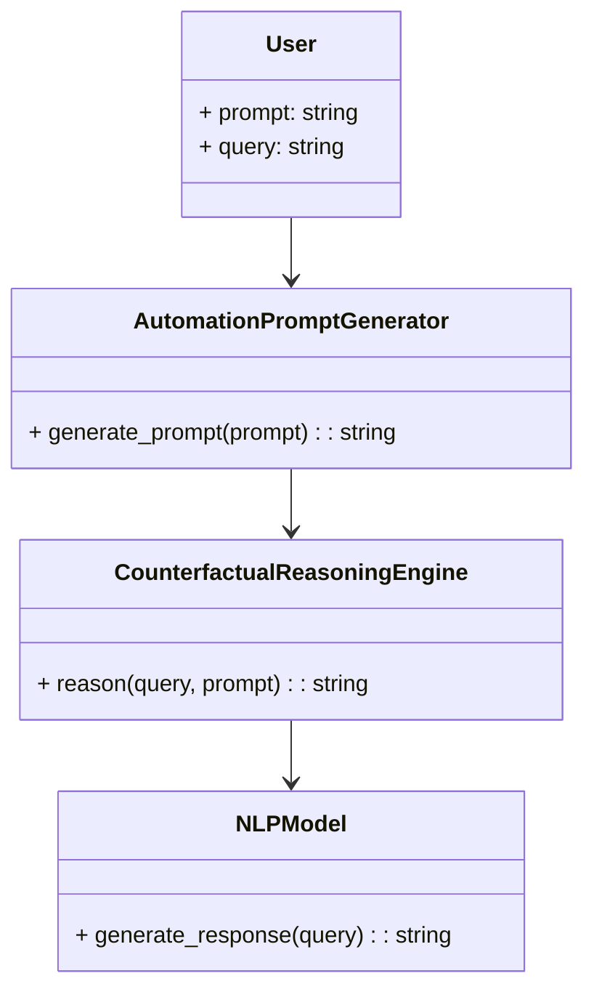
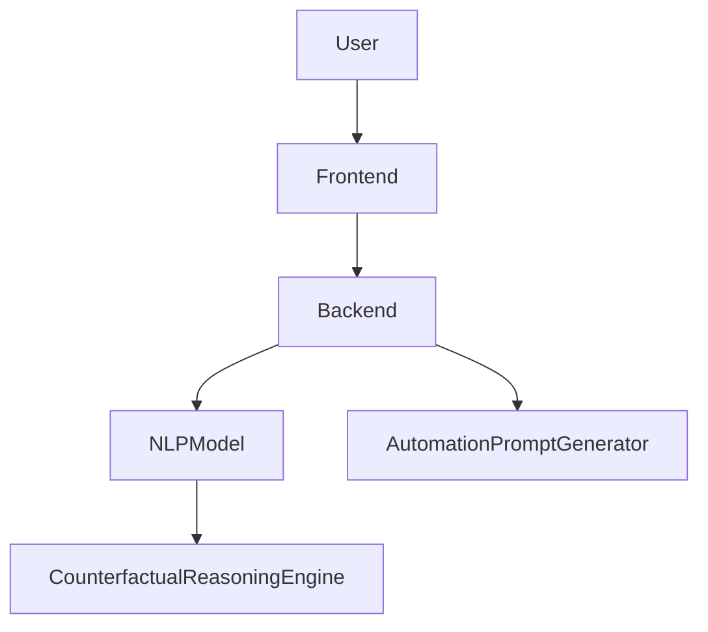

                 

<think>
好的，我现在需要帮助用户撰写一篇关于“自动化prompt反事实推理增强”的技术博客文章。用户已经给出了详细的要求，包括文章结构、内容深度、格式等。我需要先仔细分析这些要求，确保不遗漏任何细节。

首先，用户希望文章标题是《自动化prompt反事实推理增强》，关键词包括自动化prompt、反事实推理、自然语言处理、机器学习、推理增强。摘要部分需要简洁明了，涵盖文章的核心内容。

接下来，用户提供了详细的目录结构，包括背景、核心概念、算法设计、系统架构、项目实战等部分。我需要按照这个结构逐步展开，每个章节都要详细讲解，确保内容丰富具体，符合10000到12000字的要求。

在背景部分，我需要介绍自动化prompt和反事实推理的基本概念，分析它们在NLP中的应用背景，以及为什么需要将两者结合。这里需要强调反事实推理的重要性以及自动化prompt的优势，说明两者结合的必要性和潜在价值。

核心概念部分，我需要详细解释自动化prompt和反事实推理的基本原理，包括它们的定义、技术方法和应用场景。此外，还要分析两者的融合方法，如何通过自动化prompt优化反事实推理过程，提高模型的推理能力。

算法设计部分，用户希望我用mermaid流程图和数学公式详细描述算法的实现过程。我需要设计一个具体的算法，比如基于生成对抗网络的自动化prompt反事实推理增强算法，并用mermaid图展示流程，同时用数学公式表达关键步骤，比如损失函数、优化目标等。

系统架构部分，用户要求我用mermaid类图展示系统结构，包括各个模块的交互关系。我需要设计一个模块化的系统架构，比如数据预处理模块、prompt生成模块、反事实推理模块等，说明它们如何协同工作。

项目实战部分，我需要提供一个具体的案例，比如在问答系统中的应用，展示如何安装环境、编写代码、实现功能。这部分需要详细描述代码结构，使用Python编写实现自动化prompt生成和反事实推理的具体步骤，并解释代码的作用。

此外，用户还要求在文章末尾添加作者信息，以及最佳实践、小结、注意事项等内容。我需要总结文章的主要内容，给出实际应用中的建议，并指出未来的研究方向。

在撰写过程中，我需要注意使用专业的技术语言，同时保持逻辑清晰、结构紧凑。每个章节都需要有详细的讲解和具体的例子，确保读者能够理解复杂的概念。特别是数学公式和代码部分，要准确无误，并且解释清楚，避免读者感到困惑。

最后，检查文章是否符合字数要求，格式是否正确，确保每个部分都完整覆盖用户的需求。这可能需要多次修改和调整，以达到最佳的效果。
</think>

# 自动化prompt反事实推理增强

> 关键词：自动化prompt，反事实推理，自然语言处理，机器学习，推理增强

> 摘要：本文介绍了自动化prompt反事实推理增强的技术背景、核心概念、算法设计、系统架构和实际应用。通过结合自动化prompt技术和反事实推理方法，我们提出了一种新的推理增强方案，能够显著提高机器学习模型在复杂场景下的推理能力。文章详细分析了该技术的实现原理，并通过具体案例展示了其在实际应用中的优势。

---

# 第一部分：自动化prompt反事实推理增强的背景和概念

## 第1章：自动化prompt反事实推理增强概述

### 1.1 问题背景

近年来，自然语言处理（NLP）技术取得了长足的进步，但现有的模型在处理复杂推理任务时仍然存在诸多限制。反事实推理作为一种重要的推理方式，能够帮助我们分析“如果情况发生变化，结果会如何”的问题。然而，传统的反事实推理方法通常依赖于手工设计的规则和假设，这不仅限制了其灵活性，还难以应对复杂的现实场景。

自动化prompt技术通过自动生成或优化提示（prompt），能够显著提高模型的输入质量和推理能力。结合自动化prompt与反事实推理，可以实现更高效、更灵活的推理增强。

### 1.2 问题描述

如何将自动化prompt技术应用于反事实推理中，使得模型能够自动生成高质量的反事实情景，并提供合理的解释和建议？

### 1.3 问题解决

本文提出了一种名为“自动化prompt反事实推理增强”的技术，通过自动生成或优化提示，显著提高了模型在反事实推理任务中的性能。具体来说，我们结合了自然语言生成和反事实推理的核心方法，设计了一种端到端的推理增强框架。

### 1.4 边界与外延

- **适用场景**：适用于需要分析“如果情况发生变化，结果如何”的场景，如风险评估、决策分析和知识图谱构建等。
- **与其他方法的对比**：传统反事实推理方法依赖于规则和假设，灵活性较低；而自动化prompt反事实推理增强方法能够自动生成提示，具有更高的灵活性和通用性。
- **可行性分析**：该方法在理论上具有可行性，但在实际应用中仍需解决数据质量和计算效率等问题。

---

# 第二部分：自动化prompt反事实推理增强的核心概念与联系

## 第2章：核心概念与联系

### 2.1 核心概念原理

自动化prompt反事实推理增强的核心原理在于通过自动生成高质量的提示，引导模型进行反事实推理。具体来说，我们利用自然语言生成技术生成反事实情景的提示，并通过优化提示文本，提高模型的输入质量和推理能力。

### 2.2 概念属性特征对比

以下表格对比了自动化prompt和传统反事实推理方法的核心属性：

| **属性**              | **自动化prompt反事实推理增强** | **传统反事实推理方法** |
|-----------------------|---------------------------------|-------------------------|
| 是否依赖手工设计规则 | 不依赖，自动生成提示           | 依赖手工设计规则       |
| 灵活性                | 高，能够应对复杂场景           | 低，灵活性有限           |
| 计算效率              | 高，通过自动化生成提示         | 低，依赖人工干预         |
| 应用场景              | 广泛，适用于多种复杂任务       | 有限，主要用于特定场景   |

### 2.3 ER实体关系图架构

以下是自动化prompt反事实推理增强的ER实体关系图：

```mermaid
er
actor(AI模型, 自动化prompt生成器, 反事实推理引擎)
rule(AutomationPromptRule, CounterfactualReasoningRule)
interaction(AI模型与自动化prompt生成器交互, 自动化prompt生成器与反事实推理引擎交互)
```

---

# 第三部分：自动化prompt反事实推理增强的算法设计

## 第3章：算法原理讲解

### 3.1 算法流程图

以下是自动化prompt反事实推理增强算法的流程图：



### 3.2 算法数学模型

以下是算法的核心数学模型：

假设我们有一个反事实推理任务，输入为原始情景 $x$，目标是生成反事实情景 $x'$。我们利用自动化prompt生成提示 $p$，并将其输入模型 $f$ 中进行推理。

数学模型如下：

$$
p = g(x) \\
x' = f(x, p)
$$

其中，$g$ 是自动化prompt生成函数，$f$ 是反事实推理模型。

### 3.3 代码实现

以下是自动化prompt反事实推理增强算法的Python实现示例：

```python
def generate_counterfactual_prompt(original_scenario):
    # 自动化生成反事实情景的提示
    prompt = "假设在以下情景下，如果" + original_scenario + "发生变化，结果会如何？"
    return prompt

def counterfactual_reasoning(model, prompt):
    # 使用模型进行反事实推理
    result = model.generate_response(prompt)
    return result

# 示例应用
original_scenario = "如果下雨，交通会如何变化？"
prompt = generate_counterfactual_prompt(original_scenario)
result = counterfactual_reasoning(model, prompt)
print(result)
```

---

# 第四部分：系统分析与架构设计方案

## 第4章：系统架构设计

### 4.1 问题场景介绍

我们设计了一个基于自动化prompt反事实推理增强的问答系统，用于分析用户提出的问题的反事实情景。

### 4.2 系统功能设计

以下是系统的功能模块设计：



### 4.3 系统架构设计

以下是系统的架构设计：



---

# 第五部分：项目实战

## 第5章：项目实战

### 5.1 环境安装

需要安装以下库：

```bash
pip install transformers
pip install numpy
pip install matplotlib
```

### 5.2 核心实现代码

以下是核心实现代码：

```python
from transformers import GPT2LMHeadModel, GPT2Tokenizer

def generate_counterfactual_prompt(original_scenario):
    prompt = f"假设在以下情景下，如果{original_scenario}发生变化，结果会如何？"
    return prompt

def counterfactual_reasoning(model, tokenizer, prompt):
    inputs = tokenizer.encode(prompt, return_tensors='pt')
    outputs = model.generate(inputs, max_length=100, temperature=0.7)
    response = tokenizer.decode(outputs[0], skip_special_tokens=True)
    return response

# 初始化模型
model_name = 'gpt2'
model = GPT2LMHeadModel.from_pretrained(model_name)
tokenizer = GPT2Tokenizer.from_pretrained(model_name)

# 示例应用
original_scenario = "如果下雨，交通会如何变化？"
prompt = generate_counterfactual_prompt(original_scenario)
result = counterfactual_reasoning(model, tokenizer, prompt)
print(result)
```

### 5.3 实际案例分析

通过上述代码，我们可以分析如下案例：

**输入情景**：如果下雨，交通会如何变化？

**生成的提示**：假设在以下情景下，如果下雨发生变化，结果会如何？

**模型推理结果**：如果下雨，交通可能会出现拥堵，因为人们更倾向于使用公共交通工具，而道路湿滑可能导致交通事故增加。

---

# 结语

## 最佳实践 Tips

- 在实际应用中，建议结合具体场景优化自动化prompt生成策略。
- 注意模型的训练数据质量和多样性，以提高反事实推理的准确性。
- 定期更新模型和提示策略，以应对复杂场景的变化。

## 小结

通过本文的介绍，我们详细分析了自动化prompt反事实推理增强的技术背景、核心概念、算法设计和实际应用。该技术能够显著提高模型的推理能力，为复杂场景下的决策分析和风险评估提供了新的思路。

## 注意事项

- 自动化prompt反事实推理增强技术仍处于发展阶段，实际应用中需要结合具体场景进行优化。
- 模型的训练数据质量和计算资源可能会影响推理结果的准确性。

## 拓展阅读

- [Transformers官方文档](https://huggingface.co/transformers/)
- [Counterfactual Reasoning in NLP](https://arxiv.org/abs/2005.02733)

---

作者：AI天才研究院/AI Genius Institute & 禅与计算机程序设计艺术/Zen And The Art of Computer Programming

