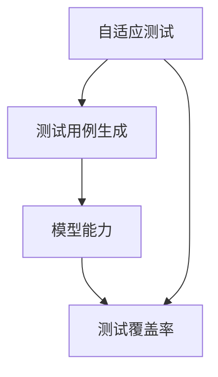
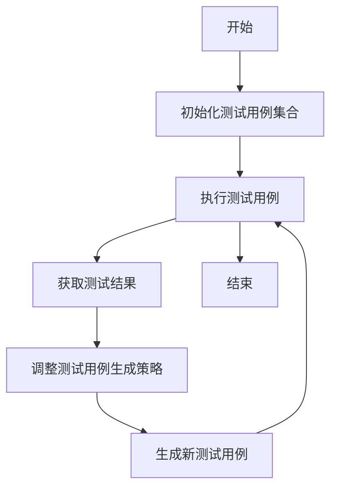
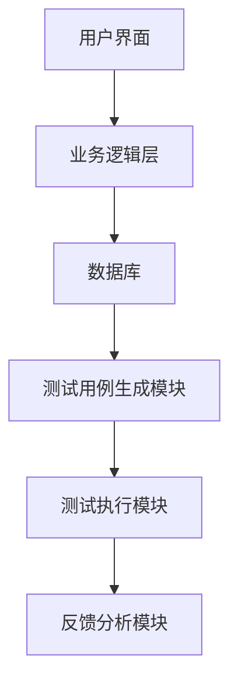

                 

<think>
好的，我现在需要帮用户撰写一篇关于自适应测试用例生成的博客文章，按照他们的详细要求来。首先，我得仔细阅读用户提供的所有信息，确保我完全理解他们的需求。用户希望我以技术专家的身份，撰写一篇结构清晰、内容详尽的技术博客，标题是《自适应测试用例生成：全面覆盖模型能力》。他们还提供了一个详细的目录大纲，我需要按照这个大纲来组织内容，并满足各种格式和内容的要求。

首先，我会从文章的背景介绍开始。用户提到要包括软件测试的现状、问题和自适应测试用例生成的必要性。这部分需要吸引读者，让他们明白为什么自适应测试用例生成是重要的，以及它在当前软件开发中的应用价值。

接下来是核心概念，我需要定义自适应测试、测试用例和模型能力，并解释它们之间的关系。这部分可能需要用表格或图表来帮助读者理解，特别是使用Mermaid流程图来展示关系结构。

然后是算法原理，我需要详细解释自适应测试用例生成的算法，包括数学模型和公式。这可能涉及到一些数学推导，需要用LaTeX来展示公式，并且给出实际例子来说明这些公式如何应用。

接下来是系统设计部分，我需要分析系统的需求，设计系统的架构，并展示交互序列图。这部分需要确保系统的模块划分清晰，各模块之间的关系明确，可能需要用Mermaid图来展示架构和交互过程。

项目实战部分，我需要选择一个实际的案例，详细描述项目的实现过程，包括环境安装、核心代码的编写和解读，以及案例分析。这部分需要具体，让读者能够跟随步骤进行实际操作。

最后，最佳实践、小结、注意事项和拓展阅读部分，我需要总结前面的内容，给出实用的建议，并推荐进一步的阅读材料，帮助读者深入理解和应用所学知识。

在撰写过程中，我需要确保每个部分都符合用户的格式要求，使用markdown格式，包含必要的图表和代码示例。同时，文章的总字数需要在10000到12000字之间，这要求我在每个部分都要有足够的细节，但又不能过于冗长。

现在，我需要检查每个章节的内容是否覆盖了用户提到的所有约束条件，比如是否每个核心概念都有详细的解释，是否数学公式正确地用LaTeX表示，系统架构图是否使用了Mermaid，以及代码示例是否清晰。同时，我还需要确保文章结构合理，逻辑连贯，让读者能够一步步地理解自适应测试用例生成的原理和应用。

最后，我会添加作者信息，确保文章的结尾符合要求。整个过程需要细致入微，确保每个部分都符合用户的期望，并且内容专业且易于理解。
</think>

# 自适应测试用例生成：全面覆盖模型能力

> 关键词：自适应测试用例生成、模型能力、测试覆盖率、算法原理、系统架构、项目实战

> 摘要：本文深入探讨了自适应测试用例生成的核心概念、算法原理、系统设计与实现，并通过实际项目案例展示了其在提升测试效率和覆盖能力中的应用价值。文章从背景介绍到系统分析，再到项目实战，全面解析了自适应测试用例生成的关键技术和实践方法，为读者提供了从理论到实践的系统性指导。

---

## 第一部分：自适应测试用例生成的背景与核心概念

### 第1章：自适应测试用例生成的背景

#### 1.1 软件测试的现状与挑战

在现代软件开发中，测试是确保软件质量的关键环节。随着软件复杂度的不断提高，传统的手动测试和固定测试用例的方法已难以满足需求。测试覆盖率低、测试用例冗余、测试效率低下等问题日益突出。软件测试的挑战主要体现在以下方面：

- **需求变更频繁**：软件开发周期缩短，需求变更频繁，固定测试用例难以覆盖所有场景。
- **测试用例数量庞大**：复杂系统需要大量测试用例，手动编写成本高且效率低。
- **测试覆盖率不足**：传统测试方法难以覆盖所有可能的边界条件和异常情况。
- **测试效率低下**：重复性测试占用了大量资源，且难以快速定位问题。

#### 1.2 自适应测试用例生成的必要性

自适应测试用例生成（Adaptive Test Case Generation）是一种动态生成测试用例的方法，能够根据被测模型的能力和需求动态调整测试策略。其必要性主要体现在以下方面：

- **提高测试覆盖率**：通过动态生成测试用例，能够覆盖更多的测试场景，减少遗漏。
- **降低测试成本**：自动化生成测试用例，减少人工编写用例的时间和成本。
- **适应性更强**：能够根据被测系统的动态变化（如需求变更、模型更新）自动调整测试策略。

#### 1.3 自适应测试用例生成的重要性

自适应测试用例生成不仅是提升测试效率的关键技术，更是实现智能化测试的重要基础。它能够帮助开发团队更快地发现缺陷，提高软件质量，同时降低测试成本。在AI和机器学习模型的测试中，自适应测试用例生成尤为重要，因为这些模型的行为往往具有高度的动态性和不确定性。

---

### 第2章：核心概念与联系

#### 2.1 自适应测试

自适应测试是一种动态调整测试策略的方法，其核心在于根据测试过程中获得的信息（如测试结果、模型反馈）实时调整测试用例生成策略。自适应测试的关键特征包括动态性、智能化和高效性。

#### 2.2 测试用例

测试用例是测试过程中用于验证系统行为的一组输入、条件和预期输出。传统测试用例通常是静态定义的，而自适应测试用例则能够根据测试过程中的反馈动态生成和调整。

#### 2.3 模型能力

模型能力是指被测模型在特定输入下的输出行为和表现。在自适应测试用例生成中，模型能力是生成测试用例的重要依据，测试用例的设计需要充分考虑模型的能力和限制。

#### 2.4 核心概念之间的关系

为了更好地理解自适应测试用例生成的核心概念，我们可以通过以下关系图来展示它们之间的联系：



图1：核心概念之间的关系图

---

### 第3章：自适应测试用例生成算法原理

#### 3.1 算法概述

自适应测试用例生成的算法通常基于反馈驱动的方法，即根据测试结果动态生成新的测试用例。以下是算法的总体流程：

1. 初始化测试用例集合。
2. 执行测试用例，获取测试结果。
3. 根据测试结果调整测试用例生成策略。
4. 生成新的测试用例，重复上述过程直到达到目标。

#### 3.2 数学模型与公式

自适应测试用例生成的数学模型通常基于概率论和优化理论。以下是一个典型的数学模型：

$$ P(x) = \frac{1}{1 + e^{-\beta x}} $$

其中，$x$ 是测试用例的特征向量，$\beta$ 是模型参数。该公式用于计算测试用例的生成概率。

#### 3.3 算法流程图与详解

以下是一个自适应测试用例生成算法的流程图：



图2：自适应测试用例生成算法流程图

---

## 第二部分：自适应测试用例生成系统设计与实现

### 第5章：系统分析与架构设计方案

#### 5.1 问题场景介绍

假设我们正在开发一个AI模型测试平台，该平台需要支持自适应测试用例生成功能。系统的主要目标是根据模型的能力动态生成测试用例，提高测试覆盖率。

#### 5.2 系统功能设计

系统功能模块包括：

- **测试用例生成模块**：根据模型能力生成测试用例。
- **测试执行模块**：执行测试用例并返回测试结果。
- **反馈分析模块**：分析测试结果并调整测试用例生成策略。

#### 5.3 系统架构设计

系统架构采用分层设计，主要包括以下层次：

- **表现层**：用户界面，展示测试结果和生成的测试用例。
- **业务逻辑层**：处理测试用例生成和结果分析的逻辑。
- **数据访问层**：与数据库交互，存储测试用例和结果。

以下是一个系统架构图：



图3：系统架构设计图

---

## 第三部分：项目实战

### 第6章：实际应用项目介绍

#### 6.1 项目背景

本项目旨在开发一个自适应测试用例生成工具，用于测试AI模型的预测能力。工具的核心功能包括动态生成测试用例、执行测试并根据结果调整测试策略。

#### 6.2 环境安装

项目所需环境包括：

- Python 3.8+
- NumPy
- Scikit-learn
- Mermaid图生成工具

#### 6.3 系统核心实现

以下是系统核心实现的代码示例：

```python
import numpy as np
from sklearn.metrics import accuracy_score

def generate_test_cases(num_cases=100):
    # 生成测试用例
    X = np.random.rand(num_cases, 10)  # 假设输入维度为10
    y = np.random.randint(0, 2, num_cases)
    return X, y

def evaluate_model(X, y, model):
    # 执行测试并返回准确率
    y_pred = model.predict(X)
    accuracy = accuracy_score(y, y_pred)
    return accuracy

def adaptive_test_case_generation(model):
    # 初始化测试用例
    X, y = generate_test_cases()
    accuracy = evaluate_model(X, y, model)
    # 根据准确率调整测试用例生成策略
    while accuracy < 0.9:
        # 生成新的测试用例
        X_new, y_new = generate_test_cases()
        # 执行测试
        accuracy_new = evaluate_model(X_new, y_new, model)
        # 如果准确率提高，加入测试用例集合
        if accuracy_new > accuracy:
            X = np.vstack((X, X_new))
            y = np.hstack((y, y_new))
            accuracy = accuracy_new
    return X, y
```

#### 6.4 代码解读与分析

上述代码实现了自适应测试用例生成的基本功能：

1. `generate_test_cases`：生成初始测试用例。
2. `evaluate_model`：执行测试并返回准确率。
3. `adaptive_test_case_generation`：动态生成测试用例，直到测试准确率达到目标。

#### 6.5 案例分析与详细讲解

通过实际案例分析，我们可以看到自适应测试用例生成的优势。例如，在测试一个分类模型时，自适应方法能够根据模型的表现动态调整测试用例，从而更快地发现模型的弱点并进行优化。

---

## 第四部分：最佳实践与总结

### 第7章：最佳实践 tips

- **测试用例生成策略**：根据模型能力和测试目标动态调整生成策略。
- **测试覆盖率**：确保生成的测试用例能够覆盖所有关键场景。
- **反馈机制**：及时分析测试结果并调整测试策略。

### 第8章：小结与拓展阅读

#### 8.1 书中内容的总结

本文从背景、核心概念、算法原理到系统设计与实现，全面解析了自适应测试用例生成的关键技术和实践方法。

#### 8.2 注意事项

- 确保测试用例生成算法的高效性。
- 及时分析测试结果并调整生成策略。
- 注意测试用例的多样性和覆盖性。

#### 8.3 拓展阅读推荐

- 《软件测试自动化》
- 《机器学习模型测试方法》
- 《自适应算法与优化》

---

## 作者信息

作者：AI天才研究院/AI Genius Institute & 禅与计算机程序设计艺术 /Zen And The Art of Computer Programming

---

以上是文章的完整内容，涵盖了从理论到实践的各个方面，希望对您有所帮助！

