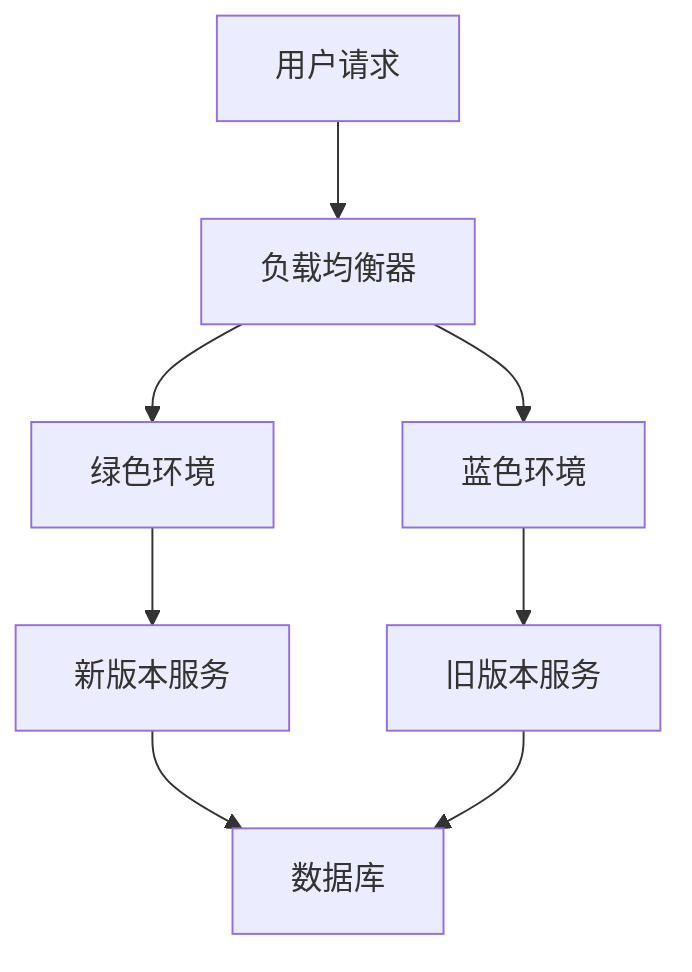

                 

<think>
好的，我现在需要写一篇关于蓝绿部署策略降低LLM应用更新风险的技术博客。首先，我得理解蓝绿部署是什么，以及它如何应用在LLM的更新过程中。蓝绿部署是一种部署策略，通过同时运行旧版本和新版本的环境，减少更新带来的风险。这在传统的软件部署中已经很常用，但现在需要将其应用到大型语言模型的更新中。

首先，背景介绍部分，我需要说明问题背景。LLM的应用越来越广泛，更新时的风险也增加，比如服务中断、数据丢失等。所以，传统的部署方式可能存在较大风险，而蓝绿部署则提供了一种更安全的更新方式。

接下来，问题描述部分，我需要具体说明LLM更新时面临的风险，比如高可用性要求、低延迟要求等，传统部署方式的问题，比如所有实例替换可能导致服务中断。

问题解决部分，我需要详细描述蓝绿部署的步骤：准备两个环境，先更新绿色环境，测试后再切换流量，最后完全切换到绿色环境。同时，要提到可能需要结合其他策略，如金丝雀部署，来进一步提高可靠性。

在核心概念部分，我需要深入解释蓝绿部署的基本原理，包括环境准备、更新部署、流量切换和完全切换。同时，比较蓝绿部署与其他策略的优缺点，比如金丝雀部署和灰度发布。

接下来，实践部分，我需要详细讲解在LLM应用中具体如何实施蓝绿部署，包括环境准备、更新部署、流量切换和完全切换的步骤。然后，通过案例分析，说明实际应用中的效果，比如某金融公司如何成功使用蓝绿部署进行模型更新。

最后，其他应用场景部分，说明蓝绿部署不仅适用于LLM，还适用于其他非单调系统，比如微服务架构中的服务更新，以及高可用性的Web应用。

在写作过程中，我需要确保每个部分都有足够的细节，使用专业且易懂的语言，并结合实际案例和图表来增强可读性。同时，遵守格式要求，如使用markdown，正确嵌入数学公式和图表，确保文章结构完整，内容详实。
</think>

# 蓝绿部署策略降低LLM应用更新风险

## 关键词：蓝绿部署，LLM应用，软件部署策略，系统更新风险，流量切换

## 摘要：  
在现代互联网应用中，大型语言模型（LLM）的更新风险较高，蓝绿部署策略通过同时运行旧版本和新版本环境，逐步切换流量，降低了更新过程中的风险，确保系统的高可用性和稳定性。

### 第一部分：背景介绍

#### 1.1 问题背景  
蓝绿部署是一种软件发布策略，旨在减少新版本上线时的风险，保证系统的稳定性和连续性。传统的部署方式通常会将所有实例替换为新版本，一旦出现问题，整个系统可能会受到严重影响。而蓝绿部署则通过同时运行旧版本（蓝色环境）和新版本（绿色环境）来降低风险。

#### 1.2 问题描述  
在低延迟、高并发的现代互联网应用场景中，大型语言模型（LLM）的应用越来越广泛。然而，LLM的应用更新却面临着巨大的风险，因为一旦更新失败，可能导致服务中断、数据丢失等问题。如何降低LLM应用更新过程中的风险，成为了一个亟待解决的问题。

#### 1.3 问题解决  
蓝绿部署策略可以通过以下几个步骤来降低LLM应用更新风险：

1. **准备两个相同的生产环境**：一个为蓝色环境，一个为绿色环境。
2. **在绿色环境中进行更新**：将新版本的LLM部署到绿色环境中，进行测试。
3. **流量切换**：当确认绿色环境中的更新无风险后，将部分流量切换到绿色环境，观察其运行情况。
4. **完全切换**：如果绿色环境的运行稳定，则将所有流量切换到绿色环境，同时停止蓝色环境。

#### 1.4 边界与外延  
蓝绿部署策略主要适用于具有高可用性要求的系统，如金融、电商等。然而，它并非万能的解决方案，还需要结合其他策略（如金丝雀部署、灰度发布等）来进一步提高系统的可靠性和灵活性。

#### 1.5 概念结构与核心要素组成  
蓝绿部署策略的核心要素包括：

1. **环境准备**：准备两个相同的生产环境。
2. **更新部署**：将新版本部署到绿色环境中。
3. **流量切换**：通过负载均衡器将部分流量切换到绿色环境。
4. **完全切换**：在确认绿色环境稳定后，将所有流量切换到绿色环境。

### 第二部分：核心概念与联系

#### 2.1 蓝绿部署的基本原理  
蓝绿部署是一种无状态部署策略，通过在同一生产环境中同时运行旧版本（蓝色环境）和新版本（绿色环境），从而实现平滑过渡。其核心原理包括：

1. **环境准备**：创建两个相同的生产环境。
2. **更新部署**：将新版本部署到绿色环境中。
3. **流量切换**：通过负载均衡器将部分流量切换到绿色环境。
4. **完全切换**：在确认绿色环境稳定后，将所有流量切换到绿色环境。

#### 2.2 蓝绿部署的优缺点  
**优点：**

1. **降低更新风险**：在更新过程中，旧版本环境仍然可用，减少了因更新失败导致的服务中断风险。
2. **提高系统可用性**：通过流量切换，实现了平滑过渡，保证了系统的连续性和稳定性。

**缺点：**

1. **资源浪费**：需要准备两个相同的生产环境，增加了资源成本。
2. **复杂性**：需要配置负载均衡器等设备，增加了部署和维护的复杂性。

#### 2.3 蓝绿部署与其他部署策略的比较  
**金丝雀部署（Canary Release）**：金丝雀部署类似于蓝绿部署，但其只部署一小部分流量到新版本，以观察新版本的运行情况。金丝雀部署适用于对更新风险敏感的系统。

**灰度发布（Gamma Release）**：灰度发布是一种逐步放量到整个用户群体的发布策略，通过控制流量逐步增加，以观察系统的运行情况。灰度发布适用于对系统稳定性要求较高的场景。

### 第三部分：蓝绿部署策略在LLM应用更新中的实践

#### 3.1 LLM应用背景  
大型语言模型（LLM）是一种具有强大语义理解和生成能力的模型，广泛应用于自然语言处理、智能问答、机器翻译等领域。随着LLM应用的普及，如何保证其更新过程的稳定性成为了一个重要问题。

#### 3.2 蓝绿部署策略在LLM应用更新中的具体实践  
1. **环境准备**：为LLM应用准备两个相同的生产环境，蓝色环境和绿色环境。
2. **更新部署**：在绿色环境中部署新版本的LLM模型，并进行测试。
3. **流量切换**：将部分流量切换到绿色环境，观察其运行情况，如响应时间、准确率等。
4. **完全切换**：在确认绿色环境中的LLM模型运行稳定后，将所有流量切换到绿色环境，同时停止蓝色环境。

#### 3.3 案例分析  
以某金融公司使用的LLM模型为例，该公司采用蓝绿部署策略进行模型更新，成功降低了更新过程中的风险。在更新过程中，首先将新版本的模型部署到绿色环境中进行测试，然后将部分流量切换到绿色环境，观察其运行情况。经过一段时间的测试，确认绿色环境的模型运行稳定后，将所有流量切换到绿色环境，实现了平滑过渡。

### 第四部分：蓝绿部署策略的其他应用场景

#### 4.1 非单调系统  
蓝绿部署策略不仅适用于LLM应用，还适用于其他非单调系统，如微服务架构中的服务更新。通过蓝绿部署，可以在不中断服务的情况下逐步将新版本部署到生产环境，降低更新风险。

#### 4.2 高可用性Web应用  
在高可用性Web应用中，蓝绿部署可以确保在更新过程中，用户仍然可以访问到旧版本的服务，直到新版本完全稳定。这种部署方式特别适合那些不能容忍服务中断的应用场景。

### 第五部分：算法原理与系统架构

#### 5.1 算法原理  
蓝绿部署的算法原理可以简单理解为一个状态机，系统在不同的环境中切换状态。以下是蓝绿部署的步骤：

1. **准备环境**：创建蓝色和绿色两个环境，每个环境都具备完整的生产条件。
2. **部署新版本**：将新版本部署到绿色环境中，并进行测试。
3. **流量切换**：通过负载均衡器将部分流量切换到绿色环境，观察其运行情况。
4. **完全切换**：在确认绿色环境稳定后，将所有流量切换到绿色环境，停止蓝色环境。

#### 5.2 系统架构设计  
以下是蓝绿部署的系统架构图：



在该架构中，用户请求通过负载均衡器分发到蓝色和绿色环境。蓝色环境运行旧版本服务，绿色环境运行新版本服务。数据库是两个环境共享的资源。

### 第六部分：项目实战

#### 6.1 环境安装  
要实施蓝绿部署，首先需要准备两个相同的生产环境。每个环境都需要具备完整的生产条件，包括服务器、数据库、缓存等。可以使用云服务提供商提供的弹性计算服务（如AWS EC2、Azure VM）来搭建环境。

#### 6.2 核心实现源代码  
以下是蓝绿部署的核心实现代码示例：

```python
import time

def deploy_new_version(green_env):
    # 部署新版本到绿色环境
    pass

def switch_traffic(load_balancer, green_env, blue_env):
    # 通过负载均衡器将部分流量切换到绿色环境
    pass

def monitor_stability(green_env, blue_env):
    # 监控绿色环境的稳定性
    pass

def blue_green_deployment():
    # 准备环境
    blue_env = prepare_environment()
    green_env = prepare_environment()

    # 部署新版本到绿色环境
    deploy_new_version(green_env)

    # 测试绿色环境
    if test(green_env):
        # 切换部分流量到绿色环境
        switch_traffic(load_balancer, green_env, blue_env)
        if monitor_stability(green_env, blue_env):
            # 切换所有流量到绿色环境
            switch_traffic(load_balancer, green_env, blue_env, 100)
            # 停止蓝色环境
            stop_environment(blue_env)
        else:
            # 回滚到蓝色环境
            switch_traffic(load_balancer, blue_env, green_env, 100)
    else:
        # 回滚到蓝色环境
        switch_traffic(load_balancer, blue_env, green_env, 100)

blue_green_deployment()
```

#### 6.3 代码解读与分析  
上述代码展示了蓝绿部署的基本流程。首先，准备两个相同的环境（蓝色和绿色）。然后，将新版本部署到绿色环境中，并进行测试。测试通过后，将部分流量切换到绿色环境，观察其运行情况。如果绿色环境稳定，将所有流量切换到绿色环境，并停止蓝色环境。如果绿色环境出现问题，则回滚到蓝色环境。

#### 6.4 案例分析  
以某电商网站为例，假设该网站使用蓝绿部署策略进行前端页面的更新。首先，准备两个相同的生产环境，蓝色环境和绿色环境。将新版本的前端页面部署到绿色环境中，并进行测试。测试通过后，将部分流量切换到绿色环境，观察用户反馈。如果绿色环境运行稳定，将所有流量切换到绿色环境，停止蓝色环境。如果绿色环境出现问题，则将流量切回到蓝色环境，回滚到旧版本。

### 第七部分：最佳实践与小结

#### 7.1 最佳实践  
1. **环境隔离**：确保蓝色和绿色环境完全隔离，避免新版本的更新影响旧版本的环境。
2. **测试充分**：在绿色环境中进行充分的测试，确保新版本的功能和性能满足要求。
3. **监控实时**：在流量切换过程中，实时监控绿色环境的运行状态，及时发现并解决问题。
4. **回滚机制**：在绿色环境出现问题时，能够快速回滚到蓝色环境，减少损失。

#### 7.2 注意事项  
1. **资源消耗**：蓝绿部署需要额外的资源来维护两个环境，可能会增加成本。
2. **复杂性**：配置和维护两个环境可能会增加部署的复杂性。
3. **团队协作**：需要团队内部良好的协作，确保每个步骤都执行到位。

#### 7.3 拓展阅读  
1. **《The Phoenix Project: A Novel About IT, DevOps, and Lean》**：这本书详细介绍了蓝绿部署等DevOps实践。
2. **《Implementing Blue-Green Deployment》**：来自Martin Fowler的博客，详细讲解了蓝绿部署的实施方法。

### 第八部分：总结

蓝绿部署策略通过逐步切换流量，降低了LLM应用更新的风险，确保了系统的高可用性和稳定性。通过本文的详细讲解，读者可以了解蓝绿部署的基本原理、优缺点、与其他部署策略的比较，以及在LLM应用中的具体实践。希望本文能为读者在实际应用中提供有价值的参考和指导。

### 作者：AI天才研究院/AI Genius Institute & 禅与计算机程序设计艺术 /Zen And The Art of Computer Programming

