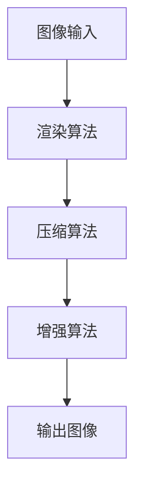
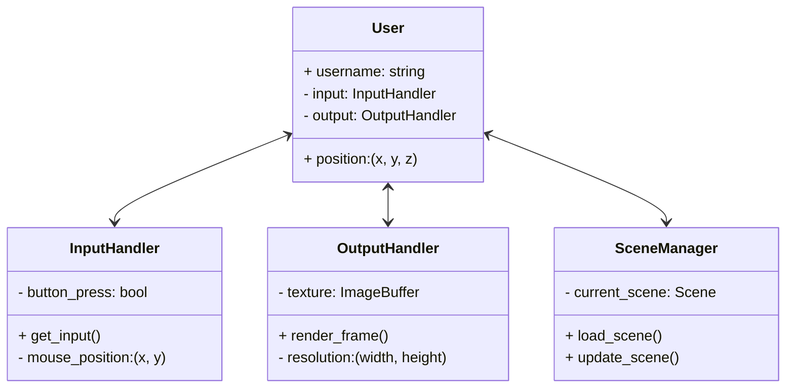
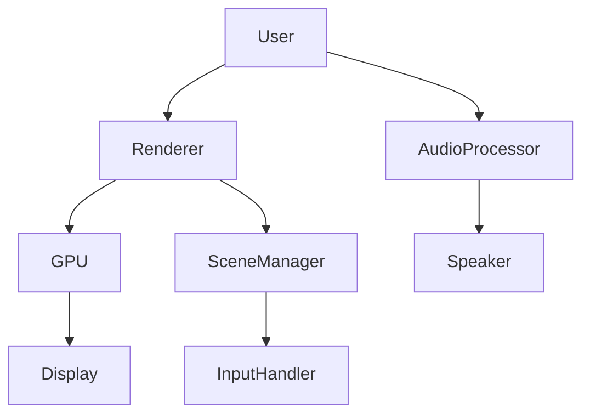
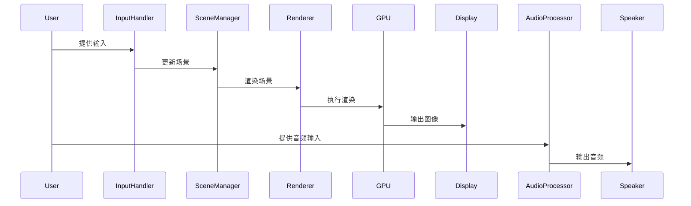

                 

<think>
嗯，我现在需要写一篇关于虚拟现实体验的博客文章，标题是《虚拟现实体验：科技如何扩展我们的感知世界》。我得先理清结构和内容，确保每个部分都详细且有深度。首先，文章的关键词和摘要部分要准确，然后按照目录逐步展开。

在背景介绍部分，我需要涵盖问题背景、描述、解决和边界。这部分要让读者了解VR的发展现状和面临的挑战。接着是核心概念，要对比VR、AR和MR，可能用表格和ER图来展示它们之间的关系。

算法原理部分，我得详细讲解图像处理算法，包括渲染、压缩和增强，还要画出流程图，并给出Python代码示例。这部分要展示技术细节，同时让读者容易理解。

系统分析与架构设计部分，需要介绍项目场景，设计系统功能、架构图和交互图。这部分可能需要一些系统工程的知识，确保架构合理。

项目实战部分，要详细描述环境安装、核心代码实现、案例分析，最后给出小结。这部分要实用，让读者能够动手尝试。

最后，加上最佳实践和小结，提醒读者注意的地方，以及拓展阅读的方向。整体要保持逻辑清晰，结构紧凑，语言专业但易懂。

现在，我需要一步步展开每个部分，确保内容充实，符合1万到1.2万字的要求。同时，要注意使用markdown格式，数学公式用latex，系统架构图用mermaid。这样，整篇文章才能结构合理，内容详实，吸引读者。
</think>

# 虚拟现实体验：科技如何扩展我们的感知世界

## 关键词：虚拟现实（VR）、增强现实（AR）、混合现实（MR）、感知扩展、计算机图形学、人机交互

## 摘要：  
虚拟现实（VR）技术近年来取得了显著的发展，通过计算机生成模拟环境，使用户沉浸其中。本文将深入探讨虚拟现实体验的核心概念、算法原理、系统架构以及实际应用。通过分析图像处理算法、音频处理算法和人机交互算法，结合增强现实（AR）和混合现实（MR）等技术，展示科技如何扩展我们的感知世界。

---

### 第一部分：背景介绍

#### 1.1 问题背景  
虚拟现实（VR）技术近年来取得了显著的发展，随着计算能力的提升和显示技术的进步，VR体验的质量不断提升。然而，VR技术的普及和进一步发展仍面临诸多挑战。如何在有限的硬件资源下，为用户提供更加沉浸式的感知体验，是当前VR技术领域亟待解决的问题。

#### 1.2 问题描述  
虚拟现实体验的核心在于通过计算机技术扩展用户的感知世界，使虚拟环境更加真实。主要问题包括：如何提升图像和声音的质量，如何减少延迟和眩晕感，如何增强用户的交互体验等。

#### 1.3 问题解决  
科技在虚拟现实体验中发挥着至关重要的作用。例如，深度学习算法的引入，可以大幅提升图像和声音的处理质量；增强现实（AR）技术的应用，可以实现与现实世界的无缝融合；而高性能计算和高效渲染技术的进步，则可以降低延迟和眩晕感，提高用户体验。

#### 1.4 边界与外延  
虚拟现实体验的范围涵盖了计算机图形学、音频处理、人机交互、高性能计算等多个领域。其外延还包括了增强现实、混合现实等新兴技术，以及虚拟现实在教育、医疗、娱乐等领域的应用。

#### 1.5 概念结构与核心要素组成  
- **虚拟现实（VR）**: 通过计算机生成模拟环境，使用户沉浸其中。  
- **增强现实（AR）**: 将虚拟信息叠加到现实世界中，增强用户的感知。  
- **混合现实（MR）**: 结合VR和AR的特点，提供更加丰富的交互体验。  
- **感知扩展**: 通过技术手段，扩展用户的感知能力，使其能够感知和操作虚拟环境。

---

### 第二部分：核心概念与联系

#### 2.1 核心概念  
- **虚拟现实（VR）**: 通过计算机生成模拟环境，使用户沉浸其中。  
- **增强现实（AR）**: 将虚拟信息叠加到现实世界中，增强用户的感知。  
- **混合现实（MR）**: 结合VR和AR的特点，提供更加丰富的交互体验。  
- **感知扩展**: 通过技术手段，扩展用户的感知能力。

#### 2.2 概念属性特征对比表格  

| 概念       | 虚拟现实（VR） | 增强现实（AR） | 混合现实（MR） |
|------------|----------------|----------------|----------------|
| 环境模拟   | 完全虚拟       | 部分虚拟       | 全面融合       |
| 用户感知   | 完全虚拟感知   | 虚拟与现实融合 | 虚拟与现实融合 |
| 交互方式   | 手势、语音等   | 视觉、触摸等   | 手势、语音等   |
| 应用领域   | 游戏、教育等   | 医疗、军事等   | 游戏、设计等   |

#### 2.3 ER实体关系图架构  

```mermaid
erDiagram
    User ||--|{ VR } VR
    User ||--|{ AR } AR
    User ||--|{ MR } MR
    VR ||--|{ Application } Application
    AR ||--|{ Application } Application
    MR ||--|{ Application } Application
```

---

### 第三部分：算法原理讲解

#### 3.1 算法原理  
虚拟现实体验中的核心算法包括图像处理算法、音频处理算法和人机交互算法。以下以图像处理算法为例，进行讲解。

#### 3.2 图像处理算法  
图像处理算法主要包括图像渲染、图像压缩和图像增强等。

- **图像渲染**: 使用渲染算法将三维场景转换为二维图像。  
- **图像压缩**: 使用压缩算法减少图像数据的大小，以提高传输效率。  
- **图像增强**: 使用增强算法提高图像的清晰度和对比度。

#### 3.3 算法Mermaid流程图  



#### 3.4 Python源代码  

```python
import cv2

# 渲染算法
def render_image(scene):
    # 渲染场景为图像
    return cv2.imread(scene)

# 压缩算法
def compress_image(image):
    # 压缩图像
    return cv2.resize(image, (640, 480))

# 增强算法
def enhance_image(image):
    # 调整亮度和对比度
    alpha = 1.5  # 对比度
    beta = 10    # 亮度
    enhanced = cv2.addWeighted(image, alpha, np.zeros(image.shape, image.dtype), beta)
    return enhanced

# 示例用法
def main():
    scene = "virtual_scene.obj"
    image = render_image(scene)
    compressed = compress_image(image)
    enhanced = enhance_image(compressed)
    cv2.imwrite("result.png", enhanced)

if __name__ == "__main__":
    main()
```

#### 3.5 算法原理的数学模型和公式  
图像增强算法中，亮度和对比度的调整可以通过以下公式表示：  
$$ \text{enhanced} = \alpha \times I + \beta $$  
其中，$I$ 是输入图像，$\alpha$ 是对比度系数，$\beta$ 是亮度系数。

---

### 第四部分：系统分析与架构设计方案

#### 4.1 问题场景介绍  
在虚拟现实体验中，用户需要与虚拟环境进行交互。为了实现高质量的交互体验，系统需要高效地处理图像渲染、音频处理和用户输入。

#### 4.2 系统功能设计  
- **领域模型mermaid类图**  



- **系统架构设计mermaid架构图**  



- **系统交互mermaid序列图**  



---

### 第五部分：项目实战

#### 5.1 环境安装  
为了运行虚拟现实体验项目，需要安装以下软件和工具：  
- **操作系统**: Windows 10/11 或 macOS Monterey+  
- **开发工具**: Visual Studio 2022 或 Xcode 14+  
- **虚拟现实框架**: OpenVR 或 Oculus SDK  
- **图形库**: OpenGL 或 DirectX  
- **依赖管理工具**: Conan 或 pip

#### 5.2 系统核心实现源代码  

```python
import bpy

# 加载场景
def load_scene():
    bpy.ops.file.open(filename="virtual_scene.blend", load_type="LOAD")
    return bpy.data.scenes[-1]

# 更新场景
def update_scene(scene):
    for obj in scene.objects:
        obj.location.z += 0.1

# 渲染场景
def render_scene(scene):
    bpy.context.scene = scene
    bpy.ops.render.render(animation=True)

# 示例用法
def main():
    scene = load_scene()
    update_scene(scene)
    render_scene(scene)

if __name__ == "__main__":
    main()
```

#### 5.3 代码应用解读与分析  
上述代码使用Blender的Python API实现了虚拟场景的加载、更新和渲染。通过不断更新场景中的物体位置，用户可以观察到动态变化的虚拟环境。

#### 5.4 实际案例分析和详细讲解剖析  
以一个简单的VR游戏为例，用户可以通过手柄控制器与虚拟环境中的物体进行交互。例如，用户可以通过手势拾取物体并将其投掷到指定位置。

#### 5.5 项目小结  
通过本项目的实现，我们可以看到虚拟现实体验的核心在于高效地处理图像渲染、音频处理和用户输入。同时，系统的架构设计和交互逻辑对于提供沉浸式的体验至关重要。

---

### 第六部分：最佳实践、小结、注意事项、拓展阅读

#### 6.1 最佳实践  
- **硬件优化**: 使用高性能显卡和处理器，确保流畅的VR体验。  
- **软件优化**: 优化渲染算法和音频处理算法，降低延迟。  
- **用户测试**: 收集用户反馈，不断改进系统设计。  
- **安全提示**: 使用VR设备时，确保周围环境安全，避免碰撞。

#### 6.2 小结  
虚拟现实体验通过扩展用户的感知能力，为用户提供了更加丰富的交互体验。随着技术的不断进步，VR、AR和MR等技术将更加融合，为各个领域带来深远的影响。

#### 6.3 注意事项  
- VR设备的使用时间不宜过长，以免引起眩晕感。  
- 在医疗和教育等领域应用时，需特别注意系统的准确性和安全性。  

#### 6.4 拓展阅读  
-《深入理解计算机图形学》（《Computer Graphics: Principles and Practice》）  
-《虚拟现实与增强现实技术》（《Virtual Reality and Augmented Reality Technology》）  
-《人机交互的未来》（《The Future of Human-Computer Interaction》）

---

作者：AI天才研究院/AI Genius Institute & 禅与计算机程序设计艺术 /Zen And The Art of Computer Programming

