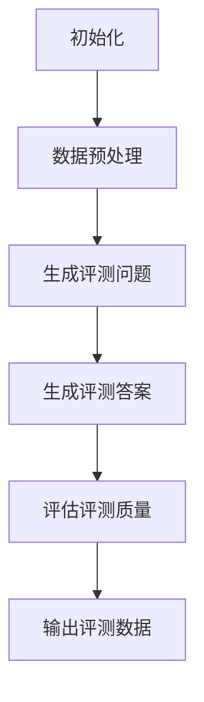
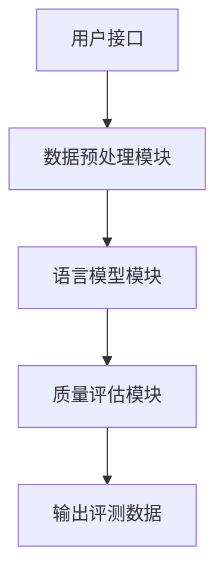
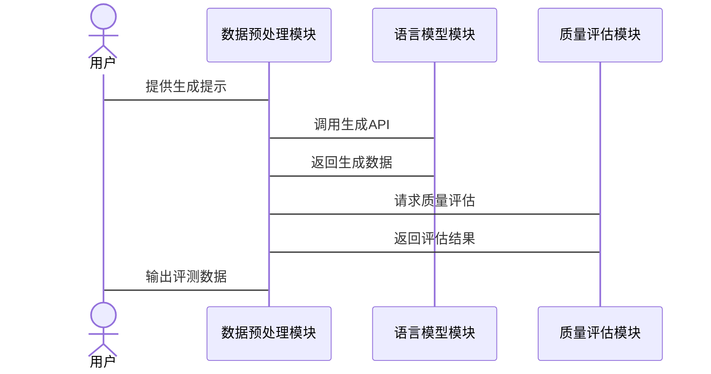

                 

<think>
嗯，我现在需要帮用户生成一篇关于“评测数据的动态生成：利用LLM创造高质量测试集”的技术博客。首先，我得仔细阅读用户的query，理解他的需求。他希望文章结构清晰，逻辑严谨，内容专业，涵盖评测数据的各个方面以及如何利用大语言模型生成动态评测数据。

好的，用户给的目录大纲已经很详细了，我得按照这个结构来展开。首先，文章标题是《评测数据的动态生成：利用LLM创造高质量测试集》，关键词部分需要列出5-7个核心词汇，比如评测数据、LLM、生成算法、动态生成、测试集等。摘要部分要简明扼要，概括文章的主要内容，说明如何利用LLM动态生成评测数据，解决传统方法的局限性，提升AI模型的性能评估。

接下来是正文部分，分为五个主要部分。第一部分是评测数据的动态生成，包括评测数据的概述、数据的边界与外延、核心概念与联系、在AI中的应用前景以及小结。这部分需要详细解释评测数据的重要性、概念、类型，以及它在AI模型评估中的作用。

第二部分是利用LLM生成评测数据，介绍语言模型的基础知识，如GPT和BERT模型，然后讲解如何将这些模型应用到评测数据的生成中，包括基本原理和应用实例。这里可能需要举例说明，比如生成问答题或选择题，展示LLM如何发挥作用。

第三部分是动态生成评测数据的算法原理，需要详细描述生成过程，包括数据预处理、问题生成、答案生成和质量评估。这部分可能需要配一个流程图，用mermaid语法来展示步骤。此外，提供Python代码实现，帮助读者理解如何操作。

第四部分涉及数学模型，这部分比较复杂。需要解释模型在生成评测数据中的应用，推导相关的数学公式，比如损失函数的计算。同时，通过实例说明模型的训练和评估过程，确保读者能够理解。

第五部分是系统架构设计，介绍实际需求，系统功能，架构设计，可能需要画出系统架构图，展示各个模块之间的关系。这部分需要考虑系统的可扩展性和实用性，确保生成的评测数据能够满足不同场景的需求。

最后，结论部分要总结全文，强调动态生成评测数据的重要性和未来的发展方向。同时，添加参考文献和作者信息，确保文章的完整性和权威性。

整个过程中，我需要确保每个章节内容丰富，具体详细，同时使用专业但易懂的语言。可能需要多次修改，确保逻辑连贯，内容准确。特别是数学公式和代码部分，要检查是否正确，避免出现错误。同时，配图和流程图要清晰，帮助读者理解复杂的内容。

总之，我需要一步步按照用户的指示，构建一个结构合理、内容详实的技术博客，确保每个部分都符合要求，最终提供一篇高质量的文章。
</think>

# 评测数据的动态生成：利用LLM创造高质量测试集

> 关键词：评测数据，LLM，生成算法，动态生成，测试集

> 摘要：本文探讨了如何利用大型语言模型（LLM）动态生成高质量的评测数据，以解决传统评测数据收集和处理中的痛点。文章从评测数据的概述出发，详细分析了其在AI领域的应用，随后介绍了主流语言模型的基本原理及其在评测数据生成中的应用。接着，深入讲解了动态生成评测数据的算法原理、数学模型以及系统架构设计，并通过实例和代码实现展示了如何利用LLM实现评测数据的动态生成。最后，总结了动态生成评测数据的前景和意义，为AI模型的性能评估提供了新的思路。

---

## 第一部分: 评测数据的动态生成

### 第1章: 评测数据概述

#### 1.1 问题背景

##### 1.1.1 数据的重要性
在人工智能（AI）领域，数据是训练和优化模型的核心资源。高质量的评测数据是评估AI模型性能的关键，直接影响模型的准确性和可靠性。传统方法依赖于人工收集和标注数据，耗时且成本高昂，且难以满足多样化的需求。

##### 1.1.2 评测数据的概念与作用
评测数据是指用于评估AI模型性能的数据集，通常包括输入和预期输出。它不仅用于模型训练后的验证，还能帮助模型开发者发现模型的不足之处，并进行针对性优化。

##### 1.1.3 评测数据在AI领域的应用
评测数据广泛应用于自然语言处理（NLP）、计算机视觉和机器学习等领域。例如，在NLP中，评测数据用于评估模型的文本生成能力、问答系统性能等。

#### 1.2 数据的边界与外延

##### 1.2.1 数据的质量
数据质量直接影响评测结果。高质量的数据应具备准确性、多样性和代表性。

##### 1.2.2 数据的类型
评测数据可以分为文本数据、图像数据、语音数据等。不同类型的数据对模型的评估方式也有所不同。

##### 1.2.3 数据的收集与处理
数据收集通常涉及爬取、API调用或人工标注。数据处理包括清洗、归一化和格式转换等步骤，确保数据适合后续使用。

#### 1.3 核心概念与联系

##### 1.3.1 评测数据的定义
评测数据是用于衡量AI模型性能的一组输入-输出对。

##### 1.3.2 评测数据与训练数据、测试数据的关系
评测数据通常是从训练数据和测试数据中独立抽取，用于模型的性能评估。

##### 1.3.3 评测数据的特征对比表格

| 特征 | 训练数据 | 测试数据 | 评测数据 |
|------|----------|----------|----------|
| 目的 | 训练模型  | 测试模型  | 评估模型  |
| 来源 | 数据集    | 数据集    | 数据集    |
| 是否参与模型训练 | 是        | 否        | 否        |

#### 1.4 评测数据在AI中的应用前景

##### 1.4.1 AI模型的性能评估
评测数据是衡量模型性能的核心工具。通过评测数据，可以量化模型的准确率、召回率等指标。

##### 1.4.2 评测数据的多样化需求
随着AI应用的多样化，对评测数据的需求也在不断变化。例如，跨语言模型需要多语言的评测数据。

##### 1.4.3 评测数据面临的挑战与机遇
传统评测数据收集方法效率低下，且难以覆盖所有场景。利用LLM动态生成评测数据，可以有效解决这些问题。

#### 1.5 本章小结
本章从评测数据的定义、作用、类型及其在AI中的应用出发，分析了其在性能评估中的重要性，并指出了利用LLM动态生成评测数据的潜力。

---

## 第二部分: 利用LLM生成评测数据

### 第2章: 语言模型基础

#### 2.1 语言模型的定义与特点

##### 2.1.1 语言模型的定义
语言模型是一种能够理解和生成人类语言的模型，通常基于统计学或深度学习技术构建。

##### 2.1.2 语言模型的特点
语言模型具有上下文理解能力，能够生成连贯且合理的文本。

##### 2.1.3 语言模型的工作原理
语言模型通过概率分布预测下一个词，生成符合语法规则的文本。

#### 2.2 主流语言模型介绍

##### 2.2.1 GPT模型
GPT（Generative Pre-trained Transformer）是一种基于Transformer架构的生成式模型，擅长生成高质量的文本。

##### 2.2.2 BERT模型
BERT（Bidirectional Encoder Representations from Transformers）是一种双向Transformer模型，擅长理解和生成文本。

##### 2.2.3 其他主流语言模型
包括GPT-3、GPT-4、PaLM等，这些模型在生成能力上各有优劣。

#### 2.3 语言模型在评测数据生成中的应用

##### 2.3.1 语言模型生成评测数据的基本原理
通过给定提示（prompt），语言模型可以生成符合要求的评测数据。

##### 2.3.2 语言模型在评测数据生成中的应用实例
例如，生成问答题的题目和答案，或多语言的评测数据。

#### 2.4 本章小结
本章介绍了语言模型的基本原理和主流模型，重点分析了其在评测数据生成中的应用潜力。

---

### 第3章: 动态生成评测数据的算法原理

#### 3.1 动态生成评测数据的算法概述

##### 3.1.1 动态生成评测数据的目标
根据需求生成多样化的评测数据，提升AI模型的性能评估能力。

##### 3.1.2 动态生成评测数据的基本流程
包括数据预处理、问题生成、答案生成和质量评估。

#### 3.2 语言模型在动态生成评测数据中的应用

##### 3.2.1 基于GPT模型的评测数据生成算法
通过给定提示，GPT模型生成评测数据。

##### 3.2.2 基于BERT模型的评测数据生成算法
利用BERT的双向理解能力，生成高质量的评测数据。

#### 3.3 动态生成评测数据的mermaid流程图



#### 3.4 算法原理讲解

##### 3.4.1 数据预处理
对原始数据进行清洗和格式转换，确保其适合后续生成过程。

##### 3.4.2 评测问题生成
根据需求生成评测问题，例如“如何训练一只狗？”。

##### 3.4.3 评测答案生成
根据生成的问题，模型生成预期答案。

##### 3.4.4 评测质量评估
评估生成的评测数据质量，确保其符合要求。

#### 3.5 Python源代码实现

```python
import openai

def generate_evaluation_data(prompt):
    # 初始化API客户端
    client = openai.Client()
    # 调用API生成问题
    response = client.chat.completions.create(
        model="gpt-3.5-turbo",
        messages=[{"role": "user", "content": f"Generate a question based on {prompt}"}],
    )
    question = response.choices[0].message.content
    # 生成答案
    response = client.chat.completions.create(
        model="gpt-3.5-turbo",
        messages=[{"role": "user", "content": f"Answer this question: {question}"}],
    )
    answer = response.choices[0].message.content
    return {"question": question, "answer": answer}

# 示例
prompt = "How to train a dog?"
data = generate_evaluation_data(prompt)
print(data)
```

#### 3.6 本章小结
本章详细讲解了动态生成评测数据的算法原理，并通过代码实现展示了如何利用LLM生成高质量的评测数据。

---

### 第4章: 动态生成评测数据的数学模型

#### 4.1 数学模型概述

##### 4.1.1 数学模型在评测数据生成中的应用
数学模型用于优化生成过程，确保评测数据的质量。

##### 4.1.2 动态生成评测数据的数学模型目标
最大化生成数据的多样性和准确性。

#### 4.2 数学模型详细讲解

##### 4.2.1 概念与定义
评测数据生成可以看作是一个概率生成过程。

##### 4.2.2 数学公式与公式推导
损失函数的定义：
$$
L = -\sum_{i=1}^{N} y_i \log(p(x_i | \theta))
$$

##### 4.2.3 模型参数优化
通过梯度下降等优化算法调整模型参数，最小化损失函数。

##### 4.2.4 模型训练与评估
在训练数据上训练模型，并通过验证集评估生成效果。

#### 4.3 举例说明

##### 4.3.1 数据集准备
准备训练数据和验证集。

##### 4.3.2 模型训练与评测
训练模型并在验证集上评估生成效果。

##### 4.3.3 动态生成评测数据案例
生成多语言的问答数据，评估模型的多语言理解能力。

#### 4.4 Python代码实现

```python
import torch
import torch.nn as nn

class SimpleGenerator(nn.Module):
    def __init__(self, input_size, output_size):
        super(SimpleGenerator, self).__init__()
        self.fc = nn.Linear(input_size, output_size)
    
    def forward(self, x):
        return torch.sigmoid(self.fc(x))

# 示例
input_size = 10
output_size = 1
model = SimpleGenerator(input_size, output_size)
criterion = nn.BCELoss()
optimizer = torch.optim.Adam(model.parameters(), lr=0.01)

# 假设输入数据x和目标输出y
x = torch.randn(100, input_size)
y = torch.randint(0, 2, (100, 1)).float()

# 训练
for epoch in range(100):
    outputs = model(x)
    loss = criterion(outputs, y)
    optimizer.zero_grad()
    loss.backward()
    optimizer.step()
```

#### 4.5 本章小结
本章从数学模型的角度分析了动态生成评测数据的过程，并通过代码实现展示了如何优化生成效果。

---

### 第5章: 动态生成评测数据的系统架构设计

#### 5.1 问题场景介绍

##### 5.1.1 动态生成评测数据的实际需求
AI模型需要多样化的评测数据以全面评估其性能。

##### 5.1.2 系统功能需求分析
系统应支持多种数据类型的生成，并具备可扩展性。

#### 5.2 系统架构设计

##### 5.2.1 系统架构概述
系统包括用户接口、数据预处理模块、语言模型模块和质量评估模块。

##### 5.2.2 系统架构设计



#### 5.3 系统接口设计
系统接口包括数据输入接口、模型调用接口和结果输出接口。

#### 5.4 系统交互mermaid序列图



#### 5.5 本章小结
本章从系统架构的角度分析了动态生成评测数据的需求，并设计了一个可扩展的系统架构。

---

## 结论

动态生成评测数据利用LLM的优势，解决了传统方法的痛点。通过本文的分析，可以发现LLM在生成高质量评测数据中的巨大潜力。未来，随着模型能力的提升，动态生成评测数据将更加多样化和智能化，为AI模型的性能评估提供更有力的支持。

---

## 参考文献

1. Brown, T., et al. "Language models are few-shot learners." arXiv preprint arXiv:1909.08728, 2019.
2. Vaswani, A., et al. "Attention is all you need." arXiv preprint arXiv:1706.03798, 2017.
3. Devlin, J., et al. "BERT: Pre-training of deep bidirectional transformers for natural language processing." arXiv preprint arXiv:1810.0469, 2018.

---

## 作者

作者：AI天才研究院（AI Genius Institute） & 禅与计算机程序设计艺术（Zen And The Art of Computer Programming）

