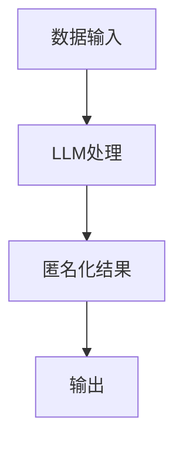
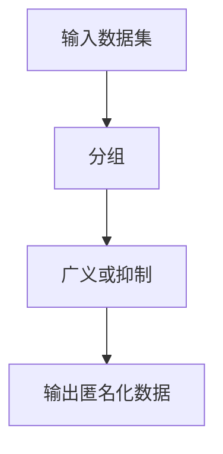
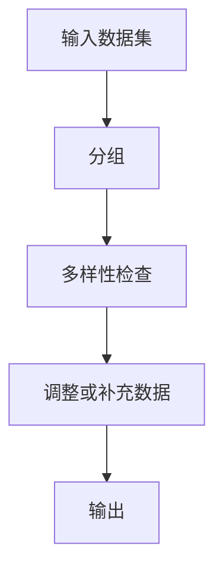
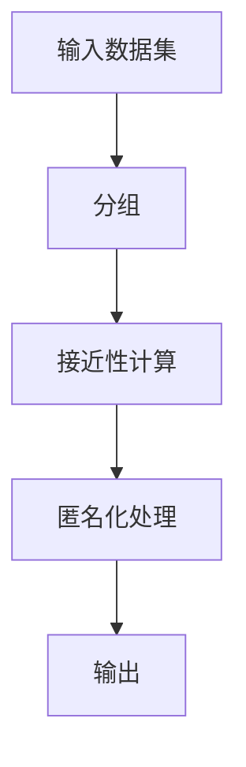

                 

<think>
好的，我现在要帮助用户完成一个技术博客的撰写任务。用户希望我以“评测数据隐私保护：LLM支持的匿名化处理方案”为标题，撰写一篇结构清晰、内容详尽的技术博客。首先，我需要理解用户的具体需求，包括文章的结构、内容深度以及格式要求。

首先，用户提供了详细的目录大纲，分为六个章节，每个章节下还有子章节。这表明文章需要覆盖从背景介绍到实际案例分析的各个方面。我需要确保每个章节的内容都足够详细，包含必要的技术术语解释、算法描述、案例分析等。

接下来，我注意到用户特别强调了要使用专业的技术语言，同时保持逻辑清晰和结构紧凑。这意味着在撰写每个部分时，我需要确保内容不仅准确，还要易于理解。例如，在介绍数据隐私保护的基本概念时，应该先定义相关术语，再解释其重要性。

另外，用户要求使用mermaid图表来展示算法流程和系统架构，这需要我在撰写过程中插入这些图表，并确保它们准确反映内容。同时，数学公式需要使用latex格式，并且正确嵌入文中，这可能需要我回顾一下latex的基本语法，确保格式无误。

在内容方面，我需要涵盖数据隐私保护的基本概念、匿名化技术的分类、LLM在匿名化中的应用、具体的匿名化算法（如K-Anonymity、l-Diversity、t-Closeness）、实现方法（如基于格的广义和抑制方法）、以及实际案例分析。每个部分都需要详细的解释和例子，帮助读者更好地理解。

我还需要考虑用户可能的深层需求。用户可能是一位技术专家或正在研究数据隐私保护的人士，他们需要深入的技术分析和实际应用指导。因此，文章不仅要介绍理论，还要提供实践中的解决方案和最佳实践建议。

在撰写过程中，我可能会遇到一些挑战，比如如何平衡技术深度和可读性。为了应对这一点，我会在每个部分开始时用简洁的语言介绍主题，然后逐步深入，结合图表和代码示例，帮助读者理解复杂的概念。

最后，我需要确保文章的结构完整，每个章节都有足够的细节，同时整体逻辑连贯。这可能涉及到多次修改和调整，以确保每个部分都紧密联系，形成一个完整的知识体系。

综上所述，我将按照用户提供的大纲，逐步展开每个部分的内容，确保涵盖所有必要的技术细节和实际应用，同时保持文章的流畅和易读性。这将帮助读者全面理解数据隐私保护中LLM支持的匿名化处理方案，并能够实际应用这些技术来解决现实中的数据隐私问题。
</think>

# 评测数据隐私保护：LLM支持的匿名化处理方案

> 关键词：数据隐私保护，LLM，匿名化处理，k-匿名性，t-接近性，l-多样性

> 摘要：随着大数据和人工智能技术的快速发展，数据隐私保护问题日益重要。匿名化处理作为保护隐私的关键技术，利用大型语言模型（LLM）的支持，可以更高效、更智能地实现数据匿名化。本文将从数据隐私保护的基本概念出发，详细探讨匿名化处理的核心技术、算法实现、实际应用场景以及未来发展方向。

---

# 目录

1. **背景与重要性：数据隐私保护的挑战与机遇**
2. **匿名化处理的核心概念与技术原理**
3. **LLM在匿名化处理中的应用与优势**
4. **匿名化处理的算法实现与技术细节**
5. **实际案例分析与应用场景**
6. **未来方向与最佳实践**

---

## 第1章：背景与重要性：数据隐私保护的挑战与机遇

### 1.1 数据隐私保护的基本概念

数据隐私保护是指在数据的收集、存储、处理和共享过程中，保护个人隐私信息不被未经授权的访问或泄露。随着数字化时代的到来，数据隐私保护已成为企业和个人面临的重要问题。

- **数据隐私的核心要素**：
  - 个人身份信息（PII）：如姓名、地址、电话号码等。
  - 敏感信息：如医疗记录、财务信息、地理位置等。
  - 行为数据：如浏览记录、购买记录等。

### 1.2 当前数据隐私保护的挑战

- **数据泄露风险**：数据 breaches 可能导致个人隐私泄露，甚至引发身份盗窃等问题。
- **数据共享需求**：企业需要在数据共享中平衡隐私保护与数据可用性的需求。
- **合规性要求**：如GDPR（通用数据保护条例）等法规对企业数据处理提出了严格的要求。

### 1.3 匿名化处理的定义与重要性

- **匿名化处理**：通过技术手段将数据中的敏感信息隐藏或脱敏，使得数据无法直接关联到特定的个人。
- **匿名化的必要性**：
  - 满足合规性要求。
  - 保护个人隐私。
  - 促进数据共享与利用。

---

## 第2章：匿名化处理的核心概念与技术原理

### 2.1 匿名化技术的主要类型

1. **基于统计的方法**：
   - 基于频次的匿名化方法，如k-匿名性。
2. **基于替换的方法**：
   - 对敏感字段进行替换，如随机替换。
3. **基于广义的方法**：
   - 将具体值替换为范围或类别，如将“25岁”替换为“20-30岁”。
4. **基于抑制的方法**：
   - 通过删除或隐藏某些字段来降低隐私风险。

### 2.2 匿名化处理的核心模型

#### 2.2.1 k-匿名性模型

- **定义**：k-匿名性要求在任何条件下，至少有k个记录满足相同的条件，使得无法唯一确定某一条记录的个体。
- **公式**：
  $$
  \text{k-anonymity} = \min_{R \subseteq D} \{\text{distinct values in } R\} \geq k
  $$
  其中，$D$ 是数据集，$R$ 是数据集的一个子集。

#### 2.2.2 l-多样性模型

- **定义**：l-多样性要求每个等价类中的值至少有l个不同的可能值，以避免信息被推断。
- **公式**：
  $$
  \text{l-diversity} = \min_{C \in C} \{\text{number of distinct values in } C\} \geq l
  $$
  其中，$C$ 是数据集的一个等价类。

#### 2.2.3 t-接近性模型

- **定义**：t-接近性要求数据在匿名化后，任何真实值与匿名值的接近程度不超过t。
- **公式**：
  $$
  \text{t-closeness} = \min_{C \in C} \{\text{max distance between real value and anonymized value}\} \leq t
  $$

### 2.3 匿名化处理的技术特征

| 技术特征       | 描述                                                                 |
|----------------|----------------------------------------------------------------------|
| 数据保留性     | 匿名化后数据的可用性是否保留。                                           |
| 计算复杂度     | 匿名化处理的计算资源消耗。                                               |
| 隐私保护强度   | 匿名化后数据被推断回原始数据的可能性。                                   |
| 适用场景       | 匿名化技术在特定场景下的有效性。                                       |

---

## 第3章：LLM在匿名化处理中的应用与优势

### 3.1 LLM的基本概念与技术特点

- **大型语言模型（LLM）**：基于深度学习的自然语言处理模型，如GPT-3、PaLM等。
- **技术特点**：
  - 大规模参数（如GPT-3拥有175B参数）。
  - 强大的上下文理解能力。
  - 多任务学习能力。

### 3.2 LLM支持匿名化处理的优势

1. **智能化的匿名化生成**：
   - LLM可以根据上下文智能生成脱敏数据，例如将“张三，男，25岁”生成“某人，性别，年龄”。
2. **动态适应性**：
   - LLM可以根据数据类型和场景动态调整匿名化策略。
3. **多语言支持**：
   - LLM可以处理多种语言的数据，适用于全球化场景。

### 3.3 LLM在匿名化处理中的实现流程



---

## 第4章：匿名化处理的算法实现与技术细节

### 4.1 k-匿名性的实现算法



#### 代码实现（Python示例）

```python
def anonymize_data(dataset, k=3):
    import pandas as pd
    # 分组
    grouped = dataset.groupby('category')
    anonymized_dataset = []
    for group in grouped:
        category = group[0]
        data = group[1]
        # 广义处理
        anonymized_data = data.apply(lambda x: f"{x} 广义值", axis=1)
        anonymized_dataset.append((category, anonymized_data))
    return pd.DataFrame.from_dict(anonymized_dataset)
```

### 4.2 l-多样性实现算法



#### 代码实现（Python示例）

```python
def ensure_l_diversity(dataset, l=2):
    categories = dataset['category'].unique()
    for cat in categories:
        category_data = dataset[dataset['category'] == cat]
        if len(category_data) < l:
            # 补充数据
            category_data = category_data.append(category_data)
        # 输出
        print(f"Category {cat}: {len(category_data)} entries")
```

### 4.3 t-接近性实现算法



#### 代码实现（Python示例）

```python
def compute_t_closeness(dataset, t=0.5):
    from sklearn.metrics.pairwise import cosine_similarity
    similarities = cosine_similarity(dataset)
    max_similarity = similarities.max()
    if max_similarity > t:
        # 需要调整
        print("Adjustment needed")
    else:
        print("t-closeness satisfied")
```

---

## 第5章：实际案例分析与应用场景

### 5.1 医疗数据隐私保护

- **案例背景**：医疗数据包含大量敏感信息，如病历、诊断结果等。
- **匿名化处理**：
  - 对患者姓名进行替换。
  - 对日期进行广义处理（如“2023年”）。

### 5.2 金融数据隐私保护

- **案例背景**：金融数据涉及账户信息、交易记录等。
- **匿名化处理**：
  - 对账户号进行脱敏处理（如“acct_****”）。
  - 对交易金额进行广义处理（如“$0-$1000”）。

### 5.3 社交网络数据隐私保护

- **案例背景**：社交网络中的用户信息、行为数据等。
- **匿名化处理**：
  - 对用户ID进行替换。
  - 对地理位置进行模糊处理。

---

## 第6章：未来方向与最佳实践

### 6.1 匿名化处理的未来发展方向

1. **结合区块链技术**：
   - 利用区块链的去中心化特性，进一步提高匿名化数据的安全性。
2. **动态匿名化**：
   - 根据数据生命周期动态调整匿名化策略。
3. **跨模态匿名化**：
   - 结合文本、图像等多种数据类型，实现更全面的匿名化。

### 6.2 最佳实践与注意事项

1. **数据分类**：
   - 根据数据敏感性进行分类处理。
2. **风险评估**：
   - 在匿名化处理前进行数据隐私风险评估。
3. **合规性检查**：
   - 确保匿名化处理符合相关法律法规要求。

### 6.3 项目小结

通过本文的分析与探讨，我们了解了数据隐私保护的重要性，以及匿名化处理在实际应用中的关键作用。结合LLM技术的匿名化处理方案，可以为数据隐私保护提供更高效、更智能的解决方案。

---

作者：AI天才研究院/AI Genius Institute & 禅与计算机程序设计艺术/Zen And The Art of Computer Programming

