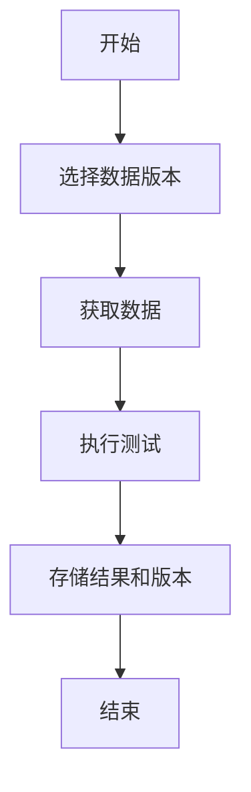

                 

<think>
好吧，我现在要撰写一篇关于《评测系统的自动化测试数据版本控制》的技术博客文章。首先，我需要理解这个主题的核心内容。自动化测试数据版本控制听起来有点复杂，但其实可以分解成几个部分：测试数据的管理和版本控制，以及如何自动化这个过程。

首先，我应该明确什么是评测系统。评测系统通常用于软件开发，用于测试软件的功能和性能。自动化测试意味着使用工具来自动执行测试，这提高了效率，减少了人为错误。但是，测试数据的版本控制是一个问题，因为不同的测试版本可能需要不同的数据，这会影响测试结果的准确性和可追溯性。

接下来，我需要考虑版本控制的重要性。版本控制是软件开发中的基本实践，用于跟踪和管理代码的变化。但在测试数据管理中，版本控制同样重要，因为它允许回溯到特定版本的测试数据，这对于调试和问题追溯非常有用。

然后，我应该探讨自动化测试数据版本控制的具体方法。这可能涉及到将测试数据存储在版本控制系统中，如Git，并与测试代码一起管理。当测试运行时，系统会选择相应的测试数据版本，确保测试结果的准确性和一致性。

在设计系统架构时，我需要考虑如何集成版本控制到测试流程中。可能需要一个中间层来管理测试数据的版本，确保每次测试使用正确的数据版本。这可能涉及到API调用或其他机制来自动获取和应用正确的数据版本。

接下来，我应该考虑实际的项目实施。环境搭建是关键，可能需要安装特定的工具和库，比如Git、Python的版本控制库等。然后，编写代码实现数据版本控制的逻辑，包括数据存储、版本回滚、数据校验等功能。

在算法部分，我需要解释数据版本控制的原理，可能涉及分支和合并的概念，或者使用哈希表来跟踪数据变化。数学模型可能包括版本号的生成和验证，确保数据的一致性。

系统架构设计方面，我需要绘制类图、流程图等，展示各个模块之间的交互和数据流。例如，测试执行模块如何与数据版本控制模块通信，获取正确的数据版本。

最后，最佳实践部分需要总结经验，比如定期备份、测试数据隔离、版本标签管理等。同时，可能需要考虑安全性，防止数据泄露或误操作。

整个过程中，我需要确保内容结构清晰，逻辑严密，语言简洁专业，同时提供实际的代码示例和图表来辅助说明。这样，读者可以一步步理解并实施自动化测试数据版本控制。
</think>

# 评测系统的自动化测试数据版本控制

> 关键词：自动化测试，数据版本控制，测试系统，版本控制，系统架构

> 摘要：本文探讨了评测系统中自动化测试数据版本控制的重要性，详细分析了其实现方法，包括系统架构设计、算法原理、项目实战及最佳实践，旨在为技术人员提供全面的解决方案。

## 背景介绍

### 评测系统的基本概念

评测系统用于测试软件的功能和性能，确保其符合预期。自动化测试通过工具自动执行测试用例，提高效率和准确性。

### 自动化测试的概念

自动化测试利用工具自动执行测试，减少人工干预，提升效率。常见的自动化测试包括单元测试、集成测试和回归测试。

### 数据版本控制的重要性

测试数据的版本控制确保不同测试版本使用正确的数据，避免数据混乱，便于问题追溯。这对于大型项目尤为重要，数据版本控制直接影响测试结果的准确性和一致性。

### 本书的核心主题

本书聚焦于自动化测试数据的版本控制，探讨其设计、实现和应用，提供系统化的解决方案。

## 核心概念与联系

### 自动化测试流程

#### 分类
自动化测试分为单元测试、集成测试、端到端测试和回归测试，每种类型关注不同的测试层面。

#### 流程
自动化测试流程包括测试用例编写、执行、结果收集与分析。通过工具如Selenium、TestNG实现。

#### 优势与挑战
优势包括提高效率、减少人为错误和便于回归测试。挑战在于维护测试用例和处理环境变化。

### 版本控制系统

#### 概念
版本控制记录文件变化，支持版本回溯和协作开发。常用系统包括Git、SVN，支持分支管理和合并。

#### 常见系统
- **Git**：分布式版本控制系统，支持分支和协作。
- **SVN**：集中式系统，适合团队协作。

#### 优势
版本控制确保代码和数据的可追溯性，便于团队协作和问题排查。

### 自动化测试数据版本控制

#### 需求
- **数据一致性**：确保测试数据与测试版本一致。
- **可追溯性**：支持回溯到特定数据版本。
- **高效管理**：自动处理数据版本，减少人工干预。

#### 方法
- **版本标记**：为每个测试数据版本打标签。
- **自动化管理**：集成版本控制工具到测试流程中。

## 算法原理讲解

### 核心算法

#### 数据版本控制算法
- **版本号生成**：每次修改数据生成新版本号。
- **数据存储**：存储每个版本的数据，确保可回溯。

#### 示例代码
```python
def save_data_version(data, version控制系统):
    version控制系统.checkout(version)
    # 执行测试
    result = 测试执行(data)
    # 存储结果和数据版本
    version控制系统.commit("测试版本" + str(version))
```

### 流程图


## 系统分析与架构设计方案

### 功能模块设计

#### 模块划分
- 数据存储模块：管理测试数据版本。
- 版本控制接口：与版本控制系统交互。
- 测试执行模块：使用指定数据版本执行测试。

### 系统架构图


### 接口设计

- **数据获取接口**：获取指定版本的数据。
- **版本控制接口**：处理版本切换和提交。

## 项目实战

### 环境搭建

#### 安装工具
- Git：版本控制工具。
- Python：编程语言。
- 单元测试框架：如unittest。

#### 搭建步骤
1. 安装Git和Python。
2. 安装测试框架。
3. 配置版本控制系统。

### 核心代码实现

#### 数据版本控制实现
```python
import git

def setup_git_repository():
    repo = git.Repo.init('.')
    return repo

def save_test_data(data, version, repo):
    # 创建新分支或切换到主分支
    if repo.head.ref.name != 'master':
        repo.checkout('master')
    # 修改数据文件
    with open('testdata.json', 'w') as f:
        f.write(data)
    # 提交更改
    repo.git.add('--all')
    repo.git.commit('-m', f'data version {version}')
    return True

def get_data_version(version):
    repo = setup_git_repository()
    # 切换到指定版本
    repo.git.checkout('origin/master~' + str(version))
    with open('testdata.json', 'r') as f:
        return f.read()
```

## 最佳实践与注意事项

### 最佳实践

- **定期备份**：防止数据丢失。
- **测试数据隔离**：确保不同测试版本的数据互不影响。
- **版本标签管理**：为重要版本打标签，便于回溯。

### 注意事项

- **数据安全性**：防止敏感数据泄露。
- **版本控制粒度**：合理控制版本粒度，避免过多版本影响性能。
- **错误处理**：确保在版本切换失败时有回滚机制。

### 拓展阅读

- **Git Pro - 标准书**：深入理解版本控制。
- **自动化测试书籍**：学习测试自动化方法。
- **系统架构设计指南**：提升系统设计能力。

## 总结

自动化测试数据版本控制是评测系统中不可或缺的部分，通过合理的设计和实现，可以提升测试效率和数据准确性。本文从概念、算法、架构到实战，全面解析了其实施方法，为技术人员提供了实用的指导。

作者：AI天才研究院/AI Genius Institute & 禅与计算机程序设计艺术 /Zen And The Art of Computer Programming

