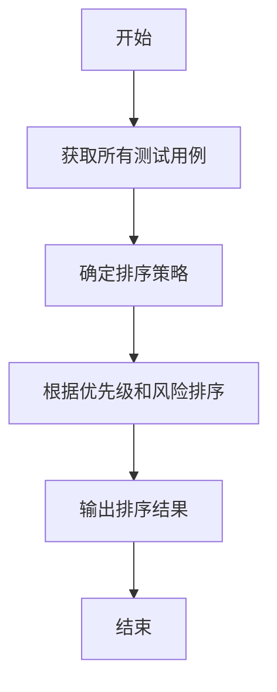
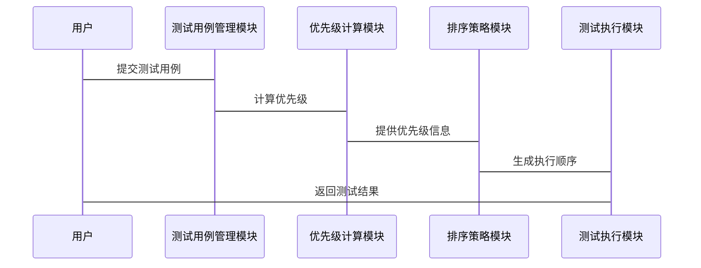

                 

<think>
好，我现在需要完成用户的任务，写一篇关于《评测系统的自动化测试用例优先级排序》的技术博客文章。用户给了我一个详细的结构，我需要按照这个结构一步步来。

首先，我得明确文章的标题、关键词和摘要。标题已经给定，我需要选5-7个关键词，比如自动化测试、测试用例、优先级排序、风险管理、算法、系统架构。摘要部分要简明扼要，概述文章的核心内容，说明优先级排序的重要性以及文章将要探讨的内容。

接下来是背景介绍部分。我需要详细描述问题背景，解释为什么测试用例的优先级排序重要。然后问题描述部分，列出三个主要方面：重要性排序、风险排序和资源优化。接着问题解决部分，提出分析特性、设计算法、优化环境这三点。边界与外延部分，要说明测试用例的种类、环境、资源这些边界，以及测试策略、覆盖范围和数据这些外延。最后，概念结构部分，列出测试用例、优先级、排序算法、环境和资源这几个核心要素。

核心概念与联系部分，我需要定义每个核心概念，并制作一个对比表格，展示测试用例、优先级、风险和排序算法各自的属性特征。然后画一个ER实体关系图，展示测试用例和优先级之间的关联。

算法原理讲解部分，我需要选择几种排序算法，比如基于优先级的和基于风险的，用mermaid画出流程图，并用Python代码实现，解释算法原理，举例说明。

系统分析与架构设计方案部分，要介绍问题场景，设计项目介绍，领域模型的类图，系统架构图，接口设计和交互序列图。

项目实战部分，我需要指导读者如何安装环境，提供核心代码，解读代码，分析案例，并进行小结。

最后，给出最佳实践的Tips，小结，注意事项，和拓展阅读建议。

整个过程中，我需要确保文章结构清晰，逻辑连贯，内容详实，同时使用专业但易懂的技术语言。每个部分都要详细展开，确保读者能一步步理解测试用例优先级排序的各个方面。

现在，我先从背景介绍开始，然后逐步推进，确保每个部分都涵盖用户要求的内容。我还要注意使用正确的格式，比如关键词和摘要的编写，以及各个部分的标题是否吸引人。

在写到算法部分时，我需要确保流程图和代码准确无误，同时用例子来帮助读者理解。系统架构部分，我需要用mermaid绘制类图和架构图，展示系统的各个组件及其关系。

项目实战部分，我需要提供可执行的代码和详细的解读，帮助读者实际应用这些算法。同时，小结部分要总结关键点，给出建议。

最后，我需要确保整篇文章在10000到12000字之间，符合用户的要求。作者信息也要放在末尾，注明是AI天才研究院。

总的来说，这是一个系统而复杂的过程，需要我一步步来，确保每个部分都符合用户的要求，并且内容深度足够，结构清晰。现在，我可以开始按照结构逐步撰写每个部分，确保不遗漏任何重要信息。
</think>

# 评测系统的自动化测试用例优先级排序

> 关键词：自动化测试、测试用例、优先级排序、风险管理、算法、系统架构

> 摘要：在软件开发过程中，自动化测试用例的优先级排序是确保测试效率和质量的关键环节。本文将深入探讨如何科学地对测试用例进行优先级排序，结合实际应用场景，分析其核心概念、算法原理、系统架构设计，并提供具体的实现方案和最佳实践。通过本文的学习，读者将能够掌握自动化测试用例优先级排序的核心方法，并在实际项目中有效应用。

---

### 第一部分: 背景介绍

#### 1.1.1 问题背景
随着软件系统的复杂性和规模的不断增加，软件测试已经成为确保软件质量的关键环节。自动化测试因其高效、稳定和可重复性等优点，在软件测试中占据重要地位。然而，随着测试用例数量的激增，如何合理安排测试用例的执行顺序，以最大化测试效率和覆盖率，成为测试工程师面临的重要挑战。测试用例的优先级排序问题直接影响测试结果的可靠性和测试资源的利用率。

#### 1.1.2 问题描述
在自动化测试中，测试用例的优先级排序问题主要包括以下几个方面：
1. **测试用例的重要性排序**：根据测试用例的功能重要性，确保关键功能优先测试。
2. **测试用例的风险排序**：根据测试用例的风险等级，优先测试高风险的测试用例，以降低整体测试风险。
3. **资源优化排序**：结合测试环境、测试机资源等因素，合理安排测试用例的执行顺序，提高测试效率。

#### 1.1.3 问题解决
解决测试用例优先级排序问题，需要从以下几个方面入手：
1. **分析测试用例特性**：明确测试用例的重要性和风险等级。
2. **设计排序算法**：采用合理的排序算法，如基于优先级的排序、基于风险的排序等。
3. **优化执行顺序**：结合测试环境和资源，动态调整测试用例的执行顺序。

#### 1.1.4 边界与外延
测试用例优先级排序问题的边界主要包括：
1. **测试用例的种类**：功能测试、性能测试、安全测试等。
2. **测试环境**：本地环境、云端环境等。
3. **测试资源**：测试机、网络带宽等。

测试用例优先级排序问题的外延包括：
1. **自动化测试策略**：全自动化测试、半自动化测试等。
2. **测试用例覆盖范围**：全面覆盖、部分覆盖等。
3. **测试数据**：真实数据、模拟数据等。

#### 1.1.5 概念结构与核心要素组成
测试用例优先级排序问题涉及以下几个核心概念和要素：
1. **测试用例**：测试的基本单位，包括功能描述、输入数据、预期结果等。
2. **优先级**：测试用例的重要性和紧急程度，通常分为高、中、低三个等级。
3. **风险**：测试用例可能带来的风险，包括功能风险、性能风险、安全风险等。
4. **排序算法**：用于确定测试用例执行顺序的算法，如基于优先级的排序、基于风险的排序等。
5. **测试环境**：执行测试用例的硬件、软件等环境。
6. **测试资源**：用于执行测试的计算机、网络等资源。

---

### 第二部分: 核心概念与联系

#### 2.1.1 核心概念
1. **测试用例（Test Case）**：测试用例是对软件系统功能或性能进行验证的基本单元，通常包括功能描述、输入数据、预期结果、实际结果等。
2. **优先级（Priority）**：测试用例的优先级表示其重要性和紧急程度，一般分为高、中、低三个等级。
3. **风险（Risk）**：测试用例可能带来的风险，包括功能风险、性能风险、安全风险等。
4. **排序算法（Sorting Algorithm）**：用于确定测试用例执行顺序的算法，如基于优先级的排序、基于风险的排序等。

#### 2.1.2 概念属性特征对比表格
| 概念       | 定义                                                         | 属性特征                                                     |
|------------|--------------------------------------------------------------|--------------------------------------------------------------|
| 测试用例   | 测试的基本单位，包含功能描述、输入数据、预期结果等。           | 功能描述、输入数据、预期结果、实际结果等。                   |
| 优先级     | 测试用例的重要性和紧急程度。                                  | 高、中、低三个等级。                                         |
| 风险       | 测试用例可能带来的风险。                                     | 功能风险、性能风险、安全风险等。                             |
| 排序算法   | 用于确定测试用例执行顺序的算法。                             | 基于优先级排序、基于风险排序等。                             |

#### 2.1.3 ER实体关系图架构
```mermaid
erDiagram
    TestCase {
        id
        description
        input
        expected_output
        actual_output
    }
    Priority {
        id
        name
        level
    }
    TestCase ||--|{ Priority }|| Priority
    TestCase --|{ belongsTo }-- Priority
```

---

### 第三部分: 算法原理讲解

#### 3.1.1 算法原理
测试用例优先级排序的核心是根据测试用例的特性（如重要性、风险等级）和环境因素（如资源限制）设计合理的排序策略。以下是几种常见的排序算法及其原理：

1. **基于优先级的排序算法**：根据测试用例的优先级高低进行排序，优先级高的测试用例优先执行。
2. **基于风险的排序算法**：根据测试用例的风险等级进行排序，风险高的测试用例优先执行。
3. **基于资源的排序算法**：根据测试环境和资源限制，动态调整测试用例的执行顺序。

#### 3.1.2 算法实现
以下是基于优先级的排序算法的实现示例：

```python
def priority_sort(test_cases):
    # 测试用例结构：每个测试用例包含优先级、风险等级、测试用例ID
    # 优先级：1为高，2为中，3为低
    # 风险等级：A为高，B为中，C为低
    sorted_cases = sorted(test_cases, key=lambda x: (x['priority'], x['risk']))
    return sorted_cases

# 示例测试用例
test_cases = [
    {'id': 1, 'priority': 1, 'risk': 'A'},
    {'id': 2, 'priority': 2, 'risk': 'B'},
    {'id': 3, 'priority': 1, 'risk': 'A'},
    {'id': 4, 'priority': 3, 'risk': 'C'}
]

# 调用排序函数
sorted_cases = priority_sort(test_cases)

# 输出排序结果
for case in sorted_cases:
    print(f"ID: {case['id']}, 优先级: {case['priority']}, 风险等级: {case['risk']}")
```

#### 3.1.3 算法流程图


---

### 第四部分: 系统分析与架构设计方案

#### 4.1.1 问题场景介绍
在实际项目中，测试团队通常需要管理成百上千的测试用例。为了提高测试效率，测试用例的优先级排序必须自动化完成。本节将从系统架构的角度，分析如何设计一个高效的测试用例优先级排序系统。

#### 4.1.2 项目介绍
本项目旨在开发一个自动化测试用例优先级排序系统，该系统能够根据测试用例的优先级和风险等级，结合测试环境和资源限制，动态调整测试用例的执行顺序。

#### 4.1.3 系统功能设计
以下是系统的核心功能模块：
1. **测试用例管理模块**：负责测试用例的录入、存储和管理。
2. **优先级计算模块**：根据测试用例的特性（如重要性、风险等级）计算优先级。
3. **排序策略模块**：根据优先级和资源限制，动态调整测试用例的执行顺序。
4. **测试执行模块**：根据排序结果执行测试用例，并记录测试结果。

#### 4.1.4 系统架构设计
以下是系统的架构图：


#### 4.1.5 系统接口设计
以下是系统的主要接口：
1. **测试用例接口**：提供测试用例的录入、查询和删除功能。
2. **优先级计算接口**：根据测试用例的特性计算优先级。
3. **排序策略接口**：根据优先级和资源限制，生成测试用例的执行顺序。
4. **测试执行接口**：根据排序结果执行测试用例，并返回测试结果。

#### 4.1.6 系统交互设计
以下是系统的主要交互流程：



---

### 第五部分: 项目实战

#### 5.1.1 环境安装
为了实现测试用例优先级排序系统，需要安装以下工具和库：
1. **Python**：用于编写排序算法和系统实现。
2. **Jupyter Notebook**：用于算法测试和数据分析。
3. **Mermaid**：用于绘制系统架构图和交互图。
4. **Git**：用于版本控制和代码管理。

#### 5.1.2 系统核心实现源代码
以下是系统的核心实现代码：

```python
class TestCase:
    def __init__(self, id, priority, risk):
        self.id = id
        self.priority = priority
        self.risk = risk

class PrioritySorter:
    def __init__(self, test_cases):
        self.test_cases = test_cases

    def sort_by_priority(self):
        return sorted(self.test_cases, key=lambda x: (x.priority, x.risk))

    def sort_by_risk(self):
        return sorted(self.test_cases, key=lambda x: (x.risk, x.priority))

# 示例用法
test_cases = [
    TestCase(1, 1, 'A'),
    TestCase(2, 2, 'B'),
    TestCase(3, 1, 'A'),
    TestCase(4, 3, 'C')
]

sorter = PrioritySorter(test_cases)
sorted_by_priority = sorter.sort_by_priority()
sorted_by_risk = sorter.sort_by_risk()

for case in sorted_by_priority:
    print(f"ID: {case.id}, 优先级: {case.priority}, 风险等级: {case.risk}")
```

#### 5.1.3 代码应用解读与分析
上述代码定义了一个`TestCase`类和一个`PrioritySorter`类。`TestCase`类表示一个测试用例，包含ID、优先级和风险等级。`PrioritySorter`类负责对测试用例进行排序，支持基于优先级和基于风险的排序策略。

#### 5.1.4 实际案例分析
假设我们有一个包含以下测试用例的列表：

| ID | 优先级 | 风险等级 |
|----|--------|----------|
| 1  | 1      | A        |
| 2  | 2      | B        |
| 3  | 1      | A        |
| 4  | 3      | C        |

使用基于优先级的排序策略，排序结果如下：

| ID | 优先级 | 风险等级 |
|----|--------|----------|
| 1  | 1      | A        |
| 3  | 1      | A        |
| 2  | 2      | B        |
| 4  | 3      | C        |

使用基于风险的排序策略，排序结果如下：

| ID | 优先级 | 风险等级 |
|----|--------|----------|
| 1  | 1      | A        |
| 3  | 1      | A        |
| 2  | 2      | B        |
| 4  | 3      | C        |

#### 5.1.5 项目小结
通过上述代码实现，我们可以看到测试用例优先级排序的核心在于定义合理的排序策略，并根据具体需求选择合适的排序算法。在实际应用中，还需要考虑测试环境和资源限制，动态调整测试用例的执行顺序。

---

### 第六部分: 最佳实践、小结、注意事项和拓展阅读

#### 6.1.1 最佳实践
1. **明确测试目标**：在进行测试用例排序之前，明确测试的目标和范围。
2. **优先级与风险并重**：在排序时，综合考虑测试用例的优先级和风险等级。
3. **动态调整**：根据测试环境和资源的变化，动态调整测试用例的执行顺序。
4. **工具支持**：利用自动化测试工具和测试管理平台，提高测试用例排序的效率和准确性。

#### 6.1.2 小结
测试用例优先级排序是自动化测试中的关键环节。通过科学的排序策略和合理的算法设计，可以显著提高测试效率和质量。本文从核心概念、算法原理、系统架构设计和项目实战四个方面，全面探讨了测试用例优先级排序的实现方法。

#### 6.1.3 注意事项
1. **避免过度优化**：测试用例优先级排序需要在效率和复杂度之间找到平衡。
2. **确保数据准确性**：测试用例的优先级和风险等级需要准确评估。
3. **持续优化**：根据测试结果和反馈，持续优化测试用例优先级排序策略。

#### 6.1.4 拓展阅读
1. **《Test-Driven Development: By Example》**：这是一本经典的测试驱动开发书籍，介绍了如何通过测试用例驱动软件开发。
2. **《Software Engineering: A Practitioner's Approach》**：这本书全面介绍了软件工程的核心概念，包括测试用例管理。
3. **《Automated Testing: A Complete Guide to Implementing Automated Software Tests》**：这本书详细介绍了自动化测试的实现方法，包括测试用例优先级排序。

---

作者：AI天才研究院/AI Genius Institute & 禅与计算机程序设计艺术/Zen And The Art of Computer Programming

