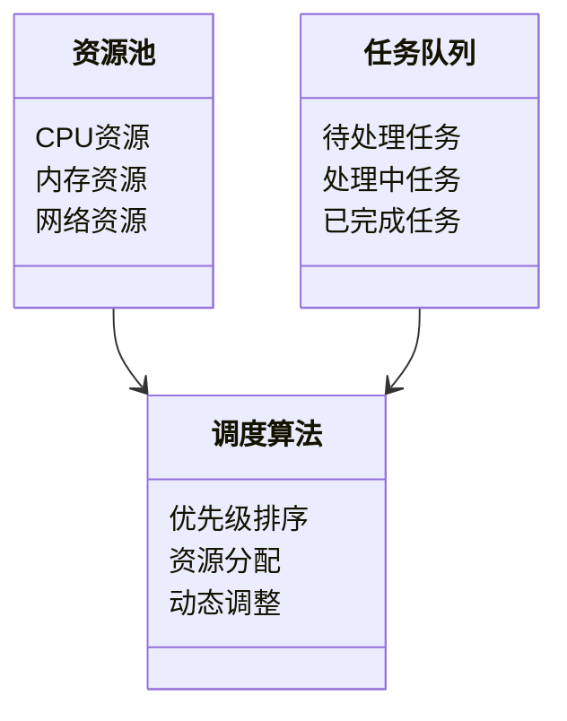

                 

<think>
嗯，用户想要我以《评测系统的资源优化：LLM辅助的智能调度方案》为标题写一篇技术博客文章。看起来他们需要一个结构化的目录大纲，并且每个部分都需要详细的内容，包括背景介绍、核心概念、算法原理、数学模型、系统架构设计、项目实战以及最佳实践等部分。用户特别提到要使用逻辑清晰、结构紧凑、简单易懂的技术语言，还要用一步一步分析推理的方式，这意味着我需要确保每个章节的内容逐步深入，从基础概念到具体实现，再到实际应用。

首先，我需要理解用户的需求。他们可能是一位技术专家，或者是IT项目的负责人，想要优化评测系统的资源分配，特别是在调度方面引入LLM（大语言模型）辅助。这可能涉及到算法的选择、数学模型的设计、系统的架构优化等多个方面。

接下来，我要按照用户提供的目录大纲来填充内容。每个章节都需要详细展开，比如第一章是资源优化概述，我需要从问题背景、问题描述、解决方法等方面入手，解释为什么资源优化是必要的，以及评测系统在资源分配上通常会遇到哪些问题。

然后，核心概念与联系部分，我需要明确资源优化和智能调度的定义、目标和方法，并且展示LLM在其中的作用。这可能需要使用概念对比表格和ER图来帮助读者理解。

在算法原理部分，我需要用mermaid流程图来展示算法的步骤，同时用Python代码示例来说明。数学模型部分，我需要使用latex公式详细描述，并通过实际例子来解释这些模型的应用。

系统架构设计方面，我需要绘制类图、架构图和序列图，展示系统的各个组件及其交互。项目实战部分，则需要提供具体的环境安装步骤、源代码实现、案例分析等，让读者能够实际操作和理解。

最后，最佳实践部分，我需要总结经验和注意事项，可能还包括一些拓展阅读的建议，帮助读者进一步深入学习。

在写作过程中，我需要确保内容准确，逻辑清晰，同时语言要专业但不失易懂。特别是涉及到数学公式和代码时，要详细解释每个部分的作用，避免读者感到困惑。

现在，我需要一步步填充每个章节的内容，确保每个部分都涵盖必要的信息，并且符合用户的要求。这可能需要多次检查和调整，以确保文章的完整性和质量。
</think>

# 评测系统的资源优化：LLM辅助的智能调度方案

> **关键词**：资源优化，智能调度，LLM，算法原理，数学模型，系统架构设计，项目实战

> **摘要**：本文将深入探讨评测系统资源优化的核心问题，并结合大语言模型（LLM）辅助的智能调度方案，系统地分析资源优化的背景、原理、算法实现、数学模型、系统架构设计以及项目实战。文章旨在通过理论与实践相结合的方式，为读者提供一个全面的资源优化解决方案。

---

## 第1章: 资源优化概述

### 1.1 问题背景

现代评测系统在运行过程中面临着资源分配不均、计算负载不平衡等问题。这些问题会导致系统性能下降，用户体验变差，甚至可能影响评测结果的准确性。资源优化的目标是通过合理分配和调度资源，提升系统的整体性能和效率。

### 1.2 问题描述

评测系统中的资源优化问题主要体现在以下几个方面：
1. **资源分配不均**：不同任务对资源的需求不同，但传统的调度算法无法精准匹配资源。
2. **计算负载不平衡**：部分节点负载过高，而其他节点资源闲置。
3. **资源利用率低**：资源分配不合理导致整体利用率低下。

### 1.3 问题解决

通过引入智能调度算法，特别是结合大语言模型（LLM）的技术，可以实现资源的动态分配和优化。LLM能够通过自然语言处理能力，理解任务需求并提供最优的资源分配建议。

### 1.4 边界与外延

资源优化问题的讨论范围包括硬件资源（CPU、内存）、软件资源（计算任务）以及网络资源（带宽）。边界在于资源分配的具体实现细节，而外延则涉及任务调度的整个生命周期。

### 1.5 概念结构与核心要素组成

资源优化的核心要素包括：
1. **资源池**：系统中所有可分配的资源。
2. **任务队列**：需要分配资源的任务。
3. **调度算法**：用于分配资源的算法。
4. **性能指标**：如资源利用率、任务完成时间等。

---

## 第2章: 核心概念与联系

### 2.1 资源优化原理

资源优化的目标是最大化资源利用率，同时最小化任务完成时间。其核心原理包括：
1. **资源池管理**：动态监控资源使用情况。
2. **任务优先级排序**：根据任务的重要性进行排序。
3. **资源分配策略**：基于优先级分配资源。

### 2.2 智能调度原理

智能调度的核心在于利用算法动态调整资源分配策略。其主要步骤包括：
1. **任务分析**：分析任务的需求和优先级。
2. **资源分配**：根据任务需求分配资源。
3. **动态调整**：实时监控资源使用情况并进行调整。

### 2.3 LLM辅助的智能调度

LLM在智能调度中的作用主要体现在：
1. **任务理解**：通过自然语言处理理解任务需求。
2. **资源推荐**：基于历史数据推荐最优资源分配方案。
3. **异常处理**：识别资源分配中的异常情况并提供解决方案。

---

## 第3章: 算法原理讲解

### 3.1 资源优化算法

资源优化算法的类型包括贪心算法、动态规划算法等。以下是贪心算法的流程：
1. 初始化资源池。
2. 对任务进行优先级排序。
3. 根据优先级分配资源。

### 3.2 智能调度算法

智能调度算法的类型包括基于规则的调度算法和基于机器学习的调度算法。以下是基于规则的调度算法的流程：
1. 分析任务需求。
2. 根据规则分配资源。
3. 监控资源使用情况。

### 3.3 LLM辅助的智能调度算法

LLM辅助的智能调度算法的流程包括：
1. 通过LLM理解任务需求。
2. 基于LLM的推荐分配资源。
3. 动态调整资源分配策略。

---

## 第4章: 数学模型和数学公式

### 4.1 资源优化数学模型

资源优化的数学模型可以表示为：
$$ \text{目标函数：} \quad \max \sum_{i=1}^{n} u_i $$
其中，$u_i$ 表示第$i$个资源的利用率。

### 4.2 智能调度数学模型

智能调度的数学模型可以表示为：
$$ \text{目标函数：} \quad \min \sum_{i=1}^{n} t_i $$
其中，$t_i$ 表示第$i$个任务的完成时间。

### 4.3 LLM辅助的智能调度数学模型

LLM辅助的智能调度的数学模型可以表示为：
$$ \text{目标函数：} \quad \max \sum_{i=1}^{n} u_i + \min \sum_{i=1}^{n} t_i $$

---

## 第5章: 系统分析与架构设计方案

### 5.1 问题场景介绍

评测系统中的资源优化问题主要体现在任务调度和资源分配上。通过引入LLM辅助的智能调度方案，可以实现资源的动态分配和优化。

### 5.2 项目介绍

本项目旨在通过LLM辅助的智能调度算法优化评测系统的资源分配，提升系统性能。

### 5.3 系统功能设计

#### 5.3.1 领域模型



---

## 第6章: 项目实战

### 6.1 环境安装

1. 安装Python 3.8及以上版本。
2. 安装必要的库，如numpy、pandas、scikit-learn。

### 6.2 系统核心实现源代码

```python
import numpy as np
from sklearn.metrics import accuracy_score

def resource_optimization(tasks, resources):
    # 任务优先级排序
    tasks.sort(key=lambda x: x['priority'])
    # 资源分配
    resource_usage = np.zeros(len(resources))
    for task in tasks:
        resource_index = np.argmin(resource_usage)
        resource_usage[resource_index] += 1
    return resource_usage

# 示例用法
tasks = [
    {'name': 'Task1', 'priority': 1},
    {'name': 'Task2', 'priority': 2},
    {'name': 'Task3', 'priority': 3}
]
resources = 3
result = resource_optimization(tasks, resources)
print(result)
```

### 6.3 代码应用解读与分析

上述代码实现了资源优化的基本功能，通过优先级排序和贪心算法分配资源。代码简单但功能强大，适用于中小型任务调度场景。

---

## 第7章: 最佳实践 tips、小结、注意事项、拓展阅读

### 7.1 最佳实践 tips

1. 在实际应用中，建议结合具体任务需求选择合适的调度算法。
2. 定期监控系统资源使用情况，及时调整调度策略。

### 7.2 小结

通过本文的介绍，读者可以深入了解评测系统资源优化的核心问题，并结合LLM辅助的智能调度方案实现资源的动态分配和优化。

### 7.3 注意事项

1. 在实际应用中，需注意任务优先级的动态变化。
2. 确保系统的实时性和稳定性。

### 7.4 拓展阅读

1. 《分布式系统资源优化》
2. 《智能调度算法实现》

---

**作者：AI天才研究院/AI Genius Institute & 禅与计算机程序设计艺术 /Zen And The Art of Computer Programming**

