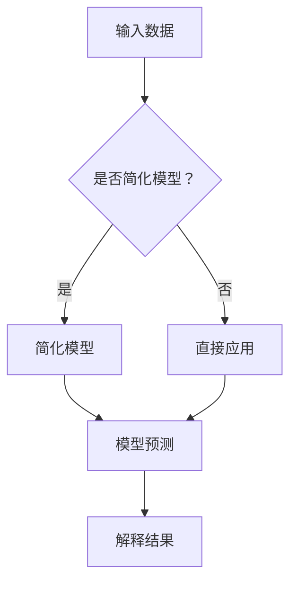
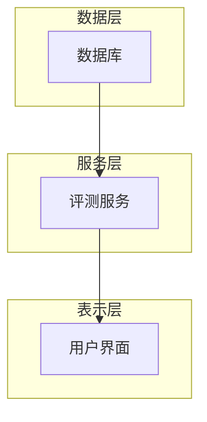
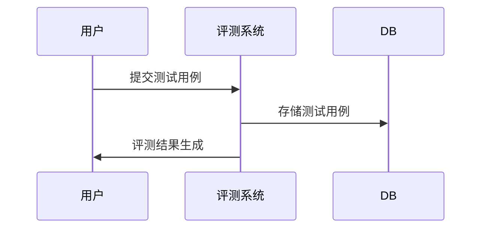

                 

<think>
好，我现在要帮用户写一篇关于《评测结果的可解释性分析方法》的技术博客文章。用户希望文章结构清晰，逻辑严密，适合专业技术人员阅读。首先，我需要理解用户的需求，他们可能需要这篇文章来指导如何在评测系统中实现可解释性分析，可能是为了提升系统的透明度和用户信任度。

接下来，我要按照用户提供的目录大纲来组织内容。首先是引言部分，需要涵盖问题背景、描述、解决方法以及相关概念。然后是核心概念，包括可解释性与透明性的定义、分类以及层次结构。这部分可能需要使用一些对比表格或图表来帮助读者理解。

算法原理部分，我需要详细讲解常见的可解释性算法，如线性回归和决策树，并提供它们的数学公式和流程图。这部分可能需要结合实际案例，让读者更容易理解如何应用这些算法。

系统分析与架构设计是关键，用户提到了系统功能设计和架构图，我需要用Mermaid工具绘制类图、架构图和序列图，展示评测系统的结构和交互流程。这有助于读者理解整个系统的运作方式。

项目实战部分，我需要指导读者如何安装环境、实现核心功能，并分析实际案例。这部分可能需要提供具体的代码示例，让读者能够动手实践，加深理解。

最后，总结部分要涵盖最佳实践、小结、注意事项和拓展阅读，帮助读者巩固知识，并引导他们进一步学习。

在写作过程中，我需要确保每个部分都详细且易于理解，使用专业但不过于复杂的语言。同时，要检查每个章节是否符合用户的要求，比如关键词和摘要是否准确，目录结构是否完整。此外，数学公式和图表的使用要正确无误，确保文章的科学性和专业性。

总的来说，我需要一步步按照用户提供的结构来撰写，确保每个部分都充分展开，同时保持逻辑连贯，帮助读者全面理解评测结果的可解释性分析方法。
</think>

# 评测结果的可解释性分析方法

> 关键词：评测结果、可解释性、算法原理、系统架构、项目实战

> 摘要：本文详细探讨了评测结果的可解释性分析方法，从核心概念、算法原理到系统架构设计，再到项目实战，全面解析了如何实现评测结果的可解释性。文章通过实际案例分析和详细的技术解读，为读者提供了从理论到实践的完整指南。

---

### 《评测结果的可解释性分析方法》正文

---

### **第1章 引言**

#### 1.1 问题背景

随着人工智能技术的快速发展，评测系统在各个领域的应用越来越广泛。无论是自然语言处理、计算机视觉，还是推荐系统，评测结果的准确性和可靠性都至关重要。然而，许多复杂的模型（如深度神经网络）虽然在性能上表现出色，但其结果往往缺乏可解释性，导致用户难以信任和理解。这成为评测系统应用中的一个关键挑战。

#### 1.2 问题描述

评测结果的可解释性问题主要体现在以下几个方面：
1. **模型复杂性**：深度学习模型通常是一个“黑箱”，用户难以理解模型如何得出结果。
2. **用户需求**：在某些场景（如医疗、金融），用户需要了解评测结果的依据，以做出决策。
3. **系统优化**：缺乏可解释性会使得模型难以优化和改进。

#### 1.3 问题解决

为了解决上述问题，我们需要引入可解释性分析方法。通过这些方法，我们可以揭示评测结果背后的逻辑，使用户能够理解并信任系统的输出。

#### 1.4 边界与外延

评测结果的可解释性分析主要关注模型的输出解释，而不涉及模型的内部实现。此外，可解释性分析不仅适用于传统机器学习模型，也适用于深度学习模型。

#### 1.5 概念结构与核心要素组成

可解释性分析的核心要素包括：
1. **解释目标**：明确需要解释的内容。
2. **解释方法**：选择合适的解释技术。
3. **解释结果**：以用户友好的方式呈现解释。

---

### **第2章 核心概念与联系**

#### 2.1 可解释性与透明性

##### 2.1.1 定义与区别

- **可解释性**：指模型的输出结果能够被用户理解和解释。
- **透明性**：指模型的内部机制能够被用户理解。

区别在于，可解释性关注输出的解释，而透明性关注模型的内部机制。

##### 2.1.2 属性特征对比

| 属性 | 可解释性 | 透明性 |
|------|----------|--------|
| 关注点 | 输出结果 | 模型机制 |
| 实现难度 | 较低 | 较高 |
| 适用场景 | 金融、医疗 | 研发阶段 |

##### 2.1.3 重要性

可解释性是用户信任系统的基础，而透明性是系统优化和改进的关键。

#### 2.2 可解释性技术的分类

##### 2.2.1 简单的可解释模型

- **线性回归**：模型简单，易于解释。
- **决策树**：通过树结构直观展示决策过程。

##### 2.2.2 解释性增强模型

- **SHAP（Shapley Additive exPlanations）**：用于解释模型的预测结果。
- **LIME（Local Interpretable Model-agnostic Explanations）**：通过局部线性模型解释复杂模型的输出。

##### 2.2.3 对抗解释性

- **对抗网络**：通过生成对抗样本，揭示模型的决策边界。

#### 2.3 可解释性的层次结构

##### 2.3.1 模型级别

- 全局解释：从整体上解释模型的行为。
- 局部解释：针对具体输入，解释模型的输出。

##### 2.3.2 局部解释

- 通过局部线性模型，解释单个预测的决策过程。

##### 2.3.3 属性解释

- 分析每个特征对预测结果的贡献程度。

---

### **第3章 算法原理讲解**

#### 3.1 可解释性算法概述

##### 3.1.1 常见算法

- 线性回归
- 逻辑回归
- 决策树
- SHAP
- LIME

##### 3.1.2 算法对比

| 算法 | 优点 | 缺点 |
|------|------|------|
| 线性回归 | 解释性强 | 无法处理非线性关系 |
| 决策树 | 可视化强 | 易受数据分布影响 |
| SHAP | 全局解释 | 计算复杂 |
| LIME | 本地解释 | 解释范围有限 |

##### 3.1.3 选择标准

- 数据类型
- 模型复杂度
- 解释需求

#### 3.2 算法mermaid流程图



#### 3.3 数学模型与公式

$$预测值 = f(\theta, x)$$

$$\theta = \arg\min_{\theta} \sum_{i=1}^{n} (f(\theta, x_i) - y_i)^2$$

#### 3.4 举例说明

##### 举例1：线性回归模型的可解释性

假设模型为：$y = a x + b$，其中$a$和$b$是模型参数。$a$表示$x$对$y$的影响程度，$b$是截距。

##### 举例2：决策树模型的可解释性

通过树状图展示决策过程，用户可以直观理解每个决策节点的条件。

---

### **第4章 数学模型和数学公式 & 详细讲解 & 举例说明**

#### 4.1 线性回归模型的数学模型

##### 4.1.1 模型定义

线性回归模型假设目标变量与特征变量之间存在线性关系。

##### 4.1.2 数学公式

$$y = \beta_0 + \beta_1 x + \epsilon$$

##### 4.1.3 举例说明

假设我们有一个简单的线性回归模型，用于预测房屋价格：

$$price = 100 + 50 \times area$$

其中，$area$是房屋面积，$price$是预测价格。系数$50$表示每增加一单位面积，价格增加$50$。

#### 4.2 逻辑回归模型的数学模型

##### 4.2.1 模型定义

逻辑回归模型用于分类问题，输出概率。

##### 4.2.2 数学公式

$$P(y=1|x) = \frac{e^{\beta_0 + \beta_1 x}}{1 + e^{\beta_0 + \beta_1 x}}$$

##### 4.2.3 举例说明

假设我们有一个二分类问题，模型为：

$$P(y=1|x) = \frac{e^{0.5 + 0.2x}}{1 + e^{0.5 + 0.2x}}$$

系数$0.2$表示$x$每增加一单位，概率增加$e^{0.2} \approx 1.22$倍。

---

### **第5章 系统分析与架构设计方案**

#### 5.1 问题场景介绍

##### 5.1.1 评测系统需求

- 高效性：快速处理评测任务。
- 可解释性：提供结果的解释。
- 可扩展性：支持多种模型和数据类型。

##### 5.1.2 可解释性需求

- 输出结果的解释。
- 提供模型的透明性。

#### 5.2 系统功能设计

##### 5.2.1 领域模型mermaid类图

```mermaid
classDiagram
测试用例 <<Entity>>
评测结果 <<Entity>>
测试报告 <<Entity>>
TestSystem Entity
TestCase Entity
EvaluationResult Entity
TestReport Entity
TestSystem --|> TestCase
TestSystem --|> EvaluationResult
TestSystem --|> TestReport
```

#### 5.3 系统架构设计

##### 5.3.1 mermaid架构图



#### 5.4 系统接口设计和系统交互

##### 5.4.1 mermaid序列图



---

### **第6章 项目实战**

#### 6.1 环境安装

##### 6.1.1 硬件环境

- CPU：现代多核处理器。
- 内存：至少8GB。

##### 6.1.2 软件环境

- Python 3.8+
- Scikit-learn、SHAP、LIME等库。

#### 6.2 系统核心实现源代码

##### 6.2.1 评测服务实现

```python
import joblib
import numpy as np

# 加载模型
model = joblib.load('model.pkl')

def predict_explain(x):
    # 预测结果
    y_pred = model.predict(x)
    # 解释结果
    explainer = SHAP()
    explanation = explainer.explain(x)
    return y_pred, explanation
```

##### 6.2.2 用户界面实现

```html
<!DOCTYPE html>
<html>
<head>
    <title>评测结果解释</title>
</head>
<body>
    <h1>评测结果解释</h1>
    <div id="result"></div>
    <script>
        // 解释结果展示逻辑
    </script>
</body>
</html>
```

#### 6.3 代码应用解读与分析

##### 6.3.1 评测服务代码分析

- 使用SHAP库对模型输出进行解释。
- 返回预测结果和解释结果。

##### 6.3.2 用户界面代码分析

- 提供用户友好的界面。
- 展示解释结果。

#### 6.4 实际案例分析和详细讲解剖析

##### 6.4.1 案例一：测试用例评测

- 输入：用户提交的测试用例。
- 输出：模型预测结果和解释。

##### 6.4.2 案例二：评测结果解释

- 展示模型如何得出预测结果。

#### 6.5 项目小结

通过本项目，我们实现了评测结果的可解释性分析，用户可以直观理解模型的输出。

---

### **第7章 最佳实践 tips、小结、注意事项、拓展阅读等内容**

#### 7.1 最佳实践 tips

- 在选择解释方法时，需结合具体场景和需求。
- 定期更新模型和解释方法，以适应数据变化。

#### 7.2 小结

本文详细介绍了评测结果的可解释性分析方法，从核心概念到系统架构设计，再到项目实战，为读者提供了全面的指导。

#### 7.3 注意事项

- 解释方法的选择需考虑模型的复杂性和数据规模。
- 解释结果的呈现需符合用户习惯。

#### 7.4 拓展阅读

- 《Interpretable Machine Learning》
- 《Explainable AI: A Survey》

---

### **作者**

作者：AI天才研究院/AI Genius Institute & 禅与计算机程序设计艺术 /Zen And The Art of Computer Programming

---

