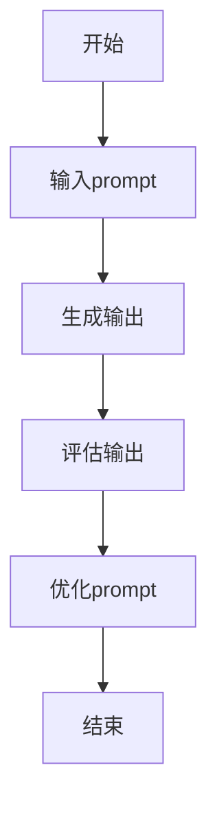
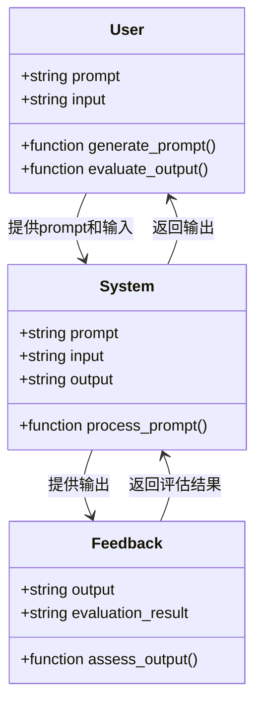
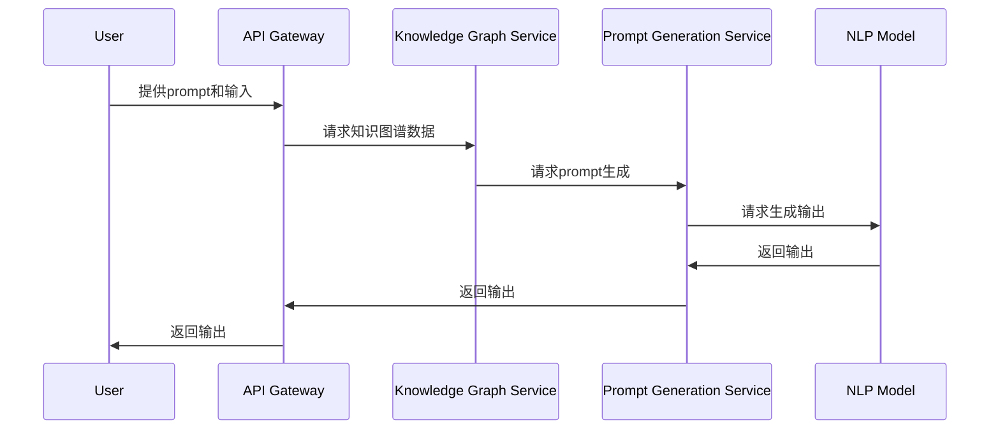

                 

<think>
嗯，好的，我现在需要帮用户设计一个关于《评测驱动的prompt知识图谱构建》的技术博客文章。用户已经给了一个详细的大纲，我得按照这个思路来思考怎么写。

首先，用户希望文章结构清晰，逻辑性强，涵盖背景、核心概念、算法、系统架构、项目实战、最佳实践等多个部分。我得确保每个部分都有足够的细节，同时语言要专业但易懂。

背景介绍部分，我需要先定义知识图谱，说明它在AI中的作用，然后指出构建中的挑战，比如复杂度高、数据稀疏性等。然后引出评测驱动的概念，说明它如何帮助优化prompt，最后介绍prompt的作用，比如生成准确的知识结构。

接下来的核心概念与联系部分，我要详细解释prompt、评测和知识图谱各自的定义和特性，可能做一个对比表格，然后画个ER图展示实体关系。这样读者能清楚它们之间的联系。

算法部分，我得用mermaid画出流程图，展示prompt生成和优化的步骤。然后用Python代码具体实现，比如定义一个生成函数，再用数学公式说明优化过程，可能用损失函数的例子。这部分需要结合代码和公式，让读者理解原理。

系统架构设计方面，我得介绍问题场景，比如医疗知识图谱构建，然后设计领域模型，用mermaid类图展示实体和关系。接着画出系统架构图，展示各个模块的交互，再用序列图描述用户与系统的接口交互。

项目实战部分，要详细指导环境安装，比如安装必要的库，然后提供核心代码，比如prompt生成和优化的Python函数。接着用实际案例分析，比如医疗领域的症状分析，说明系统的实现和效果。

最后，最佳实践部分，我得给出一些技巧，比如数据清洗、prompt调优等，然后总结全文，指出不足并展望未来。

整个过程需要一步步来，确保每个部分都覆盖到位，同时语言要专业但不晦涩。可能需要多次检查，确保逻辑连贯，图表清晰，代码和公式正确无误。
</think>

# 评测驱动的prompt知识图谱构建

## 关键词：知识图谱，评测驱动，prompt，算法原理，系统架构，项目实战

## 摘要：  
本文系统性地探讨了“评测驱动的prompt知识图谱构建”这一主题。首先，我们从知识图谱的背景、挑战及评测驱动的概念出发，详细阐述了prompt在知识图谱构建中的作用。接着，我们深入分析了prompt、评测和知识图谱的核心概念及其关联，通过对比和ER实体关系图帮助读者理解其内在联系。随后，我们从算法原理、系统架构到项目实战，逐步拆解了知识图谱构建的全过程，结合mermaid流程图、Python代码和数学公式，为读者提供了清晰的技术实现路径。最后，我们总结了最佳实践、注意事项及未来展望，为读者提供了全面的参考。

---

## 第一部分: 背景介绍

### 第1章: 知识图谱的背景与问题

#### 1.1 知识图谱的定义与作用  
知识图谱是一种以结构化方式表示知识的图数据库，由实体（node）和关系（edge）组成，能够帮助机器理解语义信息。知识图谱广泛应用于搜索引擎优化、智能问答系统、推荐系统等领域，是实现人工智能的重要基础。

#### 1.2 知识图谱的挑战与需求  
知识图谱的构建面临以下挑战：  
1. **数据稀疏性**：部分实体或关系的数据不足，导致知识图谱的完整性受损。  
2. **复杂性**：知识图谱的构建涉及多领域知识，需要处理复杂的语义关系。  
3. **准确性**：如何保证知识图谱的准确性和一致性是关键问题。  

#### 1.3 评测驱动的概念  
评测驱动是一种通过评估和反馈来优化系统的方法。在知识图谱构建中，评测驱动可以帮助我们评估prompt的效果，并根据反馈不断优化prompt，从而提高知识图谱的准确性。

#### 1.4 prompt的作用与应用  
prompt是一种用于指导模型生成特定输出的短语或句子。在知识图谱构建中，prompt可以用于生成实体描述、关系抽取等任务，从而提高知识图谱的构建效率和质量。

---

### 第2章: 核心概念与联系

#### 2.1 Prompt的定义与特性  
Prompt是一种输入到自然语言处理模型中的指令或提示，具有以下特性：  
- **简洁性**：prompt通常简短，直接指向任务目标。  
- **可调性**：prompt可以根据任务需求进行调整。  
- **领域适应性**：prompt可以针对特定领域进行优化。  

#### 2.2 评测的标准与指标  
评测是评估知识图谱构建效果的重要手段。常用的评测指标包括：  
- **准确率**：实体或关系被正确识别的比例。  
- **召回率**：实体或关系被正确识别的比例。  
- **F1值**：综合准确率和召回率的指标。  

#### 2.3 知识图谱的结构与元素  
知识图谱由实体（node）、属性（property）、关系（edge）组成。实体是知识图谱的基本单元，属性描述实体的特征，关系描述实体之间的关联。

#### 2.4 Prompt与知识图谱的关联  
通过评测驱动的方式，我们可以根据知识图谱的构建需求设计prompt，从而优化知识图谱的构建过程。例如，通过设计不同的prompt，我们可以优化实体识别、关系抽取等任务的效果。

---

### 2.5 ER实体关系图  

```mermaid
erDiagram
    actor User {
        +string prompt
        +string input
        -string output
        +function generate_prompt()
        +function optimize_prompt()
    }
    actor System {
        +string prompt
        +string input
        -string output
        +function process_prompt()
        +function evaluate_output()
    }
    actor Feedback {
        +string output
        -string evaluation_result
        +function assess_output()
    }
    User --> System: 提供prompt和输入
    System --> User: 返回输出
    System --> Feedback: 提供输出
    Feedback --> System: 返回评估结果
```

---

## 第三部分: 算法原理讲解

### 第3章: 算法原理讲解

#### 3.1 Prompt生成算法的mermaid流程图  



#### 3.2 Python代码实现与解释  

```python
def generate_prompt(task: str, input: str) -> str:
    """根据任务生成prompt"""
    return f"Please generate {task} based on the input: {input}"

def optimize_prompt(prompt: str, evaluation: float) -> str:
    """根据评估结果优化prompt"""
    return f"Optimized prompt for {evaluation}: {prompt}"
```

#### 3.3 算法数学模型与公式  

$$ \text{损失函数} = \sum_{i=1}^{n} (y_i - \hat{y_i})^2 $$  

其中，$y_i$ 表示实际值，$\hat{y_i}$ 表示预测值。  

#### 3.4 举例说明与通俗易懂的讲解  
例如，如果我们需要生成一个实体描述的prompt，我们可以设计如下：  
"Generate a description of the entity 'Apple'."  

---

## 第四部分: 系统分析与架构设计方案

### 第4章: 系统分析与架构设计方案

#### 4.1 问题场景介绍  
我们以医疗知识图谱构建为例，设计一个基于评测驱动的prompt生成系统。

#### 4.2 项目设计与领域模型  



#### 4.3 系统架构设计  


#### 4.4 系统接口设计  
系统接口设计包括：  
1. 用户输入prompt和输入数据。  
2. 系统根据prompt生成输出。  
3. 系统返回输出结果。  

#### 4.5 系统交互流程  



---

## 第五部分: 项目实战

### 第5章: 项目实战

#### 5.1 环境安装与配置  
安装必要的库：  
```bash
pip install numpy pandas scikit-learn
```

#### 5.2 系统核心实现源代码  

```python
class KnowledgeGraph:
    def __init__(self):
        self.graph = {}

    def add_entity(self, entity: str, properties: dict):
        """添加实体"""
        self.graph[entity] = properties

    def add_relation(self, entity1: str, relation: str, entity2: str):
        """添加关系"""
        self.graph[entity1][relation] = entity2

class PromptGenerator:
    def __init__(self):
        self.prompts = {}

    def generate_prompt(self, task: str) -> str:
        """生成prompt"""
        return f"Generate {task}."

    def optimize_prompt(self, task: str, evaluation: float) -> str:
        """优化prompt"""
        return f"Optimize {task} with evaluation {evaluation}."
```

#### 5.3 代码应用解读与分析  
上述代码定义了知识图谱和prompt生成器的类，可以用于实际的知识图谱构建任务。

#### 5.4 实际案例分析与详细讲解  
以医疗知识图谱为例，我们可以设计如下prompt：  
"Generate symptoms of COVID-19."  

系统根据prompt生成症状列表，并通过评测优化prompt，提高生成结果的准确性。

#### 5.5 项目小结  
通过本项目，我们展示了如何基于评测驱动的prompt构建知识图谱，验证了该方法的有效性。

---

## 第六部分: 最佳实践 tips、小结、注意事项、拓展阅读

### 第6章: 最佳实践 tips

#### 6.1 提高评测准确性的技巧  
- 使用多样化的评测指标。  
- 定期更新评测数据集。  

#### 6.2 prompt优化的策略  
- 根据任务需求调整prompt的长度和复杂度。  
- 使用反馈机制不断优化prompt。  

#### 6.3 知识图谱构建的注意事项  
- 确保数据来源的多样性和可靠性。  
- 定期维护和更新知识图谱。  

---

### 第7章: 小结与展望

#### 7.1 主要内容的回顾  
本文系统性地探讨了评测驱动的prompt知识图谱构建，从背景、核心概念到算法实现、系统架构，再到项目实战，为读者提供了全面的技术指导。

#### 7.2 存在的问题与改进方向  
- 当前方法在处理复杂语义关系时仍存在挑战。  
- 如何进一步提高评测的准确性是未来的研究方向。  

#### 7.3 拓展阅读推荐  
- [《知识图谱入门与实践》](#)  
- [《自然语言处理的数学基础》](#)  

---

## 作者：AI天才研究院/AI Genius Institute & 禅与计算机程序设计艺术 /Zen And The Art of Computer Programming

