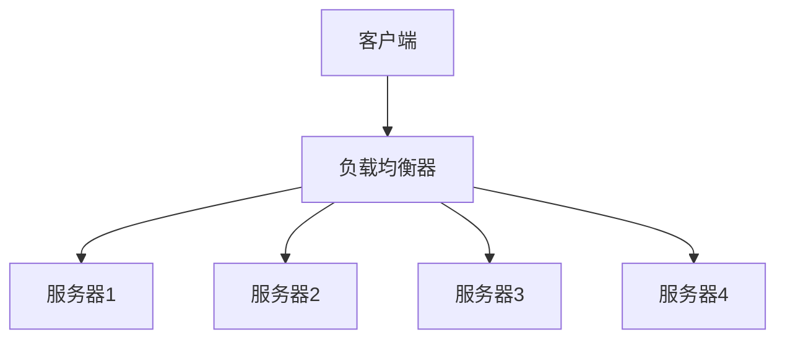
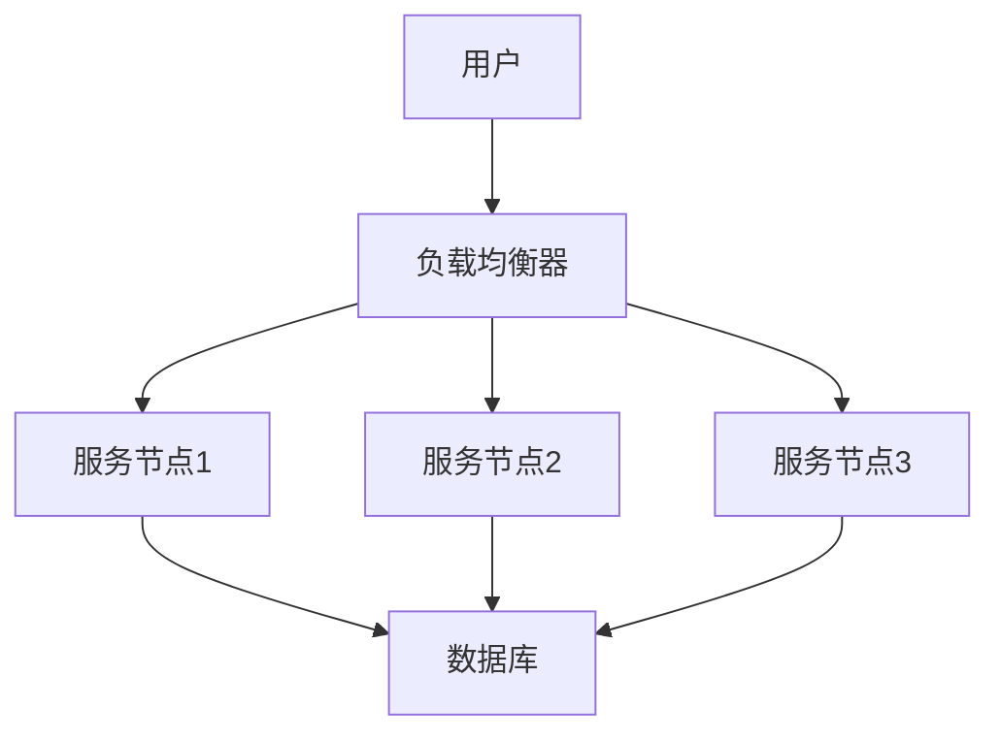

                 

<think>
好，我现在要撰写一篇关于“负载均衡：确保AI服务高可用性的技术手段”的技术博客。首先，我需要理解负载均衡的基本概念和其在AI服务中的重要性。负载均衡是将流量分配到多个服务器或节点，以提高可用性和性能。对于AI服务，高可用性至关重要，因为任何停机都可能导致巨大的损失。

接下来，我需要确定文章的结构。根据之前的大纲，文章分为七章，每章有不同的主题。第一章介绍负载均衡的基本概念，包括定义、重要性、分类和目标。这部分需要简明扼要，让读者快速理解核心概念。

第二章是关于负载均衡的算法。常见的算法有轮询、加权轮询、最小连接数和基于响应时间的算法。我需要详细解释每种算法的工作原理，并通过简单的例子来说明，比如轮询算法如何均匀分配请求，加权轮询如何根据服务器能力分配更多请求。

第三章讨论负载均衡的实现方式，分为软件和硬件负载均衡器，以及分布式负载均衡。软件如Nginx，硬件如F5，分布式如Kubernetes。我需要解释每种实现的优缺点，以及如何配置和优化。

第四章聚焦于AI服务的高可用性。需要定义高可用性，讨论其重要性，设计架构时需要考虑的因素，以及处理故障的策略。这部分需要结合AI服务的特点，比如高计算资源需求，来说明如何设计高可用架构。

第五章探讨AI服务的负载均衡策略，包括基于服务质量、响应时间和资源消耗的策略。需要解释每种策略如何应用，并结合实际场景举例说明，比如在视频流服务中如何根据带宽分配负载。

第六章是实践中的负载均衡，通过实战案例分析，如网站流量分配和视频流服务，说明负载均衡的实际应用。同时，讨论常见问题及解决方案，帮助读者解决实际问题。

第七章展望未来趋势，讨论AI与负载均衡的结合，技术发展趋势和未来挑战。这部分需要提到新技术如边缘计算和自动化运维工具的重要性。

在写作过程中，我需要确保每个章节内容详细具体，涵盖背景介绍、核心概念、算法原理、系统架构、项目实战和未来展望。同时，使用Mermaid图表和数学公式来增强解释，确保文章逻辑清晰，易于理解。

最后，检查文章是否符合字数要求，格式是否正确，确保使用markdown格式，并在结尾加上作者信息。确保每个部分都完整，包括关键词、摘要、各章节详细内容和总结。

现在，我需要逐一填充每个章节的内容，确保涵盖所有必要的部分，如背景、算法、实现、AI高可用性、负载均衡策略、实践案例和未来趋势。同时，结合实际例子和图表，让文章更具说服力和可读性。
</think>

# 负载均衡：确保AI服务高可用性的技术手段

> 关键词：负载均衡，AI服务，高可用性，分布式系统，算法，系统架构

> 摘要：负载均衡是确保AI服务高可用性的关键技术。本文深入探讨负载均衡的概念、算法、实现方式，分析AI服务高可用性的架构设计，并通过实际案例展示负载均衡的应用，最后展望未来趋势。

---

# 第1章：负载均衡的概念与原理

## 1.1 负载均衡的定义

负载均衡是将流量分配到多个服务器或节点的技术，旨在提高系统的可用性、可靠性和性能。通过将请求分发到多个资源，负载均衡避免了单点故障，确保服务持续可用。

## 1.2 负载均衡的重要性

在AI服务中，负载均衡至关重要。AI应用通常处理大量数据和请求，任何单点故障可能导致服务中断。通过负载均衡，可以分摊请求，提升处理能力，确保用户体验。

## 1.3 负载均衡的分类

负载均衡分为软件和硬件两种。软件如Nginx，灵活性高，成本低；硬件如F5，处理能力强，适合高并发场景。此外，分布式负载均衡通过多个节点分担压力，适用于大规模系统。

## 1.4 负载均衡的目标

目标包括最大化资源利用率、减少响应时间、避免单点故障、提高系统可用性和可靠性。

---

# 第2章：负载均衡的算法

## 2.1 轮询算法

轮询算法按顺序将请求分配到服务器。适用于服务器处理能力相近的情况。例如，服务器A处理第一个请求，服务器B处理第二个，依此类推。

### Mermaid 流程图



## 2.2 加权轮询算法

根据服务器处理能力分配权重，权重高的服务器处理更多请求。例如，权重为2的服务器处理两次请求，权重为1的处理一次。

### Mermaid 流程图

```mermaid
graph TD
    A[客户端] --> B[负载均衡器]
    B --> C[服务器A(权重2)]
    B --> D[服务器B(权重1)]
    B --> E[服务器C(权重2)]
```

## 2.3 least-connection算法

将请求分配到当前连接数最少的服务器，适合长连接场景，如视频流服务。

### Mermaid 流程图

```mermaid
graph TD
    A[客户端] --> B[负载均衡器]
    B --> C[服务器1(连接数1)]
    B --> D[服务器2(连接数3)]
    B --> E[服务器3(连接数2)]
```

## 2.4 基于响应时间的算法

选择响应时间最短的服务器。通过动态调整，确保请求处理快速。

---

# 第3章：负载均衡的实现

## 3.1 软件负载均衡器

软件如Nginx、HAProxy，配置灵活，成本低。适用于中小规模部署。

## 3.2 硬件负载均衡器

硬件设备如F5，处理能力强，适合企业级应用，提供高可用性。

## 3.3 分布式负载均衡

通过分布式系统如Kubernetes，动态分配请求到不同节点，提升扩展性。

## 3.4 负载均衡器配置与优化

优化负载均衡器性能，如调整算法参数，监控服务器状态，动态调整权重。

---

# 第4章：AI服务的高可用性

## 4.1 高可用性的定义

高可用性指系统在故障时能迅速恢复，减少停机时间。对于AI服务，这意味着即使部分节点故障，整体服务仍可用。

## 4.2 AI服务高可用性的重要性

AI服务处理大量数据，任何中断可能导致数据丢失或服务不可用。高可用性确保业务连续性，提升用户体验和信任度。

## 4.3 AI服务高可用性的架构设计

设计时需考虑冗余部署、自动故障恢复、数据备份和负载均衡。例如，使用分布式系统和容灾机制。

### Mermaid 架构图



## 4.4 高可用性故障处理策略

包括故障检测、自动切换、日志分析和自愈机制。例如，使用健康检查探测节点状态，自动将流量转移到可用节点。

---

# 第5章：AI服务负载均衡策略

## 5.1 负载均衡策略概述

策略选择影响系统性能和可靠性。AI服务常用基于资源消耗、响应时间和服务质量的策略。

## 5.2 基于服务质量的负载均衡

考虑网络带宽、延迟等因素，确保高质量服务。例如，在视频流服务中优先分配带宽充足的服务器。

## 5.3 基于响应时间的负载均衡

动态调整流量，将请求分配到响应最快的服务器。通过实时监控，优化请求处理速度。

## 5.4 基于资源消耗的负载均衡

根据CPU、内存使用情况分配请求，避免资源耗尽。例如，监控服务器负载，动态调整权重。

---

# 第6章：实践中的负载均衡

## 6.1 负载均衡器配置实践

配置Nginx作为负载均衡器，使用反向代理分发请求。例如，配置如下：

```nginx
upstream backend {
    server 192.168.1.1 weight=3;
    server 192.168.1.2 weight=2;
    server 192.168.1.3 weight=1;
}
server {
    listen 80;
    location / {
        proxy_pass backend;
    }
}
```

## 6.2 实战案例1：网站流量分配

使用Nginx轮询算法分配流量到三台服务器，测试流量分担和系统响应时间。

## 6.3 实战案例2：视频流服务

部署分布式负载均衡，动态调整节点权重，确保流畅播放。

## 6.4 负载均衡常见问题与解决方案

问题：服务器过载  
解决方案：增加节点或优化算法

问题：负载不均衡  
解决方案：调整权重或算法

---

# 第7章：未来展望与趋势

## 7.1 负载均衡技术的发展趋势

智能化和自动化是未来趋势，AI驱动的自适应负载均衡将成为主流。

## 7.2 AI与负载均衡的结合

AI算法优化负载均衡策略，如机器学习预测服务器负载，动态调整流量分配。

## 7.3 未来负载均衡的挑战与机遇

边缘计算和5G带来挑战，要求更智能和动态的负载均衡。同时，自动化运维工具将提升管理效率。

## 7.4 负载均衡最佳实践

保持架构弹性，定期监控和优化，选择合适的工具和策略。

---

# 总结

负载均衡是确保AI服务高可用性的关键技术。通过合理分配请求，提升系统性能和可靠性。选择合适的算法和架构设计，结合实际案例，优化负载均衡器配置，将有效应对高并发和复杂场景。未来，AI与负载均衡的结合将推动技术进一步发展。

---

作者：AI天才研究院 & 禅与计算机程序设计艺术

