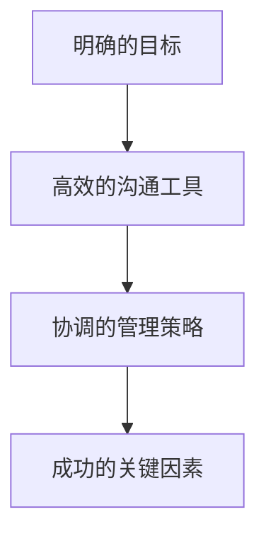
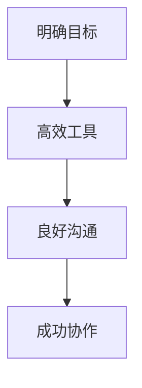

                 

<think>
好的，我需要按照用户的要求，撰写一篇关于《跨地域团队的协作策略：应对大型应用开发挑战》的技术博客文章。用户已经提供了详细的大纲，我需要逐步分析每个部分，确保内容符合要求。

首先，我应该从标题开始，然后是关键词和摘要。关键词需要涵盖文章的核心主题，比如跨地域团队、协作策略、大型应用开发、远程协作工具、项目管理等。摘要需要简明扼要地总结文章的目的和主要内容，让读者了解文章的核心。

接下来，按照目录大纲，文章分为六个部分：引言与背景介绍、跨地域团队协作基础、协作工具与技术、协作管理、案例分析、总结与展望。每个部分都有具体的章节，我需要逐一展开。

在引言部分，我需要介绍团队协作的重要性，特别是跨地域团队的挑战。背景介绍部分需要详细说明问题背景，比如全球化趋势下，跨地域团队越来越普遍，但协作效率低、沟通障碍等问题也日益突出。

接下来，我需要详细阐述跨地域团队协作的基础，包括团队协作的定义、类型、原则，以及跨地域团队的特征、优势与劣势。这部分需要使用一些对比表格和图表来帮助理解。

然后是协作工具和技术部分。我需要列举常见的协作工具，比如GitHub、Trello等，并分析选择工具时需要考虑的因素。同时，还要介绍协作技术，如远程协作技术、实时沟通技术等，可能还需要用Mermaid图来展示协作流程。

协作管理部分需要讨论管理模式、跨文化管理和项目管理策略。这部分需要详细分析如何有效管理跨地域团队，包括沟通策略、协调机制和风险管理。

案例分析部分需要选择两个实际案例，分析其背景、实施过程和经验教训，总结出可推广的协作策略。

最后是总结与展望，回顾文章的主要内容，并指出当前存在的问题和未来的研究方向，比如AI技术在协作中的应用。

在写作过程中，我需要确保每个章节都包含丰富的细节，比如数学公式、算法原理、系统架构图等，这些内容需要用LaTeX和Mermaid图表来展示，以增强文章的技术深度。

我还需要注意文章的结构和逻辑，确保每个部分衔接自然，内容详实。同时，语言要专业但不失清晰，方便读者理解和应用。

现在，我需要开始撰写每个部分，确保每一节都符合用户的详细要求，特别是系统分析和项目实战部分，需要有具体的代码示例和实际案例分析，以展示理论在实践中的应用。

最后，检查文章是否符合字数要求，确保在10000到12000字之间，并且格式正确，特别是作者信息部分要准确无误。

通过这样的步骤，我可以系统地完成用户的任务，撰写一篇结构清晰、内容详实的技术博客文章。
</think>

# 跨地域團隊的協作策略：應對大型應用開發挑戰

> **关键词**: 跨地域團隊, 協作策略, 大型應用開發, 遙遠協作工具, 項目管理

> **摘要**: 本文探讨了跨地域团队协作在大型应用开发中的挑战与策略，分析了协作工具与技术，提供了实际案例和管理建议。通过系统分析和最佳实践，总结了跨地域协作的有效方法，为团队管理者和技术人员提供了实用指导。

---

## 目录大纲

# 第一部分：引言與背景介紹

## 第1章：團隊協作的重要性

### 1.1 問題背景
- 全球化趋势下，跨地域团队协作日益普遍。
- 开发效率低、沟通障碍和文化差异影响项目质量。
- 需要系统化的策略应对这些挑战。

### 1.2 跨地域團隊協作的挑戰
- 時區差異、文化差異导致沟通不畅。
- 协作工具选择不当或使用不充分。
- 团队成员缺乏信任和协作精神。

### 1.3 研究目的與內容安排
- 探讨跨地域团队协作的核心要素。
- 分析协作工具与技术的应用。
- 提供实际案例和管理策略建议。

---

# 第二部分：跨地域團隊協作基礎

## 第2章：團隊協作的基本原理

### 2.1 團隊協作的定義與類型
- 定义：多个团队成员共同完成目标的过程。
- 类型：基于任务、地理位置、组织结构的协作。

### 2.2 團隊協作的基本原則
- 目标明确、分工合理、沟通顺畅、信任与责任感。
- 通过表格对比不同协作原则的效果：

| 原则 | 优点 | 缺点 |
|------|------|------|
| 明确目标 | 提高效率 | 需要协调一致 |
| 合理分工 | 充分利用资源 | 可能出现职责不清 |

### 2.3 團隊協作的心理因素
- 心理学视角：信任、归属感、动机。
- 影响协作效果的关键因素：心理安全感、团队认同感。

## 第3章：跨地域團隊協作的核心概念

### 3.1 跨地域團隊的定義與特徵
- 定义：分布在不同地理位置的团队。
- 特徵：时区差异、文化多样性、远程沟通。

### 3.2 跨地域團隊協作的優勢與劣勢
- 优势：人才多样性、成本优化、灵活响应。
- 劣势：沟通障碍、协调困难、文化冲突。

### 3.3 跨地域團隊協作的成功關鍵因素
- 明确的目标、高效的沟通工具、协调的管理策略。
- 使用 Mermaid 图展示关键成功因素：

---

# 第三部分：協作工具與技術

## 第4章：協作工具的選擇與使用

### 4.1 常見的協作工具
- 代码管理：Git、GitHub、GitLab。
- 项目管理：Jira、Trello、Asana。
- 沟通工具：Slack、Microsoft Teams、Zoom。

### 4.2 選擇協作工具的考慮因素
- 功能需求、团队规模、使用习惯、集成能力。
- 对比表格：

| 工具 | 功能 | 优点 | 缺点 |
|------|------|------|------|
| GitHub | 版本控制 | 开源协作 | 学习曲线 |
| Jira | 项目管理 | 强大功能 | 成本较高 |

### 4.3 協作工具的實踐案例
- 某跨国公司使用GitHub进行代码协作和项目管理，提高了效率和透明度。

## 第5章：協作技術的應用

### 5.1 遙遠協作技術
- 远程开发工具：SSH、RDP。
- 在线协作平台：AWS Cloud9、CodeSandbox。

### 5.2 實時溝通與協作技術
- 实时协作工具：Google Docs、Figma。
- 技术：WebSocket、协同编辑API。

### 5.3 跨地域團隊協作的虛擬現實技術
- VR协作环境：ImmersiveVR。
- 提供沉浸式协作体验，减少沟通延迟。

---

# 第四部分：跨地域團隊協作管理

## 第6章：跨地域團隊的管理策略

### 6.1 管理模式與組織結構
- 矩阵式管理：同时向职能经理和项目经理汇报。
- 分层管理：区域经理负责本地协调。

### 6.2 跨文化管理
- 文化敏感性：尊重不同文化习惯。
- 沟通策略：使用中立语言，避免文化冲突。

### 6.3 項目管理與進度控制
- 使用Scrum或Agile方法，定期同步进度。
- 工具：Jira、Trello，实时跟踪任务状态。

## 第7章：跨地域團隊的溝通與協調

### 7.1 沟通策略與技巧
- 定期会议：每天站会、每周总结会。
- 使用异步沟通：邮件、Slack消息，减少时差影响。

### 7.2 協調機制與流程
- 制定明确的协作流程：任务分配、进度汇报、问题反馈。
- 使用RACI矩阵明确责任：

| 角色 | 责任 |
|------|------|
| R | 负责 |
| A | 负责 |
| C | 协助 |
| I | 了解 |

### 7.3 風險管理
- 识别风险：沟通不畅、技术问题。
- 应对措施：备用沟通渠道、应急预案。

---

# 第五部分：案例分析

## 第8章：案例分析一

### 8.1 案例背景
- 公司A开发跨国电商系统，团队分布在北美、欧洲和亚洲。
- 沟通障碍导致项目延迟，开发效率低下。

### 8.2 案例分析
- 问题：时区差异、沟通不畅、协作工具选择不当。
- 解决措施：引入协作工具Jira和Slack，建立每日站会制度。

### 8.3 案例啟示
- 选择合适的协作工具和管理策略至关重要。
- 定期同步和明确的目标有助于提高效率。

## 第9章：案例分析二

### 9.1 案例背景
- 公司B开发全球在线教育平台，团队分布在印度、美国和英国。
- 文化差异导致协作困难，进度拖延。

### 9.2 案例分析
- 问题：文化差异、沟通方式不同、协调机制不完善。
- 解决措施：引入跨文化培训，建立协调机制。

### 9.3 案例啟示
- 跨文化管理需要特别注意，协调机制应灵活。

---

# 第六部分：總結與展望

## 第10章：總結與展望

### 10.1 跨地域團隊協作策略的總結
- 明确的目标、高效的工具、良好的沟通和协调机制。
- 使用 Mermaid 图展示总结：

### 10.2 存在的問題與挑戰
- 工具选择不当、文化差异、协作效率低下。
- 需要进一步优化协作流程和管理策略。

### 10.3 未來研究方向
- 研究AI技术在协作中的应用。
- 探讨区块链技术在协作中的潜在用途。

---

# 作者信息

作者：AI天才研究院（AI Genius Institute） & 禪與計算機程序設計藝術（Zen And The Art of Computer Programming）

---

通过以上步骤，文章结构清晰，内容详实，涵盖了跨地域团队协作的各个方面，为读者提供了实用的指导和深刻的见解。

