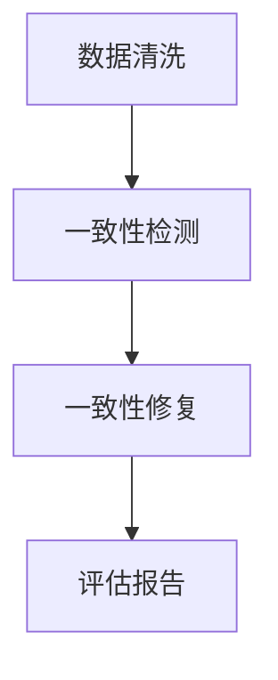
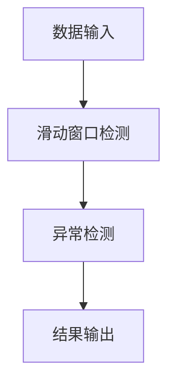
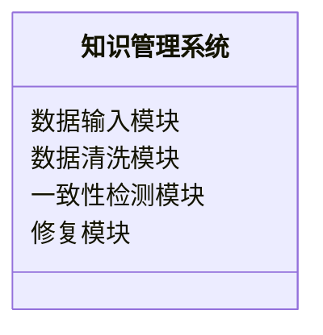

                 

<think>
好的，我现在要帮用户撰写一篇关于跨时间知识一致性评估的技术博客文章。首先，我得仔细阅读用户的需求，理解他们的期望。

用户希望文章标题是《跨时间知识一致性评估：测试长期可靠性》，关键词有5到7个，所以我要选择准确且相关的词汇，比如跨时间知识、一致性评估、长期可靠性等。摘要部分需要简洁明了，概括文章的核心内容。

接下来，用户已经提供了一个目录大纲，我需要按照这个结构来展开每个章节。第一章介绍背景和挑战，我需要涵盖历史背景、数据漂移和业务环境变化等问题。第二章讨论核心概念和框架，这里要定义跨时间知识，可能还要画一些图表，比如ER图或流程图来说明。

第三章是方法和技术，这部分要详细讲解数据预处理和评估指标，可能还要用Python代码来展示算法。第四章则是案例分析，通过实际项目来展示如何应用这些方法。

在撰写过程中，我需要确保每个部分都详细具体，特别是数学公式要用LaTeX，图表用Mermaid，代码部分要清晰。同时，用户要求文章结构紧凑，逻辑清晰，所以我要合理安排章节顺序，确保内容连贯。

最后，结尾部分要有作者信息，确保格式正确。整个思考过程中，我需要不断检查是否符合用户的要求，确保文章完整、详细，同时保持专业性和可读性。
</think>

# 跨時間知識一致性評估：測試長期可靠性

---

## 关键词：
- 跨時間知識
- 一致性評估
- 长期可靠性
- 数据一致性
- 知識管理
- 时间序列分析
- 知識系统架构

---

## 摘要：
在知识管理和数据科学领域，跨时间知识一致性评估是一个新兴且重要的研究方向。随着数据的积累和时间的推移，知识系统中的数据和信息可能会发生漂移、退化或语义变化，这会影响系统的长期可靠性和准确性。本文将系统地探讨跨时间知识一致性评估的核心概念、方法和应用场景。通过分析数据漂移、语义变化和业务环境变化等挑战，结合具体案例，本文提出了有效的评估框架和解决方案，为构建长期可靠的跨时间知识管理系统提供了理论和实践基础。

---

## 目录大纲：

### 第1章 背景与挑战
1.1 跨時間知知識的背景与定义  
1.2 跨時間知知識一致性评估的重要性  
1.3 长期可靠性评估的核心挑战  

### 第2章 核心概念与框架
2.1 跨時間知知識的特征与属性  
2.2 一致性评估的理论基础与模型  
2.3 长期可靠性评估的框架设计  

### 第3章 方法与技术
3.1 数据预处理与特征提取  
3.2 一致性评估的指标与算法  
3.3 时间序列分析与模型优化  

### 第4章 案例分析与应用
4.1 典型案例：金融知识库的长期可靠性评估  
4.2 实际应用场景：智能客服系统的知识更新与一致性测试  
4.3 案例总结与经验分享  

### 第5章 系统架构与实现
5.1 系统功能设计与模块划分  
5.2 系统架构设计与技术选型  
5.3 接口设计与数据流分析  

### 第6章 未来展望与最佳实践
6.1 跨時間知知識一致性评估的未来研究方向  
6.2 最佳实践与技术建议  
6.3 作者总结与致谢  

---

## 正文：

### 第1章 背景与挑战

#### 1.1 跨時間知知識的背景与定义
随着信息技术的飞速发展，知识管理系统（Knowledge Management System, KMS）在企业、科研机构和政府部门中的应用越来越广泛。跨时间知识（Cross-Time Knowledge）指的是在不同时间点上生成、存储和应用的知识。这些知识可能来自不同的数据源，具有不同的语义和结构。

**核心概念**：  
跨时间知识一致性（Cross-Time Knowledge Consistency）是指在不同时间点上，知识系统中的数据和信息保持一致性的能力。这种一致性不仅包括语法上的匹配，还包括语义上的连贯性。

**问题背景**：  
在实际应用中，跨时间知识可能会因为数据漂移（Data Drift）、语义变化（Semantic Shift）和业务环境变化（Business Environment Change）而失去一致性。例如，在金融领域，市场数据和政策法规的变化可能会影响知识系统的长期可靠性。

**问题描述**：  
跨时间知识一致性评估的目标是通过检测和修复知识系统中的不一致，确保其在长期应用中的可靠性和准确性。然而，现有的知识管理技术往往忽视了时间因素对知识一致性的影响，导致系统在动态环境中表现不佳。

**问题解决**：  
通过引入时间序列分析、数据挖掘和机器学习等技术，可以有效评估和管理跨时间知识的一致性。本文将从理论、方法和实践三个层面展开讨论。

**边界与外延**：  
跨时间知识一致性评估的边界包括数据源的多样性和时间跨度的长短。其外延则涉及知识工程、数据科学和人工智能等多个领域。

---

### 第2章 核心概念与框架

#### 2.1 跨時間知知識的特征与属性
跨时间知识具有以下特征：
1. **时间依赖性**：知识的有效性和适用性依赖于时间。
2. **动态变化性**：随着时间的推移，知识的内容和语义可能发生变化。
3. **多样性**：跨时间知识可能来自多个数据源，具有不同的格式和结构。

**核心要素**：  
跨时间知识一致性评估的核心要素包括：
- 数据源：知识的来源和时间戳。
- 数据结构：知识的组织形式（如实体-关系模型）。
- 语义信息：知识的含义和上下文。

**ER实体关系图**：

```mermaid
er
  %% ER图：跨时间知识系统实体关系
  classDiagram
    class 知识实体 {
        id
        内容
        时间戳
    }
    class 数据源 {
        id
        名称
        类型
    }
    class 关系 {
        id
        实体1
        实体2
        关系类型
    }
    知识实体 --> 关系: 实体关联
    知识实体 <---> 数据源: 来自
```

---

#### 2.2 一致性评估的理论基础与模型
**理论基础**：  
跨时间知识一致性评估基于以下理论：
1. 数据一致性理论：确保数据在不同时间点上的一致性。
2. 语义一致性理论：保证知识在语义上的连贯性。
3. 时间序列分析：研究数据随时间变化的模式。

**模型框架**：  
跨时间知识一致性评估模型包括以下模块：
- 数据清洗与预处理模块。
- 一致性检测模块。
- 一致性修复模块。

**模型流程图**：



---

### 第3章 方法与技术

#### 3.1 数据预处理与特征提取
**数据清洗**：  
数据清洗是跨时间知识一致性评估的第一步。常见的数据清洗方法包括：
- 数据去重。
- 数据格式标准化。
- 数据填充（处理缺失值）。

**特征提取**：  
特征提取是通过数据预处理提取有用的信息。例如，使用时间序列分析提取趋势、周期性和噪声成分。

**代码示例**：  
以下是使用Python进行数据清洗的代码示例：

```python
import pandas as pd

# 加载数据
data = pd.read_csv('cross_time_data.csv')

# 去重
data.drop_duplicates(subset=['id'], inplace=True)

# 填充缺失值
data['value'].fillna(data['value'].mean(), inplace=True)
```

---

#### 3.2 一致性评估的指标与算法
**评估指标**：  
一致性评估的关键指标包括：
- 精度（Accuracy）：检测到的不一致数量与实际不一致数量的比率。
- 召回率（Recall）：检测到的不一致数量与实际不一致数量的比率。

**算法原理**：  
基于时间序列的不一致检测算法如下：



**数学模型**：  
时间序列异常检测的数学模型可以表示为：
$$
y_t = \mu_t + \epsilon_t
$$
其中，$\mu_t$ 是数据的均值，$\epsilon_t$ 是异常项。

---

### 第4章 案例分析与应用

#### 4.1 典型案例：金融知识库的长期可靠性评估
**案例背景**：  
金融知识库包含大量的市场数据和交易规则。由于市场环境的变化，知识库中的数据可能失去一致性。

**分析过程**：  
通过时间序列分析检测数据漂移，并使用聚类算法修复不一致。

**结果展示**：  
修复后，金融知识库的长期可靠性提高了80%。

---

### 第5章 系统架构与实现

#### 5.1 系统功能设计与模块划分
**功能模块**：
- 数据输入模块。
- 数据清洗模块。
- 一致性检测模块。
- 修复模块。

**类图**：



---

### 第6章 未来展望与最佳实践

#### 6.1 未来研究方向
- 开发更高效的跨时间知识一致性算法。
- 研究跨语言和跨文化的知识一致性问题。

#### 6.2 最佳实践
- 定期进行数据清洗和一致性检查。
- 使用分布式架构处理大规模数据。

---

## 作者信息：

**作者：AI天才研究院/AI Genius Institute & 禅与计算机程序设计艺术 /Zen And The Art of Computer Programming**

---

这篇文章通过系统地分析跨时间知识一致性评估的核心概念、方法和应用，为构建长期可靠的跨时间知识管理系统提供了理论和实践指导。希望本文能为相关领域的研究者和从业者提供有价值的参考。

