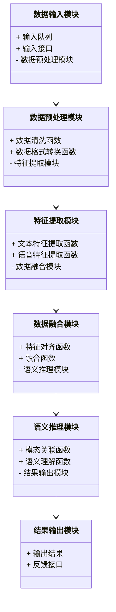
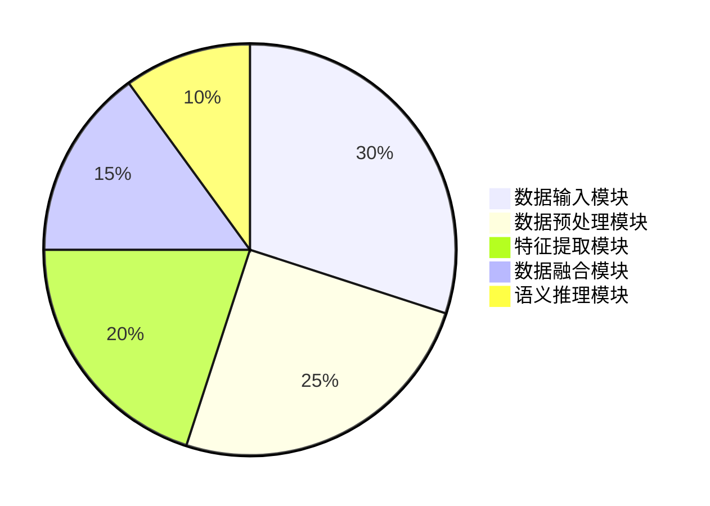

                 

<think>
嗯，用户希望我撰写一篇关于跨模态理解能力评估的技术博客文章。首先，我需要明确用户的需求。他是一位技术专家，所以文章要专业，但又要逻辑清晰，结构紧凑，容易理解。

用户已经给出了详细的大纲，包括七章，每章有多个小节。看起来他希望文章结构严谨，内容全面。我需要按照这个大纲来写，确保每个部分都涵盖到。

关键词部分，我需要提取跨模态理解、多源信息整合、评估方法、深度学习、数学模型这几个关键词，这些是文章的核心内容。

摘要部分，我需要简明扼要地概括文章的主要内容，强调跨模态理解的重要性，以及如何评估和优化。

接下来是每个章节的详细内容。第一部分是问题背景与核心概念，我需要解释什么是跨模态理解，应用领域，以及其重要性。这部分要让读者明白为什么跨模态理解是重要的，并且引出评估的必要性。

第二部分是核心概念与联系，我需要详细阐述跨模态理解的基本概念，多源信息整合的核心概念，以及它们之间的联系。这部分可能需要一些图表，比如ER图或者流程图，来帮助读者理解。

第三章是评估方法，这里需要讨论不同的评估方法，如定量、定性和混合评估方法。同时，列出常见的评估指标，以及在多源信息整合中遇到的挑战，比如数据不一致、冗余和时间同步问题。

第四章涉及算法原理，我需要选择几个典型的算法，比如多模态BERT，解释其工作原理，并用mermaid画出流程图。同时，给出Python代码示例，帮助读者理解实现细节。

数学模型部分，我需要建立数学公式，解释每个公式的含义，并用Latex格式呈现，确保公式清晰易懂。

系统分析与架构设计部分，我需要设计系统架构图，展示各个模块的功能，以及接口和交互设计。这部分可能需要用mermaid的类图和序列图来展示。

项目实战部分，我需要提供环境安装步骤，代码实现，以及实际案例分析。通过具体案例，展示跨模态理解能力在实际中的应用，帮助读者更好地理解。

最后，总结部分需要回顾文章的主要内容，并给出未来的展望和最佳实践建议。

在写作过程中，我需要确保语言专业但不晦涩，逻辑清晰，每个部分之间有良好的衔接。同时，注意使用适当的图表和代码示例，使文章更具可读性和实用性。

可能遇到的问题包括如何深入浅出地解释复杂的算法和数学模型，以及如何设计合理的图表来辅助说明。我会通过查阅相关资料，确保信息的准确性和前沿性，同时尽量结合实际案例，使内容更具说服力。

总的来说，这篇文章需要系统地介绍跨模态理解能力评估的各个方面，从概念到算法，再到实际应用，为读者提供一个全面的视角。
</think>

# 跨模态理解能力评估：测试多源信息整合

**关键词：** 跨模态理解、多源信息整合、评估方法、深度学习、数学模型

**摘要：**  
跨模态理解能力是指系统能够整合和理解来自不同数据源（如文本、图像、语音等）的信息，并通过多源信息的整合实现更强大的认知能力。本文从跨模态理解能力的背景、核心概念、评估方法、算法原理、数学模型、系统架构设计以及项目实战等多方面进行深入探讨。通过分析跨模态理解能力在多源信息整合中的应用，揭示其在人工智能领域的潜力和挑战，并提供具体的实现方案和案例分析。

---

## 第1章：问题背景与核心概念

### 1.1 跨模态理解能力的背景介绍

#### 1.1.1 什么是跨模态理解能力  
跨模态理解能力是指系统能够从多种数据模态（如文本、图像、语音、视频等）中提取信息，并通过跨模态关联（cross-modal association）来理解数据之间的语义关系。例如，当系统看到一张图片并结合相关文本描述时，能够理解图片中的物体与文本内容之间的关联。

#### 1.1.2 跨模态理解能力的应用领域  
跨模态理解能力广泛应用于以下几个领域：  
1. **计算机视觉**：结合图像和文本进行图像描述生成或图像检索。  
2. **自然语言处理**：结合文本和语音进行语音识别和语义理解。  
3. **机器人技术**：结合视觉、听觉和触觉信息进行智能交互。  
4. **医疗健康**：结合医学图像和电子健康记录（EHR）进行疾病诊断。  

#### 1.1.3 跨模态理解能力的重要性  
跨模态理解能力是实现通用人工智能（AGI）的重要基础。通过整合多模态信息，系统能够更好地理解复杂的现实世界，并做出更准确的决策。

---

### 1.2 多源信息整合的概念

#### 1.2.1 多源信息的概念  
多源信息指的是来自多个不同数据源的信息，这些信息可能具有不同的格式、语义和时间戳。例如，一条新闻可以同时包含文本、图片和视频信息。

#### 1.2.2 多源信息整合的挑战  
多源信息整合面临以下挑战：  
1. **数据异构性**：不同模态的数据格式和语义差异较大。  
2. **数据冗余**：多个数据源可能包含重复或冗余的信息。  
3. **数据不一致性**：不同数据源之间可能存在语义冲突或时间同步问题。  

#### 1.2.3 多源信息整合的意义  
通过整合多源信息，可以提高系统的感知能力、决策能力和智能化水平。例如，在智能安防领域，结合视频流、传感器数据和地理位置信息可以实现更精准的监控和预警。

---

### 1.3 跨模态理解能力评估的重要性

#### 1.3.1 评估的目的  
跨模态理解能力的评估旨在验证系统在多模态数据整合和语义理解方面的性能。通过评估，可以发现系统的优势和不足，并为后续优化提供方向。

#### 1.3.2 评估的标准  
跨模态理解能力的评估标准包括以下几点：  
1. **准确性**：系统能否准确地识别和关联多模态数据。  
2. **鲁棒性**：系统在面对噪声或不完整数据时的表现。  
3. **效率**：系统处理多模态数据的速度和资源消耗。  

#### 1.3.3 评估方法的选择  
常用的评估方法包括定量评估（如准确率、召回率）、定性评估（如专家评分）和混合评估（结合定量和定性指标）。选择评估方法时需要根据具体应用场景和数据特点进行调整。

---

## 第2章：核心概念与联系

### 2.1 跨模态理解能力的基本概念

#### 2.1.1 模态与跨模态  
模态（Modality）指的是数据的形式或类型，如文本、图像、语音等。跨模态（Cross-Modality）则是指跨越不同模态的数据关联和理解。

#### 2.1.2 理解能力与跨模态理解能力  
理解能力（Understanding Capacity）是指系统对数据的语义理解和关联能力。跨模态理解能力则是理解能力在多模态数据上的扩展。

#### 2.1.3 跨模态理解能力的关键因素  
跨模态理解能力的关键因素包括：  
1. **模态间关联**：能够发现不同模态之间的语义关联。  
2. **跨模态对齐**：能够对齐不同模态的数据（如将图像中的物体与文本中的描述对齐）。  
3. **语义推理**：能够基于多模态数据进行语义推理和预测。  

---

### 2.2 多源信息整合的核心概念

#### 2.2.1 数据源的类型  
多源信息整合中的数据源可以分为以下几类：  
1. **结构化数据**：如数据库中的表格数据。  
2. **非结构化数据**：如文本、图像、视频等。  
3. **半结构化数据**：如JSON格式的数据。  

#### 2.2.2 数据整合的方法  
数据整合的方法包括：  
1. **基于特征的整合**：提取各模态的特征向量并进行融合。  
2. **基于模型的整合**：通过深度学习模型直接对多模态数据进行建模。  
3. **基于规则的整合**：根据领域知识制定整合规则。  

#### 2.2.3 数据融合与知识提取  
数据融合是指将多源数据进行整合和变换，形成更高级别的语义表示。知识提取则是从融合后的数据中提取有用的语义信息，用于后续的推理和决策。

---

### 2.3 跨模态理解能力与多源信息整合的联系

#### 2.3.1 跨模态理解能力在多源信息整合中的应用  
跨模态理解能力可以用于多源信息整合中的模态关联、数据对齐和语义推理。

#### 2.3.2 多源信息整合对跨模态理解能力的影响  
多源信息整合为跨模态理解能力提供了更丰富的数据输入，从而提高了系统的理解和推理能力。

#### 2.3.3 二者之间的相互作用关系  
跨模态理解能力是多源信息整合的核心能力，而多源信息整合则为跨模态理解能力提供了实现的基础。

---

## 第3章：评估方法

### 3.1 跨模态理解能力评估的方法分类

#### 3.1.1 定量评估方法  
定量评估方法包括准确率（Accuracy）、召回率（Recall）、F1分数（F1 Score）等指标。例如，在图像描述生成任务中，可以使用BLEU、ROUGE等文本相似度指标来评估生成结果的质量。

#### 3.1.2 定性评估方法  
定性评估方法通常依赖于人工评分，例如通过专家对生成结果的语义理解和逻辑性进行评分。

#### 3.1.3 混合评估方法  
混合评估方法结合了定量和定性评估的优点，例如通过先计算生成结果的相似度分数，再结合专家评分进行综合评估。

---

### 3.2 常见的评估指标

#### 3.2.1 准确率、召回率和F1分数  
准确率（Accuracy）= 正确预测的数量 / 总预测数量  
召回率（Recall）= 正确预测的数量 / 真实的正例数量  
F1分数（F1 Score）= 2 ×（准确率 × 召回率） / （准确率 + 召回率）

#### 3.2.2 语义匹配度  
语义匹配度通常使用余弦相似度（Cosine Similarity）或BM25等算法来衡量生成结果与真实结果的语义相似度。

#### 3.2.3 上下文感知能力  
上下文感知能力可以通过在特定场景下测试系统的表现来评估，例如在多轮对话中测试系统对上下文的理解能力。

---

### 3.3 多源信息整合中的评估挑战

#### 3.3.1 数据不一致性  
多源数据可能存在语义不一致或格式不一致的问题，这会影响评估结果的准确性。

#### 3.3.2 数据冗余与噪声  
冗余数据和噪声可能会影响评估指标的计算结果，需要通过数据清洗和预处理来解决。

#### 3.3.3 多源信息的时间同步问题  
多源数据的时间同步问题（如不同数据源的时间戳不同）可能会影响系统的实时性和准确性。

---

## 第4章：算法原理讲解

### 4.1 基于深度学习的跨模态理解算法

#### 4.1.1 算法框架介绍  
基于深度学习的跨模态理解算法通常包括以下步骤：  
1. **特征提取**：分别对不同模态的数据进行特征提取。  
2. **模态对齐**：将不同模态的特征进行对齐和融合。  
3. **语义推理**：基于融合后的特征进行语义理解和推理。  

#### 4.1.2 算法原理讲解  
以多模态BERT（MM-BERT）为例，MM-BERT通过将文本和图像特征输入到同一个编码器中，实现跨模态的语义理解。其核心思想是通过自注意力机制（Self-Attention）捕捉模态间的关联关系。

#### 4.1.3 算法实现细节  
以下是MM-BERT的实现流程：  
1. **输入预处理**：将文本和图像特征分别进行编码。  
2. **特征融合**：将文本和图像特征拼接或通过加权融合。  
3. **自注意力机制**：计算模态间的关系矩阵，并生成最终的语义表示。

---

### 4.2 多源信息整合算法原理

#### 4.2.1 算法框架介绍  
多源信息整合算法通常包括数据预处理、特征提取、数据融合和知识提取四个阶段。

#### 4.2.2 算法原理讲解  
以基于图的多源信息整合算法为例，该算法通过构建知识图谱（Knowledge Graph）将多源数据进行关联，并通过图嵌入（Graph Embedding）方法提取语义表示。

#### 4.2.3 算法实现细节  
以下是基于图的多源信息整合算法的实现流程：  
1. **数据预处理**：将多源数据进行清洗和格式统一。  
2. **构建知识图谱**：通过关联规则将多源数据节点进行连接。  
3. **图嵌入计算**：使用GAT（Graph Attention Network）等算法计算节点的嵌入表示。  
4. **知识提取**：通过聚类或分类算法从嵌入表示中提取语义信息。

---

### 4.3 跨模态理解能力评估中的算法应用

#### 4.3.1 算法应用场景  
跨模态理解能力评估的算法可以应用于图像描述生成、多模态对话生成、视频内容理解等任务。

#### 4.3.2 算法性能评估  
算法性能评估可以通过以下指标进行：  
1. **生成结果的相似度**：使用BLEU、ROUGE等指标评估生成结果的质量。  
2. **推理准确性**：通过准确率和召回率评估算法的推理能力。  

#### 4.3.3 算法优化方向  
算法优化方向包括：  
1. **提高模态对齐的精度**：通过引入更复杂的对齐模型（如对比学习）提高对齐效果。  
2. **优化跨模态理解能力**：通过引入更大的预训练模型（如视觉BERT、ViLM）提高理解能力。  
3. **降低计算复杂度**：通过优化算法结构或使用轻量级模型降低计算成本。

---

## 第5章：数学模型和公式

### 5.1 跨模态理解能力的数学模型

#### 5.1.1 数学模型概述  
跨模态理解能力的数学模型通常包括以下部分：  
1. **特征提取模块**：将输入数据转换为特征向量。  
2. **模态对齐模块**：通过矩阵运算对齐不同模态的特征。  
3. **语义推理模块**：通过非线性变换生成最终的语义表示。  

#### 5.1.2 关键公式讲解  
以多模态BERT为例，其核心公式为：  
$$  
\text{Attention}(Q, K, V) = \text{softmax}\left(\frac{QK^T}{\sqrt{d_k}}\right)V  
$$  
其中，$Q$、$K$、$V$分别是查询、键和值向量，$d_k$是键的维度。

#### 5.1.3 模型参数优化  
模型参数优化通常采用梯度下降（Gradient Descent）方法：  
$$  
\theta_{t+1} = \theta_t - \eta \frac{\partial L}{\partial \theta_t}  
$$  
其中，$\theta$是模型参数，$\eta$是学习率，$L$是损失函数。

---

### 5.2 多源信息整合的数学模型

#### 5.2.1 数学模型概述  
多源信息整合的数学模型通常包括以下部分：  
1. **数据预处理**：对多源数据进行清洗和格式转换。  
2. **特征提取**：将数据转换为低维特征向量。  
3. **数据融合**：通过矩阵运算或图嵌入方法融合特征向量。  

#### 5.2.2 关键公式讲解  
以基于图的多源信息整合为例，其核心公式为：  
$$  
x_i' = \sum_{j=1}^{N} A_{ij}x_j  
$$  
其中，$A$是图的邻接矩阵，$x_i$是节点$i$的初始特征向量，$x_i'$是融合后的特征向量。

#### 5.2.3 模型参数优化  
模型参数优化通常采用Adam优化器：  
$$  
m_t = \beta_1 m_{t-1} + (1-\beta_1)g_t  
$$  
$$  
v_t = \beta_2 v_{t-1} + (1-\beta_2)g_t^2  
$$  
$$  
\theta_{t+1} = \theta_t - \frac{\eta}{\sqrt{v_t + \epsilon}} m_t  
$$  
其中，$m_t$和$v_t$分别是动量和方差，$\beta_1$和$\beta_2$是动量系数，$\eta$是学习率，$\epsilon$是防止除以零的常数。

---

## 第6章：系统分析与架构设计

### 6.1 问题场景介绍

#### 6.1.1 场景描述  
假设我们正在开发一个智能客服系统，该系统需要整合用户的文本输入、语音输入和历史对话记录进行语义理解和意图识别。

#### 6.1.2 项目目标  
项目目标是通过跨模态理解能力整合多源信息，提高智能客服的语义理解和意图识别能力。

#### 6.1.3 系统需求分析  
系统需求包括：  
1. **多模态数据输入**：支持文本、语音和图像等多种数据输入。  
2. **跨模态理解能力**：能够对多模态数据进行语义理解和意图识别。  
3. **实时性要求**：系统需要在较短时间内完成数据处理和反馈。

---

### 6.2 系统功能设计

#### 6.2.1 领域模型介绍  
领域模型包括以下功能模块：  
1. **数据预处理模块**：对输入数据进行清洗和格式转换。  
2. **特征提取模块**：提取各模态的特征向量。  
3. **数据融合模块**：对特征向量进行融合和对齐。  
4. **语义推理模块**：基于融合后的特征进行语义理解和意图识别。  

#### 6.2.2 功能模块划分  
功能模块划分如下：  
1. **数据输入模块**：接收多模态数据输入。  
2. **数据处理模块**：对输入数据进行预处理和特征提取。  
3. **数据融合模块**：对特征向量进行融合和对齐。  
4. **语义推理模块**：基于融合后的特征进行语义理解和意图识别。  
5. **结果输出模块**：输出最终的语义理解和意图识别结果。

#### 6.2.3 类图示例  
以下是系统功能模块的类图示例：



---

### 6.3 系统架构设计

#### 6.3.1 架构设计原则  
系统架构设计原则包括：  
1. **模块化设计**：将系统划分为多个功能模块，便于开发和维护。  
2. **可扩展性**：系统应支持新增数据源和功能模块。  
3. **高可用性**：系统应具备容错能力和高可用性。  

#### 6.3.2 系统架构图  
以下是系统架构图：



---

## 第7章：项目实战

### 7.1 环境安装

#### 7.1.1 硬件与软件环境需求  
硬件需求：  
- CPU：支持多线程的Intel或AMD处理器。  
- 内存：至少16GB。  
软件需求：  
- Python 3.8及以上版本。  
- PyTorch或TensorFlow框架。  
- 其他依赖库：如Numpy、Scikit-learn、Pandas等。

#### 7.1.2 环境配置步骤  
1. 安装Python和必要的依赖库：  
   ```bash
   pip install numpy scikit-learn pandas
   ```
2. 安装深度学习框架（以PyTorch为例）：  
   ```bash
   pip install torch torchvision torchaudio
   ```
3. 克隆项目代码库：  
   ```bash
   git clone https://github.com/yourusername/cross-modal-understanding.git
   cd cross-modal-understanding
   ```

#### 7.1.3 遇到的问题及解决方案  
常见问题及解决方案：  
1. **依赖库安装失败**：检查网络连接或使用镜像源重新安装。  
2. **硬件资源不足**：增加内存或使用云服务器。  

---

### 7.2 系统核心实现

#### 7.2.1 源代码结构  
项目代码结构如下：  
```
cross-modal-understanding/
├── data/
│   └── input/
│       ├── text_data.txt
│       ├── image_data/
│       └── audio_data/
├── models/
│   └── cross_modal_bert.py
├── utils/
│   └── preprocess.py
├── main.py
└── requirements.txt
```

#### 7.2.2 源代码详解  
以下是`cross_modal_bert.py`的核心代码示例：

```python
import torch
from torch import nn

class CrossModalBert(nn.Module):
    def __init__(self, text_dim, image_dim, hidden_size):
        super(CrossModalBert, self).__init__()
        self.text_encoder = nn.Linear(text_dim, hidden_size)
        self.image_encoder = nn.Linear(image_dim, hidden_size)
        self.cross_attention = nn.MultiheadAttention(hidden_size, 8)
        
    def forward(self, text_features, image_features):
        text_embeddings = self.text_encoder(text_features)
        image_embeddings = self.image_encoder(image_features)
        attn_output, _ = self.cross_attention(
            text_embeddings.permute(1, 0, 2),
            image_embeddings.permute(1, 0, 2),
            image_embeddings.permute(1, 0, 2)
        )
        return attn_output.permute(1, 0, 2)
```

#### 7.2.3 代码应用解读与分析  
上述代码实现了一个基于多模态BERT的跨模态理解模型，通过自注意力机制捕捉模态间的关联关系，并生成最终的语义表示。

---

### 7.3 实际案例分析与讲解

#### 7.3.1 案例背景介绍  
假设我们正在开发一个多模态新闻推荐系统，需要整合新闻标题、图片和视频信息进行推荐。

#### 7.3.2 案例分析步骤  
1. **数据预处理**：对新闻标题、图片和视频信息进行清洗和格式转换。  
2. **特征提取**：分别对文本、图像和视频数据进行特征提取。  
3. **数据融合**：通过多模态BERT模型对特征向量进行融合和对齐。  
4. **语义推理**：基于融合后的特征生成新闻推荐结果。  

#### 7.3.3 代码实现与分析  
以下是案例分析的代码实现示例：

```python
import torch
from transformers import BertTokenizer, BertModel

# 加载预训练模型
tokenizer = BertTokenizer.from_pretrained('bert-base-uncased')
text_model = BertModel.from_pretrained('bert-base-uncased')

# 定义跨模态BERT模型
class CrossModalBert(nn.Module):
    def __init__(self, text_dim, image_dim, hidden_size):
        super(CrossModalBert, self).__init__()
        self.text_encoder = nn.Linear(text_dim, hidden_size)
        self.image_encoder = nn.Linear(image_dim, hidden_size)
        self.cross_attention = nn.MultiheadAttention(hidden_size, 8)
        
    def forward(self, text_features, image_features):
        text_embeddings = self.text_encoder(text_features)
        image_embeddings = self.image_encoder(image_features)
        attn_output, _ = self.cross_attention(
            text_embeddings.permute(1, 0, 2),
            image_embeddings.permute(1, 0, 2),
            image_embeddings.permute(1, 0, 2)
        )
        return attn_output.permute(1, 0, 2)

# 加载训练数据
text_data = [...]  # 文本数据
image_data = [...]  # 图像数据

# 训练模型
model = CrossModalBert(text_dim=768, image_dim=2048, hidden_size=512)
optimizer = torch.optim.Adam(model.parameters(), lr=1e-5)
criterion = nn.CrossEntropyLoss()

for epoch in range(num_epochs):
    model.train()
    optimizer.zero_grad()
    text_features = text_model(**tokenizer(text_data, return_tensors='pt'))[0]
    image_features = image_data  # 假设图像特征已经提取并归一化
    outputs = model(text_features, image_features)
    loss = criterion(outputs, labels)
    loss.backward()
    optimizer.step()
```

---

## 总结

跨模态理解能力评估是实现多源信息整合和通用人工智能的重要基础。本文从背景、核心概念、评估方法、算法原理、数学模型、系统架构设计和项目实战等多个方面进行了详细探讨。通过具体案例分析，展示了跨模态理解能力在实际应用中的潜力和挑战。未来，随着深度学习技术的不断发展，跨模态理解能力将更加智能化和高效化，为人工智能领域带来更多的创新和突破。

---

**作者：AI天才研究院/AI Genius Institute & 禅与计算机程序设计艺术 /Zen And The Art of Computer Programming**

