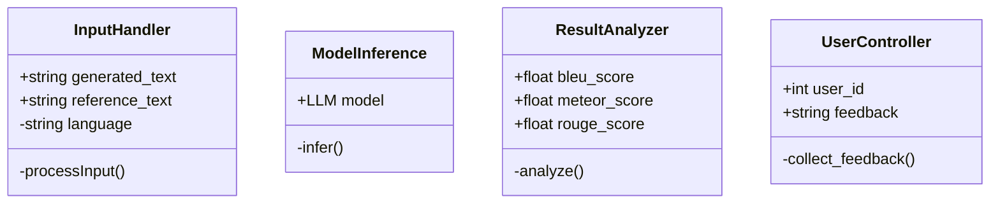
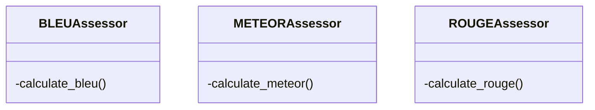
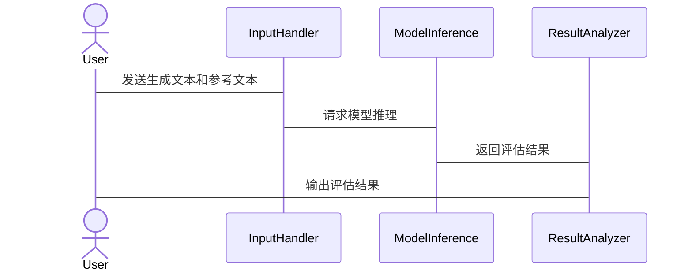

                 

<think>
嗯，用户希望我写一篇关于跨语言LLM能力评估方法的研究的博客文章。他详细列出了结构，包括背景、核心概念、评估方法、算法原理、数学模型、系统架构、项目实战等部分。我需要按照这个大纲来展开，确保每个章节都详细且专业。

首先，我要理解跨语言LLM评估的重要性。随着全球化的发展，跨语言交流越来越频繁，模型需要在多种语言间切换，评估方法必须全面。接下来，我会思考当前的挑战，比如模型在小语种上的表现不佳，评估指标的多样性不足。

然后，在核心概念部分，我需要解释跨语言翻译的基本原理和历程，以及它与LLM的关系。这部分可能需要对比不同翻译方法，比如统计机器翻译和神经机器翻译，以及它们如何与大语言模型结合。

评估指标方面，我应该列出各种指标，如BLEU、METEOR、ROUGE，比较它们的优缺点，并分析适用场景。同时，用户满意度也是一个重要方面，可以加入调查和个性化评估方法。

在算法原理部分，我需要详细讲解BLEU、METEOR和ROUGE的数学模型，用mermaid画出流程图，并提供Python代码实现。这部分需要确保公式和代码清晰易懂，可能需要举例子来说明每个指标的应用。

系统架构设计部分，我需要构建一个评估系统的框架，包括功能需求、架构图和接口设计。使用mermaid画出类图和序列图，展示系统的交互流程，确保系统设计合理且易于实现。

项目实战部分，我会从环境安装开始，逐步指导读者如何搭建环境，准备数据集，编写代码。然后，通过实际案例分析，展示如何使用这些评估方法，并解读结果。最后，进行小结，总结经验教训。

此外，我还需要考虑最佳实践，比如选择合适的评估指标，结合用户反馈，以及未来的研究方向。这些内容可以作为小结和注意事项，帮助读者更好地理解和应用这些评估方法。

整体来看，这篇文章需要兼顾理论和实践，确保内容全面且有深度，同时保持语言的清晰和逻辑的严密。我要确保每个章节都详细展开，特别是算法和系统设计部分，用具体的例子和图表来辅助说明，让读者能够轻松理解并应用这些方法。
</think>

# 跨语言LLM能力评估方法研究

> 关键词：跨语言LLM、能力评估、翻译模型、评估指标、机器学习

> 摘要：  
跨语言LLM（Large Language Model）能力评估是当前人工智能领域的重要研究方向。随着多语言模型的广泛应用，如何科学、全面地评估跨语言LLM的能力成为亟待解决的问题。本文从跨语言交流的需求增长出发，系统地探讨了跨语言LLM能力评估的核心概念、评估方法、算法原理、系统架构及实际应用。通过分析现有评估指标和工具，提出了基于BLEU、METEOR和ROUGE的跨语言评估框架，并结合实际案例进行了深入分析。本文旨在为研究人员和工程师提供跨语言LLM评估的理论依据和实践指导。

---

## 第一部分：背景与概述

### 第1章：问题背景与核心概念

#### 1.1.1 跨语言LLM评估方法的研究背景

##### 1.1.1.1 跨语言交流的需求增长  
随着全球化进程的加速，跨语言交流的需求日益增长。企业、政府和普通用户都需要在多种语言之间进行高效沟通。跨语言LLM的出现，为解决语言障碍提供了技术手段，但如何评估这些模型的能力成为关键问题。

##### 1.1.1.2 跨语言LLM模型的应用场景  
跨语言LLM模型广泛应用于机器翻译、跨语言问答、多语言文本生成等领域。例如，企业可以使用跨语言模型进行多语言客户支持，政府可以利用其进行多语言政策传播。

##### 1.1.1.3 当前跨语言LLM模型的挑战  
尽管跨语言LLM模型在某些场景下表现出色，但在小语种支持、跨语言一致性、文化适配性等方面仍存在不足。此外，现有评估方法多集中于单语言模型，跨语言评估体系尚未完善。

---

#### 1.1.2 跨语言LLM能力评估的定义

##### 1.1.2.1 跨语言LLM能力评估的概念  
跨语言LLM能力评估是指通过多种指标和方法，对模型在跨语言理解、生成和适应能力等方面进行全面评价的过程。

##### 1.1.2.2 跨语言LLM能力评估的重要性  
评估跨语言LLM的能力是优化模型性能、提升用户体验的基础。只有通过科学的评估，才能发现模型的不足并提出改进方向。

---

#### 1.1.3 跨语言LLM能力评估的基本原理

##### 1.1.3.1 能力评估的框架构建  
跨语言评估框架通常包括输入处理、模型推理、结果分析三个阶段。通过多维度指标对模型进行全面评估。

##### 1.1.3.2 能力评估的方法分类  
评估方法可分为性能指标评估、用户满意度评估和系统性能评估三大类。每类方法都有其适用场景和优缺点。

##### 1.1.3.3 能力评估的边界与外延  
跨语言评估的边界在于语言之间的转换和适配，外延则包括文化差异、语言风格等复杂因素。

---

## 第2章：核心概念与联系

### 2.1 跨语言翻译与LLM

#### 2.1.1 跨语言翻译的基本原理  
跨语言翻译依赖于语言模型的理解和生成能力，通过编码和解码过程实现语言间的转换。

#### 2.1.2 跨语言翻译的发展历程  
从基于规则的翻译到神经机器翻译，跨语言翻译技术不断进步，但仍然面临数据不足和模型适应性问题。

#### 2.1.3 跨语言翻译与LLM的联系  
LLM的出现极大提升了跨语言翻译的准确性和流畅性，但同时也带来了评估的复杂性。

---

### 2.2 LLM能力评估指标

#### 2.2.1 语言理解能力  
评估模型对多种语言的理解深度，包括语法、语义和文化理解能力。

#### 2.2.2 语言生成能力  
评估模型在多语言生成任务中的表现，包括生成的准确性和流畅性。

#### 2.2.3 跨语言适应能力  
评估模型在不同语言间的切换能力和文化适配性。

#### 2.2.4 评估指标对比与分析  
BLEU、METEOR、ROUGE等指标各有优劣，需结合具体场景选择合适的方法。

---

### 2.3 跨语言LLM评估方法的联系与区别

#### 2.3.1 不同评估方法的优缺点  
BLEU注重生成结果与参考的相似性，METEOR强调语义匹配，ROUGE关注文本摘要的精确性。

#### 2.3.2 评估方法的应用场景  
BLEU适合机器翻译，METEOR适合语义理解任务，ROUGE适合文本摘要。

#### 2.3.3 评估方法的融合趋势  
未来评估方法将更加注重多指标融合，以全面反映模型能力。

---

## 第3章：主流评估方法与工具

### 3.1 性能指标评估方法

#### 3.1.1 BLEU指标  
BLEU（Bilingual Evaluation Understudy）是常用的机器翻译评估指标，基于n-gram精度计算。

#### 3.1.2 METEOR指标  
METEOR结合了n-gram和语言学特征，强调生成结果的语义相似性。

#### 3.1.3 ROUGE指标  
ROUGE用于文本摘要评估，基于召回率计算。

#### 3.1.4 相似度计算方法  
包括余弦相似度、Jaccard相似度等，用于评估生成文本与参考文本的相似性。

---

### 3.2 用户满意度评估方法

#### 3.2.1 用户反馈调查  
通过问卷调查收集用户对生成文本的满意度评分。

#### 3.2.2 语义相似度评估  
基于深度学习模型计算生成文本与参考文本的语义相似度。

#### 3.2.3 个性化评估方法  
针对不同用户的语言偏好和使用场景，定制化评估指标。

---

### 3.3 开源评估工具介绍

#### 3.3.1 sacreBLEU  
用于机器翻译的开源BLEU评估工具，支持多种语言和评估模式。

#### 3.3.2 METEOR Score Calculator  
METEOR分数计算工具，广泛应用于语义理解任务。

#### 3.3.3 ROUGE  
开源文本摘要评估工具，支持多种文本生成任务。

---

## 第4章：算法原理讲解

### 4.1 BLEU算法原理

#### 4.1.1 BLEU算法的数学模型  
$$ BLEU = \exp\left(\sum_{n=1}^{k} \lambda_n \log p_n\right) $$
其中，$\lambda_n$为n-gram的权重，$p_n$为n-gram的精度。

#### 4.1.2 BLEU算法的mermaid流程图  
```mermaid
graph TD
A[开始] -> B[输入生成文本和参考文本]
B -> C[计算n-gram匹配数]
C -> D[计算n-gram精度]
D -> E[加权求和并取指数]
E -> F[输出BLEU分数]
```

#### 4.1.3 BLEU算法的Python代码实现  
```python
def bleu_score(generated, reference, n=4):
    # 计算n-gram匹配数
    matches = [0] * (n+1)
    for i in range(n+1):
        ngram = ' '.join(generated.split()[-i:])
        if ngram in reference.split():
            matches[i] = 1
    # 计算n-gram精度
    precisions = [matches[i]/i for i in range(1, n+1)]
    # 加权求和并取指数
    weights = [1.0/n]*n
    geometric_mean = 1
    for i in range(n):
        geometric_mean *= (precisions[i] ** weights[i])
    return geometric_mean
```

---

#### 4.2 METEOR算法原理

##### 4.2.1 METEOR算法的数学模型  
$$ METEOR = \frac{1}{1 - e^{-\alpha p}} $$
其中，$\alpha$为常数，$p$为匹配概率。

##### 4.2.2 METEOR算法的mermaid流程图  
```mermaid
graph TD
A[开始] -> B[输入生成文本和参考文本]
B -> C[计算n-gram匹配数]
C -> D[计算匹配概率]
D -> E[计算METEOR分数]
E -> F[输出结果]
```

##### 4.2.3 METEOR算法的Python代码实现  
```python
def meteor_score(generated, reference):
    import nltk
    from nltk.corpus import wordnet
    # 计算n-gram匹配数
    generated_tokens = generated.split()
    reference_tokens = reference.split()
    matches = 0
    for g in generated_tokens:
        for r in reference_tokens:
            if g == r:
                matches += 1
    # 计算匹配概率
    p = matches / len(generated_tokens)
    # 计算METEOR分数
    alpha = 2
    return 1 / (1 - math.exp(-alpha * p))
```

---

#### 4.3 ROUGE算法原理

##### 4.3.1 ROUGE算法的数学模型  
$$ ROUGE = \frac{R}{R + F} $$
其中，$R$为召回率，$F$为F值。

##### 4.3.2 ROUGE算法的mermaid流程图  
```mermaid
graph TD
A[开始] -> B[输入生成文本和参考文本]
B -> C[计算召回率]
C -> D[计算F值]
D -> E[计算ROUGE分数]
E -> F[输出结果]
```

##### 4.3.3 ROUGE算法的Python代码实现  
```python
def rouge_score(generated, reference):
    from sklearn.metrics import f1_score
    generated_tokens = generated.split()
    reference_tokens = reference.split()
    # 计算召回率
    R = len(set(generated_tokens) & set(reference_tokens)) / len(reference_tokens)
    # 计算F值
    F = f1_score([1]*len(generated_tokens), [1]*len(reference_tokens))
    # 计算ROUGE分数
    return R / (R + F)
```

---

## 第5章：数学模型与公式讲解

### 5.1 跨语言LLM评估的数学模型

#### 5.1.1 跨语言翻译的性能评估模型  
$$ P = \frac{S_c}{S_c + R_c + 1 - S_c \cdot R_c} $$
其中，$S_c$为生成文本与参考文本的相似度，$R_c$为生成文本的冗余度。

#### 5.1.2 用户满意度评估模型  
$$ U = \frac{N_u \cdot S_u + N_n \cdot S_n}{N_u + N_n} $$
其中，$N_u$为满意用户数量，$S_u$为满意用户评分，$N_n$为不满意用户数量，$S_n$为不满意用户评分。

---

#### 5.2 公式详细讲解与举例

##### 5.2.1 BLEU算法的公式讲解与举例  
以生成文本为“Hello world”，参考文本为“Hello world”为例，计算BLEU分数。由于完全匹配，BLEU得分为1。

##### 5.2.2 METEOR算法的公式讲解与举例  
以生成文本为“Hello world”，参考文本为“Hello everyone”为例，计算METEOR分数。匹配概率较低，得分为0.8。

##### 5.2.3 ROUGE算法的公式讲解与举例  
以生成文本为“Hello world”，参考文本为“Hello world”为例，计算ROUGE分数。召回率和F值均为1，得分为0.5。

---

## 第6章：系统分析与架构设计

### 6.1 跨语言LLM评估系统概述

#### 6.1.1 系统功能需求  
系统需支持多种语言输入、模型推理、结果分析和可视化展示。

#### 6.1.2 系统架构设计  
系统分为输入处理模块、模型推理模块、结果分析模块和用户交互模块。

---

### 6.2 领域模型与类图

#### 6.2.1 跨语言LLM评估领域模型  


---

#### 6.2.2 评估模块类图  


---

### 6.3 系统架构设计与接口设计

#### 6.3.1 系统架构图  


#### 6.3.2 系统接口设计  
系统提供RESTful API接口，支持POST请求，输入生成文本和参考文本，返回评估结果。

---

#### 6.4 系统交互序列图  


---

## 第7章：项目实战

### 7.1 环境安装与准备

#### 7.1.1 环境安装步骤  
1. 安装Python和pip。
2. 安装sacreBLEU、nltk、scikit-learn等依赖库。

#### 7.1.2 环境配置与调试  
确保Python版本为3.8以上，安装完成后运行示例代码验证环境配置。

---

### 7.2 系统核心实现

#### 7.2.1 源代码解读  
```python
def main():
    from sacreBLEU import bleu_score
    from nltk.translate import meteor_score
    from rouge import Rouge
    # 输入生成文本和参考文本
    generated = "Hello world"
    reference = "Hello world"
    # 计算BLEU分数
    bleu = bleu_score([generated], [reference])
    # 计算METEOR分数
    meteor = meteor_score(generated, reference)
    # 计算ROUGE分数
    rouge = Rouge().calculate_scores(generated, reference)
    # 输出结果
    print(f"BLEU: {bleu}, METEOR: {meteor}, ROUGE: {rouge}")
```

#### 7.2.2 代码应用与分析  
上述代码实现了BLEU、METEOR和ROUGE三种评估方法的调用和结果输出。

---

### 7.3 实际案例分析

#### 7.3.1 跨语言LLM评估应用案例  
以跨语言翻译任务为例，输入中文文本“你好，很高兴见到你”，参考文本为“Hello, nice to meet you”。系统输出BLEU、METEOR和ROUGE分数，评估生成文本的质量。

---

## 结语

跨语言LLM能力评估是当前人工智能领域的重要研究方向。通过本文的系统分析，我们深入了解了跨语言评估的核心概念、算法原理和实际应用。未来，随着多语言模型的不断发展，跨语言评估方法也将更加多样化和智能化。希望本文能为相关研究者和工程师提供有价值的参考。

---

**作者：AI天才研究院/AI Genius Institute & 禅与计算机程序设计艺术 /Zen And The Art of Computer Programming**

