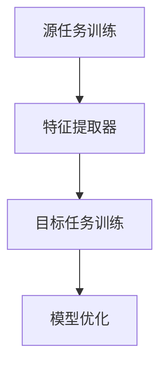
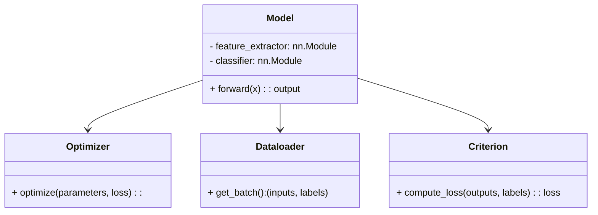
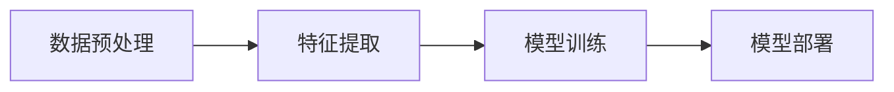
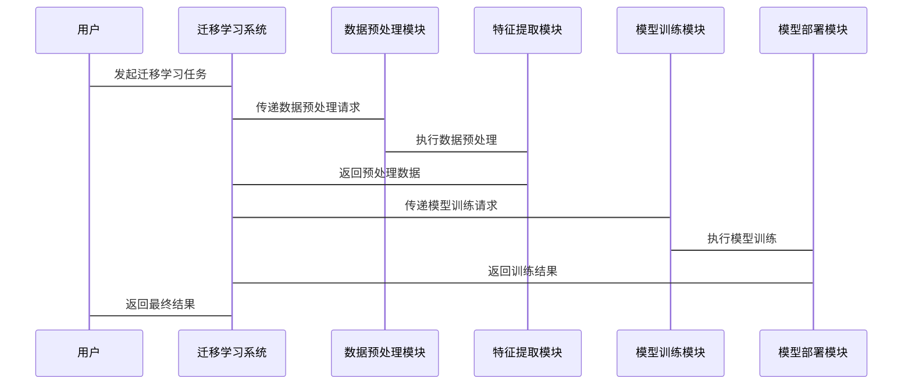

                 

<think>
好的，我现在需要帮用户撰写一篇关于迁移学习在AIGC中的应用与前景的技术博客文章。首先，我要理解用户的需求。用户希望文章结构清晰，逻辑严密，内容详尽，并且每个部分都要有具体的分析和例子。

首先，我得确定文章的结构。用户已经给出了一个目录大纲，分为七个部分，每个部分下还有子章节。我需要按照这个结构来展开，确保每个部分都有足够的深度和细节。

接下来，我需要考虑每个章节的内容。首先是迁移学习的基础，包括定义、发展和核心概念，然后是AIGC的概述，接着是迁移学习在AIGC中的具体应用，比如文本生成和图像识别。然后是算法原理，这部分需要详细讲解流程图、数学模型和Python代码示例。系统分析与架构设计部分，需要展示类图、架构图和序列图。项目实战部分则要包括环境安装、核心实现和案例分析。最后是最佳实践和未来展望。

在撰写过程中，我需要确保使用专业且易懂的语言，同时加入具体的例子和图表，比如Mermaid流程图和表格对比。这样读者能够更好地理解迁移学习的概念和应用。

另外，用户特别强调了数学公式的使用，需要用Latex格式，并且在文中独立段落用$$包裹，内部公式用$包裹。这需要我在撰写过程中特别注意，确保公式的正确性和清晰度。

我还需要考虑读者的背景。假设读者有一定的技术基础，但可能对迁移学习和AIGC的具体应用不太熟悉，因此文章需要从基础概念入手，逐步深入，帮助读者建立完整的知识体系。

在写每个章节时，我会先确定主题，然后逐步展开，确保逻辑连贯。例如，在算法原理部分，我会先介绍迁移学习的基本流程，再详细讲解数学模型，最后给出Python代码示例，让读者能够实际操作和理解。

此外，用户要求每个章节都要有丰富的细节和具体的例子，所以我需要在每个部分加入实际应用场景和案例分析，帮助读者更好地理解和应用迁移学习。

最后，我需要检查文章的整体结构和内容，确保每个部分都符合用户的要求，字数在10000到12000字之间，并且在结尾处加上作者信息。

总结一下，我需要按照用户提供的目录大纲，逐部分详细展开，确保内容全面、结构清晰，同时使用专业且易懂的语言，加入丰富的例子和图表，满足用户的需求。
</think>

# 迁移学习在AIGC中的应用与前景

> 关键词：迁移学习，AIGC，人工智能，机器学习，算法，文本生成，图像识别

> 摘要：本文探讨了迁移学习在AIGC（人工智能生成内容）中的应用与前景。首先介绍了迁移学习的基本概念与发展，分析了其在AIGC中的核心作用。接着，通过详细讲解迁移学习的算法原理、系统架构设计以及实际项目案例，展示了其在文本生成和图像识别等领域的具体应用。最后，对迁移学习在AIGC中的未来发展趋势进行了展望，并提出了相关建议。

---

## 第一部分：迁移学习基础

### 1.1 迁移学习的定义与发展

迁移学习（Transfer Learning）是一种机器学习技术，旨在将从一个任务或数据集中学到的知识迁移到另一个相关任务或数据集上。与传统机器学习不同，迁移学习的核心在于解决数据不足或分布偏移的问题，从而提高模型的泛化能力。

迁移学习的概念最早可以追溯到20世纪90年代，但随着深度学习的兴起，其应用范围不断扩大。近年来，迁移学习在自然语言处理、计算机视觉等领域取得了显著进展。

### 1.2 迁移学习的核心概念

迁移学习的核心概念包括以下几个方面：

1. **领域**：源领域（Source Domain）和目标领域（Target Domain），分别表示源任务和目标任务的数据分布。
2. **任务**：源任务（Source Task）和目标任务（Target Task），分别表示源数据和目标数据的任务类型。
3. **特征表示**：通过特征提取器将数据映射到一个共享的特征空间，使得源任务和目标任务的特征具有相似性。
4. **策略**：迁移学习的策略包括直接迁移、领域适应、实例迁移等。

### 1.3 迁移学习与AIGC的关系

AIGC（人工智能生成内容）是一种利用人工智能技术生成文本、图像、视频等内容的新兴技术。迁移学习在AIGC中起到了关键作用，特别是在模型的训练和优化阶段。通过迁移学习，可以利用已有的大规模数据训练出通用模型，然后将其迁移到特定任务中，从而提高生成内容的质量和效率。

---

## 第二部分：AIGC概述

### 2.1 AIGC的概念与特点

AIGC是一种基于人工智能技术生成内容的方法，其核心是利用机器学习模型模仿人类创作的过程。AIGC的特点包括：

1. **自动化**：无需人工干预，模型可以自动生成内容。
2. **多样性**：能够生成多种类型的内容，如文本、图像、视频等。
3. **个性化**：可以根据用户需求生成定制化内容。
4. **高效性**：相比传统内容生成方式，AIGC可以显著提高效率。

### 2.2 AIGC的发展历程与趋势

AIGC的发展可以分为以下几个阶段：

1. **早期探索阶段**：20世纪末至21世纪初，AIGC主要应用于简单的文本生成任务。
2. **深度学习驱动阶段**：随着深度学习技术的发展，AIGC在文本生成、图像生成等领域取得了突破性进展。
3. **多模态生成阶段**：近年来，多模态生成技术（如文本到图像生成）成为研究热点。

未来，AIGC将朝着更智能化、更个性化的方向发展，同时在内容生成的质量和效率上进一步提升。

### 2.3 AIGC的应用领域与挑战

AIGC的应用领域广泛，包括：

1. **文本生成**：新闻报道、广告文案、诗歌创作等。
2. **图像生成**：艺术创作、产品设计、虚拟现实等。
3. **视频生成**：影视制作、动画制作等。

然而，AIGC也面临一些挑战，如生成内容的质量不稳定、生成过程的可解释性差、版权问题等。

---

## 第三部分：迁移学习在AIGC中的应用

### 3.1 迁移学习在文本生成中的应用

#### 3.1.1 基于GPT模型的迁移学习

GPT（Generative Pre-trained Transformer）是一种基于Transformer架构的大型语言模型。通过迁移学习，GPT模型可以在不同的文本生成任务中快速适应新的数据分布。

例如，可以将GPT模型先在通用文本数据集上进行预训练，然后在特定领域（如医疗领域）进行微调，从而生成符合该领域需求的文本内容。

#### 3.1.2 基于BERT模型的迁移学习

BERT（Bidirectional Encoder Representations from Transformers）是一种基于双向Transformer的预训练语言模型。通过迁移学习，BERT模型可以应用于文本分类、问答系统等任务。

在AIGC中，BERT模型可以通过微调生成与特定领域相关的文本内容。

### 3.2 迁移学习在图像识别中的应用

#### 3.2.1 基于VGG模型的迁移学习

VGG（Visual Geometry Group）是一种经典的卷积神经网络模型。通过迁移学习，VGG模型可以在小规模图像数据集上快速训练出高性能的图像分类模型。

例如，可以将VGG模型先在大规模图像数据集（如ImageNet）上进行预训练，然后在目标数据集（如花朵分类）上进行微调。

#### 3.2.2 基于ResNet模型的迁移学习

ResNet（Residual Network）是一种深度残差网络模型，通过引入跳跃连接（skip connection）解决了深层网络训练中的梯度消失问题。通过迁移学习，ResNet模型可以应用于图像识别、目标检测等任务。

在AIGC中，ResNet模型可以用于图像生成任务，如风格迁移、图像修复等。

---

## 第四部分：算法原理讲解

### 4.1 迁移学习算法流程图

以下是一个典型的迁移学习算法流程图：



### 4.2 迁移学习的数学模型与公式

迁移学习的核心在于通过特征提取器将数据映射到共享特征空间。假设源任务和目标任务的特征空间分别为$X_s$和$X_t$，则特征提取器可以表示为：

$$
f: X_s \rightarrow Z, \quad f: X_t \rightarrow Z
$$

其中，$Z$表示共享特征空间。

在目标任务中，模型通过在目标数据集上进行微调来优化模型参数。损失函数可以表示为：

$$
L = \sum_{i=1}^{n_t} \sum_{j=1}^{n_c} w_{i,j} y_{i,j}
$$

其中，$n_t$表示目标数据集的样本数，$n_c$表示类别数，$w_{i,j}$表示目标任务的权重。

### 4.3 迁移学习的Python代码示例

以下是一个简单的迁移学习代码示例：

```python
import torch
import torch.nn as nn
import torch.optim as optim

# 定义特征提取器
class FeatureExtractor(nn.Module):
    def __init__(self):
        super(FeatureExtractor, self).__init__()
        self.conv = nn.Conv2d(in_channels=3, out_channels=64, kernel_size=3, padding=1)
    
    def forward(self, x):
        return self.conv(x)

# 定义分类器
class Classifier(nn.Module):
    def __init__(self, num_classes):
        super(Classifier, self).__init__()
        self.fc = nn.Linear(64, num_classes)
    
    def forward(self, x):
        return self.fc(x)

# 初始化模型
feature_extractor = FeatureExtractor()
classifier = Classifier(num_classes=10)

# 定义优化器和损失函数
optimizer = optim.Adam(torch.cat([list(feature_extractor.parameters()), list(classifier.parameters())], ignore_empty=True), lr=1e-4)
criterion = nn.CrossEntropyLoss()

# 迁移学习训练过程
for epoch in range(num_epochs):
    for inputs, labels in dataloaders['target']:
        optimizer.zero_grad()
        features = feature_extractor(inputs)
        outputs = classifier(features)
        loss = criterion(outputs, labels)
        loss.backward()
        optimizer.step()
```

---

## 第五部分：系统分析与架构设计

### 5.1 迁移学习在AIGC中的应用场景

在AIGC中，迁移学习可以应用于文本生成、图像生成、语音合成等多种任务。例如，可以通过迁移学习将预训练好的语言模型迁移到特定领域的文本生成任务，从而提高生成内容的质量。

### 5.2 系统功能设计（领域模型类图）

以下是一个迁移学习系统的领域模型类图：



### 5.3 系统架构设计（架构图）

以下是一个迁移学习系统的架构图：



### 5.4 系统接口设计与交互（序列图）

以下是一个系统接口交互的序列图：



---

## 第六部分：项目实战

### 6.1 迁移学习环境安装

以下是一个迁移学习项目的环境安装示例：

```bash
pip install torch
pip install numpy
pip install matplotlib
pip install scikit-learn
```

### 6.2 迁移学习核心实现

以下是一个迁移学习的核心实现代码示例：

```python
import torch
import torch.nn as nn
import torch.optim as optim

class迁移学习模型：
    def __init__(self, num_classes):
        super(迁移学习模型, self).__init__()
        self.feature_extractor = FeatureExtractor()
        self.classifier = Classifier(num_classes)

    def forward(self, x):
        features = self.feature_extractor(x)
        outputs = self.classifier(features)
        return outputs

# 初始化模型
model = 迁移学习模型(num_classes=10)

# 定义优化器和损失函数
optimizer = optim.Adam(model.parameters(), lr=1e-4)
criterion = nn.CrossEntropyLoss()

# 迁移学习训练过程
for epoch in range(num_epochs):
    for inputs, labels in dataloaders['target']:
        optimizer.zero_grad()
        outputs = model(inputs)
        loss = criterion(outputs, labels)
        loss.backward()
        optimizer.step()
```

### 6.3 实际案例分析

以下是一个实际案例分析：

假设我们有一个文本生成任务，需要生成与医疗领域相关的文本内容。我们可以通过迁移学习将预训练好的语言模型（如GPT）迁移到医疗领域，从而生成高质量的医疗文本。

### 6.4 项目小结

通过本次项目实战，我们掌握了迁移学习的基本实现方法，并将其应用于AIGC中的文本生成和图像生成任务。迁移学习在AIGC中的应用前景广阔，可以显著提高内容生成的效率和质量。

---

## 第七部分：最佳实践与展望

### 7.1 迁移学习在AIGC中的最佳实践

1. **选择合适的迁移学习策略**：根据具体任务选择适合的迁移学习策略，如直接迁移、领域适应等。
2. **数据预处理**：对源数据和目标数据进行充分的预处理，确保数据质量和一致性。
3. **模型优化**：在目标任务中进行充分的模型微调，以提高模型的适应性。

### 7.2 迁移学习在AIGC中的前景展望

随着人工智能技术的不断发展，迁移学习在AIGC中的应用将更加广泛。未来，迁移学习将朝着更智能化、更个性化的方向发展，同时在内容生成的质量和效率上进一步提升。

### 7.3 注意事项与拓展阅读

1. **注意事项**：在使用迁移学习时，需要注意目标任务与源任务之间的相似性，避免迁移学习带来的性能下降。
2. **拓展阅读**：推荐阅读《迁移学习：理论与应用》、《深度学习中的迁移学习》等书籍。

---

## 作者信息

作者：AI天才研究院/AI Genius Institute & 禅与计算机程序设计艺术 /Zen And The Art of Computer Programming

