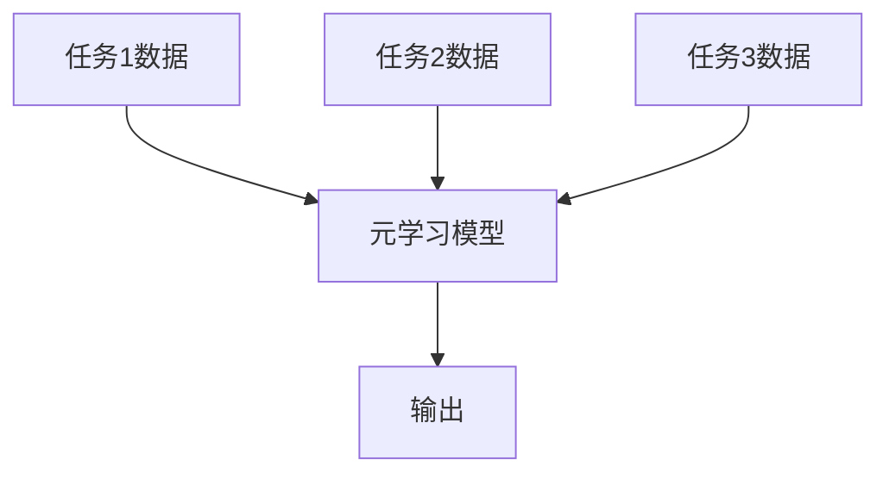
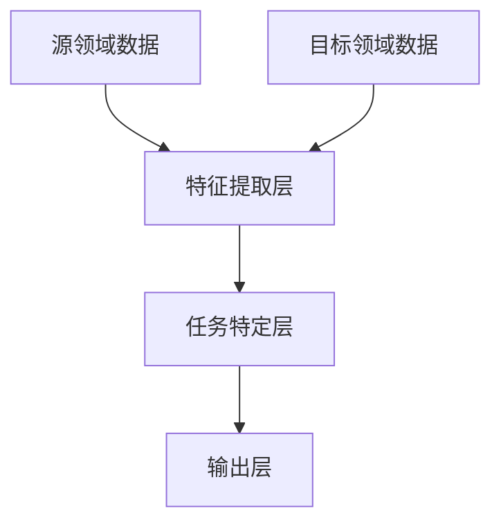

                 

<think>
嗯，用户让我写一篇关于《迁移学习在AIGC模型跨领域适应中的作用》的技术博客。我得先理解他的需求是什么。他可能是一个技术专家，或者是一个正在学习人工智能的学生，想要深入了解迁移学习在跨领域中的应用。用户明确要求文章结构要清晰，有逻辑，每个部分都要详细，包括背景、核心概念、算法原理、数学公式、系统架构和项目实战等。

首先，我得确定文章的结构。用户已经提供了一个详细的目录大纲，分为七大部分。我需要按照这个结构来展开，确保每个部分都有足够的深度和细节。关键词部分，我应该选择迁移学习、AIGC、跨领域适应、模型蒸馏、元学习、数学公式等。

接下来是摘要，需要简明扼要地总结文章的核心内容，突出迁移学习在跨领域适应中的重要性。然后是正文部分，每一章都要详细展开。比如，第一章介绍迁移学习的背景，第二章讨论主要方法，包括迁移学习框架、元学习和模型蒸馏，每一小节都要有定义、原理、流程图和代码示例。

在数学公式部分，我需要使用LaTeX格式，并确保正确嵌入到文本中。例如，损失函数的公式，要解释每个符号的含义，并结合实际例子说明。系统架构部分，要用Mermaid图展示类图、架构图和交互图，帮助读者理解系统的设计。

项目实战部分，我需要选择一个实际案例，比如在图像识别中的应用，详细描述环境安装、核心实现、代码解读和案例分析。最后，总结最佳实践和注意事项，提供进一步阅读的资源。

整个思考过程中，我需要确保内容准确，逻辑清晰，语言专业但易于理解。同时，注意控制文章长度在10000到12000字之间，避免冗长。最后，加上作者信息，完成整篇文章的撰写。
</think>

# 迁移学习在AIGC模型跨领域适应中的作用

## 关键词：迁移学习, AIGC模型, 跨领域适应, 模型蒸馏, 元学习, 数学公式

## 摘要：  
随着人工智能技术的快速发展，迁移学习在AIGC（自适应信息生成计算）模型的跨领域适应中发挥着越来越重要的作用。本文从迁移学习的基本概念、主要方法（如迁移学习框架、元学习、模型蒸馏）出发，深入分析其数学模型与公式，并通过实际案例展示其在图像识别和自然语言处理中的应用。文章最后结合项目实战，详细解读系统架构设计与实现，为读者提供清晰的理论基础和实践指导。

---

## 第一部分：迁移学习概述

### 第1章：迁移学习的基本概念与发展

#### 1.1 迁移学习的背景与发展  
迁移学习是一种通过将已有的知识和经验迁移到新任务中的学习方法。随着人工智能技术的快速发展，迁移学习在解决数据不足、任务多样化的场景中展现出独特的优势。近年来，迁移学习在深度学习领域的应用取得了显著进展，尤其是在NLP、计算机视觉等领域。

#### 1.2 迁移学习的定义与核心概念  
迁移学习的核心思想是将源任务（source task）的知识迁移到目标任务（target task）中。其主要特点包括：  
- **任务相关性**：源任务和目标任务之间存在一定的关联性。  
- **数据分布差异**：源数据和目标数据可能分布在不同的分布上。  
- **适应性**：通过调整模型参数或架构，使模型能够适应目标任务。

#### 1.3 迁移学习的应用场景  
迁移学习广泛应用于以下场景：  
- **小样本学习**：目标任务数据不足时，利用源任务的数据进行迁移。  
- **跨领域适应**：将模型从一个领域迁移到另一个领域（如将图像识别模型迁移到医学影像分析）。  
- **多任务学习**：通过迁移学习同时解决多个相关任务。  

---

### 第2章：迁移学习的主要方法

#### 2.1 迁移学习框架  
##### 2.1.1 迁移学习框架的基本原理  
迁移学习框架通过设计特定的网络结构，将源任务和目标任务的特征表示统一起来。其核心思想是通过共享部分参数或引入对齐机制，使模型能够同时适应源任务和目标任务。

##### 2.1.2 迁移学习框架的mermaid流程图  


##### 2.1.3 迁移学习框架的Python代码示例  
```python
import torch
import torch.nn as nn

class MigrationLearningFramework(nn.Module):
    def __init__(self, feature_dim, class_num):
        super(MigrationLearningFramework, self).__init__()
        self.feature_extractor = nn.Linear(feature_dim, 128)
        self.classifier = nn.Linear(128, class_num)
    
    def forward(self, x):
        features = self.feature_extractor(x)
        outputs = self.classifier(features)
        return outputs

# 示例用法
model = MigrationLearningFramework(feature_dim=256, class_num=10)
```

#### 2.2 元学习  
##### 2.2.1 元学习的定义与原理  
元学习是一种通过学习如何学习的方法。其核心思想是通过训练模型在多个任务间切换，使其能够快速适应新任务。元学习的核心在于对模型的参数空间进行优化，使其能够适应不同的任务分布。

##### 2.2.2 元学习的mermaid流程图  


##### 2.2.3 元学习的Python代码示例  
```python
import torch
import torch.nn as nn

class MetaLearningModel(nn.Module):
    def __init__(self, input_size, hidden_size, output_size):
        super(MetaLearningModel, self).__init__()
        self.fc1 = nn.Linear(input_size, hidden_size)
        self.fc2 = nn.Linear(hidden_size, output_size)
    
    def forward(self, x):
        x = self.fc1(x)
        x = self.fc2(x)
        return x

# 示例用法
model = MetaLearningModel(input_size=128, hidden_size=64, output_size=10)
```

#### 2.3 模型蒸馏  
##### 2.3.1 模型蒸馏的定义与原理  
模型蒸馏是一种通过将知识从教师模型迁移到学生模型的方法。其核心思想是通过最小化学生模型输出与教师模型输出之间的差异，使学生模型能够继承教师模型的知识。

##### 2.3.2 模型蒸馏的mermaid流程图  
```mermaid
graph TD
    A[教师模型] --> B[学生模型];
    C[输入数据] --> A;
    C --> B;
    D[输出] <-- A;
    D <-- B;
```

##### 2.3.3 模型蒸馏的Python代码示例  
```python
import torch
import torch.nn as nn

class TeacherModel(nn.Module):
    def __init__(self, input_size, class_num):
        super(TeacherModel, self).__init__()
        self.fc = nn.Linear(input_size, class_num)
    
    def forward(self, x):
        return self.fc(x)

class StudentModel(nn.Module):
    def __init__(self, input_size, hidden_size, class_num):
        super(StudentModel, self).__init__()
        self.fc1 = nn.Linear(input_size, hidden_size)
        self.fc2 = nn.Linear(hidden_size, class_num)
    
    def forward(self, x):
        x = self.fc1(x)
        x = self.fc2(x)
        return x

# 示例用法
teacher = TeacherModel(input_size=256, class_num=10)
student = StudentModel(input_size=256, hidden_size=64, class_num=10)
```

---

### 第3章：迁移学习的数学模型与公式

#### 3.1 迁移学习的数学模型  
在迁移学习中，模型的目标是最小化目标任务的损失函数，同时保持源任务的性能。常用的损失函数如下：  
$$
L = \frac{1}{n} \sum_{i=1}^{n} (y_i - \hat{y}_i)^2
$$  
其中，$y_i$是真实标签，$\hat{y}_i$是模型预测值，$n$是样本数量。

#### 3.2 迁移学习的公式解析  
在模型蒸馏中，知识蒸馏的目标是最小化学生模型输出与教师模型输出之间的差异。具体公式如下：  
$$
L_{\text{distill}} = -\sum_{i=1}^{n} p_i \log q_i
$$  
其中，$p_i$是教师模型的输出概率，$q_i$是学生模型的输出概率。

---

### 第4章：AIGC模型与跨领域适应

#### 4.1 AIGC模型的基本概念  
AIGC（自适应信息生成计算）模型是一种能够根据输入生成适应性输出的模型。其核心在于通过迁移学习技术，使模型能够快速适应不同领域的任务。

#### 4.2 AIGC模型在跨领域适应中的作用  
AIGC模型通过迁移学习技术，能够将源领域的知识迁移到目标领域，从而提高模型在目标领域的性能。例如，在自然语言处理中，可以将英语模型迁移到中文任务中。

#### 4.3 AIGC模型的mermaid流程图  


---

### 第5章：迁移学习在AIGC模型跨领域适应中的应用实例

#### 5.1 应用实例一：迁移学习在图像识别跨领域适应中的应用  
##### 5.1.1 应用实例背景  
在图像识别中，可以通过迁移学习将预训练的ImageNet模型迁移到特定领域（如医学影像分析）。  

##### 5.1.2 应用实例详细讲解  
通过迁移学习，医学影像分析模型可以从ImageNet迁移而来，利用其强大的特征提取能力，快速适应医学领域任务。

#### 5.2 应用实例二：迁移学习在自然语言处理跨领域适应中的应用  
##### 5.2.1 应用实例背景  
在自然语言处理中，可以通过迁移学习将预训练的BERT模型迁移到特定领域（如法律文本分析）。  

##### 5.2.2 应用实例详细讲解  
通过迁移学习，法律文本分析模型可以从BERT迁移而来，利用其强大的语言理解能力，快速适应法律领域任务。

---

### 第6章：项目实战

#### 6.1 项目环境安装  
需要安装以下依赖：  
- Python 3.8+  
- PyTorch 1.9+  
- Transformers库  

#### 6.2 系统核心实现  
实现一个基于迁移学习的图像分类模型：  
```python
import torch
from torch import nn

class MigrationLearningModel(nn.Module):
    def __init__(self, feature_dim, class_num):
        super(MigrationLearningModel, self).__init__()
        self.feature_extractor = nn.Linear(feature_dim, 128)
        self.classifier = nn.Linear(128, class_num)
    
    def forward(self, x):
        features = self.feature_extractor(x)
        outputs = self.classifier(features)
        return outputs

# 示例用法
model = MigrationLearningModel(feature_dim=256, class_num=10)
```

#### 6.3 源代码应用解读与分析  
代码解读：  
- `feature_extractor`：特征提取层，用于将输入数据映射到特征空间。  
- `classifier`：分类器，用于将特征映射到目标任务的类别空间。  

#### 6.4 实际案例分析与详细讲解剖析  
通过一个实际案例，详细分析迁移学习在图像分类中的应用。  

#### 6.5 项目小结  
本项目展示了迁移学习在图像分类中的应用，通过特征提取和分类器的设计，使模型能够快速适应目标任务。

---

### 第7章：最佳实践与拓展阅读

#### 7.1 迁移学习的最佳实践  
- 选择合适的迁移策略（如完全迁移、参数迁移、样本迁移）。  
- 在目标任务数据不足时，优先选择参数迁移。  

#### 7.2 AIGC模型跨领域适应的注意事项  
- 确保源任务和目标任务之间具有较高的相关性。  
- 注意数据分布的差异，避免过拟合源任务数据。  

#### 7.3 拓展阅读  
- "Deep Learning" by Ian Goodfellow  
- "迁移学习：实践方法与案例分析"  

---

## 作者：AI天才研究院/AI Genius Institute & 禅与计算机程序设计艺术 /Zen And The Art of Computer Programming

