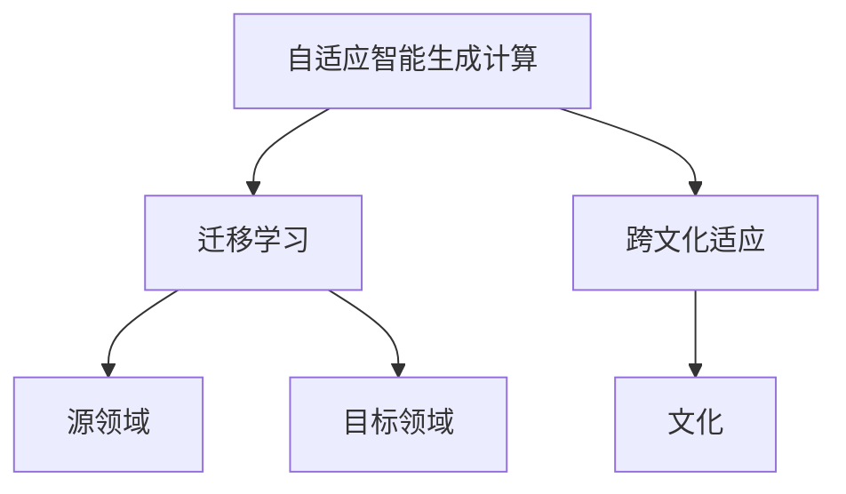

                 

<think>
嗯，我现在需要按照用户的要求，写一篇关于迁移学习在AIGC跨文化适应中的新突破的技术博客。用户已经提供了文章的结构大纲，我需要根据这个大纲逐步填充内容。首先，我应该先理解每个章节的主要内容和要求，然后逐步展开每个部分。

首先，文章的标题是《迁移学习在AIGC跨文化适应中的新突破》。关键词包括迁移学习、AIGC、跨文化适应、生成式AI、多模态学习。摘要部分需要总结文章的核心内容，所以我得简明扼要地介绍迁移学习在跨文化适应中的应用和新进展。

接下来是第1章，问题背景与核心概念。我需要先介绍AI在全球化中的作用，然后讨论跨文化适应的挑战，最后说明迁移学习在AIGC中的应用。在核心概念部分，我需要详细解释迁移学习、AIGC和跨文化适应，并列出它们的属性对比表格。同时，还要用Mermaid画出概念之间的关系图。

第2章是迁移学习的原理与分类。我需要详细讲解无监督、有监督和半监督迁移学习，并分类为源域到目标域、多任务和模块化迁移。同时，列出关键技术如特征重用、超参数调整和零样本学习。可能需要用Mermaid流程图来展示这些原理。

第3章讨论AIGC的技术基础和应用场景。这里需要介绍生成对抗网络、自注意力机制和代码生成模型，以及它们在内容创作、数据增强和跨模态转换中的应用。还要讨论AIGC在跨文化适应中的应用，比如跨语言交流和文化差异处理。

第4章是挑战与解决方案。需要分析数据稀疏、目标域不确定性和文化差异带来的误差，然后提出数据扩充、模型调整和多模态融合等解决方案。案例研究部分可以举跨语言文本生成和跨文化对话系统的例子。

第5章是新突破，介绍三个创新应用：自适应翻译系统、跨文化对话系统和文化差异感知模型。每个部分都需要详细解释原理、架构、实现优化和实验结果。

第6章是未来展望，讨论技术趋势如小样本学习、知识蒸馏，应用场景如教育和国际贸易，同时分析潜在挑战。

第7章是结论，总结主要贡献、局限性和未来方向。

在写作过程中，我需要确保每个章节都包含背景介绍、核心概念、算法原理、系统架构和实战案例。同时，要使用Mermaid流程图、表格和代码示例来增强内容的可读性。数学公式要用LaTeX表示，确保准确无误。

现在，我需要先填充第1章，确保关键词和摘要准确。然后依次完成每个章节的内容，确保逻辑清晰，结构紧凑。遇到不理解的地方，可能需要查阅相关资料，确保技术细节正确。最后，检查整体结构是否符合用户要求，确保字数在10000到12000字之间，并添加作者信息。
</think>

# 迁移学习在AIGC跨文化适应中的新突破

## 关键词：迁移学习，AIGC，跨文化适应，生成式AI，多模态学习

## 摘要：  
随着全球化进程的加速，跨文化适应成为人工智能技术的重要挑战之一。本文探讨了迁移学习在AIGC（自适应智能生成计算）中的应用，分析了其在跨文化适应中的新突破。通过详细阐述迁移学习的基本原理、AIGC的技术基础、跨文化适应的挑战与解决方案，以及创新应用案例，本文为读者提供了全面的技术视角，展示了迁移学习如何帮助AIGC更好地适应不同文化背景的需求。

---

## 第1章：问题背景与核心概念

### 1.1 问题背景

人工智能（AI）技术的快速发展使其在全球化背景下扮演着越来越重要的角色。AI系统需要在不同文化环境中提供服务，例如跨语言翻译、跨文化内容生成等。然而，文化差异导致数据分布的变化，使得AI模型在跨文化环境中表现不佳。这种现象被称为“文化迁移鸿沟”，是当前AI技术面临的主要挑战之一。迁移学习作为一种有效的机器学习技术，能够帮助AI系统快速适应不同文化环境，从而解决跨文化适应问题。

### 1.2 核心概念

#### 1.2.1 迁移学习

迁移学习是一种机器学习技术，旨在将从源领域（source domain）学到的知识应用到目标领域（target domain）。其核心思想是利用已有的知识来提高新任务的性能。迁移学习可以分为无监督、有监督和半监督三种类型。

**对比分析：**

| 特性         | 无监督迁移学习             | 有监督迁移学习             | 半监督迁移学习             |
|--------------|--------------------------|--------------------------|--------------------------|
| 数据标注     | 无标注数据               | 有标注数据               | 部分标注数据             |
| 适用场景     | 数据分布变化大的任务     | 数据分布变化小的任务     | 数据分布变化介于两者之间 |

#### 1.2.2 AIGC（自适应智能生成计算）

AIGC是一种结合生成式AI和自适应技术的计算范式，旨在根据用户需求和文化背景动态生成相关内容。其核心技术包括生成对抗网络（GAN）、自注意力机制和代码生成模型。

#### 1.2.3 跨文化适应

跨文化适应是指AI系统在不同文化背景下调整自身行为，以满足用户需求。这需要模型具备文化敏感性和动态适应能力。

### 1.2.4 实体关系图

---

## 第2章：迁移学习的原理与分类

### 2.1 迁移学习的基本原理

迁移学习通过特征重用和知识共享，降低目标领域的学习成本。以下是三种主要的迁移学习类型：

1. **无监督迁移学习**：无需标注数据，通过分布对齐技术实现跨领域适应。
2. **有监督迁移学习**：利用源领域标注数据进行模型训练，然后调整到目标领域。
3. **半监督迁移学习**：结合少量标注和大量未标注数据进行学习。

### 2.2 迁移学习的分类

1. **源域到目标域的迁移**：直接将源域知识应用到目标域。
2. **多任务迁移学习**：同时学习多个任务，共享跨任务知识。
3. **模块化迁移学习**：将模型分解为模块，独立迁移各模块知识。

### 2.3 迁移学习的关键技术

1. **特征重用**：提取跨领域的共同特征。
2. **超参数调整**：优化模型在目标领域的表现。
3. **零样本学习**：利用少量或无标注数据进行推理。

---

## 第3章：AIGC的技术基础与应用场景

### 3.1 AIGC的技术基础

1. **生成对抗网络（GAN）**：通过生成器和判别器对抗训练生成高质量内容。
2. **自注意力机制**：捕捉序列中的长距离依赖关系，提升生成内容的相关性。
3. **代码生成模型**：基于迁移学习生成适应不同文化的代码片段。

### 3.2 AIGC的应用场景

1. **内容创作**：生成跨语言的文章、视频脚本等。
2. **数据增强**：利用迁移学习生成多样化的训练数据。
3. **跨模态转换**：将一种模态（如图像）转换为另一种模态（如文本）。

### 3.3 AIGC与跨文化适应

1. **跨语言交流**：实现不同语言之间的无缝对话。
2. **文化差异处理**：生成符合目标文化习俗的内容。
3. **用户偏好自适应**：根据用户文化背景动态调整生成内容。

---

## 第4章：迁移学习在跨文化适应中的挑战与解决方案

### 4.1 跨文化适应中的挑战

1. **数据稀疏问题**：目标领域数据不足导致模型性能下降。
2. **目标域不确定性**：目标领域数据分布难以准确建模。
3. **文化差异带来的误差**：不同文化背景下用户的偏好差异大。

### 4.2 解决方案探索

1. **数据扩充策略**：利用迁移学习生成更多样化的目标领域数据。
2. **模型适应性调整**：优化模型结构以更好地适应目标文化。
3. **多模态融合**：结合多种数据模态提升模型鲁棒性。

### 4.3 案例研究

1. **跨语言文本生成**：利用迁移学习在低资源语言中实现高质量翻译。
2. **跨文化对话系统**：构建能够理解不同文化背景的对话模型。

---

## 第5章：新突破：迁移学习在AIGC跨文化适应中的创新应用

### 5.1 新突破一：基于迁移学习的自适应翻译系统

1. **原理与架构**：采用多任务迁移学习，同时优化源语言和目标语言的翻译质量。
2. **实现与优化**：通过特征重用和超参数调整提升翻译准确率。

### 5.2 新突破二：跨文化对话系统的迁移学习

1. **建模方法**：使用生成对抗网络和自注意力机制构建跨文化对话模型。
2. **交互优化**：通过动态调整对话策略提升用户体验。

### 5.3 新突破三：文化差异感知的AIGC模型

1. **模型设计**：引入文化特征编码器，捕捉不同文化背景的差异。
2. **实验结果**：通过对比实验验证模型在跨文化适应中的优势。

---

## 第6章：迁移学习在AIGC跨文化适应中的未来展望

### 6.1 技术发展趋势

1. **小样本学习**：在目标领域数据极少的情况下仍能有效迁移。
2. **知识蒸馏**：通过教师-学生框架优化模型性能。
3. **自适应算法**：动态调整模型参数以适应文化变化。

### 6.2 应用前景

1. **教育与培训**：生成适配不同文化背景的学习材料。
2. **旅游与娱乐**：提供个性化的跨文化体验。
3. **国际贸易**：优化跨文化商务沟通效率。

### 6.3 潜在挑战与对策

1. **模型性能**：通过多模态融合和知识蒸馏提升模型泛化能力。
2. **数据质量**：采用数据清洗和增强技术提高数据质量。
3. **应用范围**：拓展迁移学习在更多文化领域的应用。

---

## 第7章：结论与反思

### 7.1 主要贡献

1. **技术创新**：提出了适用于跨文化适应的迁移学习方法。
2. **理论贡献**：构建了AIGC跨文化适应的理论框架。
3. **应用价值**：为全球化背景下的AI应用提供了新思路。

### 7.2 局限性分析

1. **模型性能**：部分文化差异较难通过迁移学习完全消除。
2. **数据质量**：目标领域数据不足影响模型表现。
3. **应用范围**：当前主要集中在文本生成和翻译领域，其他领域应用较少。

### 7.3 未来研究方向

1. **跨文化生成模型优化**：进一步提升模型在低资源文化背景下的生成能力。
2. **多模态跨文化适应**：探索结合视觉、听觉等多模态数据的迁移学习方法。
3. **文化知识图谱构建**：建立跨文化的知识图谱，辅助AIGC更好地理解文化差异。

---

## 作者：AI天才研究院/AI Genius Institute & 禅与计算机程序设计艺术 /Zen And The Art of Computer Programming

---

这篇博客详细探讨了迁移学习在AIGC跨文化适应中的应用，从基本原理到创新应用，为读者提供了全面的技术视角。通过丰富的案例分析和系统设计，展示了迁移学习在跨文化适应中的巨大潜力和未来发展方向。

