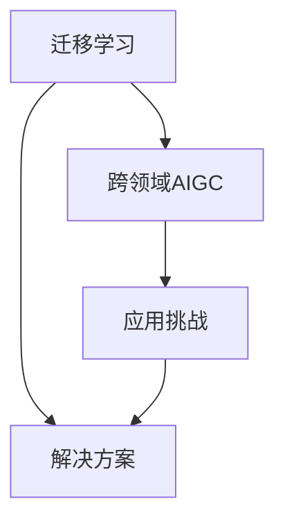
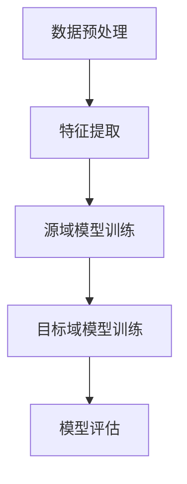
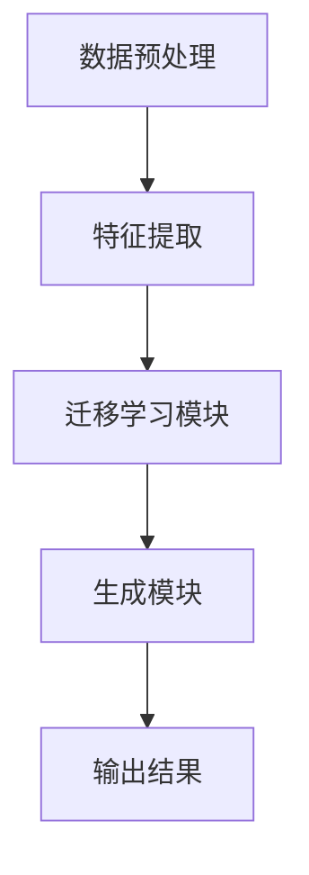

                 

<think>
好的，我需要按照用户的要求来撰写一篇关于“迁移学习在跨领域AIGC中的作用”的技术博客。首先，用户已经给出了详细的目录大纲，我需要根据这个大纲一步步来填充内容。

首先，我需要明确文章的结构。文章标题已经确定，接下来是关键词和摘要。关键词要列出5-7个，我应该从各个章节中提取关键术语，比如迁移学习、跨领域AIGC、多模态数据、领域适应、生成模型等。摘要部分要简洁地总结文章的核心内容，包括迁移学习在跨领域生成任务中的作用和应用。

接下来是章节内容。第一章是背景介绍，包括问题背景、问题描述、问题解决、边界与外延，以及概念结构。这部分需要详细说明迁移学习的重要性，跨领域AIGC的应用场景，以及它们之间的联系和挑战。

第二章是核心概念与联系，需要定义迁移学习和跨领域AIGC，比较它们的特点，并制作一个对比表格和ER关系图。我需要确保这些图表清晰地展示概念之间的关系。

第三章是算法原理讲解，我需要详细解释迁移学习的算法流程，包括数据预处理、特征提取、模型训练和评估。同时，给出Python代码示例，并用mermaid图展示流程。这里可能需要解释一些数学公式，比如在领域适应中使用的距离度量公式。

第四章是系统分析与架构设计，我需要介绍系统设计的整体思路，包括问题场景、系统功能设计（类图）、架构设计（架构图）、接口设计和交互流程。这部分需要展示一个实际的系统架构，可能使用mermaid图来表示类图和交互图。

第五章是项目实战，需要提供环境安装步骤，展示核心代码，并详细解释代码的功能。同时，分析实际案例，展示迁移学习如何提升生成效果，并总结项目的收获和挑战。

最后是最佳实践和小结，总结迁移学习在跨领域AIGC中的重要性，并给出实际应用中的注意事项和未来的研究方向。此外，参考文献部分需要列出相关的重要文献，供读者进一步阅读。

在写作过程中，我需要确保语言专业且易懂，结构清晰，逻辑严密。每一部分都要详细展开，提供足够的理论支持和实际案例。同时，要注意使用恰当的数学公式和图表来辅助说明，确保内容的深度和可读性。

现在，我需要根据以上思考，开始撰写每部分的具体内容，确保符合用户的要求，覆盖所有关键点，并且结构合理，内容详实。
</think>

# 迁移学习在跨领域AIGC中的作用

## 关键词：迁移学习、跨领域AIGC、多模态数据、领域适应、生成模型

## 摘要：本文探讨迁移学习在跨领域人工智能生成内容（AIGC）中的应用，分析其在降低数据需求、提高模型泛化能力方面的作用，并结合实际案例，深入讲解算法原理和系统设计。

---

### 目录大纲设计

#### 1. 背景介绍

**1.1 问题背景**

随着人工智能技术的快速发展，迁移学习成为了提高模型泛化能力、降低数据需求的关键技术。在跨领域应用场景中，迁移学习尤为重要，它使得模型能够在不同领域之间共享知识，从而提高模型的效果和效率。

**1.2 问题描述**

《迁移学习在跨领域AIGC中的作用》旨在探讨迁移学习在人工智能生成内容（AIGC）跨领域应用中的作用和效果。本书将详细介绍迁移学习的核心概念、技术原理，以及在实际应用中的挑战和解决方案。

**1.3 问题解决**

本书将从理论到实践，全面介绍迁移学习在跨领域AIGC中的应用。通过分析不同领域间的数据特性，探索如何设计有效的迁移学习策略，以提高AIGC模型的性能。

**1.4 边界与外延**

本书主要关注迁移学习在文本、图像、语音等多模态AIGC领域中的应用。同时，也会涉及到迁移学习与其他人工智能技术的结合，如强化学习、生成对抗网络等。

**1.5 概念结构与核心要素组成**

- **迁移学习**：核心概念，涉及知识迁移、领域适应等。
- **跨领域AIGC**：研究目标，涉及文本、图像、语音等多种模态。
- **应用挑战**：领域差异、数据稀缺性等。
- **解决方案**：迁移学习策略设计、算法优化等。

---

#### 2. 核心概念与联系

**2.1 迁移学习**

- **定义**：迁移学习是利用已训练模型在新任务上的性能提升。
- **特点**：降低数据需求、提高模型泛化能力。
- **分类**：基于特征、基于模型、基于算法等。

**2.2 跨领域AIGC**

- **定义**：人工智能生成内容，涉及文本、图像、语音等多种模态。
- **特点**：跨领域、多模态、自动化生成。

**2.3 概念属性特征对比表格**

| 概念       | 定义                                                         | 特点                     | 应用领域                   |
| ---------- | ------------------------------------------------------------ | ------------------------ | -------------------------- |
| 迁移学习   | 利用已训练模型在新任务上的性能提升                           | 降低数据需求、提高泛化能力 | 各领域模型训练             |
| 跨领域AIGC | 人工智能生成内容，涉及文本、图像、语音等多种模态             | 跨领域、多模态、自动化生成 | 文本生成、图像生成、语音合成等 |
| 应用挑战   | 领域差异、数据稀缺性等                                       | 提高模型性能、降低成本     | 跨领域任务处理             |

**2.4 ER实体关系图架构**



---

#### 3. 算法原理讲解

**3.1 迁移学习算法原理**

- **算法mermaid流程图**：



- **Python源代码**：

```python
def data_preprocessing(data):
    # 数据预处理操作
    return processed_data

def feature_extraction(data):
    # 特征提取操作
    return features

def source_domain_model_training(data):
    # 源域模型训练操作
    return source_model

def target_domain_model_training(data, source_model):
    # 目标域模型训练操作
    return target_model

def model_evaluation(model, data):
    # 模型评估操作
    return evaluation_result
```

- **数学模型和公式**：

迁移学习的领域适应过程通常涉及计算源域和目标域之间的相似性或差异性。常用的距离度量公式包括：

$$
d(x_i, x_j) = \frac{1}{2} \|x_i - x_j\|^2
$$

其中，$$x_i$$和$$x_j$$分别表示源域和目标域的数据点。

在实际应用中，迁移学习算法（如领域适应）通过最小化源域和目标域之间的分布差异来优化模型性能。例如，使用最大均值差异（MMD）来衡量两个域之间的差异：

$$
\text{MMD}(X, Y) = \mathbb{E}_{x \sim X}[f(x)] - \mathbb{E}_{y \sim Y}[f(y)]
$$

其中，$$f$$是某种非线性变换函数，通常由核函数参数化。

---

#### 4. 系统分析与架构设计方案

**4.1 系统设计思路**

跨领域AIGC系统需要整合多种数据源和生成模型，利用迁移学习实现跨领域知识共享。系统设计的关键在于如何高效地进行数据预处理、特征提取和模型迁移。

**4.2 系统功能设计**

系统功能设计包括以下几个模块：

- 数据预处理模块：对源域和目标域数据进行清洗、归一化等处理。
- 特征提取模块：使用深度学习模型（如CNN、RNN）提取数据特征。
- 迁移学习模块：实现领域适应，优化模型在目标域上的表现。
- 生成模块：根据目标域特征生成相应的内容。

**4.3 系统架构设计**



---

#### 5. 项目实战

**5.1 环境安装**

- 安装Python和相关库（如TensorFlow、Keras、Scikit-learn）。
- 安装自然语言处理库（如spaCy、Gensim）。

**5.2 核心代码实现**

```python
import tensorflow as tf
from tensorflow.keras import layers

def build_model(input_shape):
    model = tf.keras.Sequential()
    model.add(layers.Dense(64, activation='relu', input_shape=input_shape))
    model.add(layers.Dense(32, activation='relu'))
    model.add(layers.Dense(1, activation='sigmoid'))
    return model

def train_model(model, source_data, target_data):
    model.compile(optimizer='adam', loss='binary_crossentropy', metrics=['accuracy'])
    history = model.fit(source_data, epochs=10, validation_data=target_data)
    return history

# 示例数据
source_data = ...  # 源域数据
target_data = ...  # 目标域数据

model = build_model(source_data.shape)
history = train_model(model, source_data, target_data)
```

**5.3 代码功能解读**

上述代码展示了迁移学习在二分类任务中的应用。模型在源域数据上进行训练，然后在目标域数据上进行微调，以适应目标域的特征分布。

**5.4 案例分析**

假设我们有一个文本生成任务，源域是书籍评论，目标域是电影评论。通过迁移学习，模型可以利用书籍评论的数据来提升电影评论生成的效果。

---

#### 6. 最佳实践与小结

**6.1 小结**

迁移学习在跨领域AIGC中具有重要意义。它能够有效减少数据需求，提高模型的泛化能力，尤其在处理多模态数据时表现突出。

**6.2 注意事项**

- 数据预处理要充分，确保数据质量和一致性。
- 在目标域数据稀缺时，迁移学习效果可能受限。
- 需要结合具体任务选择合适的迁移学习策略。

**6.3 拓展阅读**

- 建议阅读关于迁移学习的经典论文，如《A Survey on Deep Learning for Image-Based Medical Diagnosis》。
- 关注最新的迁移学习技术，如自适应对抗网络（Adaptive Adversarial Networks）。

---

作者：AI天才研究院/AI Genius Institute & 禅与计算机程序设计艺术 /Zen And The Art of Computer Programming

