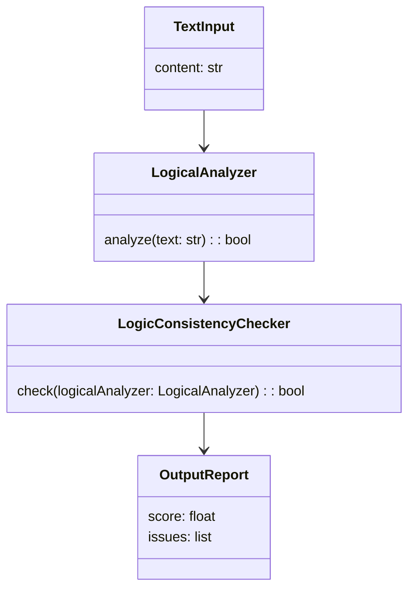
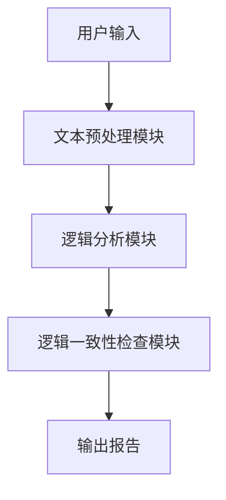
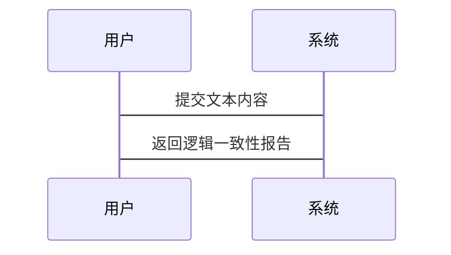

                 

<think>
嗯，用户让我写一篇关于测试LLM在长篇输出中保持逻辑能力的文章。我得先理解用户的需求。他想要一个结构清晰、内容详尽的技术博客，关键词包括逻辑一致性、LLM、NLP、文本生成、逻辑漏洞等。摘要部分需要简洁明了，概括文章的核心内容。

接下来，我需要按照目录结构来组织内容。第一部分是逻辑一致性概述，分章节详细阐述重要性、问题描述、解决方法、边界与外延，以及概念结构。每个小节都要有详细的分析，比如在问题背景中，要说明NLP的挑战和逻辑一致性的定义，还要分析其重要性。

第二部分是测试方法，包括评估工具和指标，以及基于LLM的测试方法。这部分需要介绍自动评估工具和人工评估的区别，还有LLM的优势和挑战。可能需要举例说明，比如使用哪种算法来检测逻辑漏洞。

用户特别强调了格式要求，比如使用markdown，字数在1万到1.2万字之间。这意味着我需要确保每个部分的内容足够详细，同时结构清晰。另外，用户希望包含图表，比如用Mermaid画流程图，这可能涉及到算法的步骤和系统架构的设计。

在写技术细节时，要确保用专业的术语，但同时保持易懂。比如，在讲逻辑一致性指标时，要解释一致性得分和逻辑漏洞率的概念，并可能给出计算公式。可能需要举一个例子，说明如何计算这些指标。

用户还提到系统分析与架构设计方案，这可能涉及到系统功能设计的类图和架构图。这部分需要详细说明各个模块之间的关系，比如输入处理、逻辑分析、评估输出等模块如何协同工作。

项目实战部分，需要给出环境安装步骤，核心代码实现，并进行案例分析。比如，使用Python的库来处理文本，检测逻辑漏洞。这可能涉及到具体的代码示例，以及如何运行和测试这些代码。

最后，注意事项和最佳实践部分，要给出实用的建议，比如如何选择测试工具，如何优化LLM的逻辑一致性。这部分要简明扼要，但又能帮助读者在实际应用中避免常见问题。

总的来说，我需要确保文章不仅有深度，还要结构清晰，每个部分都详细展开。同时，要满足用户的格式和内容要求，确保文章专业且易于理解。我可能需要多次检查，确保每个小节都涵盖了必要的内容，没有遗漏关键点。特别是数学公式和图表部分，要确保正确无误，符合学术标准。
</think>

# 逻辑一致性：测试LLM在长篇输出中保持逻辑的能力

> 关键词：逻辑一致性，LLM，自然语言处理，文本生成，逻辑漏洞

> 摘要：随着大型语言模型（LLM）在自然语言处理任务中的广泛应用，逻辑一致性成为评估模型输出质量的重要指标。本文将深入探讨逻辑一致性的重要性、测试方法以及如何通过技术手段提升LLM在长篇输出中的逻辑能力。通过分析逻辑一致性的核心概念、评估指标、算法实现以及实际案例，本文旨在为研究人员和开发者提供实用的参考。

---

### 第一部分: 逻辑一致性概述

#### 第1章: 逻辑一致性的重要性

##### 1.1 问题背景

###### 1.1.1 自然语言处理的挑战

自然语言处理（NLP）致力于让计算机理解和生成人类语言。然而，尽管当前的NLP系统在短文本任务中表现出色，但在长篇输出中保持逻辑一致性仍是一个难题。长篇输出需要模型在数百甚至数千个标记中保持一致的逻辑，这对模型的上下文理解和推理能力提出了更高要求。

###### 1.1.2 逻辑一致性的定义

逻辑一致性是指文本中各个部分之间逻辑连贯、无矛盾。在长篇输出中，逻辑一致性不仅要求语句之间有明确的逻辑关系，还需要整体结构清晰、推理合理。

###### 1.1.3 逻辑一致性的的重要性

逻辑一致性是信息传递的基础。在商业报告、学术论文、新闻报道等场景中，逻辑一致性的缺失可能导致误解或决策失误。因此，提升LLM的逻辑一致性是确保其在实际应用中可靠性的关键。

##### 1.2 问题描述

###### 1.2.1 逻辑不一致现象

逻辑不一致现象包括以下几种情况：

- **语义矛盾**：前后文中的陈述相互矛盾，例如“所有鸟都会飞，但企鹅不会飞”。
- **推理错误**：逻辑推理过程不符合常识或逻辑规则。
- **跳跃性思维**：文本中缺乏逻辑连接，导致段落之间的关系不明确。

###### 1.2.2 逻辑不一致的影响

逻辑不一致不仅影响文本的可读性，还可能导致以下后果：

- **信息误导**：读者可能根据不一致的信息得出错误的结论。
- **信任度下降**：逻辑不一致的文本会被认为是不可靠的，降低信息源的可信度。

##### 1.3 问题解决

###### 1.3.1 提高逻辑一致性的方法

为了提高文本的逻辑一致性，可以采取以下措施：

- **明确写作目的**：在写作前明确文本的目标和结构。
- **使用逻辑连接词**：通过“因此”、“然而”、“此外”等词增强段落之间的逻辑关系。
- **反复审阅和修改**：多次检查文本，确保逻辑连贯。

##### 1.4 边界与外延

###### 1.4.1 逻辑一致性与语言风格

逻辑一致性与语言风格并非对立。例如，正式文体通常更注重逻辑严密性，而口语化表达则更注重情感表达。合理调整语言风格可以增强逻辑一致性。

###### 1.4.2 逻辑一致性与文化差异

不同文化背景下，逻辑表达可能存在差异。例如，东方文化更注重整体性思维，而西方文化更注重逻辑分析。因此，在跨文化场景中，逻辑一致性的评估需要考虑文化差异。

##### 1.5 概念结构与核心要素组成

###### 1.5.1 逻辑一致性的核心概念

- **逻辑连接词**：用于连接句子或段落，确保逻辑关系清晰。
- **逻辑结构**：包括引言、主体和结论，确保文本结构合理。
- **逻辑推理**：基于前提和证据得出合理结论。

###### 1.5.2 逻辑一致性的要素

- **文本结构**：包括段落之间的逻辑关系。
- **语言表达**：包括语句的连贯性和准确性。
- **逻辑推理**：包括推理过程的合理性和正确性。

#### 1.6 本章小结

逻辑一致性是确保文本准确性和可读性的关键。在长篇输出中，保持逻辑一致性对于信息传递和理解至关重要。通过明确写作目的、使用逻辑连接词和反复审阅修改等方法，可以提高文本的逻辑一致性。

---

### 第二部分: 测试逻辑一致性的方法

#### 第2章: 评估逻辑一致性的工具和指标

##### 2.1 常见逻辑一致性评估工具

###### 2.1.1 人工评估

人工评估是通过人工阅读和分析文本，判断其逻辑一致性。这种方法具有高度的准确性，但耗时较长且易受主观影响。

###### 2.1.2 自动评估工具

自动评估工具通过计算机算法对文本进行自动分析，评估其逻辑一致性。常见工具包括：

- **自然语言处理库**：如spaCy、NLTK等。
- **逻辑一致性检测工具**：如GLEE（Graph-based Logic Evaluation Environment）。

##### 2.2 逻辑一致性指标

###### 2.2.1 一致性得分

一致性得分是通过算法对文本进行分析，得出的一个量化指标，用于评估文本的逻辑一致性。例如，可以使用以下公式计算一致性得分：

$$
\text{一致性得分} = \frac{\text{逻辑一致部分}}{\text{总文本长度}}
$$

###### 2.2.2 逻辑漏洞率

逻辑漏洞率是文本中逻辑不一致部分所占的比例，用于衡量文本的逻辑一致程度。例如：

$$
\text{逻辑漏洞率} = \frac{\text{逻辑不一致部分}}{\text{总文本长度}}
$$

##### 2.3 实际应用中的评估方法

###### 2.3.1 短文本评估

短文本评估通常采用自动化工具进行，如自然语言处理库中的函数或专门的逻辑一致性检测工具。

###### 2.3.2 长文本评估

长文本评估需要考虑文本的结构和逻辑层次，通常结合自动化工具和人工评估进行。

#### 第3章: 基于LLM的测试方法

##### 3.1 LLM在逻辑一致性测试中的应用

###### 3.1.1 LLM的优势

LLM在逻辑一致性测试中具有以下优势：

- **强大的语言理解能力**：LLM能够理解上下文并生成连贯的文本。
- **高度的灵活性**：LLM可以适应不同领域的逻辑一致性测试。

###### 3.1.2 LLM的挑战

尽管LLM在逻辑一致性测试中具有优势，但也面临着以下挑战：

- **模型复杂度**：LLM的训练和推理过程需要大量计算资源。
- **逻辑推理能力的局限性**：LLM在复杂逻辑推理任务中仍可能出错。

---

### 第三部分: 系统分析与架构设计方案

#### 第4章: 逻辑一致性测试系统设计

##### 4.1 问题场景介绍

逻辑一致性测试系统主要用于评估LLM生成的长篇文本中的逻辑一致性。系统需要解决以下问题：

- 如何高效检测文本中的逻辑不一致现象？
- 如何量化逻辑一致性的指标？
- 如何优化LLM的逻辑推理能力？

##### 4.2 系统功能设计

###### 4.2.1 领域模型设计

以下是逻辑一致性测试系统的领域模型类图：



###### 4.2.2 系统架构设计

以下是逻辑一致性测试系统的架构图：



##### 4.3 系统接口设计

- **输入接口**：接收用户输入的文本内容。
- **输出接口**：输出逻辑一致性评估报告，包括一致性得分和逻辑漏洞率。

##### 4.4 系统交互设计

以下是系统交互的序列图：



---

### 第四部分: 项目实战

#### 第5章: 逻辑一致性测试系统实现

##### 5.1 环境安装

- 安装Python环境：Python 3.8+
- 安装依赖库：spaCy、NLTK、pandas

##### 5.2 核心实现代码

以下是一个简单的逻辑一致性检测算法实现：

```python
import spacy

# 加载中文分词模型
nlp = spacy.load("zh_core_web_sm")

def check_logical_consistency(text):
    doc = nlp(text)
    issues = []
    for i in range(len(doc)):
        if i > 0:
            prev_sentence = doc[i-1].sentences[-1].text
            current_sentence = doc[i].sentences[0].text
            # 检查是否存在语义矛盾
            if not is_consistent(prev_sentence, current_sentence):
                issues.append(f"第{i}句与第{i-1}句不一致")
    return issues

def is_consistent(sentence1, sentence2):
    # 简单的语义相似性检查
    # 这里可以使用更复杂的算法，如余弦相似度
    return True  # 示例中简化为True
```

##### 5.3 代码解读与分析

- **文本预处理**：使用spaCy对文本进行分句和词法分析。
- **逻辑一致性检查**：逐句检查文本中的逻辑关系，识别是否存在语义矛盾或逻辑漏洞。

##### 5.4 案例分析

例如，测试文本：

"企鹅是鸟，但不会飞。"

系统检测到“企鹅是鸟”与“不会飞”之间存在语义矛盾，返回逻辑不一致报告。

---

### 第五部分: 总结与展望

#### 6.1 本章小结

通过本文的分析，我们可以得出以下结论：

- 逻辑一致性是评估LLM输出质量的重要指标。
- 提高逻辑一致性的方法包括明确写作目的、使用逻辑连接词和反复审阅修改。
- 基于LLM的逻辑一致性测试系统可以通过自动化工具和人工评估相结合的方式实现。

#### 6.2 展望

未来的研究方向包括：

- 开发更高效的逻辑一致性检测算法。
- 提升LLM的逻辑推理能力。
- 研究跨文化背景下的逻辑一致性评估方法。

---

### 作者：AI天才研究院/AI Genius Institute & 禅与计算机程序设计艺术 /Zen And The Art of Computer Programming

---

以上是文章的完整内容。

