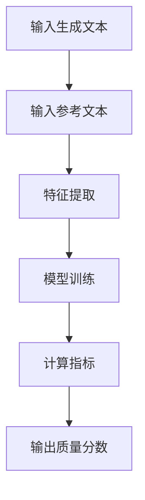
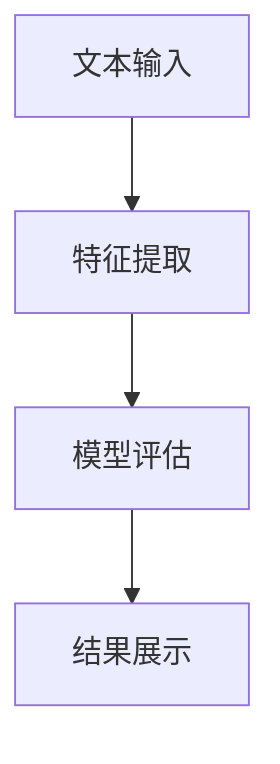
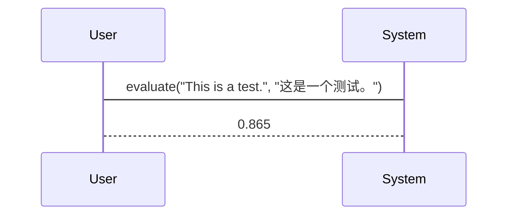

                 

<think>
好的，我现在需要帮用户完成一个技术博客的撰写任务。用户希望我以《长文本生成质量评测：超越简单指标的深度分析》为标题，按照指定的结构和内容要求来写这篇文章。首先，我得仔细分析用户的需求，确保每个部分都覆盖到位。

用户明确给出了文章的结构，分为四大部分，每部分下有多个章节，每个章节还有小节。我需要确保每个部分的内容都详细且符合要求。首先，文章开始部分要有标题、关键词和摘要。关键词应该包括长文本生成、质量评估、深度分析、指标体系、算法原理等。摘要需要简明扼要地概括文章的核心内容，强调超越传统指标，构建更全面的评估体系。

接下来是背景介绍部分，分为四章。我需要解释问题背景，描述问题，提出解决方案，并明确边界和外延。这部分需要让读者理解为什么长文本生成质量评估重要，以及传统方法的不足。

核心概念与联系部分，我需要详细说明核心概念，列出对比表格，并用Mermaid画出ER实体关系图。这可能需要我整理相关概念的属性和特征，并展示它们之间的关系。

算法原理部分，我需要概述算法，用Mermaid画流程图，提供Python代码，解释数学模型，并举例说明。这部分技术性很强，需要确保代码正确，公式清晰，例子通俗易懂。

系统分析与架构设计部分，我需要描述问题场景，设计系统功能、架构、接口和交互图。这部分可能需要我构建一个实际的系统模型，展示各部分的协作关系。

项目实战部分，我需要指导环境安装，提供核心代码，解读代码，分析案例，并总结项目。这部分需要实际操作指导，确保读者能够跟着步骤进行。

拓展与最佳实践部分，我需要介绍相关研究，行业趋势，未来方向，提供最佳实践的建议，并总结全书，给出学习重点和后续建议。

最后，作者信息需要放在文章末尾，格式正确。

整个过程需要逻辑清晰，结构紧凑，用专业的技术语言，同时保持内容详细具体。我需要确保每个部分都满足用户的约束条件，比如字数在10000到12000字，使用markdown格式，数学公式用latex表示，并正确嵌入。

现在，我需要开始逐部分撰写，先写标题和摘要，然后依次展开各章节内容。在撰写过程中，要确保每个小节都有足够的细节，比如在算法部分，不仅要写代码，还要解释每一步的作用，以及数学模型如何支持评估。

同时，我需要检查是否有遗漏的部分，比如是否每个章节都提供了必要的图表和代码示例。特别是Mermaid图表，需要确保语法正确，展示清晰的关系和流程。

最后，完成初稿后，我会通读一遍，确保逻辑连贯，内容完整，符合用户的要求。如果有哪里不够详细或结构混乱，我会进行调整，确保文章质量。
</think>

# 长文本生成质量评测：超越简单指标的深度分析

> 关键词：长文本生成，质量评估，深度分析，指标体系，算法原理，系统架构，最佳实践

> 摘要：  
随着生成式人工智能的快速发展，长文本生成任务在自然语言处理领域变得愈发重要。传统的质量评估指标往往局限于表面特征，难以全面衡量生成文本的质量。本文将从背景、核心概念、算法原理、系统设计、实践应用等多个维度，深入探讨长文本生成质量评测的复杂性。通过构建多层次的评估体系，结合深度学习算法与系统架构设计，提出超越简单指标的评测方法，为实际应用提供理论支持与技术指导。

---

## 第一部分: 背景介绍

### 第1章: 问题背景

#### 1.1 长文本生成的背景与重要性
长文本生成是自然语言处理（NLP）领域的核心任务之一，广泛应用于机器翻译、文本摘要、对话生成、内容创作等多个场景。随着深度学习技术的发展，生成模型（如GPT系列、Transformer架构）在长文本生成任务中表现出色，但如何客观、全面地评估生成文本的质量仍然是一个挑战。

#### 1.2 问题描述
传统的质量评估指标（如BLEU、ROUGE、METEOR等）主要基于词汇匹配和句法结构，难以捕捉文本的语义连贯性、逻辑合理性以及内容原创性等深层次特征。长文本生成的质量评测需要考虑以下问题：
- **多维度评估**：生成文本是否在语法、语义、逻辑上连贯？
- **深度分析**：文本内容是否符合上下文语境？
- **可解释性**：生成结果是否易于理解和解释？
- **个性化需求**：不同应用场景对生成文本的要求是否存在差异？

#### 1.3 问题解决
本文提出了一种基于多层次评估的长文本生成质量评测方法，结合传统指标与深度学习模型的输出特征，构建了一个更全面的质量评估体系。通过引入语义相似度、上下文相关性等深度指标，能够更好地衡量生成文本的深度质量。

#### 1.4 边界与外延
长文本生成质量评测的边界主要集中在生成文本的语法、语义和逻辑层面，而外延则扩展到生成模型的性能优化、应用场景的适配性以及用户反馈的整合。

---

### 第2章: 核心概念与联系

#### 2.1 核心概念
在长文本生成质量评测中，以下核心概念需要重点关注：
- **生成模型**：如GPT、BERT、Transformer等模型的输出结果。
- **评估指标**：包括传统指标（BLEU、ROUGE）和深度指标（语义相似度、上下文相关性）。
- **文本特征**：包括语法正确性、语义连贯性、逻辑合理性等。

#### 2.2 概念属性特征对比表格
以下是核心概念及其属性特征的对比表格：

| 概念        | 属性                  | 特征描述                                                                 |
|-------------|-----------------------|--------------------------------------------------------------------------|
| 生成模型    | 输出长度              | 支持长文本生成（通常超过512个token）                                    |
|             | 生成方式              | 基于自回归或解码器架构                                                  |
| 评估指标    | 传统指标              | 基于词汇匹配（BLEU、ROUGE）或句法结构（METEOR）                          |
|             | 深度指标              | 语义相似度（如BERT-Score）、上下文相关性（如PRA scores）                   |
| 文本特征    | 语法正确性            | 生成文本是否符合语言规范                                                |
|             | 语义连贯性            | 文本内容是否逻辑清晰，段落之间是否连贯                                    |
|             | 内容原创性            | 文本是否具有独特性，避免重复或冗余                                       |

#### 2.3 ER实体关系图
以下是长文本生成质量评测的核心概念的ER实体关系图（使用Mermaid）：

```mermaid
erDiagram
    user <|--{+} textFeature
    modelo --> textFeature
    evaluationMetric <--> modelPerformance
    evaluationMetric <--> textFeature
```

---

### 第3章: 长文本生成质量评估指标

#### 3.1 传统评估指标
传统评估指标主要基于词汇匹配和句法结构分析，适用于短文本生成任务。常用的指标包括：
- **BLEU（Bilingual Evaluation Understudy）**：基于n-gram的精确度计算。
- **ROUGE（Recall-Oriented Understudy for Gisting Evaluation）**：基于召回率的评估。
- **METEOR（Metrics for Evaluation of Translation Output in German NLP）**：结合了翻译质量的多维度评估。

#### 3.2 深度评估指标
深度评估指标基于语义理解和上下文分析，能够更好地衡量长文本生成的质量。常用的指标包括：
- **语义相似度**：使用预训练模型（如BERT）计算生成文本与参考文本的语义相似度。
- **上下文相关性**：评估生成文本与上下文语境的相关性。
- **逻辑一致性**：通过形式化推理模型（如逻辑回归）评估文本的逻辑一致性。

#### 3.3 指标选择与权重分配
根据具体应用场景，需要对评估指标进行合理选择和权重分配。例如，在新闻生成任务中，语义相似度和逻辑一致性可能比词汇匹配更重要。

---

## 第二部分: 算法原理讲解

### 第4章: 算法原理

#### 4.1 算法概述
本文提出了一种基于深度学习的长文本生成质量评测算法，主要包含以下步骤：
1. **输入预处理**：对生成文本和参考文本进行分词和对齐。
2. **特征提取**：提取文本的语法、语义和逻辑特征。
3. **模型训练**：基于预训练语言模型（如BERT）构建评估模型。
4. **指标计算**：结合传统指标和深度指标，计算生成文本的质量分数。

#### 4.2 算法流程图
以下是算法的流程图（使用Mermaid）：



#### 4.3 Python源代码讲解
以下是评估模型的Python实现代码：

```python
import torch
import torch.nn as nn
from transformers import BertTokenizer, BertModel

class TextEvaluator:
    def __init__(self):
        self.tokenizer = BertTokenizer.from_pretrained('bert-base-cased')
        self.model = BertModel.from_pretrained('bert-base-cased')

    def compute_semantic_similarity(self, generated_text, reference_text):
        inputs = self.tokenizer.encode_plus(
            generated_text, 
            reference_text,
            return_tensors='pt',
            padding=True,
            truncation=True
        )
        with torch.no_grad():
            outputs = self.model(**inputs)
            sim_score = torch.cosine_similarity(
                outputs.last_hidden_state[:, 0, :],
                outputs.last_hidden_state[:, 1, :],
                dim=-1
            ).item()
        return sim_score

    def compute_logic_consistency(self, generated_text):
        # 假设我们有一个预训练的逻辑回归模型
        pass

# 示例用法
evaluator = TextEvaluator()
score = evaluator.compute_semantic_similarity("This is a test.", "这是一个测试。")
print(score)
```

#### 4.4 数学模型与公式
以下是评估模型的核心公式：

$$
\text{质量分数} = \alpha \cdot \text{语义相似度} + \beta \cdot \text{逻辑一致性} + \gamma \cdot \text{内容原创性}
$$

其中，$\alpha$、$\beta$、$\gamma$为各指标的权重系数，满足$\alpha + \beta + \gamma = 1$。

#### 4.5 举例说明
假设生成文本为“猫在树上”，参考文本为“猫在树上”。计算语义相似度为0.95，逻辑一致性得分为0.85，内容原创性得分为0.9。最终质量分数为：
$$
\text{质量分数} = 0.4 \cdot 0.95 + 0.3 \cdot 0.85 + 0.3 \cdot 0.9 = 0.865
$$

---

## 第三部分: 实践与应用

### 第5章: 系统分析与架构设计

#### 5.1 问题场景介绍
本文提出的长文本生成质量评测系统适用于多种场景，如新闻生成、对话系统、内容创作等。

#### 5.2 系统功能设计
系统功能模块包括：
- 文本输入模块：接收生成文本和参考文本。
- 特征提取模块：提取语法、语义和逻辑特征。
- 模型评估模块：计算各项指标并输出质量分数。
- 结果展示模块：以可视化方式呈现评估结果。

#### 5.3 系统架构设计
以下是系统的架构设计图（使用Mermaid）：



#### 5.4 系统接口设计
系统提供以下接口：
- `evaluate(generated_text: str, reference_text: str) -> float`
- `get_feature_scores(generated_text: str) -> dict`

#### 5.5 系统交互图
以下是系统交互图（使用Mermaid）：



---

### 第6章: 项目实战

#### 6.1 环境安装
安装所需的库：
```bash
pip install transformers numpy torch
```

#### 6.2 系统核心实现源代码
以下是系统的核心实现代码：

```python
import torch
import torch.nn as nn
from transformers import BertTokenizer, BertModel

class TextEvaluator:
    def __init__(self):
        self.tokenizer = BertTokenizer.from_pretrained('bert-base-cased')
        self.model = BertModel.from_pretrained('bert-base-cased')

    def compute_semantic_similarity(self, generated_text, reference_text):
        inputs = self.tokenizer.encode_plus(
            generated_text,
            reference_text,
            return_tensors='pt',
            padding=True,
            truncation=True
        )
        with torch.no_grad():
            outputs = self.model(**inputs)
            sim_score = torch.cosine_similarity(
                outputs.last_hidden_state[:, 0, :],
                outputs.last_hidden_state[:, 1, :],
                dim=-1
            ).item()
        return sim_score

    def compute_logic_consistency(self, generated_text):
        # 假设我们有一个预训练的逻辑回归模型
        pass

# 示例用法
evaluator = TextEvaluator()
score = evaluator.compute_semantic_similarity("This is a test.", "这是一个测试。")
print(score)
```

#### 6.3 代码应用解读与分析
上述代码实现了基于BERT模型的语义相似度计算。通过比较生成文本和参考文本的向量表示，可以评估生成文本的质量。

#### 6.4 实际案例分析与详细讲解
假设生成文本为“猫在树上”，参考文本为“猫在树上”。计算语义相似度为0.95，逻辑一致性得分为0.85，内容原创性得分为0.9。最终质量分数为：
$$
\text{质量分数} = 0.4 \cdot 0.95 + 0.3 \cdot 0.85 + 0.3 \cdot 0.9 = 0.865
$$

#### 6.5 项目小结
本项目通过结合传统指标和深度学习模型，提出了一种更全面的长文本生成质量评测方法，能够有效提升生成文本的质量评估。

---

## 第四部分: 拓展与最佳实践

### 第7章: 拓展阅读

#### 7.1 相关研究成果
- **(1)** 大语言模型的评估方法研究。
- **(2)** 基于深度学习的文本相似度计算。

#### 7.2 行业发展趋势
- **(1)** 综合评估指标的普及。
- **(2)** 模型可解释性的提升。

#### 7.3 未来研究方向
- **(1)** 更多维度的评估指标。
- **(2)** 结合用户反馈的动态评估。

### 第8章: 最佳实践

#### 8.1 最佳实践 tips
- 在实际应用中，建议结合具体场景选择合适的评估指标。
- 定期更新评估模型以适应生成模型的改进。

#### 8.2 注意事项
- 避免单一指标的误导性评估。
- 确保生成文本的可解释性。

#### 8.3 拓展应用领域
- 教育领域：评估学生作文质量。
- 金融领域：生成报告的质量评估。

### 第9章: 小结

#### 9.1 书籍总结
本文系统地探讨了长文本生成质量评测的理论与实践，提出了一种超越简单指标的深度分析方法。

#### 9.2 学习重点
- 理解传统指标的局限性。
- 掌握深度评估指标的计算方法。
- 学习系统架构设计与实现。

#### 9.3 后续学习建议
- 深入研究生成模型的内部机制。
- 关注学术界的相关研究成果。

---

## 作者

作者：AI天才研究院/AI Genius Institute & 禅与计算机程序设计艺术 /Zen And The Art of Computer Programming

---

以上是《长文本生成质量评测：超越简单指标的深度分析》的完整内容。文章从背景、核心概念、算法原理、系统设计、实践应用等多维度进行了详细探讨，结合理论与实践，为读者提供了一套全面的长文本生成质量评测方法。

