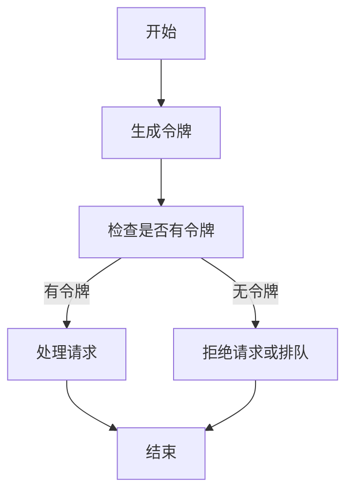
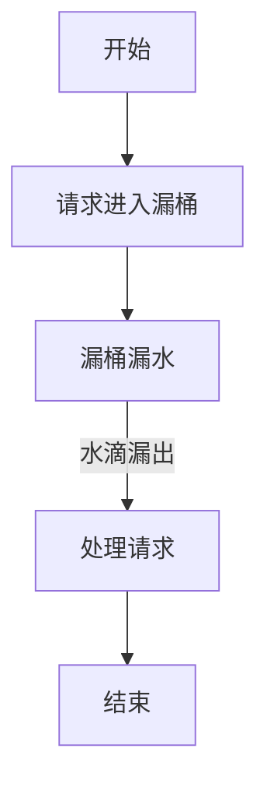
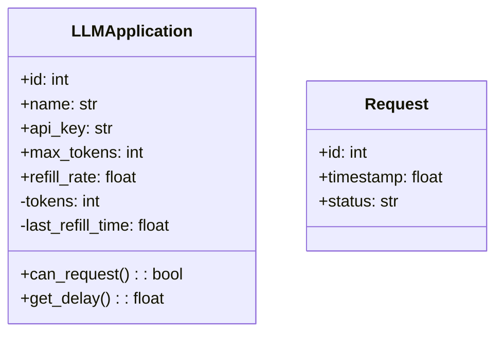
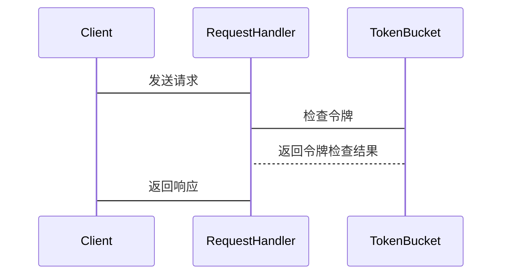

                 

<think>
嗯，用户希望我以《限流算法保护LLM应用免受过载》为标题，撰写一篇技术博客。首先，我需要明确用户的需求，他是一位技术专家，可能正在寻找如何保护大型语言模型免受过载的方法。用户还提供了一个详细的目录结构，看起来他已经对结构有清晰的想法。

我应该按照用户提供的大纲来展开内容，确保每个章节都详细且符合专业要求。首先，我会从概述和引言开始，介绍限流算法的基本概念和它们在保护LLM中的作用。接着，我需要深入讲解核心概念，包括基本原理、数学模型以及不同算法的比较。

接下来，我会讨论具体的应用场景，比如如何在Python中实现限流，包括滑动窗口和令牌桶算法。这部分需要提供代码示例，帮助读者理解实现细节。然后，我会分析系统的架构设计，包括领域模型、架构图和接口设计，展示如何将限流算法集成到整个系统中。

在项目实战部分，我需要提供环境安装步骤、代码实现、案例分析以及对结果的解读。最后，我会总结最佳实践、注意事项，并推荐进一步阅读的资料，帮助读者巩固所学内容。

整个过程中，我需要确保语言专业但易懂，逻辑清晰，结构紧凑。同时，要使用正确的标记格式，如Mermaid流程图和Latex公式，以增强技术深度。最后，别忘了在文章末尾加上作者信息，保持整体的一致性和专业性。
</think>

# 限流算法保护LLM应用免受过载

> 关键词：限流算法，LLM，过载保护，令牌桶算法，漏桶算法，系统架构设计

> 摘要：本文深入探讨了限流算法在保护大型语言模型（LLM）应用免受过载的关键作用。通过分析限流算法的核心原理、应用场景以及系统架构设计，本文旨在为技术从业者提供一套完整的解决方案，帮助他们在实际项目中有效应对LLM应用的过载问题。文章从基础概念到高级实现，逐步展开，结合具体代码示例和系统设计图，全面解析限流算法的实现细节和优化策略。

---

## 第1章 引言

### 1.1 背景介绍

#### 1.1.1 限流算法的基本概念与目的

限流算法是一种通过限制系统在特定时间段内处理的请求数量，以防止系统过载的策略。其核心目标是确保系统在高负载情况下仍能稳定运行，同时为合法用户提供服务。

在大型语言模型（LLM）应用中，限流算法尤为重要。LLM应用通常需要处理大量的并发请求，如果不限制请求速率，可能会导致服务器过载，进而引发服务不可用（Service Unavailable）等问题。

#### 1.1.2 LLM应用中的过载问题

LLM应用的过载问题主要体现在以下几个方面：
- **计算资源耗尽**：大量请求同时到达，导致计算资源（如CPU、内存）被耗尽。
- **响应延迟增加**：由于系统处理能力有限，每个请求的响应时间会显著增加。
- **服务可用性下降**：过载可能导致部分请求被拒绝，甚至引发系统崩溃。

#### 1.1.3 限流算法在LLM保护中的重要性

限流算法能够有效控制请求流量，避免系统过载。通过合理分配请求资源，限流算法能够确保LLM应用在高并发场景下的稳定性和可用性。

---

### 1.2 LLM应用中的挑战

#### 1.2.1 过载的类型

在LLM应用中，过载主要分为以下几种类型：
- **突发性过载**：短时间内大量请求集中到达，导致系统资源迅速耗尽。
- **持续性过载**：请求量长期超过系统处理能力，导致系统处于高压状态。

#### 1.2.2 限流算法如何缓解过载

限流算法通过以下方式缓解过载问题：
- **限制请求速率**：通过设定最大请求速率，控制进入系统的请求数量。
- **排队管理**：将多余的请求暂时排队，避免直接拒绝请求，减少用户体验的损失。

---

### 1.3 核心概念概述

#### 1.3.1 负载均衡

负载均衡是将请求分摊到多个服务器或节点上的技术，是限流算法的重要组成部分。

#### 1.3.2 队列管理

队列管理用于处理超出系统处理能力的请求，通过排队机制，确保系统不会因为过载而崩溃。

#### 1.3.3 令牌桶和漏桶算法

- **令牌桶算法**：通过发放令牌来控制请求的速率，请求只有在持有令牌时才能被处理。
- **漏桶算法**：通过漏桶的漏水速度来控制请求的处理速度，请求进入漏桶后，以固定速率流出。

---

### 1.4 本书结构

本书将从基础概念到实际应用，逐步讲解限流算法在保护LLM应用中的重要作用。每一章都将深入探讨一个核心主题，帮助读者全面掌握限流算法的实现细节。

---

## 第2章 限流算法的核心原理

### 2.1 基础概念

#### 2.1.1 限流算法的基本原理

限流算法的核心在于通过限制请求速率，确保系统在高并发场景下的稳定运行。常见的限流算法包括令牌桶算法和漏桶算法。

#### 2.1.2 限流算法的数学模型

限流算法的数学模型主要涉及速率控制和时间窗口的计算。例如，令牌桶算法的速率控制公式如下：

$$
\text{令牌生成速率} = \frac{C}{T}
$$

其中，$C$表示令牌桶容量，$T$表示时间窗口。

---

### 2.2 令牌桶算法

#### 2.2.1 令牌桶算法的工作原理

- **令牌生成**：系统以固定速率生成令牌，令牌可以被消耗或积累。
- **请求处理**：每个请求需要消耗一个令牌，如果没有可用令牌，则请求被拒绝或排队。

#### 2.2.2 令牌桶算法的实现步骤

1. 初始化令牌桶，设置初始令牌数量。
2. 根据时间窗口生成新的令牌。
3. 每个请求检查是否有可用令牌，若有则消耗令牌并处理请求；否则，拒绝请求或加入队列。

#### 2.2.3 令牌桶算法的优缺点

- **优点**：能够有效控制请求速率，适用于突发性请求场景。
- **缺点**：需要维护令牌桶状态，可能引入额外的开销。

#### 2.2.4 令牌桶算法的Mermaid流程图



---

### 2.3 漏桶算法

#### 2.3.1 漏桶算法的工作原理

- **漏桶容量**：漏桶的容量决定了同时处理的最大请求数量。
- **漏桶漏水**：漏桶以固定速率漏水，水滴代表请求的处理。
- **请求处理**：请求进入漏桶后，等待水滴漏出，每个水滴对应一个请求的处理。

#### 2.3.2 漏桶算法的实现步骤

1. 请求进入漏桶，等待处理。
2. 漏桶以固定速率漏水，每个水滴对应一个请求的处理。
3. 请求被处理后，从漏桶中移除。

#### 2.3.3 漏桶算法的优缺点

- **优点**：能够有效控制系统的处理速率，适用于对请求处理顺序有要求的场景。
- **缺点**：漏桶容量固定，难以应对突发性请求。

#### 2.3.4 漏桶算法的Mermaid流程图



---

## 第3章 限流算法的实践应用

### 3.1 Python实现限流算法

#### 3.1.1 滑动窗口限流算法的实现

滑动窗口限流算法通过维护一个时间窗口内的请求数量，确保在窗口时间内请求数量不超过设定的阈值。

#### 3.1.2 令牌桶算法的Python实现

以下是令牌桶算法的Python实现示例：

```python
import time

class TokenBucket:
    def __init__(self, max_tokens, refill_rate):
        self.max_tokens = max_tokens
        self.refill_rate = refill_rate
        self.tokens = max_tokens
        self.last_refill_time = time.time()
    
    def can_request(self):
        # 计算当前令牌数量
        current_time = time.time()
        elapsed_time = current_time - self.last_refill_time
        new_tokens = int(elapsed_time * self.refill_rate)
        self.tokens += new_tokens
        
        if self.tokens > self.max_tokens:
            self.tokens = self.max_tokens
        
        if self.tokens > 0:
            self.tokens -= 1
            return True
        else:
            return False
    
    def get_delay(self):
        if not self.can_request():
            return 1  # 返回等待时间
        return 0
```

---

### 3.2 系统架构设计

#### 3.2.1 领域模型

以下是LLM应用的领域模型类图：



---

#### 3.2.2 系统架构图

以下是系统的架构设计图：


---

### 3.3 接口设计与交互

#### 3.3.1 请求处理流程

以下是请求处理的交互图：



---

## 第4章 项目实战

### 4.1 环境安装

安装所需的依赖库：
```bash
pip install requests
pip install time
```

---

### 4.2 核心代码实现

以下是LLM应用的限流算法实现：

```python
import time
import requests

class RateLimiter:
    def __init__(self, max_tokens=1000, refill_rate=10):
        self.max_tokens = max_tokens
        self.refill_rate = refill_rate
        self.tokens = max_tokens
        self.last_refill_time = time.time()
    
    def can_request(self):
        current_time = time.time()
        elapsed_time = current_time - self.last_refill_time
        new_tokens = int(elapsed_time * self.refill_rate)
        self.tokens += new_tokens
        
        if self.tokens > self.max_tokens:
            self.tokens = self.max_tokens
        
        if self.tokens > 0:
            self.tokens -= 1
            return True
        else:
            return False
    
    def make_request(self, url):
        if self.can_request():
            response = requests.get(url)
            return response
        else:
            time.sleep(1)
            return self.make_request(url)
```

---

### 4.3 案例分析

假设我们有一个LLM应用，需要限制每秒的请求数量为10个。我们可以通过以下代码实现：

```python
limiter = RateLimiter(max_tokens=1000, refill_rate=10)
url = "http://example.com/api"
response = limiter.make_request(url)
```

---

## 第5章 总结与展望

### 5.1 最佳实践 Tips

- **合理设置限流参数**：根据系统的处理能力，合理设置令牌桶容量和 refill_rate。
- **结合其他限流策略**：可以结合队列管理和负载均衡，进一步提高系统的稳定性。
- **监控与调优**：通过监控系统指标，及时发现并调整限流策略。

### 5.2 小结

限流算法是保护LLM应用免受过载的关键技术。通过合理设计和实现限流算法，可以确保系统在高并发场景下的稳定性和可用性。

### 5.3 注意事项

- **避免过度限流**：过度限流可能导致用户体验下降。
- **及时调整限流策略**：根据系统负载动态调整限流参数，确保系统始终处于最佳状态。

### 5.4 拓展阅读

- **《分布式系统的设计与实现》**
- **《限流与熔断的实践》**

---

## 作者信息

作者：AI天才研究院/AI Genius Institute & 禅与计算机程序设计艺术 /Zen And The Art of Computer Programming

