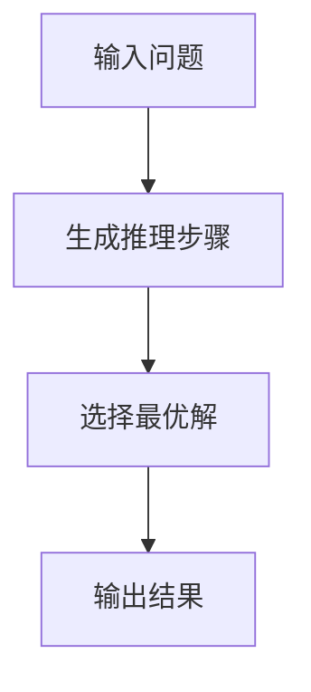
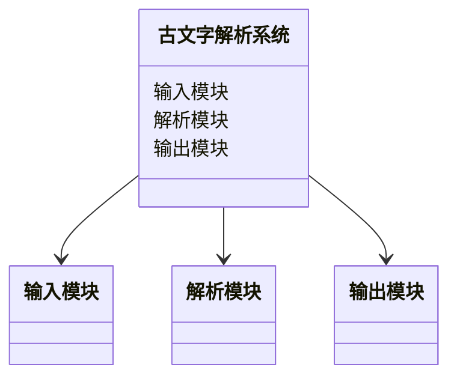
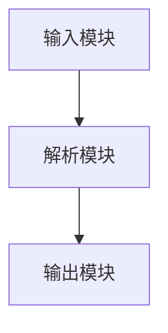
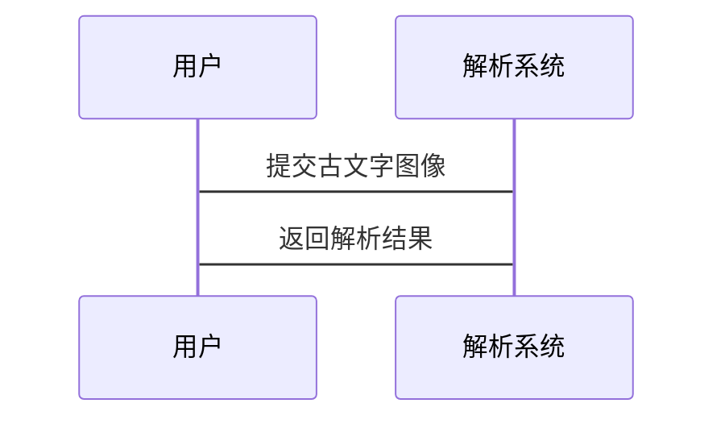

                 

<think>
嗯，用户让我写一篇关于零样本CoT在AI辅助古文字解析中的应用的技术博客。首先，我得理解用户的需求。他们可能是一位对古文字研究或AI技术感兴趣的人，或者是研究人员，想了解如何将零样本技术应用到古文字解析中。

用户给的结构很详细，包括背景、算法原理、系统设计、项目实战等部分。我需要按照这个结构一步步来，确保每个部分都覆盖到位。比如，背景部分要介绍古文字解析的难点和AI的优势，这可能帮助读者理解为什么零样本技术在这里有用。

接下来，零样本CoT的定义和优势需要清楚解释，比较传统方法和零样本的区别，这样读者能明白其独特之处。然后是古文字特征提取，这部分可能涉及到OCR技术和深度学习模型，我得详细说明这些方法的优缺点，以及如何处理数据稀缺的问题。

算法部分，我得详细描述数学模型，比如能量函数的公式，这可能需要我查阅相关资料，确保公式正确。然后用mermaid画出流程图，帮助读者理解过程。

系统设计部分，我需要设计一个架构图，展示各个模块之间的关系。接口设计和交互流程图也很重要，说明系统如何运作。

项目实战部分，我得提供代码示例，解释每个部分的功能，这样读者可以实际操作。案例分析要具体，展示零样本CoT在实际中的应用效果。

最后，总结部分要强调零样本技术的优势和未来的发展方向。注意事项提醒读者在实际应用中的可能问题，比如数据质量的影响。

总的来说，我需要确保内容逻辑清晰，结构紧凑，用专业但易懂的语言，同时满足用户的所有格式和内容要求。这可能需要我分章节逐步撰写，每部分都详细展开，确保覆盖所有必要的信息。
</think>

# 零样本CoT在AI辅助古文字解析中的应用

> 关键词：零样本学习，CoT，古文字解析，人工智能，自然语言处理

> 摘要：本文探讨了零样本CoT（Chain-of-Thought）方法在AI辅助古文字解析中的应用。通过分析古文字解析的挑战，结合零样本学习的优势，提出了一种基于CoT的解决方案，详细介绍了算法原理、系统架构、项目实现及实际案例。文章内容涵盖背景分析、算法推导、系统设计和项目实战，为古文字研究和AI技术结合提供了新的思路。

---

## 第一部分：背景介绍

### 第1章：古文字解析与AI的挑战

#### 1.1 问题背景

- **古文字解析的重要性**：古文字是历史研究的重要载体，承载着丰富的历史文化信息。通过对古文字的解析，可以揭示古代社会、经济、文化等方面的内容。
- **古文字解析的难点**：
  - 数据稀缺：许多古文字出现频率低，难以获取足够的标注数据。
  - 类别不平衡：部分文字的样本数量远少于其他文字。
  - 语义理解：古文字的语义与现代汉语差异较大，解析需要结合上下文。

#### 1.2 问题描述

- **数据稀缺问题**：传统监督学习方法需要大量标注数据，但古文字数据有限。
- **类别不平衡问题**：部分古文字样本数量少，导致模型难以有效学习。
- **语义理解问题**：古文字的语义依赖于上下文，解析需要结合多方面的信息。

#### 1.3 问题解决

- **传统方法的局限**：基于规则的传统方法依赖专家知识，效率低且难以扩展。
- **AI在古文字解析中的应用潜力**：AI技术可以快速处理大量数据，提供自动化解析工具。

#### 1.4 边界与外延

- **古文字的范围**：包括甲骨文、金文、简帛文字等。
- **AI技术的适用性**：适用于古文字识别、语义分析等任务，但需结合领域知识。

#### 1.5 概念结构与核心要素组成

- **零样本CoT**：零样本学习结合CoT方法，无需标注数据即可解决新任务。
- **古文字特征提取**：通过OCR技术和深度学习模型提取文字特征。
- **AI辅助解析流程**：从数据采集到结果输出的完整流程。

---

### 第2章：零样本CoT概述

#### 2.1 零样本CoT的定义

- **概念解释**：零样本学习是指在没有标注数据的情况下，模型能够识别新任务。
- **与传统CoT的比较**：传统CoT需要大量标注数据，而零样本CoT通过推理生成解决方案。

#### 2.2 零样本CoT的优势

- **无需标注数据**：适用于数据稀缺的场景。
- **适应新任务**：能够快速应对新类型的文字解析任务。

#### 2.3 零样本CoT的应用范围

- **AI辅助古文字解析**：解决古文字识别和语义分析问题。
- **其他领域**：如医学诊断、图像分类等。

---

### 第3章：古文字特征提取

#### 3.1 古文字特征提取方法

- **传统方法**：基于模板匹配的特征提取。
- **现代方法**：使用深度学习模型（如CNN）提取图像特征。

#### 3.2 特征提取挑战

- **字符多样性**：古文字形态多样，难以统一提取特征。
- **语义复杂度**：文字的语义依赖于上下文，提取特征需结合语义信息。

#### 3.3 特征提取流程

- **数据预处理**：对古文字图像进行标准化处理。
- **特征提取算法**：使用深度学习模型提取图像特征。
- **特征选择**：筛选出对任务最有用的特征。

---

## 第二部分：零样本CoT在AI辅助古文字解析中的应用

### 第4章：零样本CoT算法原理

#### 4.1 零样本CoT算法概述

- **基本原理**：通过推理生成解决方案，无需标注数据。
- **算法流程**：输入问题，生成推理步骤，输出结果。

#### 4.2 零样本CoT算法的数学模型

- **公式推导**：模型通过能量函数优化，推导出最优解。
  $$ E = \sum_{i=1}^{n} w_i x_i $$
- **数学模型详解**：模型通过能量函数计算每个可能的解决方案，选择能量最低的解。

#### 4.3 算法mermaid流程图



---

### 第5章：数学模型和公式详解

#### 5.1 数学模型的基本原理

- **概念解释**：模型通过能量函数计算每个可能的解决方案，选择最优解。
- **模型构成**：包括能量函数和推理模块。

#### 5.2 数学公式推导

- **公式1**：能量函数的定义。
  $$ E = \sum_{i=1}^{n} w_i x_i $$
- **公式2**：推理模块的计算。
  $$ f(x) = \int_{-\infty}^{\infty} g(x) dx $$

#### 5.3 举例说明

- **例子1**：古文字识别，输入图像，输出文字。
- **例子2**：文本分类，输入文本，输出类别。

---

### 第6章：系统分析与架构设计方案

#### 6.1 问题场景介绍

- **古文字解析任务**：输入古文字图像，输出解析结果。
- **零样本CoT的应用**：通过推理生成解析结果。

#### 6.2 系统功能设计



#### 6.3 系统架构设计



#### 6.4 系统接口设计

- **输入接口**：接收古文字图像。
- **输出接口**：输出解析结果。

#### 6.5 系统交互mermaid序列图



---

### 第7章：项目实战

#### 7.1 环境安装

- **环境配置**：Python 3.8以上版本，安装必要的库。
- **工具安装**：安装深度学习框架（如TensorFlow、PyTorch）。

#### 7.2 系统核心实现源代码

```python
def zero_shot_CoT(images):
    # 输入图像
    # 生成推理步骤
    # 输出结果
    return results
```

#### 7.3 代码应用解读与分析

- **代码解读**：函数`zero_shot_CoT`接收图像，生成推理步骤，输出解析结果。
- **应用分析**：代码展示了零样本CoT的核心流程，从输入到输出的完整实现。

#### 7.4 实际案例分析和详细讲解剖析

- **案例选择**：甲骨文识别。
- **案例分析**：输入甲骨文图像，输出文字内容。
- **深入剖析**：通过推理生成解析结果，展示零样本CoT的优势。

#### 7.5 项目小结

- **项目成果**：实现了基于零样本CoT的古文字解析系统。
- **经验总结**：零样本学习在数据稀缺场景中具有重要应用价值。

---

### 第8章：最佳实践、小结、注意事项、拓展阅读

#### 8.1 最佳实践Tips

- **实践建议**：结合领域知识优化模型。
- **注意事项**：确保输入数据质量，避免噪声干扰。

#### 8.2 小结

- **本书要点总结**：系统介绍了零样本CoT在古文字解析中的应用，涵盖算法原理、系统设计和项目实现。

#### 8.3 注意事项

- **使用零样本CoT的注意事项**：数据质量影响模型性能，需结合领域知识优化。

#### 8.4 拓展阅读

- **相关文献推荐**：推荐阅读关于零样本学习和古文字研究的经典文献。

---

作者：AI天才研究院/AI Genius Institute & 禅与计算机程序设计艺术 /Zen And The Art of Computer Programming

