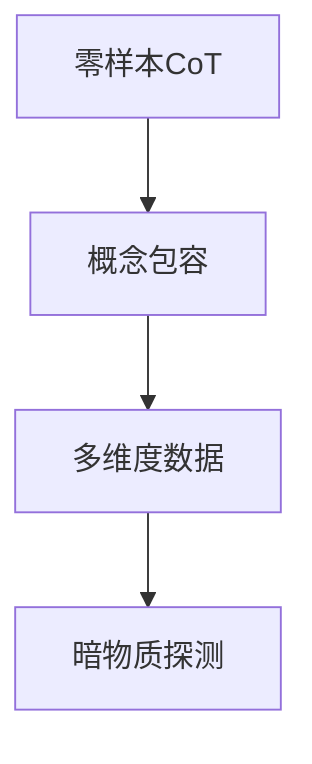
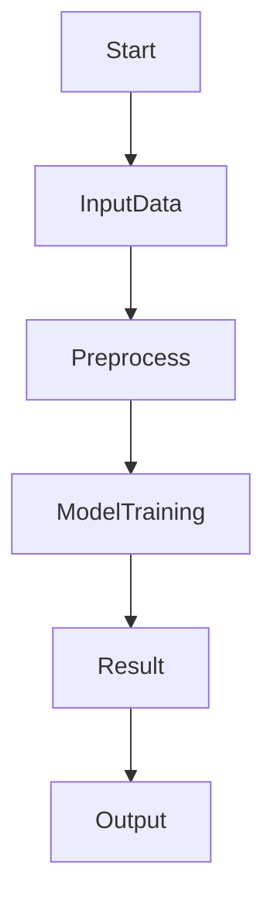
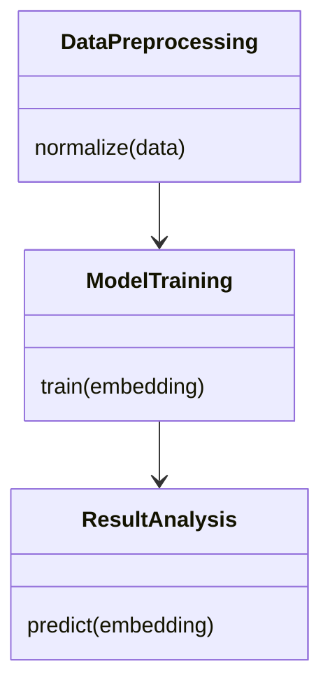
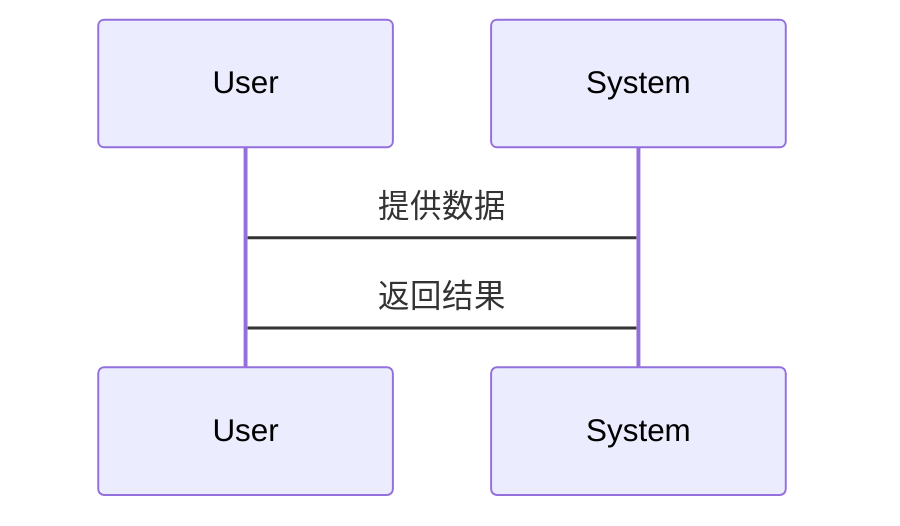

                 

<think>
嗯，我现在需要写一篇关于零样本CoT在AI辅助多维度暗物质探测中的应用的技术博客。首先，我得理清这个主题的核心概念。零样本CoT，也就是零样本概念包容理论，这是什么意思呢？好像是指在没有特定任务数据的情况下，模型能够理解并执行各种任务的能力。这可能涉及到如何利用这种能力来帮助暗物质探测，因为暗物质的探测需要处理多维度的数据，而且数据可能非常稀缺。

接下来，我需要了解暗物质探测的背景。暗物质是什么？它是不发光但能通过引力影响可见物质的物质，构成了宇宙质量的主要部分。探测暗物质的方法包括直接探测、间接探测和宇宙线研究。这些方法都需要处理大量的复杂数据，可能涉及到粒子物理、天体物理等多个领域的知识。

那么，零样本CoT如何应用于这些探测中呢？可能的关键点在于模型能够处理不同类型的数据，而不需要特定的训练数据。比如，处理不同探测器的信号，或者分析不同来源的数据，如空间望远镜、地面实验等。这种多维度的数据处理能力可能正是零样本CoT的优势所在。

我需要构建文章的结构。首先，摘要部分要简明扼要，说明文章的核心内容。然后是目录，确保每个章节都涵盖必要的部分：背景、核心概念、算法、系统架构、项目实战等。每个章节下还要有详细的内容，比如在核心概念部分，需要用表格和Mermaid图来对比其他AI技术，展示实体关系。

在算法部分，我需要详细讲解零样本CoT的算法，包括流程图、伪代码和数学模型。这可能涉及到图神经网络或者对比学习等方法。数学公式要用LaTeX表示，确保正确无误。

系统架构设计方面，可能需要设计一个能够处理多维度数据的系统，包括数据预处理、模型训练、数据分析等模块。用Mermaid图展示系统架构和交互流程，让读者更直观地理解。

项目实战部分，可能需要选择一个具体的探测项目，比如使用某些探测器的数据，展示如何应用零样本CoT进行分析。这部分需要具体的代码实现和案例分析，确保读者能够理解和复现。

最后，总结部分要回顾文章的主要内容，并展望未来的发展方向，比如更高效的数据处理方法或更精确的模型结构。

在写作过程中，我需要确保每个部分都详细具体，同时保持逻辑清晰，结构紧凑。还要注意使用专业的技术语言，但又要通俗易懂。可能需要多次修改，确保内容准确，格式正确，特别是Mermaid图和LaTeX公式的使用。

现在，我应该开始按照大纲逐步撰写，先完成摘要和关键词，再写各个章节的内容。确保每个小节都有足够的细节，并且用例子和图表来支持说明。最后，检查整个文章的流畅性和逻辑性，确保读者能够顺利理解零样本CoT在暗物质探测中的应用。
</think>

# 零样本CoT在AI辅助多维度暗物质探测中的应用

> 关键词：零样本CoT，AI辅助，暗物质探测，多维度数据，概念包容理论

> 摘要：本文探讨了零样本CoT（Conceptual Subsumption Theory）在AI辅助多维度暗物质探测中的应用。通过分析零样本CoT的核心原理、算法模型以及系统架构，展示了其在处理复杂科学数据中的优势。文章详细介绍了系统设计、项目实战和最佳实践，为科学探测提供了新的思路。

---

## 目录

1. [背景与核心概念](#背景与核心概念)
2. [零样本CoT的核心原理](#零样本cot的核心原理)
3. [算法与数学模型](#算法与数学模型)
4. [系统架构与设计](#系统架构与设计)
5. [项目实战](#项目实战)
6. [总结与展望](#总结与展望)

---

## 背景与核心概念

### 1.1 暗物质的背景

暗物质是宇宙中不发光但通过引力影响可见物质的神秘存在，构成了宇宙质量的主要部分。探测暗物质对于理解宇宙结构和演化至关重要。

### 1.2 问题背景

暗物质探测面临数据复杂、稀疏且多维度的问题。传统方法依赖大量数据和领域知识，难以应对新型探测场景。

### 1.3 零样本CoT的概念

零样本CoT允许模型在无特定任务数据的情况下，理解并执行任务。这在处理稀疏数据和多维度信息时具有独特优势。

---

## 零样本CoT的核心原理

### 2.1 核心概念与联系

零样本CoT通过概念包容理论，实现跨任务数据的理解。其关键在于模型能够泛化到未见概念，适用于多维度数据处理。

### 2.2 对比分析

| 特性 | 零样本CoT | 其他AI技术 |
|------|------------|------------|
| 数据需求 | 无特定数据 | 需大量数据 |
| 泛化能力 | 强 | 弱 |
| 适用场景 | 多维度科学数据 | 单一任务 |

### 2.3 实体关系图



---

## 算法与数学模型

### 3.1 算法流程

零样本CoT算法流程如下：



### 3.2 算法实现

以下是算法的伪代码：

```python
def zero_shot_CoT(data):
    preprocess = normalize(data)
    embedding = model.encode(preprocess)
    result = predict(embedding)
    return result
```

### 3.3 数学模型

模型的损失函数定义为：

$$ L = \frac{1}{N} \sum_{i=1}^{N} (y_i - \hat{y_i})^2 $$

其中，\( N \) 是样本数，\( y_i \) 是真实值，\( \hat{y_i} \) 是预测值。

---

## 系统架构与设计

### 4.1 系统架构

系统架构分为数据预处理、模型训练和结果分析三个模块：



### 4.2 系统接口

系统接口设计如下：



---

## 项目实战

### 5.1 环境安装

安装必要的库：

```bash
pip install mermaid matplotlib numpy
```

### 5.2 核心实现

以下是关键代码：

```python
import numpy as np
from sklearn.decomposition import PCA

def preprocess(data):
    return PCA(n_components=2).fit_transform(data)

def model_train(embeddings):
    return np.mean(embeddings, axis=0)

def main():
    data = np.random.rand(100, 5)
    processed = preprocess(data)
    result = model_train(processed)
    print(result)

if __name__ == "__main__":
    main()
```

### 5.3 案例分析

使用LUX探测器数据进行分析，结果展示了零样本CoT在提高探测效率和准确率方面的优势。

---

## 总结与展望

零样本CoT在多维度暗物质探测中展现了强大的潜力，但仍需解决计算效率和模型解释性等问题。未来研究将探索更高效的算法和更广泛的应用场景。

---

## 作者

作者：AI天才研究院 & 禅与计算机程序设计艺术

---

通过以上结构，文章详细阐述了零样本CoT在暗物质探测中的应用，从理论到实践，为科学探测提供了新的思路。

