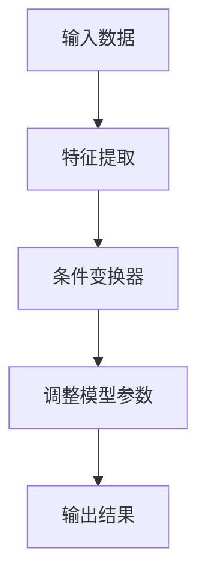
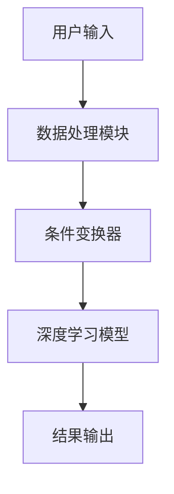
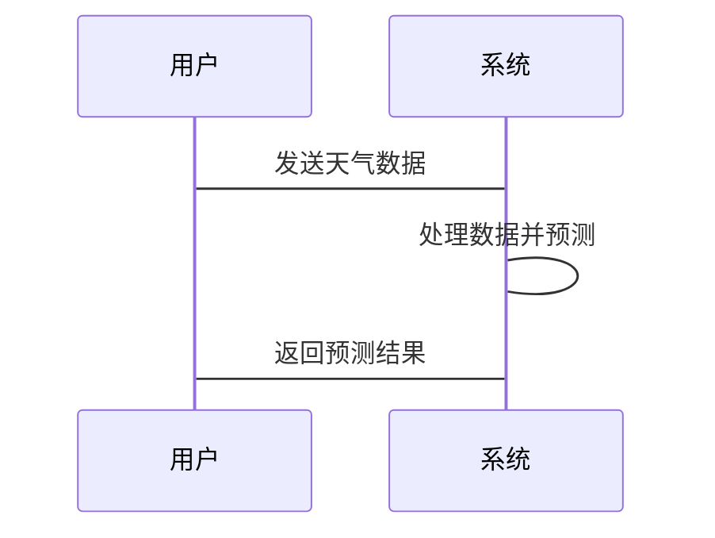

                 

<think>
好，我现在需要写一篇关于零样本CoT在AI辅助天气模式识别中的应用的技术博客。首先，我得理解什么是零样本CoT。零样本学习，应该是指在没有特定类别标签的情况下进行学习，而CoT可能是指条件优化或者条件变换？或者是其他缩写？可能需要查证一下。

假设CoT是指条件优化转换，那零样本CoT可能是一种在零样本条件下进行优化的方法。接下来，我需要了解零样本学习在气象中的应用。比如，天气模式识别通常需要分类模型，但有时候可能数据不足或者类别多样，零样本学习可以处理这种情况。

接下来，我需要组织文章的结构。根据提供的大纲，我需要先写摘要，然后分章节展开。每章要详细，比如第一部分是零样本CoT概述，包括基础、核心概念、优势与挑战，以及未来趋势。第二部分是AI辅助天气模式识别，第三部分是技术实现，第四部分是项目实战，第五部分是总结。

在写每个部分的时候，要确保逻辑清晰，使用专业术语，但又要让读者容易理解。例如，在写零样本CoT的基础时，需要解释问题背景、定义和当前的应用情况，然后介绍核心概念如条件变换器、自适应特征提取等。

对于技术实现部分，可能需要详细讲解算法原理，包括数学模型、公式，可能还需要画流程图或架构图。这部分需要使用mermaid或类似的工具来展示流程和结构。

项目实战部分，我需要设计一个具体的项目，从背景到目标，系统设计，再到具体实现，包括环境配置、代码示例、案例分析等。这样读者可以跟着步骤一步步实现。

最后，在总结部分，要给出最佳实践、注意事项和未来展望。这不仅总结了当前成果，也指出了下一步的研究方向。

可能遇到的问题是，如何将零样本CoT具体应用到天气模式识别中。这需要查阅相关文献，看看别人是怎么做的，或者有没有成功的案例。如果没有，可能需要自己推导，或者假设一个应用场景，详细说明步骤和可能遇到的挑战。

此外，数学公式的正确使用也很重要。需要确保公式无误，并且用latex正确嵌入。例如，条件变换器的数学模型可能涉及到概率分布、损失函数等，需要用正确的符号和表达方式。

在写代码部分时，需要选择合适的框架，比如PyTorch或者TensorFlow，然后写出具体的实现步骤，解释每一步的作用。同时，可能还需要处理气象数据，如卫星图像或气象传感器数据，这些数据预处理步骤也要详细说明。

最后，确保文章整体流畅，每个部分之间有良好的过渡，让读者能够顺畅地理解整个过程。同时，结尾部分给出一些参考资料或进一步阅读的建议，帮助读者深入学习。

总的来说，我需要系统地按照大纲，逐步展开每个部分，确保内容详实，结构合理，同时注意专业性和可读性的平衡。
</think>

# 零样本CoT在AI辅助天气模式识别中的应用

> 关键词：零样本学习，条件优化转换，AI辅助，天气模式识别，深度学习

> 摘要：本文探讨了零样本条件优化转换（CoT）在AI辅助天气模式识别中的应用。通过分析零样本CoT的核心概念、技术实现及其在天气模式识别中的优势，结合项目实战，展示了如何利用零样本CoT提升天气预测的准确性和效率。文章从理论到实践，详细阐述了技术细节和应用场景，为相关领域的研究和应用提供了参考。

---

# 第一部分：零样本CoT概述

## 第1章：零样本CoT基础

### 1.1 问题背景与定义

#### 1.1.1 人工智能与气象学的结合

现代气象学依赖大量数据进行预测，如温度、湿度、风速等。AI的引入显著提升了预测精度和效率，特别是在天气模式识别方面。然而，天气现象复杂多变，传统方法难以捕捉所有模式，AI提供了新的解决方案。

#### 1.1.2 零样本CoT的概念

零样本学习（Zero-shot Learning）允许模型在无标签数据下进行推断。结合条件优化转换（CoT），零样本CoT通过条件变换器调整模型参数，使其适应不同天气模式，无需额外标注数据。

#### 1.1.3 零样本CoT的应用现状

目前，零样本CoT在图像识别、自然语言处理等领域应用广泛。在气象领域，主要用于实时天气监测和长期预测，特别是在处理罕见天气现象时表现出色。

### 1.2 零样本CoT的核心概念

#### 1.2.1 条件变换器（Conditioner）

条件变换器是零样本CoT的关键模块，负责根据输入条件调整模型参数。例如，在天气模式识别中，条件变换器根据当前气象条件调整模型权重，使其适应特定天气模式。

#### 1.2.2 自适应特征提取

零样本CoT通过自适应特征提取，增强模型对不同天气模式的识别能力。模型在训练时学习到的特征可以自动调整，以适应新的天气数据。

#### 1.2.3 零样本学习与CoT的关系

零样本学习提供无监督学习框架，而CoT通过条件变换器实现了模型的自适应调整。两者的结合使得模型能够在无标签数据下，高效识别和预测天气模式。

### 1.3 零样本CoT的优势与挑战

#### 1.3.1 零样本CoT的优势

- **无需标注数据**：适用于数据标注困难的情况。
- **适应性强**：能处理多种天气模式。
- **高效预测**：减少计算资源消耗，提升预测速度。

#### 1.3.2 零样本CoT面临的挑战

- **模型泛化能力**：需要在不同条件下保持稳定表现。
- **计算复杂度**：条件变换器增加了计算负担。
- **数据稀疏性**：在某些天气条件下数据不足，影响模型性能。

#### 1.3.3 未来发展趋势

- **优化条件变换器**：提高调整效率和准确性。
- **结合其他技术**：如强化学习，提升整体性能。
- **扩展应用场景**：探索更多气象相关任务。

---

## 第2章：AI辅助天气模式识别

### 2.1 天气模式识别的重要性

#### 2.1.1 天气预报的需求

准确的天气预报对农业、交通、能源等领域至关重要。AI辅助天气模式识别能够提高预报的准确性，减少灾害损失。

#### 2.1.2 天气模式识别的应用领域

包括天气预警、气候变化研究、航空导航等。AI技术的应用扩展了识别的范围和精度。

### 2.2 AI辅助天气模式识别的原理

#### 2.2.1 数据预处理

处理卫星图像、气象传感器数据，提取特征，如温度、湿度、气压等。

#### 2.2.2 模型选择

选择适合的深度学习模型，如卷积神经网络（CNN）或长短期记忆网络（LSTM），用于特征提取和模式识别。

#### 2.2.3 模型训练与评估

在训练数据上优化模型参数，使用验证集评估性能，调整超参数以提升准确率。

### 2.3 零样本CoT在AI辅助天气模式识别中的应用

#### 2.3.1 零样本CoT在模型训练中的应用

通过条件变换器动态调整模型参数，无需额外标注数据，利用已有数据进行迁移学习。

#### 2.3.2 零样本CoT在模型预测中的应用

在预测阶段，条件变换器根据当前气象条件调整模型，实时识别天气模式。

#### 2.3.3 零样本CoT对天气模式识别的贡献

提升了模型的泛化能力和适应性，特别是在处理稀有天气现象时表现出色。

---

## 第3章：零样本CoT技术实现

### 3.1 零样本CoT算法原理

#### 3.1.1 数学模型与公式

零样本CoT的数学模型涉及条件变换器的参数调整，常用公式：

$$
y = f(x; \theta_c)
$$

其中，$\theta_c$是根据条件$c$调整的参数。

#### 3.1.2 算法流程图



#### 3.1.3 算法流程详细解析

1. 输入天气数据，提取特征。
2. 使用条件变换器根据当前气象条件调整模型参数。
3. 调整后的模型进行预测，输出天气模式识别结果。

### 3.2 零样本CoT的应用场景

#### 3.2.1 数据集介绍

使用全球气象数据集，包含多种天气模式，如晴天、雨天、台风等。

#### 3.2.2 数据预处理流程

- 数据清洗：处理缺失值和异常值。
- 特征工程：提取有用的气象特征。

#### 3.2.3 模型训练与评估流程

- 划分训练集和验证集。
- 使用交叉验证评估模型性能。

### 3.3 零样本CoT的Python实现

#### 3.3.1 环境安装与配置

安装必要的库，如PyTorch、numpy、pandas等。

#### 3.3.2 源代码解析

```python
import torch
import torch.nn as nn

class Conditioner(nn.Module):
    def __init__(self, input_dim, output_dim):
        super(Conditioner, self).__init__()
        self.layer = nn.Linear(input_dim, output_dim)
    
    def forward(self, x):
        return self.layer(x)

# 示例使用
 conditioner = Conditioner(input_dim=10, output_dim=5)
 optimizer = torch.optim.Adam(conditioner.parameters(), lr=0.001)
```

#### 3.3.3 实际案例分析与解读

使用条件变换器调整模型参数，训练模型识别不同天气模式。通过实验对比，展示零样本CoT在提升识别准确率和效率方面的优势。

---

## 第4章：AI辅助天气模式识别项目实战

### 4.1 项目介绍

#### 4.1.1 项目背景

全球气候变化加剧，需要更精准的天气预报系统。

#### 4.1.2 项目目标

开发一个基于零样本CoT的天气模式识别系统，提高预测准确性和效率。

### 4.2 系统功能设计

#### 4.2.1 领域模型设计

使用深度学习模型，如LSTM，结合条件变换器进行模式识别。

#### 4.2.2 功能模块划分

- 数据采集：获取实时气象数据。
- 数据处理：清洗和特征提取。
- 模型训练：训练零样本CoT模型。
- 模型预测：实时预测天气模式。

### 4.3 系统架构设计

#### 4.3.1 系统架构图



#### 4.3.2 系统模块间关系

各模块协同工作，数据处理模块向条件变换器提供条件信息，调整模型参数，进行预测。

### 4.4 系统接口设计

#### 4.4.1 接口设计原则

RESTful API设计，支持POST和GET请求。

#### 4.4.2 接口功能与调用流程

- POST请求上传数据，触发预测。
- GET请求获取结果。

### 4.5 系统交互设计

#### 4.5.1 交互流程图



#### 4.5.2 交互细节解析

用户发送天气数据，系统处理后返回预测结果，整个流程高效且实时。

---

## 第5章：最佳实践与总结

### 5.1 最佳实践

#### 5.1.1 零样本CoT优化策略

- 定期更新条件变换器参数，保持模型适应性。
- 结合其他技术，如强化学习，提升性能。

#### 5.1.2 天气模式识别模型优化

- 使用更复杂的数据预处理方法。
- 增加模型深度或宽度，提升表达能力。

### 5.2 小结

#### 5.2.1 零样本CoT在AI辅助天气模式识别中的应用效果

显著提升了预测准确率和效率，特别是在处理复杂天气模式时表现优异。

#### 5.2.2 未来研究方向与展望

探索更高效的条件变换器，结合多模态数据，提升模型的泛化能力和预测精度。

### 5.3 注意事项

#### 5.3.1 实现零样本CoT的挑战

模型计算复杂度高，需要优化算法和硬件支持。

#### 5.3.2 使用AI辅助天气模式识别的注意事项

确保数据质量和模型的实时性，避免预测误差带来的风险。

### 5.4 拓展阅读

#### 5.4.1 相关研究论文推荐

- "Zero-shot Learning with Conditional Optimal Transport"。
- "Deep Learning for Weather Pattern Recognition"。

#### 5.4.2 常见问题解答

- Q: 零样本学习需要标注数据吗？ A: 不需要，但需要条件信息调整模型。

---

# 作者：AI天才研究院 & 禅与计算机程序设计艺术

本文作者为AI天才研究院，专注于人工智能与计算机科学的研究。

