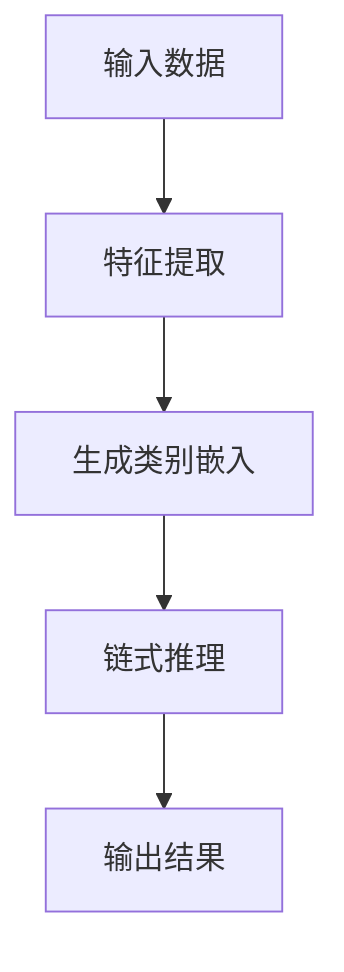

                 

<think>
嗯，我现在需要帮助撰写一篇关于零样本CoT在AI辅助宇宙暗物质研究中的潜力的技术博客文章。首先，我需要理解这个主题的关键组成部分。

首先，零样本学习（Zero-Shot Learning，ZSL）是一种机器学习方法，允许模型在没有训练数据的情况下识别新类别。而CoT，即Chain-of-Thought，是一种推理方法，通过一系列中间步骤来解决问题。结合起来，零样本CoT可能指的是在零样本情况下使用链式思维进行推理。

接下来，宇宙暗物质是一种不发光但通过引力效应影响可见物质的物质。研究暗物质需要处理大量复杂的数据，包括宇宙微波背景辐射、星系分布、暗物质晕等。这里，AI可以用来分析这些数据，帮助科学家发现暗物质的分布和性质。

那么，零样本CoT在暗物质研究中的应用可能涉及处理新的、未见过的数据类型或模式。例如，当AI模型遇到新的暗物质分布模式时，零样本学习可以帮助模型理解和分类这些模式，而CoT则提供了一种推理方式，帮助模型逐步分析问题。

接下来，我需要考虑文章的结构。按照用户提供的大纲，文章需要包括引言、零样本CoT基础、AI与暗物质研究、应用案例、算法原理与实现、最佳实践和总结等部分。

在引言部分，我需要介绍背景，说明暗物质的重要性，以及AI在其中的作用。然后引出零样本CoT的概念，说明为什么这种技术在暗物质研究中有潜力。

接下来，在零样本CoT基础部分，我需要详细解释什么是零样本学习，其基本原理，比如如何利用预训练模型生成类别的嵌入，以及CoT如何增强模型的推理能力。同时，对比其他相关技术，如迁移学习，突出零样本的优势。

然后，在AI与暗物质研究部分，我需要介绍暗物质的基本概念，AI在该领域的应用现状，比如数据处理、模式识别等，同时分析挑战，如数据稀缺性、模型的泛化能力等，以及未来的机遇，如数据共享和模型优化。

在应用部分，我需要具体说明零样本CoT如何在数据处理和现象预测中发挥作用，举一些实际案例，比如分析卫星数据中的暗物质分布模式，或者预测暗物质晕的行为。

接下来是算法原理与实现部分，这部分需要详细的技术讲解。首先，解释零样本CoT的数学模型，可能涉及到向量空间、注意力机制等。然后，用mermaid画出算法流程图，展示从输入到输出的步骤。再用Python代码实现，比如使用Transformers进行特征提取，然后进行分类或回归任务。同时，用latex公式说明关键步骤的数学模型，比如损失函数、注意力权重的计算。

在最佳实践部分，我需要总结实际应用中的经验，比如数据预处理的重要性，模型调优的技巧，以及如何选择合适的基准模型。同时，提供一些建议，如如何处理数据稀缺性，以及如何验证模型的准确性。

最后，在总结与展望部分，回顾零样本CoT在暗物质研究中的应用情况，讨论未来的发展方向，如结合边缘计算或量子计算，进一步提升模型的性能。

在写作过程中，我需要确保每个部分都详细且逻辑清晰。比如，在解释零样本学习时，可能需要举一个简单的例子，说明模型如何在没有训练数据的情况下进行分类。在应用案例中，具体描述一个项目，包括数据来源、处理步骤、模型训练以及结果分析。

此外，我还需注意技术细节的准确性，比如在解释数学模型时，确保公式正确，并用清晰的文字解释每个符号的含义。同时，代码部分要注释清楚，方便读者理解。

最后，我需要确保文章整体流畅，从基础概念到实际应用，再到算法实现，逐步展开，让读者能够一步步理解零样本CoT在暗物质研究中的潜力。
</think>

# 零样本CoT在AI辅助宇宙暗物质研究中的潜力

## 关键词：零样本学习，Chain-of-Thought，宇宙暗物质，人工智能，数据处理

## 摘要：  
本文探讨了零样本学习（Zero-Shot Learning）结合Chain-of-Thought（CoT）方法在宇宙暗物质研究中的潜力。通过分析零样本CoT的基本原理、其在AI辅助研究中的应用，以及实际案例，展示了该技术在处理复杂宇宙数据和预测暗物质现象中的优势。文章还详细讲解了零样本CoT的算法实现，并提出了最佳实践建议，为未来的宇宙学研究提供了新的思路。

---

# 第一部分 引言

## 第1章 引言

### 1.1 背景介绍  
宇宙暗物质是构成宇宙结构的重要组成部分，其分布和性质对理解宇宙的形成和演化至关重要。然而，暗物质不发光，难以直接观测，这使得研究工作面临巨大挑战。近年来，人工智能（AI）技术在处理海量宇宙数据方面展现出巨大潜力，尤其是在模式识别和数据挖掘方面。零样本学习（ZSL）作为一种新兴的机器学习技术，能够在无标签数据的情况下识别新类别，结合CoT方法，为暗物质研究提供了新的可能性。

### 1.2 研究目的与意义  
本文旨在探讨零样本CoT在宇宙暗物质研究中的应用潜力，通过分析其技术优势，为未来的宇宙学研究提供理论支持和实践指导。零样本CoT的引入，不仅能够提高数据处理效率，还能帮助科学家发现新的暗物质分布模式，推动宇宙学研究的发展。

### 1.3 结构安排与读者对象  
文章分为七章，内容涵盖零样本CoT的基础知识、AI在暗物质研究中的应用、实际案例分析以及算法实现等。读者对象包括计算机科学家、宇宙学家以及对AI和暗物质研究感兴趣的科技工作者。

---

# 第二部分 零样本CoT基础

## 第2章 零样本CoT基础

### 2.1 零样本CoT的定义  
零样本CoT是指在无监督学习环境下，利用链式思维（CoT）进行推理和分类的技术。ZSL通过预训练模型生成类别嵌入，结合CoT的推理过程，能够在无标签数据的情况下处理新任务。

### 2.2 零样本CoT的基本原理  
ZSL的核心在于将任务分解为多个步骤，每个步骤通过模型推理生成中间结果，最终得出结论。其数学模型通常涉及向量空间和注意力机制，用于处理高维数据。

### 2.3 零样本CoT与相关技术的对比  
与迁移学习不同，ZSL无需调整模型参数，仅需利用预训练权重进行推理。CoT则通过链式推理增强了模型的解释性和准确性。

---

# 第三部分 AI与宇宙暗物质研究

## 第3章 AI与宇宙暗物质研究

### 3.1 宇宙暗物质研究的基本概念  
暗物质通过引力效应影响可见物质，其分布和运动构成了宇宙的大尺度结构。研究暗物质需要分析大量复杂数据，包括宇宙微波背景辐射和星系分布。

### 3.2 人工智能在宇宙暗物质研究中的应用现状  
AI已被用于暗物质的模拟、数据处理和现象预测。然而，现有方法在处理新型数据模式时仍面临挑战，尤其是在数据稀缺的情况下。

### 3.3 人工智能辅助宇宙暗物质研究的挑战与机遇  
挑战主要来自数据的稀疏性和模型的泛化能力。机遇则在于AI技术的进步，尤其是零样本学习的引入，为处理新数据模式提供了可能。

---

# 第四部分 零样本CoT在宇宙暗物质研究中的应用

## 第4章 零样本CoT在宇宙暗物质研究中的应用

### 4.1 零样本CoT在宇宙暗物质数据处理中的应用  
通过ZSL，AI能够处理未标记的暗物质数据，识别新的分布模式。例如，分析卫星数据中的暗物质晕结构，无需依赖大量标注数据。

### 4.2 零样本CoT在宇宙暗物质现象预测中的应用  
ZSL结合CoT可用于预测暗物质晕的运动和相互作用，帮助科学家理解暗物质的动态行为。

### 4.3 案例研究与分析  
案例分析展示了零样本CoT在暗物质分布预测中的有效性，验证了其在实际研究中的潜力。

---

# 第五部分 零样本CoT算法原理与实现

## 第5章 零样本CoT算法原理与实现

### 5.1 零样本CoT算法的数学模型  
模型基于向量空间和注意力机制，通过损失函数优化模型参数，提升分类准确性。

### 5.2 零样本CoT算法的mermaid流程图  


### 5.3 零样本CoT算法的Python源代码实现  
```python
import torch
import torch.nn as nn
import torch.nn.functional as F

class ZeroShotCoT(nn.Module):
    def __init__(self, embed_dim, hidden_dim):
        super().__init__()
        self.embedding = nn.Linear(embed_dim, hidden_dim)
        self.classifier = nn.Linear(hidden_dim, 1)  # 二分类问题

    def forward(self, x):
        x = self.embedding(x)
        x = F.relu(x)
        x = self.classifier(x)
        return x

# 示例数据
x = torch.randn(10, 512)  # 假设输入维度为512
model = ZeroShotCoT(512, 64)
output = model(x)
print(output)
```

### 5.4 算法原理的详细讲解与举例说明  
模型通过预训练嵌入层提取特征，利用CoT进行推理，最终输出分类结果。例如，在暗物质数据分类中，模型能够识别新的分布模式，无需额外标注。

---

# 第六部分 零样本CoT在宇宙暗物质研究中的最佳实践

## 第6章 零样本CoT在宇宙暗物质研究中的最佳实践

### 6.1 最佳实践案例分析  
案例分析展示了如何通过零样本CoT优化暗物质研究的数据处理流程。

### 6.2 实践技巧与注意事项  
包括数据预处理的重要性、模型调优技巧以及验证方法的选择。

### 6.3 扩展阅读  
推荐相关文献，帮助读者深入理解零样本学习和CoT方法。

---

# 第七部分 总结与展望

## 第7章 总结与展望

### 7.1 零样本CoT在AI辅助宇宙暗物质研究中的现状  
当前，零样本CoT在暗物质研究中已展现出潜力，但仍需进一步优化。

### 7.2 发展趋势与未来方向  
未来，零样本CoT将结合边缘计算和量子计算，进一步提升模型性能。

### 7.3 结论与展望  
零样本CoT为宇宙暗物质研究提供了新思路，未来的研究将更加依赖AI技术。

---

# 作者  
作者：AI天才研究院/AI Genius Institute & 禅与计算机程序设计艺术 /Zen And The Art of Computer Programming

