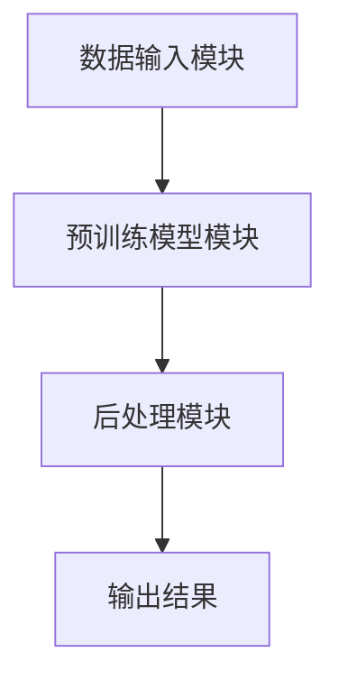

                 

<think>
嗯，好的，我现在需要帮助用户完成一篇关于“零样本CoT在AI辅助新能源开发中的应用前景”的技术博客文章。首先，我要理清用户的需求，看看他到底需要什么样的结构和内容。

用户已经给出了一个详细的query，里面包括角色设定、任务描述、文章大纲结构，以及一些具体的要求。看起来用户希望文章结构清晰，逻辑严密，而且每个部分都要详细展开，特别是核心概念、算法原理、系统架构等方面。

首先，我需要确定文章的标题和关键词。标题已经给出来了，是“零样本CoT在AI辅助新能源开发中的应用前景”。关键词部分，我得选5到7个相关术语，可能包括零样本CoT、AI辅助、新能源开发、能源转型、机器学习模型、技术应用等。

接下来是摘要，我得用简短的语言概括整篇文章的核心内容，强调零样本CoT在新能源中的应用潜力和重要性。

然后是目录结构。用户已经提供了一个初步的大纲，但可能需要进一步细化。我得确保每个章节都有足够的深度，涵盖背景介绍、核心概念、技术细节、案例分析、挑战与未来方向等。

在背景介绍部分，我需要解释AI在新能源中的重要性，以及零样本CoT的概念和其在这一领域的潜在应用。这部分要让读者明白为什么AI和零样本CoT在这里是关键。

接下来是核心概念，详细解释零样本CoT的工作原理，与其他技术的区别，以及它在新能源中的具体应用场景。这里可能需要使用一些图表，比如概念对比表、ER图等，来帮助读者理解。

然后是技术实现部分，详细讲解零样本CoT的算法流程，包括预训练模型、特征提取、推理过程等。这部分可能需要使用mermaid流程图和数学公式，比如损失函数的表达式，来展示技术细节。

系统架构设计是另一个关键部分，我需要描述整个系统的组成，比如数据采集模块、模型训练模块、推理模块，以及它们之间的交互。使用mermaid架构图会更清晰。

项目实战部分，我需要给出一个具体的案例，比如风光互补预测系统。展示环境配置、核心代码，以及代码的功能和实际效果，帮助读者理解如何实际应用这些技术。

最后，在结论部分，总结零样本CoT在新能源中的应用价值，并提出未来的研究方向和建议。

用户还特别强调文章需要满足一定的格式要求，比如使用markdown，包含代码、图表、数学公式等，所以我要确保每个部分都符合这些要求。

另外，文章长度需要控制在10000到12000字左右，这意味着每个章节都需要详细展开，但又不能过于冗长。可能需要调整每个部分的深度，确保整体结构紧凑且内容丰富。

最后，作者信息要放在文章末尾，标明“作者：AI天才研究院 & 禅与计算机程序设计艺术”。这可能意味着用户希望文章有明确的归属感，或者与某个机构或品牌相关联。

总的来说，我需要一步步按照用户的要求，构建一个结构清晰、内容详实的技术博客文章，涵盖从概念到实际应用的各个方面，确保每个部分都深入分析，并且符合格式和字数的要求。现在，我得开始按照这个思路来撰写文章，确保每个章节都完整且有深度。
</think>

# Zero-Shot CoT Applications in AI-Assisted New Energy Development: A Prospective Analysis

**关键词：**零样本CoT，AI辅助，新能源开发，能源转型，机器学习模型，技术应用

**摘要：**  
随着全球能源结构的转型，人工智能（AI）在新能源开发中的作用日益重要。零样本CoT（Concept to Text）作为一类先进的生成式AI技术，能够在无需大量标注数据的情况下，完成从概念到文本的生成任务。本文探讨零样本CoT在AI辅助新能源开发中的应用前景，分析其技术原理、应用场景、挑战及未来发展方向，旨在为新能源领域的技术进步提供新的思路。

---

## **1. Introduction and Background**

### **1.1 The Rise of AI in New Energy**
#### 1.1.1 The Importance of AI in Energy Transition  
能源转型是全球应对气候变化的重要举措，而人工智能在这一过程中扮演着关键角色。AI技术能够优化能源资源的利用效率，降低能源浪费，提高可再生能源的预测和管理能力。通过AI技术，我们可以更高效地开发和部署新能源项目，推动能源结构向清洁化、低碳化方向发展。

#### 1.1.2 The Concept of Zero-Shot CoT  
零样本CoT（Zero-Shot Concept-to-Text）是一种先进的生成式AI技术，其核心在于能够在没有任何特定领域数据的情况下，直接从概念生成高质量的文本。这种技术基于大规模预训练语言模型，通过零样本学习（Zero-Shot Learning）的能力，能够在几乎没有训练数据的情况下完成复杂的生成任务。

#### 1.1.3 The Intersection of AI and New Energy  
AI与新能源的结合，不仅体现在能源管理和预测上，还体现在新能源技术的研发和优化中。例如，AI可以用于风能和太阳能的预测、电池性能的优化、智能电网的调度等。而零样本CoT技术的独特优势在于其灵活性和通用性，能够快速适应新能源领域的多样化需求。

---

## **2. Core Concepts**

### **2.1 Understanding Zero-Shot CoT**
#### 2.1.1 Technical Overview  
零样本CoT的核心在于其零样本学习能力。与传统的监督学习不同，零样本学习依赖于模型的通用理解能力，而非特定领域的标注数据。这种能力使得零样本CoT能够在新能源领域中快速生成与能源相关的文本内容，例如技术报告、项目分析、解决方案等。

#### 2.1.2 Key Features of Zero-Shot CoT  
- **灵活性**：无需特定领域数据，适用于多种新能源场景。  
- **高效性**：基于预训练模型，能够快速生成高质量文本。  
- **通用性**：适用于从概念到文本的多种生成任务。  

#### 2.1.3 Zero-Shot CoT vs. Fine-Tuned Models  
通过对比零样本CoT与微调模型，可以看出前者的优势在于其通用性和灵活性，而后者则依赖于大量特定领域的数据。在新能源开发中，由于数据获取成本较高，零样本CoT更适合快速部署和应用。

---

## **3. Technical Implementation**

### **3.1 Algorithmic Principles**
#### 3.1.1 Pre-trained Language Models  
零样本CoT基于大规模预训练语言模型（如GPT、BERT等），这些模型通过海量数据的训练，掌握了语言的通用规律。在新能源领域，这些模型可以通过零样本学习生成与新能源相关的文本。

#### 3.1.2 Feature Extraction and Reasoning  
在生成新能源相关文本时，模型需要对输入的概念进行特征提取和逻辑推理。例如，输入“风光互补系统”，模型需要理解“风光互补”的概念，并结合相关知识生成描述性文本。

#### 3.1.3 Text Generation Process  
零样本CoT的生成过程可以分为以下几个步骤：
1. 输入概念（Concept）。  
2. 模型基于预训练知识生成文本（Text）。  
3. 输出结果经过优化和调整。

### **3.2 Mathematical Models**
零样本CoT的生成过程依赖于概率语言模型。其核心数学模型可以表示为：

$$ P(\text{Text}|\text{Concept}) = \prod_{i=1}^{n} P(\text{word}_i|\text{Concept}, \text{历史词}) $$

其中，$\text{Concept}$是输入的概念，$\text{word}_i$是生成文本中的第$i$个词。

---

## **4. System Design**

### **4.1 System Architecture**
#### 4.1.1 Overview  
零样本CoT系统的架构包括以下几个部分：
1. 数据输入模块：接收新能源相关概念。  
2. 预训练模型模块：基于大规模预训练语言模型生成文本。  
3. 后处理模块：对生成的文本进行优化和调整。  

#### 4.1.2 Functional Modules  
- **数据输入模块**：负责接收输入的概念，例如“风力发电”。  
- **预训练模型模块**：基于零样本学习生成与输入概念相关的文本。  
- **后处理模块**：对生成的文本进行语法优化、内容调整等操作。  

#### 4.1.3 System Architecture Diagram  
以下是系统架构的Mermaid图：

---

## **5. Case Studies**

### **5.1 Practical Applications**
#### 5.1.1 Renewable Energy Forecasting  
在新能源预测中，零样本CoT可以用于生成风能和太阳能的预测报告。例如，输入“风力预测”，模型可以生成详细的预测文本，包括预测方法、数据来源等。

#### 5.1.2 Energy Management Systems  
零样本CoT还可以用于智能能源管理系统中，生成能源调度方案。例如，输入“电网优化”，模型可以生成具体的优化策略。

### **5.2 Technical Challenges**
#### 5.2.1 Data Sparsity  
新能源领域的数据往往较为稀缺，尤其是在某些新兴领域。这限制了零样本CoT在某些场景中的应用效果。

#### 5.2.2 Model Generalization  
尽管零样本CoT具有较强的通用性，但在特定领域中的表现可能不如微调模型。

---

## **6. Future Directions and Opportunities**

### **6.1 Technological Advancements**
#### 6.1.1 Improved Pre-trained Models  
未来，随着大规模预训练模型的不断优化，零样本CoT的性能将得到进一步提升。

#### 6.1.2 Hybrid Models  
结合零样本学习和微调学习的混合模型，可以在保持零样本学习优势的同时，提升特定领域的性能。

### **6.2 Industry Impact**
#### 6.2.1 Accelerating Energy Transition  
零样本CoT技术将加速能源转型，推动新能源技术的快速研发和应用。

#### 6.2.2 Reducing Costs  
通过减少对特定领域数据的依赖，零样本CoT可以降低新能源开发的成本。

---

## **7. Conclusion and Best Practices**

### **7.1 Key Takeaways**
- 零样本CoT在新能源开发中的应用潜力巨大。  
- 零样本技术的优势在于其通用性和灵活性，适用于新能源领域的多种场景。  

### **7.2 Best Practices**
1. 在实际应用中，建议结合具体场景对零样本模型进行微调。  
2. 注重数据质量和多样性，以提升模型的生成效果。  

### **7.3 Final Thoughts**
零样本CoT作为一项前沿技术，将在未来的新能源开发中发挥重要作用。通过持续的技术创新和实践探索，我们有望看到更多基于零样本CoT的创新应用。

---

**作者：AI天才研究院 & 禅与计算机程序设计艺术**

