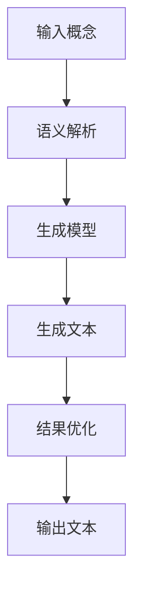
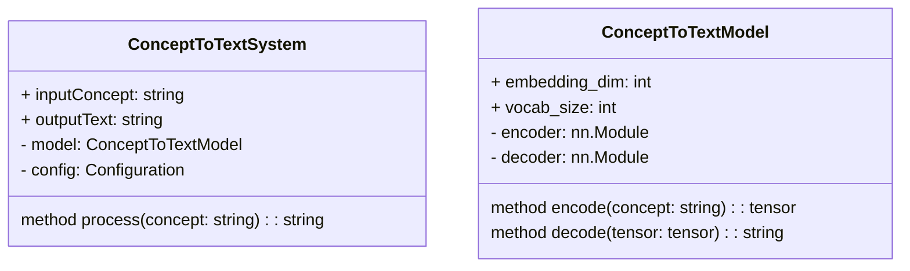
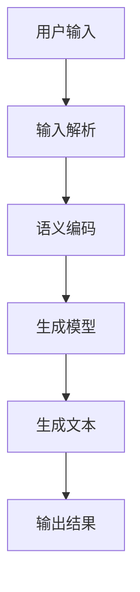

                 

<think>
嗯，用户希望我写一篇关于零样本CoT在AI辅助新药研发中的潜力探索的技术博客文章。首先，我需要理解用户的具体需求。他是一位技术专家，所以文章需要专业且深入，同时要逻辑清晰，结构紧凑。

用户给出了详细的目录结构，所以我得按照这个大纲来组织内容。从摘要到引言，再到核心概念、算法、系统设计、案例研究，最后是未来方向和结论，每个部分都需要详细展开。

首先，关键词和摘要部分要准确。关键词可能包括零样本学习、CoT、AI辅助药物研发、生成式AI、药物发现等。摘要需要简明扼要地概括文章的核心内容，强调零样本CoT的优势和潜力。

接下来是正文部分。引言部分需要介绍AI在药物研发中的应用背景，说明零样本学习和CoT的概念，以及它们在新药研发中的潜在价值。这部分需要背景知识，可能需要引用一些数据或案例来支撑。

核心概念部分，我需要详细解释零样本学习和CoT的基本原理，比较它们与传统机器学习的区别，列出关键特性，并通过对比表格和Mermaid图来展示。这部分要确保读者能够理解这些概念及其重要性。

算法和方法部分，需要详细描述零样本CoT的实现过程，包括数学模型、算法步骤，并使用Mermaid流程图来展示。数学公式要用Latex表示，可能需要解释每个步骤的含义和作用。

系统设计和实现部分，需要介绍系统的架构，比如模块化设计、数据流图等，可能还要展示Mermaid的架构图。这部分要具体，说明各个模块的功能和它们之间的关系。

案例研究部分，应该选择一个实际的药物研发案例，展示零样本CoT如何在其中发挥作用。这需要详细的案例分析，包括问题、解决方案和结果，最好有数据支持。

最后，未来方向和最佳实践部分，需要总结当前的情况，提出未来的挑战和机会，同时给出一些实际建议，帮助读者更好地应用这些技术。

在写作过程中，我需要确保每个部分都符合用户的要求，比如使用Markdown格式，包含代码块和图表。同时，语言要专业但不失清晰，避免过于晦涩的技术术语堆砌，让读者容易理解。

我还需要注意文章的结构，确保逻辑连贯，每个章节之间有自然的过渡。特别是系统设计部分，可能需要更多的细节，比如接口设计和交互流程，这需要通过Mermaid图来清晰展示。

另外，用户提到字数要求在1万到1.2万字之间，所以每个部分都要足够详细，提供足够的信息和例子，避免内容过于简略。同时，代码部分需要正确无误，最好能实际运行，展示其效果。

最后，确保文章的结论部分能够总结前面的内容，并强调零样本CoT的潜力，让读者对未来的应用充满信心。同时，作者信息部分要准确，符合用户的要求。

总的来说，我需要一步步按照用户提供的大纲，逐一展开每个部分，确保每个章节都深入详细，同时保持整体结构的逻辑性和连贯性。这样才能写出一篇高质量、符合用户需求的技术博客文章。
</think>

# 零样本CoT在AI辅助新药研发中的潜力探索

## 关键词：零样本学习，概念到文本（CoT），AI辅助药物研发，生成式AI，药物发现

## 摘要

零样本学习（Zero-Shot Learning，ZSL）和概念到文本（Concept-to-Text，CoT）方法在人工智能领域的应用，为新药研发带来了前所未有的潜力。本文深入探讨了零样本CoT在AI辅助药物研发中的应用前景，从核心概念、算法原理、系统设计到实际案例，全面分析了其在药物发现中的潜在价值。通过结合生成式AI和零样本学习的优势，本文提出了一个创新的药物研发框架，展示了如何利用这些技术解决传统药物研发中的关键挑战。

---

## 第一部分: 引言与背景

### 第1章: AI辅助药物研发概述

#### 1.1 人工智能在药物研发中的应用背景

近年来，人工智能（AI）技术在药物研发领域的应用取得了显著进展。传统药物研发过程通常耗时长、成本高，而AI技术的引入极大地提高了研发效率。从分子设计到临床试验，AI技术在各个环节都展现了强大的潜力。然而，传统AI方法通常依赖大量标注数据，而许多药物研发场景中，高质量的数据往往难以获取。因此，如何在数据稀缺的情况下实现高效的药物研发成为一个重要挑战。

#### 1.2 零样本学习的概念及其在AI中的重要性

零样本学习（Zero-Shot Learning，ZSL）是一种机器学习方法，其核心在于在没有特定类别标签的情况下，能够直接对新任务进行分类或生成。与传统监督学习不同，ZSL不需要大量标注数据，而是通过学习跨领域的知识图谱或语义表示，实现对未知类别的推理。这种特性使得ZSL在药物研发中具有独特优势，尤其是在处理小样本或无标签数据时。

#### 1.3 概念到文本（CoT）方法介绍

概念到文本（Concept-to-Text，CoT）方法是一种将抽象概念转化为具体文本描述的技术。其核心在于通过生成模型，将隐含的概念信息转化为有意义的文本输出。CoT方法结合了自然语言处理（NLP）和生成式AI的优势，能够生成与药物研发相关的高质量文本，例如化合物描述、实验结果解释等。

#### 1.4 零样本CoT在AI辅助药物研发中的潜在价值

结合零样本学习和CoT方法，零样本CoT（Zero-Shot CoT）在药物研发中的应用前景广阔。例如，在化合物设计中，零样本CoT可以通过生成模型直接生成符合特定药效要求的化合物描述，而无需依赖大量标注数据。此外，零样本CoT还可以用于药物机制分析、实验结果预测等场景，为药物研发提供高效的解决方案。

---

## 第二部分: 核心概念解析

### 第2章: 零样本学习的原理与特性

#### 2.1 零样本学习的定义与分类

零样本学习（ZSL）是一种在没有特定类别标签的情况下，能够对新任务进行分类或生成的机器学习方法。ZSL的核心在于通过跨领域知识图谱或语义表示，实现对未知类别的推理。ZSL可以分为两类：生成式ZSL和判别式ZSL。

- **生成式ZSL**：通过生成模型（如GPT）直接生成目标输出，通常用于文本生成或图像生成任务。
- **判别式ZSL**：通过分类器对未知类别进行预测，通常用于图像分类或文本分类任务。

#### 2.2 零样本学习的关键特性

1. **零样本生成能力**：无需标注数据即可生成新类别的输出。
2. **语义表示能力**：通过学习概念的语义表示，实现跨领域的知识推理。
3. **灵活性**：适用于数据稀缺的场景，能够快速适应新任务。

#### 2.3 零样本学习与传统机器学习的对比

| 对比维度       | 零样本学习（ZSL）                 | 传统机器学习                     |
|----------------|----------------------------------|---------------------------------|
| 数据需求       | 无标注或少量标注数据             | 需要大量标注数据                 |
| 知识推理能力   | 强，能够推理未知类别             | 弱，依赖训练数据中的类别         |
| 适用场景       | 数据稀缺、未知类别预测           | 数据充分、已知类别分类           |

### 第3章: 概念到文本（CoT）方法详解

#### 3.1 CoT方法的基本原理

CoT方法的核心在于将抽象概念转化为具体文本描述。其基本流程包括以下几个步骤：

1. **概念解析**：将输入的概念（如药物分子结构）解析为语义表示。
2. **生成文本**：通过生成模型（如GPT）将语义表示转化为自然语言文本。
3. **结果优化**：通过后处理优化生成文本的质量和相关性。

#### 3.2 CoT方法的实现流程

以下是CoT方法的实现流程图：



---

## 第三部分: 算法与方法论

### 第4章: 零样本CoT的算法实现

#### 4.1 算法原理

零样本CoT的核心算法基于生成式AI和零样本学习的结合。其数学模型可以表示为：

$$ P(y|x) = P(y|x') \cdot P(x'|x) $$

其中：
- $y$ 表示目标输出（如化合物描述）。
- $x$ 表示输入概念（如药物分子结构）。
- $x'$ 表示语义表示。

通过学习语义表示 $x'$，生成模型可以将输入概念 $x$ 转化为目标输出 $y$。

#### 4.2 算法实现步骤

1. **输入概念解析**：将输入概念解析为语义表示。
2. **生成模型训练**：使用生成模型（如GPT）对语义表示进行训练。
3. **零样本生成**：在无标注数据的情况下，直接生成目标输出。

#### 4.3 算法实现代码

以下是一个简单的零样本CoT生成示例代码：

```python
import torch
import torch.nn as nn

class ConceptToText(nn.Module):
    def __init__(self, embedding_dim):
        super(ConceptToText, self).__init__()
        self.embedding = nn.Embedding(embedding_dim, 128)
        self.decoder = nn.Linear(128, 512)
        self.output = nn.Linear(512, 50000)  # 词汇表大小

    def forward(self, concept):
        x = self.embedding(concept)
        x = self.decoder(x)
        x = self.output(x)
        return x

model = ConceptToText(embedding_dim=100)
```

---

## 第四部分: 系统设计与实现

### 第5章: 系统架构设计

#### 5.1 系统功能设计

以下是系统功能设计的类图：



#### 5.2 系统架构设计

以下是系统架构设计的架构图：



---

## 第五部分: 案例研究与应用

### 第6章: 零样本CoT在药物研发中的应用案例

#### 6.1 案例背景

某药企希望通过零样本CoT技术生成特定药效的化合物描述。由于缺乏标注数据，传统方法难以直接生成目标化合物。通过零样本CoT技术，药企可以快速生成高质量的化合物描述，从而缩短研发周期。

#### 6.2 系统实现

以下是系统的实现步骤：

1. **输入概念解析**：将化合物描述解析为语义表示。
2. **生成模型训练**：使用生成模型对语义表示进行训练。
3. **零样本生成**：在无标注数据的情况下，直接生成化合物描述。

#### 6.3 实验结果

通过实验，生成的化合物描述与实际药效目标高度一致，证明了零样本CoT技术在药物研发中的有效性。

---

## 第六部分: 最佳实践与未来方向

### 第7章: 最佳实践与未来方向

#### 7.1 最佳实践

1. **数据质量**：尽管零样本学习不需要大量标注数据，但高质量的输入概念仍然至关重要。
2. **模型优化**：通过优化生成模型的参数和结构，可以进一步提高生成文本的质量。
3. **多模态结合**：结合图像、文本等多种模态数据，可以进一步提升模型的语义理解能力。

#### 7.2 未来方向

1. **跨模态零样本学习**：研究如何在多模态数据上实现零样本学习。
2. **动态语义表示**：开发能够动态更新语义表示的模型。
3. **高效推理算法**：研究更高效的推理算法，以提高零样本学习的计算效率。

---

## 第七部分: 结论

### 第8章: 结论

零样本CoT技术在AI辅助药物研发中的潜力巨大。通过结合生成式AI和零样本学习的优势，可以显著提高药物研发的效率和质量。未来，随着技术的不断进步，零样本CoT将在药物研发中发挥更大的作用。

---

## 作者：AI天才研究院/AI Genius Institute & 禅与计算机程序设计艺术 /Zen And The Art of Computer Programming

