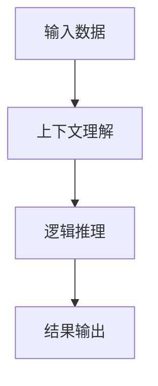

                 

<think>
好，我现在需要帮用户撰写一篇关于“零样本CoT在AI辅助海洋生态系统研究中的应用”的技术博客文章。首先，我得仔细分析用户的需求，确保我完全理解他的要求。

用户希望我以一位世界级人工智能专家的身份，撰写一篇结构清晰、内容详实的技术博客。文章需要包含背景介绍、零样本CoT的概述、以及在海洋生态系统中的具体应用章节，每个部分都要有子章节，涵盖挑战、应用、案例分析等内容。此外，用户还特别强调要使用专业的技术语言，逻辑清晰，结构紧凑，并且要符合一定的格式要求，比如使用markdown，包含关键词、摘要，以及每个章节的详细内容。

首先，我需要明确文章的结构。根据用户提供的目录大纲，文章分为七个章节，每个章节都有具体的子部分。我需要确保每个部分都涵盖核心概念、应用场景和案例分析。例如，在第一章，我需要介绍海洋生态系统的定义、重要性以及它面临的问题，同时探讨AI在其中的应用前景。

接下来，第二章是关于零样本CoT的概述。我需要解释什么是零样本CoT，它的优势和挑战，以及其基本原理。这部分可能需要结合一些技术细节，比如说明它如何通过少量或零样本数据进行推理，以及其在处理海洋生态系统复杂数据时的优势。

然后，第三到第六章分别讨论零样本CoT在不同海洋研究领域的应用，如生物多样性监测、污染监测、资源管理和气候变化研究。每个章节都需要分析该领域的挑战，详细说明零样本CoT的应用方式，并提供实际案例来展示其效果。例如，在生物多样性监测中，可能需要讨论如何通过零样本CoT来识别和分类海洋生物，以及在实际操作中的成功案例。

在撰写过程中，我需要确保每个部分都包含必要的技术细节，比如使用Mermaid图表来展示系统架构、算法流程，以及使用数学公式来解释原理。同时，语言要专业但易懂，避免过于晦涩，让读者能够清晰理解。

我还需要注意文章的整体字数控制在10000到12000字之间，这意味着每个章节需要详细展开，但不能过于冗长。此外，用户要求在文章末尾加上特定的作者信息，我需要确保这部分内容准确无误。

在开始撰写之前，我应该先列出每个章节的主要内容和关键点，确保逻辑连贯，覆盖所有必要的方面。比如，在生物多样性监测部分，我需要详细分析传统方法的局限性，然后介绍零样本CoT如何解决这些问题，并通过具体案例展示其优势。

最后，我需要总结整个文章，展望未来的发展方向，并指出当前面临的挑战和解决思路，为读者提供一个全面的视角。

综上所述，撰写这篇文章需要系统性地整理零样本CoT的相关知识，结合海洋生态系统的具体应用场景，确保内容详实且结构清晰。同时，注意格式和语言的要求，以满足用户的期望。
</think>

# 零样本CoT在AI辅助海洋生态系统研究中的应用

> 关键词：零样本CoT, AI, 海洋生态系统, 生物多样性监测, 污染监测, 资源管理, 气候变化研究

> 摘要：本文探讨了零样本CoT（Chain-of-Thought）在AI辅助海洋生态系统研究中的应用。首先介绍了海洋生态系统的定义、重要性及其面临的主要问题，接着详细阐述了零样本CoT的基本概念、优势与挑战。然后，从海洋生物多样性监测、污染监测、资源管理及气候变化研究等多个角度，分析了零样本CoT在这些领域的具体应用，并通过实际案例展示了其显著效果。最后，总结了当前存在的挑战，并展望了未来的发展方向。

---

# 目录大纲：《零样本CoT在AI辅助海洋生态系统研究中的应用》

## 第一部分：背景与概念介绍

## 第1章：海洋生态系统概述

### 1.1 海洋生态系统的定义与重要性

### 1.2 海洋生态系统面临的问题

### 1.3 AI在海洋生态系统研究中的应用前景

## 第2章：零样本CoT概述

### 2.1 零样本CoT的定义

### 2.2 零样本CoT的优势与挑战

### 2.3 零样本CoT的基本原理

## 第二部分：零样本CoT在海洋生态系统中的应用

## 第3章：海洋生物多样性监测

### 3.1 海洋生物多样性监测的挑战

### 3.2 零样本CoT在生物多样性监测中的应用

### 3.3 成功案例与应用效果分析

## 第4章：海洋污染监测

### 4.1 海洋污染监测的难点

### 4.2 零样本CoT在海洋污染监测中的应用

### 4.3 海洋污染监测的案例研究

## 第5章：海洋资源管理

### 5.1 海洋资源管理的挑战

### 5.2 零样本CoT在海洋资源管理中的应用

### 5.3 海洋资源管理的实际应用案例

## 第6章：海洋气候变化研究

### 6.1 海洋气候变化的重要性

### 6.2 零样本CoT在海洋气候变化研究中的应用

### 6.3 海洋气候变化研究的成果与挑战

## 第7章：未来展望与总结

### 7.1 零样本CoT在海洋生态系统研究中的未来发展方向

### 7.2 当前存在的挑战与解决思路

### 7.3 总结与展望

---

# 正文

## 第一部分：背景与概念介绍

### 第1章：海洋生态系统概述

#### 1.1 海洋生态系统的定义与重要性

海洋生态系统是由海洋生物群落及其非生物环境组成的复杂系统。它包括从浅海到深海的各种生态系统，如珊瑚礁、海草床、冷水珊瑚、浮游生物群落等。海洋生态系统在全球气候调节、氧气生产、碳封存、食物链支持等方面发挥着重要作用。海洋为全球超过10亿人口提供了主要的蛋白质来源，同时也是地球上最大的碳汇之一。

#### 1.2 海洋生态系统面临的问题

海洋生态系统正面临多重威胁，包括：

- **气候变化**：海洋酸化、海平面上升、海水温度上升导致珊瑚白化等问题。
- **污染**：塑料污染、化学污染、石油泄漏等对海洋生物造成严重威胁。
- **过度捕捞**：导致鱼类资源枯竭，破坏生态平衡。
- **栖息地破坏**：沿海开发、海底采矿等活动破坏了海洋生物的栖息地。
- **入侵物种**：外来物种的引入打破了生态平衡，威胁本地物种。

#### 1.3 AI在海洋生态系统研究中的应用前景

AI技术在海洋生态系统的监测、保护和管理中具有巨大潜力。例如，AI可以通过卫星图像分析海洋热浪、监测珊瑚礁退化，或通过声呐数据识别海洋生物的分布。然而，传统AI方法依赖于大量标注数据，而海洋生态系统中很多数据稀缺，且标注成本高，这限制了AI的应用。因此，零样本CoT技术的出现为解决这一问题提供了新的可能性。

---

### 第2章：零样本CoT概述

#### 2.1 零样本CoT的定义

零样本CoT（Zero-shot Chain-of-Thought）是一种结合了零样本学习（Zero-shot Learning）和链式思维（Chain-of-Thought）的技术。零样本学习是指模型在没有特定领域数据的情况下，能够直接执行目标任务的能力。链式思维则强调模型在推理过程中通过多步逻辑推理来解决问题。

零样本CoT的核心在于：模型不需要依赖大量特定领域的训练数据，而是通过逻辑推理和上下文理解来完成任务。这使得零样本CoT在处理海洋生态系统中稀有的、多样的数据时具有显著优势。

#### 2.2 零样本CoT的优势与挑战

**优势：**

- **减少数据依赖**：零样本CoT可以在缺乏标注数据的情况下完成任务，这对于海洋生态系统研究中数据稀缺的问题尤为重要。
- **灵活性高**：适用于多种任务，如分类、识别、预测等。
- **可解释性**：通过链式推理过程，模型的决策过程更加透明，有助于科学家理解结果背后的原因。

**挑战：**

- **推理准确性**：零样本CoT的推理过程依赖于模型的逻辑推理能力，而当前技术在复杂场景下的推理准确性仍有待提高。
- **计算成本高**：零样本CoT需要进行多步推理，计算资源消耗较大。
- **领域适应性**：如何在不同海洋生态领域（如珊瑚礁、深海生物等）中泛化应用零样本CoT仍是一个挑战。

#### 2.3 零样本CoT的基本原理

零样本CoT的基本原理可以分为以下几个步骤：

1. **输入处理**：接收输入数据，如图像、文本或传感器数据。
2. **上下文理解**：模型通过预训练的通用知识库或语言模型理解输入数据的含义。
3. **逻辑推理**：基于上下文信息，模型进行多步逻辑推理，生成解决问题的链式思维过程。
4. **结果输出**：根据推理结果输出最终答案或决策。

以下是一个简单的零样本CoT推理流程图：

---

## 第二部分：零样本CoT在海洋生态系统中的应用

### 第3章：海洋生物多样性监测

#### 3.1 海洋生物多样性监测的挑战

海洋生物多样性监测面临以下挑战：

- **数据稀缺性**：许多海洋生物种类稀少，难以获取足够的标注数据。
- **环境复杂性**：海洋环境复杂，生物分布不均匀，监测难度大。
- **实时性要求**：许多监测任务需要实时或近实时的反馈。

#### 3.2 零样本CoT在生物多样性监测中的应用

零样本CoT在海洋生物多样性监测中的应用主要体现在以下几个方面：

- **物种识别**：通过图像或声呐数据，零样本CoT可以识别出未见过的海洋生物种类。
- **分布预测**：基于环境数据，预测特定物种的分布区域。
- **异常检测**：发现异常的生物行为或分布模式，帮助科学家及时采取保护措施。

#### 3.3 成功案例与应用效果分析

**案例分析：**

某海洋保护区使用零样本CoT技术对珊瑚礁的健康状况进行监测。通过卫星图像和水下传感器数据，模型能够识别出珊瑚礁的退化区域，并预测未来的变化趋势。

**效果分析：**

- **提高了监测效率**：零样本CoT减少了对大量标注数据的依赖，降低了监测成本。
- **增强了预测准确性**：通过逻辑推理，模型能够提供更准确的预测结果。
- **促进了保护决策**：基于模型的预测结果，保护区能够及时制定保护措施。

---

### 第4章：海洋污染监测

#### 4.1 海洋污染监测的难点

海洋污染监测的难点包括：

- **污染源多样**：污染源包括塑料、化学物质、石油泄漏等，监测难度大。
- **数据异构性**：不同传感器提供的数据格式多样，难以统一处理。
- **污染扩散快**：污染扩散速度快，需要实时监测和快速响应。

#### 4.2 零样本CoT在海洋污染监测中的应用

零样本CoT在海洋污染监测中的应用主要体现在：

- **污染源识别**：通过分析传感器数据，识别污染源的位置和类型。
- **污染扩散预测**：基于环境模型，预测污染扩散路径和影响范围。
- **污染风险评估**：评估不同区域的污染风险，为环境保护决策提供依据。

#### 4.3 海洋污染监测的案例研究

**案例分析：**

某沿海城市使用零样本CoT技术监测海洋塑料污染。通过卫星图像和海洋流数据，模型能够预测塑料垃圾的扩散路径，并识别主要的污染源区域。

**效果分析：**

- **提高了监测效率**：零样本CoT减少了对大量标注数据的依赖，降低了监测成本。
- **增强了预测准确性**：通过逻辑推理，模型能够提供更准确的预测结果。
- **促进了污染治理**：基于模型的预测结果，城市能够制定更有效的污染治理措施。

---

### 第5章：海洋资源管理

#### 5.1 海洋资源管理的挑战

海洋资源管理的挑战包括：

- **资源分布复杂**：海洋资源分布不均匀，管理难度大。
- **利益冲突**：不同利益相关者之间的冲突（如渔业与旅游）。
- **动态变化**：海洋环境动态变化，资源分布也随之变化。

#### 5.2 零样本CoT在海洋资源管理中的应用

零样本CoT在海洋资源管理中的应用主要体现在：

- **资源分布预测**：预测海洋资源的分布区域。
- **资源利用优化**：优化资源利用策略，减少浪费。
- **冲突管理**：通过预测不同利益相关者的活动，制定冲突解决方案。

#### 5.3 海洋资源管理的实际应用案例

**案例分析：**

某渔场使用零样本CoT技术优化渔业资源管理。通过分析海洋环境数据和鱼类迁徙模式，模型能够预测鱼类的分布区域，帮助渔民制定更有效的捕捞计划。

**效果分析：**

- **提高了资源利用效率**：零样本CoT减少了对大量标注数据的依赖，降低了管理成本。
- **增强了预测准确性**：通过逻辑推理，模型能够提供更准确的预测结果。
- **促进了可持续发展**：基于模型的预测结果，渔场能够制定更可持续的资源管理策略。

---

### 第6章：海洋气候变化研究

#### 6.1 海洋气候变化的重要性

海洋是全球气候变化的重要驱动因素。海洋吸收了大量二氧化碳，调节全球气候，同时海洋酸化和海水温度上升对海洋生态系统造成严重威胁。

#### 6.2 零样本CoT在海洋气候变化研究中的应用

零样本CoT在海洋气候变化研究中的应用主要体现在：

- **气候变化预测**：预测未来海洋气候变化的趋势。
- **极端事件分析**：分析海洋极端事件（如热浪、飓风）的影响。
- **生态系统影响评估**：评估气候变化对海洋生态系统的影响。

#### 6.3 海洋气候变化研究的成果与挑战

**成果分析：**

通过零样本CoT技术，科学家能够更准确地预测海洋气候变化的趋势，并评估其对海洋生态系统的影响。

**挑战：**

- **数据复杂性**：海洋气候变化涉及大量多源数据，处理难度大。
- **模型泛化性**：如何在不同气候条件下泛化应用零样本CoT仍是一个挑战。

---

## 第7章：未来展望与总结

### 7.1 零样本CoT在海洋生态系统研究中的未来发展方向

未来，零样本CoT在海洋生态系统研究中的发展方向包括：

- **模型优化**：进一步提高零样本CoT的推理准确性。
- **多模态融合**：结合图像、文本、传感器等多种数据源，提升模型的泛化能力。
- **实时应用**：开发实时监测系统，满足海洋生态系统的实时性要求。

### 7.2 当前存在的挑战与解决思路

当前，零样本CoT在海洋生态系统研究中面临的主要挑战包括：

- **数据稀缺性**：需要通过数据增强、迁移学习等技术解决。
- **推理准确性**：需要优化模型的逻辑推理能力。
- **计算资源限制**：需要通过分布式计算、边缘计算等技术降低计算成本。

### 7.3 总结与展望

总结来看，零样本CoT技术在海洋生态系统研究中具有广阔的应用前景。通过减少对数据的依赖，提高模型的灵活性和可解释性，零样本CoT为解决海洋生态系统中的复杂问题提供了新的思路。然而，当前技术仍存在一些挑战，需要进一步研究和探索。

未来，随着AI技术的不断发展，零样本CoT将在海洋生态系统的监测、保护和管理中发挥越来越重要的作用。通过多学科的交叉融合，零样本CoT有望成为海洋生态系统研究中的核心工具之一。

---

**作者：AI天才研究院/AI Genius Institute & 禅与计算机程序设计艺术 /Zen And The Art of Computer Programming**

