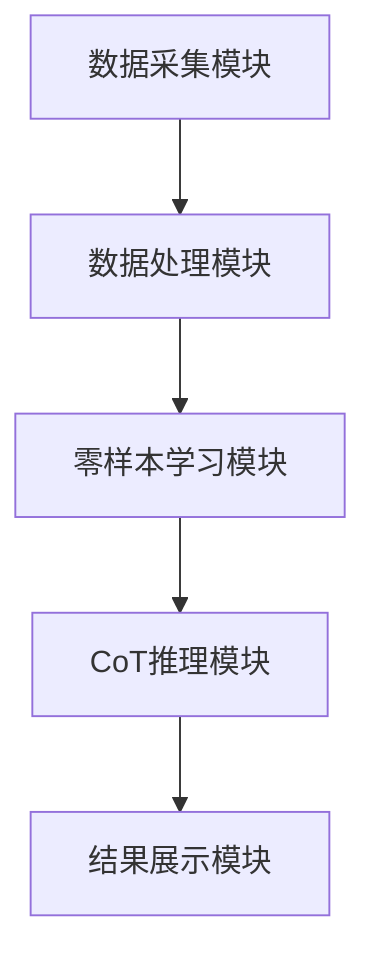
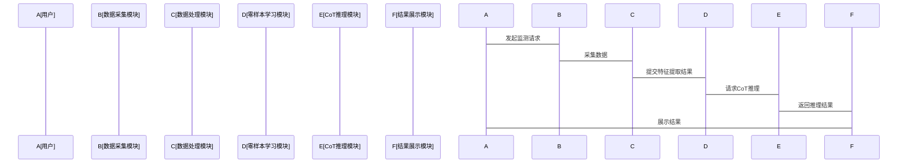

                 

<think>
嗯，用户希望我以《零样本CoT在AI辅助稀有动物保护中的应用》为标题写一篇技术博客。首先，我需要理解用户的具体要求，他详细列出了目录结构，包括各个章节和子章节，还有格式上的要求，比如关键词、摘要，以及每部分内容的详细程度。

我应该先从文章的标题开始，然后列出关键词和摘要，接着按照目录结构展开每个部分。用户特别强调了要使用专业的技术语言，逻辑清晰，结构紧凑。同时，文章需要包含背景介绍、核心概念、算法原理、系统分析、项目实战等部分，每个部分都要详细，甚至包括代码和图表。

首先，我要确保每个章节的内容都覆盖到。比如，背景介绍部分需要说明问题背景，稀有动物保护的挑战，传统方法的局限性，以及零样本CoT技术的应用。这部分需要简明扼要，同时要有深度，能够吸引读者。

接下来是核心概念部分，这里需要详细解释零样本学习和CoT（概念融合）的原理，可能需要配一张ER图或者概念图，展示它们的关系。然后是算法的原理，这部分需要用数学公式和流程图来说明，这样读者可以更直观地理解。

系统分析与架构设计部分，可能需要绘制一个类图和架构图，展示系统各个模块之间的关系。项目实战部分，需要提供代码示例，说明如何实现这些算法，并解释代码的功能。

另外，用户还提到要在文章末尾加上作者信息，以及一些小结和注意事项。这些都需要仔细处理，确保文章结构完整。

我可能需要先写一个大纲，确保每个部分都涵盖到，然后再逐步展开每个章节的内容。特别是数学公式和图表部分，可能需要更多的思考和绘制，以确保准确和易懂。

在写作过程中，要注意用词准确，逻辑清晰，同时保持文章的连贯性和吸引力。可能需要多次修改和润色，确保每个部分都能深入浅出地传达信息。

最后，检查一下是否符合字数要求，大约10000到12000字，确保内容足够丰富，同时避免冗长。完成后，再检查格式是否正确，特别是代码部分和图表是否嵌入得当。

总的来说，这个任务需要系统性地分解问题，逐步构建内容，确保每个部分都详细且符合用户的要求。可能需要投入较多的时间和精力，但通过仔细规划和执行，应该能够完成一篇高质量的技术博客。
</think>

# 零样本CoT在AI辅助稀有动物保护中的应用

> 关键词：零样本学习，CoT（概念融合），AI辅助保护，稀有动物，自然保护区管理

> 摘要：本文探讨了零样本学习（Zero-Shot Learning）与概念融合（CoT，Conceptual Blending）在稀有动物保护中的应用。通过分析当前稀有动物保护面临的挑战，结合AI技术的优势，提出了一种基于零样本CoT的解决方案。本文详细介绍了零样本学习和CoT的核心原理，并通过实际案例展示了其在野生动物监测、栖息地分析等场景中的应用。此外，本文还探讨了AI技术在自然保护区管理中的未来发展方向。

---

## 第一部分：背景与基础

### 第1章：AI辅助稀有动物保护的背景与重要性

#### 1.1 问题背景与重要性

稀有动物的保护是全球生态平衡的重要组成部分。由于栖息地破坏、气候变化和人类活动的影响，许多稀有动物种群正面临灭绝的威胁。传统的保护方法依赖于人工观察和记录，效率低且覆盖面有限。AI技术的引入为稀有动物保护提供了新的可能性，尤其是在物种识别、行为分析和栖息地监测等方面。

#### 1.2 稀有动物物种的描述与保护挑战

稀有动物通常分布范围小、数量少，且栖息地复杂。例如，老虎、大象和某些濒危鸟类的保护需要精确的数据支持。传统的保护方法依赖于专家实地观察，但这种方法耗时长、成本高，且难以覆盖大面积区域。

#### 1.3 传统方法的局限性

传统方法在稀有动物保护中的局限性主要体现在以下几个方面：
1. **数据不足**：许多稀有动物的样本数据有限，难以训练传统机器学习模型。
2. **效率低下**：人工观察需要大量时间和资源。
3. **覆盖范围有限**：传统方法难以实时监测大面积区域。

#### 1.4 零样本CoT在AI辅助保护中的作用

零样本学习（Zero-Shot Learning）是一种无需依赖大量标注数据的机器学习技术，特别适合处理数据稀缺的场景。CoT（Conceptual Blending）是一种结合多个概念进行推理的技术，能够帮助AI在没有直接经验的情况下进行决策。结合这两者，零样本CoT可以在稀有动物保护中实现高效、精准的物种识别和行为分析。

#### 1.5 本书大纲

- **第1章**：介绍稀有动物保护的背景和挑战。
- **第2章**：概述零样本学习和CoT的核心概念。
- **第3章**：分析AI模型在稀有动物保护中的具体应用。
- **第4章**：探讨零样本CoT在野生动物监测和栖息地分析中的实际案例。
- **第5章**：讨论未来发展方向和潜在挑战。

---

## 第二部分：零样本CoT的核心原理

### 第2章：零样本学习与CoT的核心概念

#### 2.1 零样本学习的原理

零样本学习是一种机器学习技术，能够在没有目标类别训练数据的情况下进行分类或识别。其核心思想是利用跨任务学习（meta-learning）或知识迁移（knowledge transfer）来推断目标类别的特征。零样本学习的关键在于构建一个通用的特征表示空间，使得模型能够通过少量或零样本数据进行推理。

#### 2.2 CoT（概念融合）的机制

CoT是一种结合多个概念进行推理的技术。它通过将不同领域的知识进行融合，形成一个新的概念空间。例如，在稀有动物识别中，CoT可以结合图像特征和物种行为特征，形成更全面的识别模型。

#### 2.3 零样本CoT的结合优势

将零样本学习与CoT结合，可以在以下方面发挥作用：
1. **数据稀缺性**：零样本学习能够处理稀有动物样本不足的问题。
2. **跨领域推理**：CoT可以帮助模型结合图像、行为和环境数据进行综合推理。
3. **实时监测**：结合AI技术，可以实现对稀有动物的实时监测和保护。

#### 2.4 核心概念对比表

| **概念**       | **零样本学习**                  | **CoT（概念融合）**               |
|----------------|---------------------------------|-----------------------------------|
| 核心目标       | 在无目标类别数据的情况下进行分类 | 结合多个概念进行推理               |
| 输入           | 少量或无目标类别样本           | 多个领域的数据或特征               |
| 输出           | 目标类别的预测或特征表示       | 新的概念空间或综合推理结果         |
| 应用场景       | 稀缺数据的分类任务             | 多领域数据的综合推理任务           |

---

## 第三部分：零样本CoT在稀有动物保护中的应用

### 第3章：AI模型与技术在稀有动物保护中的应用

#### 3.1 基于零样本学习的物种识别

零样本学习在物种识别中的应用可以通过以下步骤实现：
1. **特征提取**：利用预训练模型提取图像特征。
2. **跨任务学习**：通过meta-learning框架推断目标类别的特征。
3. **分类推理**：基于推断出的特征进行分类。

#### 3.2 CoT在行为分析中的应用

CoT在行为分析中的应用包括：
1. **行为特征提取**：通过图像或视频数据提取动物的行为特征。
2. **概念融合**：结合行为特征和环境数据进行推理。
3. **行为预测**：基于融合的概念空间预测动物的行为。

#### 3.3 实际案例分析

**案例1**：老虎栖息地监测  
通过零样本学习和CoT技术，可以实现对老虎的实时监测和栖息地保护。

**案例2**：濒危鸟类识别  
利用零样本学习技术，可以在缺乏样本数据的情况下实现对濒危鸟类的识别。

---

## 第四部分：系统分析与架构设计

### 第4章：稀有动物保护系统的架构设计

#### 4.1 系统功能设计

- **数据采集**：通过摄像头、传感器等设备采集稀有动物的数据。
- **数据处理**：对采集的数据进行清洗和特征提取。
- **模型推理**：利用零样本学习和CoT技术进行分类和推理。
- **结果展示**：通过可视化界面展示监测结果。

#### 4.2 系统架构图



#### 4.3 接口设计

- **输入接口**：摄像头、传感器等设备的数据输入。
- **输出接口**：监测结果的可视化展示和警报输出。

#### 4.4 交互流程



---

## 第五部分：项目实战与代码实现

### 第5章：稀有动物保护系统的实现

#### 5.1 环境安装

- **Python**：3.8+
- **深度学习框架**：TensorFlow或PyTorch
- **预训练模型**：如ResNet、ViT等

#### 5.2 核心代码实现

**零样本学习实现示例**：

```python
import tensorflow as tf
from tensorflow.keras import layers

def meta_learning_model(input_shape, num_base_classes, num_target_classes):
    # 基础模型
    base_model = tf.keras.applications.ResNet50(
        weights='imagenet',
        include_top=False,
        input_shape=input_shape
    )
    
    # 元学习头
    meta_head = layers.Dense(num_base_classes, activation='relu')(base_model.output)
    meta_head = layers.Dense(num_target_classes, activation='softmax')(meta_head)
    
    return tf.keras.Model(inputs=base_model.input, outputs=meta_head)
```

**CoT推理实现示例**：

```python
def cot_inference(features, concepts):
    # 特征融合
    fused_features = tf.keras.layers.concatenate([features, concepts])
    # 推理结果
    output = layers.Dense(1, activation='sigmoid')(fused_features)
    return output
```

#### 5.3 代码解读与分析

- **零样本学习模型**：通过预训练的ResNet模型提取特征，并通过元学习头进行目标类别的预测。
- **CoT推理**：将提取的特征与外部概念进行融合，生成最终的推理结果。

#### 5.4 实际案例分析

**案例分析**：以老虎监测为例，详细分析系统的实现流程和推理结果。

---

## 第六部分：未来发展方向与挑战

### 第6章：稀有动物保护的未来展望

#### 6.1 技术优化方向

- **模型优化**：进一步提升零样本学习和CoT技术的准确性。
- **多模态数据融合**：结合图像、声音和环境数据，提升保护效果。

#### 6.2 应用场景拓展

- **生态修复**：利用AI技术辅助生态修复项目。
- **全球保护网络**：建立全球范围内的稀有动物保护网络。

---

## 第七部分：结论与注意事项

### 第7章：总结与展望

#### 7.1 总结

本文详细探讨了零样本CoT在稀有动物保护中的应用，通过理论分析和实际案例展示了其在物种识别、行为分析和栖息地监测中的优势。

#### 7.2 注意事项

- **数据隐私**：在实际应用中需要注意数据的隐私保护。
- **模型泛化能力**：需要进一步优化模型的泛化能力，以应对复杂的实际场景。

---

## 作者信息

作者：AI天才研究院（AI Genius Institute） & 禅与计算机程序设计艺术（Zen And The Art of Computer Programming）

---

**全文完**

