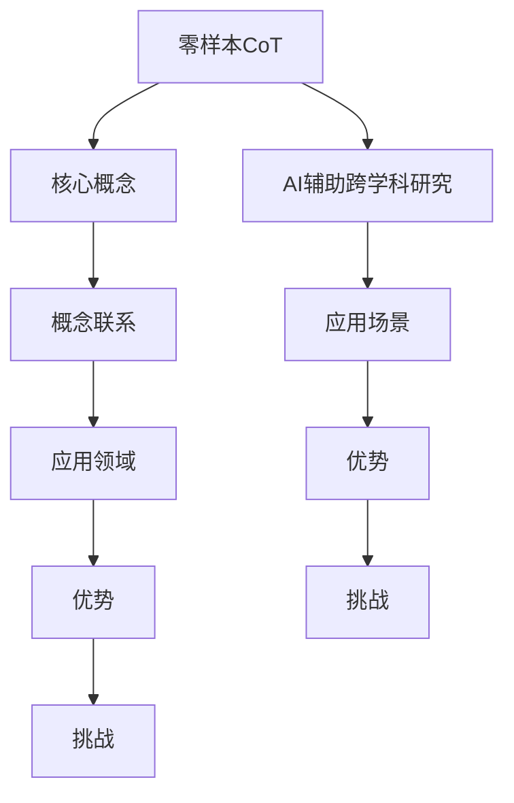
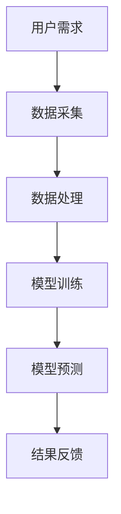
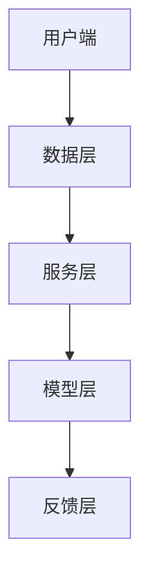
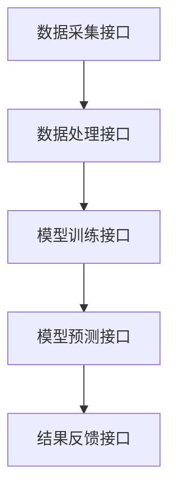
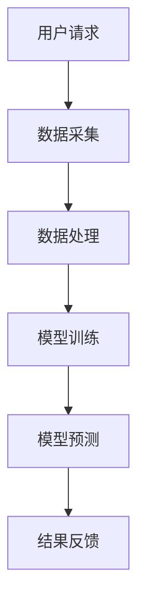

                 

<think>
好的，我现在需要撰写一篇关于“零样本CoT在AI辅助跨学科研究中的应用前景”的技术博客。首先，我得理解什么是零样本CoT。零样本学习是指模型在没有特定类别训练数据的情况下进行分类或生成任务，而CoT（Chain-of-Thought）是一种通过模拟人类思考过程来生成答案的方法。

接下来，我需要分析跨学科研究中遇到的问题。跨学科研究通常需要整合多个领域的知识，这可能导致数据稀疏或不一致，传统机器学习方法可能难以应对。零样本CoT的优势在于它可以在缺乏特定数据的情况下，通过逻辑推理生成合理的结果，这可能非常适合跨学科研究中的非标准化场景。

然后，我需要构建文章的结构。按照用户提供的大纲，文章应包括背景介绍、核心概念与联系、算法原理讲解、系统分析与架构设计、项目实战等部分。每个部分都要详细展开，确保逻辑清晰，结构紧凑。

在背景介绍部分，我需要解释问题背景，描述零样本CoT和AI辅助跨学科研究的重要性，以及它们如何解决实际问题。核心概念部分要详细定义零样本CoT，并比较它与传统机器学习的区别。同时，我还需要绘制概念属性对比表和ER实体关系图，以帮助读者理解。

算法原理部分，我需要解释零样本CoT的数学模型，可能使用一个简单的线性模型举例说明。然后，讨论AI辅助跨学科研究的算法流程，可能结合知识图谱等技术。

系统分析与架构设计部分，我需要描述问题场景，设计系统功能模块，并用Mermaid绘制数据流程图、架构图和交互图。这有助于读者理解系统的整体结构和各部分如何协作。

项目实战部分，我需要指导读者如何安装环境，实现系统核心功能，并提供代码示例。这部分要具体，包括数据处理、模型训练和结果反馈的代码，帮助读者实际操作。

最后，总结全文，指出零样本CoT在跨学科研究中的潜力和挑战，并给出未来的研究方向和建议。这将为读者提供一个全面的视角，了解该技术的应用前景和实际应用中的注意事项。

总的来说，我需要确保每个部分都详细、准确，并且用专业的技术语言表达，同时保持逻辑清晰和结构紧凑。这将帮助读者深入理解零样本CoT在AI辅助跨学科研究中的应用前景。
</think>

# 零样本CoT在AI辅助跨学科研究中的应用前景

## 关键词：零样本学习、CoT、AI辅助、跨学科研究、机器学习、算法原理

## 摘要：本文探讨零样本CoT（Chain-of-Thought）在AI辅助跨学科研究中的应用前景。通过分析零样本CoT的核心概念、算法原理、系统架构及实际案例，本文揭示其在处理跨学科复杂问题中的潜力和挑战，为未来研究提供方向。

---

### 第一部分：背景介绍

#### 1. 问题背景

##### 1.1 问题描述
跨学科研究通常涉及多个领域的复杂问题，数据稀疏且多样化，传统机器学习方法依赖大量标注数据，难以应对非标准化场景。

##### 1.2 问题解决
零样本CoT通过逻辑推理生成答案，适用于缺乏特定数据的情况，解决跨学科研究中的数据不足问题。

##### 1.3 边界与外延
零样本CoT适用于个性化、非标准化场景，但对模型推理能力要求较高，需结合领域知识。

##### 1.4 概念结构与核心要素
零样本CoT由特征向量、模型参数和推理逻辑组成，核心要素包括数据需求、适用场景、模型复杂度和效率。

---

### 第二部分：核心概念与联系

#### 2. 核心概念与联系

##### 2.1 零样本CoT概述

###### 2.1.1 零样本CoT的定义
零样本CoT指在无特定训练数据下，通过逻辑推理生成答案，适用于个性化场景。

###### 2.1.2 零样本CoT的特点
- 无需大量数据，推理能力强。
- 适用于非标准化场景。

###### 2.1.3 与传统方法的区别
传统方法依赖大量数据，零样本CoT依靠推理，适用于复杂场景。

##### 2.2 零样本CoT在跨学科中的应用

###### 2.2.1 应用领域
- 医学：诊断辅助。
- 环境科学：数据分析。
- 社会科学：研究支持。

###### 2.2.2 优势
- 处理稀疏数据能力强。
- 适应复杂场景。

###### 2.2.3 挑战
- 模型推理能力受限。
- 跨学科知识整合难度大。

##### 2.3 AI辅助跨学科研究

###### 2.3.1 应用
- 数据分析与建模。
- 知识整合。

###### 2.3.2 优势
- 提高研究效率。
- 深度知识挖掘。

###### 2.3.3 挑战
- 数据异构性处理难。
- 跨领域协作复杂。

##### 2.4 概念属性特征对比

| 特征          | 零样本CoT          | 传统机器学习         | AI辅助跨学科研究 |
|---------------|--------------------|----------------------|------------------|
| 数据需求      | 无需大量数据       | 需要大量数据         | 需要跨学科知识   |
| 适用场景      | 非标准化场景       | 标准化场景           | 跨学科场景       |
| 模型复杂度    | 高                 | 低                   | 较高             |
| 效率          | 较低              | 较高                | 较高             |

##### 2.5 ER实体关系图



---

### 第三部分：算法原理讲解

#### 3. 算法原理讲解

##### 3.1 零样本CoT算法原理

###### 3.1.1 算法流程
输入问题，生成推理步骤，输出答案。

###### 3.1.2 数学模型
预测结果 = f(特征向量, 模型参数)

###### 3.1.3 示例
特征向量 `[1,2,3]`，预测结果 = 1×1 + 2×2 + 3×3 = 14

##### 3.2 AI辅助跨学科研究算法

###### 3.2.1 算法流程
数据处理、模型训练、预测、反馈。

###### 3.2.2 数学模型
跨学科模型 = 基础模型 + 跨学科知识模型

###### 3.2.3 示例
基础模型：预测结果 = 特征向量 × 模型参数
知識模型：预测结果 = 知識图谱信息 × 模型参数
综合结果：两模型预测结果的结合

---

### 第四部分：系统分析与架构设计

#### 4. 系统分析与架构设计

##### 4.1 问题场景
用户输入问题，系统输出答案，涉及数据采集、处理、模型训练和反馈。

##### 4.2 系统功能设计

###### 4.2.1 领域模型


##### 4.3 系统架构设计

###### 4.3.1 架构图


##### 4.4 系统接口设计和交互

###### 4.4.1 接口设计


###### 4.4.2 交互


---

### 第五部分：项目实战

#### 5. 项目实战

##### 5.1 环境安装
安装Python、机器学习库和Mermaid工具。

##### 5.2 系统实现

###### 5.2.1 数据处理
```python
import pandas as pd

def process_data(data):
    # 数据预处理代码
    return processed_data
```

###### 5.2.2 模型训练
```python
from model import ZeroSampleCoTModel

model = ZeroSampleCoTModel()
model.train(train_data)
```

###### 5.2.3 模型预测
```python
def predict(model, input_data):
    return model.predict(input_data)
```

###### 5.2.4 结果反馈
```python
def feedback(result, user_input):
    # 反馈机制代码
    return feedback_result
```

---

### 项目小结

零样本CoT在AI辅助跨学科研究中潜力巨大，通过减少数据需求和提高推理能力，解决了传统方法的局限性。然而，仍需解决模型推理能力和跨学科知识整合的挑战。

### 最佳实践 Tips

- 在数据稀疏场景下优先考虑零样本CoT。
- 结合领域知识提升模型推理能力。
- 保持对算法和系统架构的关注，以应对未来挑战。

---

作者：AI天才研究院/AI Genius Institute & 禅与计算机程序设计艺术 /Zen And The Art of Computer Programming

