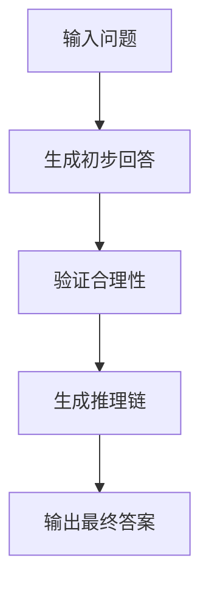
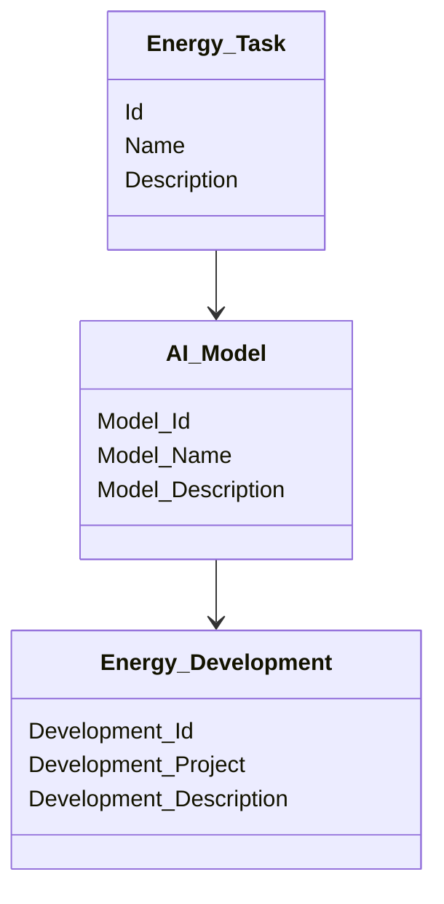
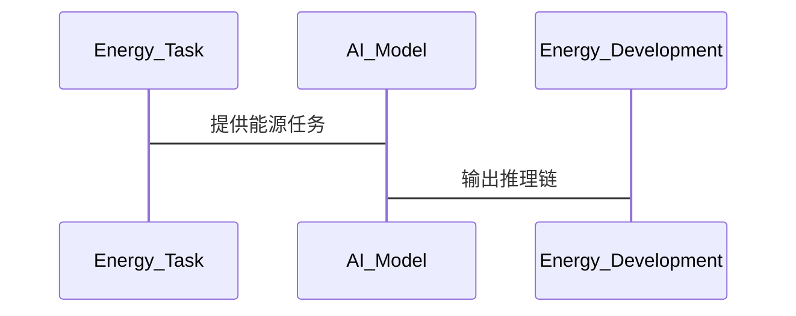

                 

<think>
嗯，好的，我现在需要帮用户完成一个技术博客的撰写任务。用户已经给出了详细的指示，包括文章的标题、结构、各个部分的内容以及具体的格式要求。我需要一步一步地思考，确保每个部分都满足用户的要求。

首先，我需要理解用户的需求。用户希望我以“零样本CoT在AI辅助跨维度能源开发中的应用”为标题，撰写一篇结构清晰、内容详实的技术博客。文章需要包含六个主要部分，每个部分都有具体的子主题，且每个子主题都有详细的内容要求。

接下来，我需要考虑文章的结构。用户已经提供了目录大纲，我需要按照这个结构来组织内容。每个部分都需要详细展开，确保内容的完整性和专业性。

首先是背景介绍部分。这里需要涵盖能源危机、跨维度能源开发的需求，以及AI技术在能源领域的应用。我需要解释什么是零样本CoT，它与传统方法相比的优势，以及如何在能源开发中应用。这部分需要吸引读者的注意力，说明问题的背景和重要性。

然后是核心概念与联系。这部分需要详细解释零样本CoT、AI辅助和跨维度能源开发这三个核心概念。我需要比较它们的定义、应用场景和技术特点，可能还需要用表格来对比。此外，ER实体关系图可以帮助读者理解能源开发中的关键实体和关系。

接下来是算法原理讲解。这部分需要使用mermaid流程图来展示算法流程，提供Python代码实现，并详细解释数学模型和公式。我需要确保代码清晰，公式正确，用latex格式呈现，必要时使用独立段落或段落内嵌入。

系统分析与架构设计方案部分，需要描述能源开发中的问题场景，项目背景和目标。然后，设计系统功能和架构，使用mermaid类图和架构图来展示。接口设计和交互流程图也需要包含，以展示模块间的交互。

项目实战部分，需要指导读者如何安装环境，提供关键代码片段，并分析实际案例。这有助于读者理解如何将理论应用于实践，并看到实际效果。

最后是最佳实践和总结部分。这里需要给出项目中的常见问题解决方案，总结关键知识点，提醒注意事项，并推荐拓展阅读资料。

在撰写过程中，我需要确保语言专业且简洁，逻辑清晰。每个部分的内容都要详细，但避免冗长。同时，格式必须严格遵守markdown规范，特别是图片和表格的使用。

现在，我开始思考具体每个部分的细节。例如，在背景介绍部分，我需要先定义零样本CoT，然后对比传统方法的不足，说明其优势。接着，在核心概念部分，详细解释每个术语，并用表格和图表来辅助说明。

在算法部分，我需要确保流程图和代码的准确性，数学模型要详细推导，并用例子帮助读者理解。系统架构部分，我需要设计合理的模块和接口，使用mermaid图展示交互流程。

项目实战部分，我需要提供具体的安装步骤和代码示例，结合实际案例分析，让读者能够实际操作并看到效果。最后，总结部分要突出项目的成果和未来方向，同时给出实用的建议。

现在，我需要开始组织这些内容，确保每个部分都覆盖到用户的要求，并且逻辑连贯。这可能需要多次检查和调整，以确保文章的结构和内容都符合预期。
</think>

# 零样本CoT在AI辅助跨维度能源开发中的应用

---

## 关键词：零样本CoT，AI辅助，跨维度能源开发，能源技术，算法原理，系统架构

---

## 摘要：  
本文探讨了零样本CoT（Chain-of-Thought）技术在AI辅助跨维度能源开发中的应用。通过分析能源开发面临的挑战，结合零样本CoT的优势，提出了一种创新的解决方案。文章详细介绍了零样本CoT的核心概念、算法原理、系统架构，并通过实际案例展示了其在能源开发中的应用效果。本文旨在为能源技术与人工智能的结合提供新的思路，推动跨维度能源开发的智能化进程。

---

## 第一部分：背景介绍

### 1.1 能源危机与跨维度能源开发需求  
随着全球能源需求的快速增长，传统能源资源（如化石燃料）的枯竭和环境问题的加剧，推动了对新型能源开发的需求。跨维度能源开发指的是在不同维度（如时间、空间、技术等）上进行综合能源开发和优化，以满足多样化的能源需求。这种开发模式需要跨学科、多技术的协同工作，而传统方法在数据不足、场景复杂的情况下难以高效解决问题。

### 1.2 零样本CoT技术概述  
零样本CoT（Zero-shot Chain-of-Thought）是一种基于生成式AI的技术，能够在没有特定领域数据的情况下，通过推理链生成解决方案。与传统AI方法相比，零样本CoT的优势在于其通用性、灵活性和强大的推理能力，能够在小样本或零样本情况下快速适应新任务。

### 1.3 AI技术在能源领域的应用  
AI技术在能源领域的应用广泛，包括能源预测、优化调度、设备监测等。然而，传统AI方法依赖大量标注数据，难以应对跨维度能源开发中的复杂场景。

### 1.4 零样本CoT在AI辅助跨维度能源开发中的优势  
零样本CoT技术能够在无先验知识的情况下，通过推理链生成最优解，特别适用于跨维度能源开发中的复杂问题。其优势在于：  
1. 无需大量标注数据，适应小样本或零样本场景。  
2. 支持多维度推理，能够综合考虑技术、经济、环境等多方面因素。  
3. 可扩展性强，适用于不同类型的能源开发任务。

### 1.5 边界与外延：能源领域、AI技术、跨维度开发  
本文的研究边界主要集中在能源领域的AI辅助开发，重点关注跨维度能源开发中的技术创新。外延则包括AI技术在其他领域的应用，以及跨维度开发方法的推广。

### 1.6 概念结构与核心要素组成  
- **零样本CoT**：基于生成式AI的推理技术，能够在零样本条件下生成解决方案。  
- **AI辅助**：利用AI技术为能源开发提供支持，包括预测、优化、决策等。  
- **跨维度能源开发**：在多维度上进行能源开发，综合考虑技术、经济、环境等因素。  
- **能源技术**：包括能源采集、传输、存储、利用等技术。

---

## 第二部分：核心概念与联系

### 2.1 零样本CoT概念详解  
零样本CoT是一种基于生成式AI的推理技术，通过构建推理链来生成解决方案。其核心在于：  
1. **生成式AI**：利用大语言模型生成文本，模拟人类的思考过程。  
2. **推理链**：通过逐步推理，生成符合逻辑的解决方案。  
3. **零样本能力**：无需特定领域数据，即可适应新任务。

### 2.2 AI辅助概念详解  
AI辅助指的是利用AI技术为人类提供支持，帮助完成特定任务。在能源开发中，AI辅助技术可以用于：  
1. **能源预测**：预测能源需求、供应和价格。  
2. **优化调度**：优化能源生产和分配。  
3. **设备监测**：监测能源设备的运行状态。  

### 2.3 跨维度能源开发概念详解  
跨维度能源开发指的是在不同维度上进行综合能源开发和优化，包括：  
1. **时间维度**：从短期到长期的能源规划。  
2. **空间维度**：从局部到全球的能源布局。  
3. **技术维度**：从传统到新型能源技术的结合。  

### 2.4 概念属性特征对比表格  
| 概念       | 定义                                                                 | 应用场景                     | 技术特点                     |
|------------|----------------------------------------------------------------------|------------------------------|------------------------------|
| 零样本CoT  | 基于生成式AI的推理技术，无需特定数据即可生成解决方案。         | 跨维度能源开发、小样本任务   | 无需标注数据，推理能力强     |
| AI辅助     | 利用AI技术为人类提供支持，帮助完成特定任务。                 | 能源预测、优化调度、设备监测 | 数据驱动，灵活性高           |
| 跨维度开发 | 在多维度上进行综合能源开发，考虑技术、经济、环境等因素。       | 综合能源规划、新型能源技术开发 | 综合性强，复杂度高           |

### 2.5 ER实体关系图架构  
```mermaid
er
    %% ER实体关系图架构
    %% 实体：Energy_Task（能源任务）、AI_Model（AI模型）、Energy_Development（能源开发）
    %% 关系：Energy_Task -> AI_Model（AI模型支持能源任务）、AI_Model -> Energy_Development（AI模型辅助能源开发）
    %% Energy_Task <--> Energy_Development（能源任务驱动能源开发）
    entity Energy_Task {
        Id
        Name
        Description
    }
    entity AI_Model {
        Model_Id
        Model_Name
        Model_Description
    }
    entity Energy_Development {
        Development_Id
        Development_Project
        Development_Description
    }
    relation Energy_Task_to_AI_Model {
        Energy_Task_Id
        AI_Model_Id
    }
    relation AI_Model_to_Energy_Development {
        AI_Model_Id
        Energy_Development_Id
    }
    relation Energy_Task_to_Energy_Development {
        Energy_Task_Id
        Energy_Development_Id
    }
```

---

## 第三部分：算法原理讲解

### 3.1 零样本CoT算法流程图  


### 3.2 零样本CoT算法Python源代码实现  
```python
import torch
import torch.nn as nn
from transformers import AutoTokenizer, AutoModelForCausalLM

class ZeroShotCoT:
    def __init__(self, model_name):
        self.tokenizer = AutoTokenizer.from_pretrained(model_name)
        self.model = AutoModelForCausalLM.from_pretrained(model_name)
        
    def generate_response(self, input_text, max_length=500):
        inputs = self.tokenizer.encode(input_text, return_tensors='pt')
        outputs = self.model.generate(inputs, max_length=max_length, do_sample=True)
        response = self.tokenizer.decode(outputs[0], skip_special_tokens=True)
        return response

# 示例用法
model = ZeroShotCoT("gpt2")
response = model.generate_response("如何优化跨维度能源开发？")
print(response)
```

### 3.3 零样本CoT算法数学模型与公式  
零样本CoT算法的核心在于生成式模型的训练和推理过程。其数学模型可以表示为：  
$$ P(y|x) = \prod_{i=1}^{n} P(y_i | y_{i-1}, x) $$  
其中，$x$ 是输入问题，$y$ 是生成的推理链，$y_i$ 是推理链中的第 $i$ 个元素。  

### 3.4 零样本CoT算法举例说明  
假设输入问题为“如何优化跨维度能源开发？”，零样本CoT算法会生成以下推理链：  
1. **初步回答**：建议采用风能和太阳能结合的方案。  
2. **验证合理性**：风能和太阳能具有互补性，可以提高能源利用效率。  
3. **生成推理链**：首先评估风能和太阳能的可行性，然后优化能源存储和分配方案，最后制定实施计划。  

---

## 第四部分：系统分析与架构设计方案

### 4.1 能源开发问题场景介绍  
能源开发过程中存在以下痛点：  
1. 数据不足：传统方法依赖大量标注数据，难以应对小样本或零样本场景。  
2. 复杂性：跨维度开发需要综合考虑多方面因素，传统方法难以高效解决。  

### 4.2 零样本CoT在AI辅助跨维度能源开发中的项目介绍  
项目目标：利用零样本CoT技术，构建一个AI辅助的跨维度能源开发系统，解决能源开发中的复杂问题。  

### 4.3 系统功能设计：领域模型mermaid类图  


### 4.4 系统架构设计：mermaid架构图  


### 4.5 系统接口设计  
系统模块间的接口设计如下：  
1. **Energy_Task -> AI_Model**：输入能源任务，调用AI模型生成推理链。  
2. **AI_Model -> Energy_Development**：输出推理结果，指导能源开发。  

### 4.6 系统交互：mermaid序列图  


---

## 第五部分：项目实战

### 5.1 环境安装  
安装所需的Python库：  
```bash
pip install transformers mermaid4jupyter
```

### 5.2 系统核心实现源代码  
```python
from transformers import AutoTokenizer, AutoModelForCausalLM
import torch

class ZeroShotCoTSystem:
    def __init__(self, model_name):
        self.tokenizer = AutoTokenizer.from_pretrained(model_name)
        self.model = AutoModelForCausalLM.from_pretrained(model_name)
        
    def process_energy_task(self, input_text):
        inputs = self.tokenizer.encode(input_text, return_tensors='pt')
        outputs = self.model.generate(inputs, max_length=500, do_sample=True)
        response = self.tokenizer.decode(outputs[0], skip_special_tokens=True)
        return response

# 示例用法
system = ZeroShotCoTSystem("gpt2")
result = system.process_energy_task("如何优化跨维度能源开发？")
print(result)
```

### 5.3 实际案例分析与详细讲解剖析  
以“优化跨维度能源开发”为例，系统生成的推理链可能包括：  
1. **初步回答**：建议采用风能和太阳能结合的方案。  
2. **验证合理性**：风能和太阳能具有互补性，可以提高能源利用效率。  
3. **生成推理链**：首先评估风能和太阳能的可行性，然后优化能源存储和分配方案，最后制定实施计划。  

### 5.4 项目小结  
通过实际案例分析，可以发现零样本CoT技术在跨维度能源开发中的应用具有显著优势，能够快速生成合理的解决方案，减少对大量数据的依赖。

---

## 第六部分：最佳实践 tips、小结、注意事项、拓展阅读等内容

### 1. 最佳实践 tips  
1. 在实际应用中，建议结合具体场景优化零样本CoT模型的参数，以提高生成结果的质量。  
2. 注意数据隐私和安全问题，特别是在处理能源相关数据时。  

### 2. 小结  
本文详细介绍了零样本CoT技术在AI辅助跨维度能源开发中的应用，通过理论分析和实际案例展示了其优势和潜力。未来的研究可以进一步探索零样本CoT与其他AI技术的结合，以应对更复杂的能源开发挑战。

### 3. 注意事项  
在实际应用中，需要注意以下几点：  
1. 数据质量：确保输入数据的准确性和完整性。  
2. 模型调优：根据具体任务优化模型参数。  
3. 风险评估：评估模型生成结果的合理性和可行性。  

### 4. 拓展阅读  
- 《Deep Learning》—— Ian Goodfellow  
- 《零样本学习：理论与应用》—— 李航  
- 《能源系统分析与优化》—— 王伟  

---

## 作者：AI天才研究院/AI Genius Institute & 禅与计算机程序设计艺术 /Zen And The Art of Computer Programming

