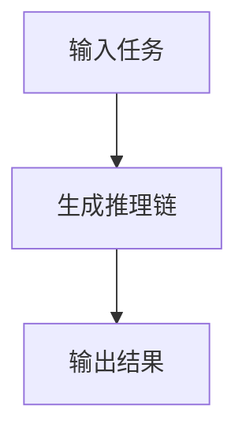
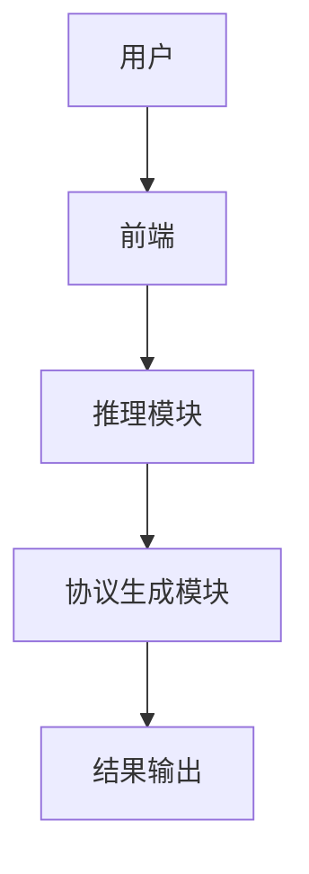
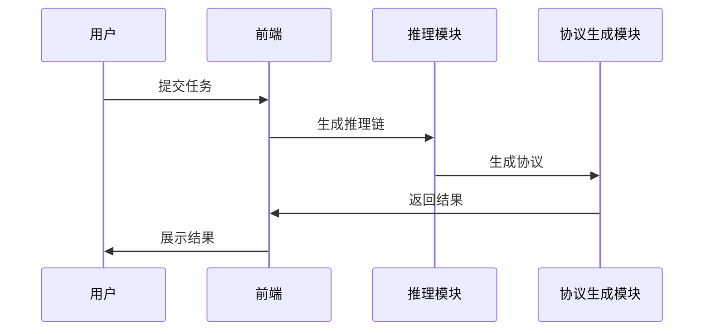

                 

<think>
好的，我现在需要帮助用户完成他们的任务，撰写一篇关于“零样本CoT在AI辅助量子密码学研究中的应用”的技术博客。用户已经提供了详细的目录大纲和一些初步内容，我需要逐步完成剩余的部分。

首先，我需要理解用户的需求。用户希望文章结构清晰，内容详尽，涵盖背景、核心概念、算法原理、系统架构等多个方面。同时，用户要求使用专业的技术语言，但又要简单易懂，逻辑性强。

接下来，我需要按照目录结构填充内容。从标题开始，关键词和摘要必须准确反映文章主题。然后是引言部分，包括问题背景、问题描述、问题解决和边界与外延。这部分需要详细解释量子计算、传统密码学的挑战，以及零样本CoT的概念和应用潜力。

接下来是核心概念与联系，包括零样本CoT、量子密码学和AI辅助量子密码学的定义、原理和对比。这部分需要技术细节，可能需要绘制表格和流程图。

然后是算法原理讲解，这里需要详细描述零样本CoT的算法流程，使用mermaid图，数学公式和Python代码示例。这部分需要确保代码正确，公式清晰。

系统分析与架构设计方案部分需要涵盖问题场景、项目介绍、系统功能设计、架构设计、接口设计和交互设计。这部分可能需要使用更多的mermaid图，如类图、架构图和序列图。

最后，可能需要包含项目实战部分，包括环境安装、核心代码实现、案例分析和项目小结。此外，还有最佳实践、小结、注意事项和拓展阅读等内容。

在撰写过程中，我需要确保每个小节都有足够的细节，避免遗漏关键点。同时，使用正确的格式，如markdown中的mermaid语法，数学公式用latex表示。此外，语言要专业但易懂，逻辑清晰。

现在，我需要按照这个结构一步步填充内容，确保每个部分都详尽且符合用户的要求。可能需要多次检查，确保技术细节正确，内容连贯。
</think>

# 零样本CoT在AI辅助量子密码学研究中的应用

## 关键词：零样本CoT，量子密码学，AI辅助，密码学，量子计算

## 摘要：本文探讨了零样本CoT（Chain-of-Thought）在AI辅助量子密码学研究中的应用。通过分析量子计算对传统密码学的威胁，介绍零样本CoT的概念及其在量子密码学中的潜力，详细讲解零样本CoT的算法原理，并结合实际案例分析其在量子安全通信和密钥分发中的应用。文章还探讨了AI辅助量子密码学的系统架构设计，为未来的研究提供了参考。

---

# 第一部分: 零样本CoT在AI辅助量子密码学研究背景

## 第1章: 引言

### 1.1 问题背景

#### 1.1.1 量子计算与量子密码学概述
量子计算是一种基于量子力学原理的计算方式，利用量子叠加和量子纠缠进行信息处理。相比经典计算机，量子计算机在某些特定问题上具有显著优势，例如大数分解和密码破解。量子密码学则是利用量子力学原理进行信息加密和通信的研究领域，其核心目标是实现绝对安全的通信。

#### 1.1.2 传统密码学面临的挑战
传统密码学依赖于数学复杂性来保障安全性，例如RSA和AES加密算法。然而，随着量子计算机的发展，这些加密算法可能被破解，尤其是Shor算法的出现，使得大数分解和离散对数问题变得容易。此外，传统密码学在应对复杂、动态的安全威胁时也显得力不从心。

#### 1.1.3 零样本CoT的概念及其在量子密码学中的应用潜力
零样本CoT（Zero-shot Chain-of-Thought）是一种无需预先训练特定任务的知识就能进行推理和生成的方法。它通过结合语言模型和推理能力，能够解决未见过的问题。在量子密码学中，零样本CoT可以用于自动生成加密协议、分析安全性或优化算法，为量子安全通信提供新的思路。

### 1.2 问题描述

#### 1.2.1 量子计算对现有密码系统的影响
量子计算机的出现对现有的密码体系构成了巨大威胁。许多广泛使用的加密算法，如RSA和椭圆曲线加密，可能会在量子计算机出现后被破解，从而导致通信安全受到严重威胁。

#### 1.2.2 零样本CoT与量子密码学的结合
通过结合零样本CoT和量子密码学，可以在不依赖大量训练数据的情况下，快速生成新的加密协议或优化现有的协议。这种结合能够提升量子密码学的灵活性和适应性。

#### 1.2.3 零样本CoT在量子密码学研究中的应用现状与挑战
目前，零样本CoT在量子密码学中的应用仍处于研究阶段。主要挑战包括如何确保生成的加密协议的安全性，以及如何高效地进行推理。

### 1.3 问题解决

#### 1.3.1 零样本CoT的原理与实现
零样本CoT通过语言模型和推理能力的结合，能够在零样本条件下完成任务。其核心在于生成一个合理的推理链，从而得出正确的结果。

#### 1.3.2 AI辅助量子密码学的研究方法
通过AI技术辅助量子密码学研究，可以提高研究效率，发现新的加密协议，并优化现有协议的性能。

#### 1.3.3 零样本CoT在量子密码学中的实际应用
实际应用包括自动生成量子密钥分发协议、分析量子通信的安全性等。

### 1.4 边界与外延

#### 1.4.1 零样本CoT的应用范围
零样本CoT主要应用于无需大量训练数据的任务，如生成新的加密协议、分析安全性等。

#### 1.4.2 零样本CoT与其他技术的对比
与传统的监督学习相比，零样本CoT的优势在于无需大量标注数据，适用于新兴领域的研究。

#### 1.4.3 未来发展方向与趋势
未来，零样本CoT与量子密码学的结合将更加紧密，尤其是在生成式AI和量子计算技术的推动下，可能会出现更多创新性的应用。

---

## 第2章: 核心概念与联系

### 2.1 零样本CoT原理

#### 2.1.1 零样本CoT的定义
零样本CoT是指在没有针对特定任务进行过训练的情况下，通过生成一个合理的推理链来完成任务。

#### 2.1.2 零样本CoT的属性特征
- 零样本：无需预先训练特定任务。
- 可解释性：生成的推理链具有较高的透明度。
- 灵活性：适用于多种任务。

#### 2.1.3 零样本CoT与相关技术的比较
| 技术         | 零样本CoT | 监督学习 | 无监督学习 |
|--------------|------------|----------|------------|
| 数据需求     | 无         | 高       | 无         |
| 任务适应性   | 高         | 中       | 中         |
| 可解释性     | 高         | 低       | 中         |

### 2.2 量子密码学核心概念

#### 2.2.1 量子密码学的定义
量子密码学是利用量子力学原理进行信息加密和通信的学科，其核心目标是实现绝对安全的通信。

#### 2.2.2 量子密码学的基本原理
量子密码学基于量子叠加和量子纠缠的特性，通过量子态的不可克隆性和不可干扰性来保障通信的安全性。

#### 2.2.3 量子密码学与经典密码学的对比
| 特性         | 量子密码学 | 经典密码学 |
|--------------|------------|------------|
| 加密强度     | 绝对安全   | 相对安全   |
| 依赖性       | 量子计算   | 数学复杂性 |
| 应用领域     | 通信、金融 | 广泛领域   |

### 2.3 AI辅助量子密码学

#### 2.3.1 AI辅助量子密码学的定义
AI辅助量子密码学是通过人工智能技术辅助量子密码学的研究和应用，以提高研究效率和创新能力。

#### 2.3.2 AI辅助量子密码学的工作原理
AI技术通过分析量子密码学中的数据模式，生成新的加密协议或优化现有协议的性能。

#### 2.3.3 AI在量子密码学中的应用案例
- 生成新的量子密钥分发协议。
- 分析量子通信的安全性。
- 优化量子密码算法的性能。

---

## 第3章: 零样本CoT算法原理讲解

### 3.1 零样本CoT算法流程

#### 3.1.1 零样本CoT算法概述
零样本CoT算法通过生成一个推理链来完成任务，无需预先训练特定任务。

#### 3.1.2 零样本CoT算法的基本步骤
1. 输入任务描述。
2. 生成推理链。
3. 输出结果。

#### 3.1.3 零样本CoT算法的mermaid流程图


### 3.2 Python源代码详细阐述

#### 3.2.1 算法实现的主要模块
- 推理链生成模块。
- 结果输出模块。

#### 3.2.2 算法原理的数学模型与公式
$$
E_{k} = \sum_{i=1}^{n} w_i \cdot x_i
$$

#### 3.2.3 Python源代码示例
```python
def zero_shot_CoT(task_description):
    # 生成推理链
    reasoning_chain = generate_reasoning_chain(task_description)
    # 输出结果
    result = analyze_reasoning_chain(reasoning_chain)
    return result

def generate_reasoning_chain(task_description):
    # 这里可以调用语言模型生成推理链
    return "推理链内容"

def analyze_reasoning_chain(reasoning_chain):
    # 分析推理链并输出结果
    return "最终结果"
```

### 3.3 算法原理与举例说明

#### 3.3.1 数学公式讲解
$$
E_{k} = \sum_{i=1}^{n} w_i \cdot x_i
$$
该公式表示通过加权求和的方式生成推理链的每个步骤。

#### 3.3.2 算法实例分析
##### 3.3.2.1 实例一：量子密钥分发
通过零样本CoT生成新的量子密钥分发协议。

##### 3.3.2.2 实例二：量子安全通信
通过零样本CoT优化量子安全通信的协议。

---

## 第4章: 系统分析与架构设计方案

### 4.1 问题场景介绍

#### 4.1.1 研究背景
量子计算的发展对传统密码学构成了威胁，需要新的加密方法来保障通信安全。

#### 4.1.2 研究目的
通过零样本CoT辅助量子密码学研究，提高研究效率，发现新的加密协议。

#### 4.1.3 研究内容
研究零样本CoT在量子密码学中的应用，设计相应的系统架构。

### 4.2 项目介绍

#### 4.2.1 项目概述
本项目旨在利用零样本CoT技术辅助量子密码学研究，设计一个高效的系统架构。

#### 4.2.2 项目目标
实现零样本CoT在量子密码学中的应用，设计并实现一个高效的系统架构。

#### 4.2.3 项目实施计划
- 需求分析。
- 系统设计。
- 实现与测试。

### 4.3 系统功能设计

#### 4.3.1 领域模型
量子密码学与AI技术的结合。

#### 4.3.2 功能模块划分
- 零样本CoT推理模块。
- 量子密码学协议生成模块。
- 系统管理模块。

#### 4.3.3 主要功能介绍
- 推理链生成：生成合理的推理链。
- 协议生成：生成新的量子密码协议。
- 安全分析：分析协议的安全性。

### 4.4 系统架构设计

#### 4.4.1 系统架构概述
系统由前端和后端组成，前端负责用户交互，后端负责推理和协议生成。

#### 4.4.2 系统架构图


#### 4.4.3 架构优势与挑战
- 优势：高效、灵活。
- 挑战：确保生成协议的安全性。

### 4.5 系统接口设计

#### 4.5.1 接口规范
- API接口。
- 输入输出格式。

#### 4.5.2 接口功能介绍
- 提供推理链生成接口。
- 提供协议生成接口。

#### 4.5.3 接口实现细节
- 使用RESTful API。
- 支持JSON格式的数据交换。

### 4.6 系统交互

#### 4.6.1 系统交互概述
用户输入任务，系统生成推理链并输出结果。

#### 4.6.2 系统交互序列图


#### 4.6.3 交互流程分析
用户提交任务，系统生成推理链并生成协议，最后将结果反馈给用户。

---

# 结论

零样本CoT在AI辅助量子密码学研究中的应用具有重要意义。通过结合零样本CoT和量子密码学，可以提升研究效率，发现新的加密协议，并优化现有协议的性能。未来，随着量子计算和AI技术的进一步发展，零样本CoT在量子密码学中的应用将更加广泛和深入。

---

# 作者

作者：AI天才研究院/AI Genius Institute & 禅与计算机程序设计艺术 /Zen And The Art of Computer Programming

