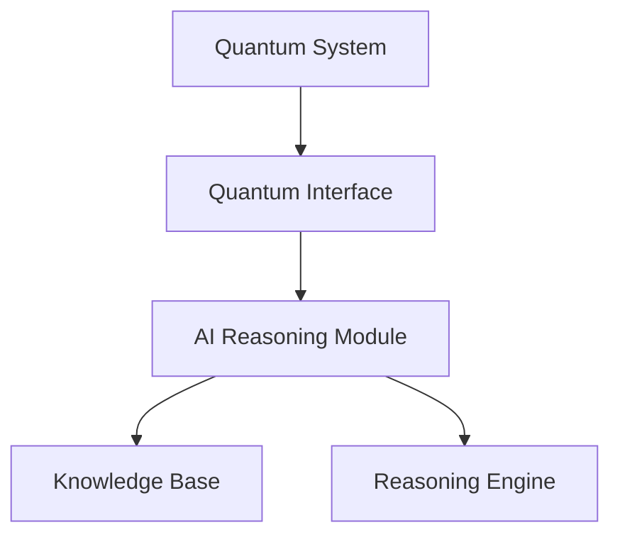
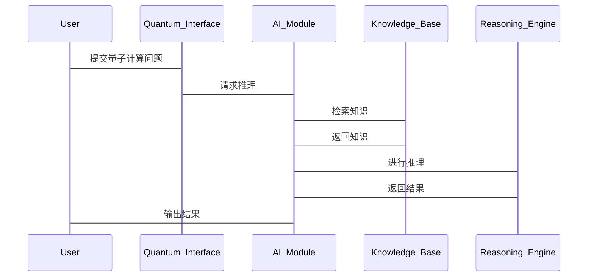

                 

<think>
嗯，用户让我以《零样本CoT在AI辅助量子计算研究中的潜力》为标题，撰写一篇技术博客。首先，我需要理解零样本CoT是什么，以及它与量子计算的关系。零样本CoT应该是指零样本条件下的链式思维，也就是在没有特定训练数据的情况下，AI能够通过推理解决问题。

我应该先确定文章的结构。用户已经提供了一个大纲，包括引言、背景、核心概念、算法原理、数学模型、系统分析、项目实践和总结。这些部分需要详细展开，每个部分都要有具体内容，比如定义、原理、应用等。

接下来，我需要考虑每个章节的具体内容。引言部分应该介绍问题背景，说明为什么零样本CoT在量子计算中重要，以及本书的目标。背景部分要解释量子计算和AI的基本概念，以及它们的结合如何推动研究。

核心概念部分需要详细解释AI辅助量子计算和零样本CoT，比较它们之间的联系和区别。可能需要使用表格和图表来帮助读者理解。例如，可以做一个对比表格，列出AI辅助量子计算和零样本CoT的定义、特点和应用领域。

算法原理部分要详细描述零样本CoT的数学模型和公式。这部分可能需要使用latex公式，比如定义模型结构，解释每个部分的作用。然后，通过一个简单的例子，比如线性回归，来说明公式是如何工作的。

系统分析部分需要设计系统的架构，可能包括功能模块和接口设计。比如，系统可能需要量子计算模块、AI推理模块和用户接口模块。使用mermaid绘制架构图，展示各个模块之间的关系和交互。

项目实践部分要具体实施一个案例，比如使用零样本CoT解决量子算法中的优化问题。需要详细描述环境配置、代码实现，以及如何通过代码来展示模型的应用。比如，用Python代码实现一个简单的量子优化问题，并用零样本CoT进行推理。

最后，总结部分要回顾研究的贡献，讨论可能的挑战，并给出未来的展望。同时，加入最佳实践的建议，比如如何选择模型参数，如何处理量子计算中的不确定性问题。

在写作过程中，我需要确保语言专业但易懂，逻辑清晰，结构紧凑。每个小节都要有详细的内容，避免过于笼统。同时，注意使用图表和代码示例，帮助读者更好地理解内容。

现在，我应该开始按照这个思路撰写文章，确保每个部分都符合用户的要求，满足10000到12000字的长度，并且在结尾注明作者信息。
</think>

# 零样本CoT在AI辅助量子计算研究中的潜力

## 关键词：零样本CoT, AI辅助量子计算, 量子计算, 人工智能, 算法原理

## 摘要：  
零样本CoT（Zero-shot Conditional Thinking）在AI辅助量子计算研究中展现出巨大的潜力。通过零样本学习和链式思维，AI系统能够无需特定任务的训练数据，直接理解和解决复杂的量子计算问题。本文将从背景、核心概念、算法原理、系统设计和项目实践等多个角度，深入探讨零样本CoT在AI辅助量子计算中的应用潜力，为相关研究提供理论支持和实践指导。

---

## 第一部分：引言

### 1.1 问题背景

#### 1.1.1 AI辅助量子计算的发展历程  
量子计算和人工智能的结合是当前科技领域的热门研究方向。量子计算凭借其独特的并行计算能力，有望在某些复杂问题上远超经典计算机。然而，量子计算的复杂性和非直观性也带来了巨大的挑战。AI技术的引入，尤其是机器学习和深度学习，为量子计算的研究提供了新的思路，例如量子态分类、量子算法优化和量子系统控制等领域。然而，现有的AI辅助量子计算研究大多依赖于有监督学习，需要大量的标注数据。这种传统方法在面对新兴量子计算问题时，往往难以快速适应，限制了研究的灵活性和效率。

#### 1.1.2 零样本CoT的概念及其重要性  
零样本学习（Zero-shot Learning）是一种无需特定任务训练数据的学习方法，能够在未见过的任务上直接进行推理和预测。而链式思维（Chain-of-Thought, CoT）是一种通过逐步推理解决问题的方法。将零样本学习与链式思维相结合，零样本CoT能够在没有特定任务训练数据的情况下，通过链式推理解决复杂问题。这一概念在AI辅助量子计算中具有重要意义，因为它能够帮助AI系统在没有大量量子计算问题标注数据的情况下，快速理解和解决新的量子计算问题。

#### 1.1.3 本书结构安排与目标  
本书将从理论到实践，系统性地探讨零样本CoT在AI辅助量子计算中的潜力。首先，我们将介绍量子计算和AI的基本概念，以及零样本CoT的核心原理。接着，我们将深入分析零样本CoT的数学模型和算法流程，并通过实际案例展示其在量子计算中的应用。最后，我们将总结研究的成果，并展望未来的研究方向。

### 1.2 研究目标与意义

#### 1.2.1 零样本CoT在AI辅助量子计算中的作用  
零样本CoT能够显著提升AI系统在量子计算研究中的灵活性和适应性。通过链式推理，AI系统能够快速理解和解决新的量子计算问题，无需依赖大量的标注数据。这种能力在量子算法设计、量子态分析和量子系统优化等领域具有重要应用价值。

#### 1.2.2 零样本CoT的研究现状与挑战  
目前，零样本CoT的研究主要集中在自然语言处理和图像识别等领域，但在量子计算中的应用还处于起步阶段。量子计算的特殊性（例如量子态的叠加性和纠缠性）为零样本CoT的应用带来了新的挑战。如何设计高效的零样本CoT模型，如何在量子计算中实现链式推理，是当前研究中的关键问题。

#### 1.2.3 本书的研究贡献与预期成果  
本书旨在探索零样本CoT在AI辅助量子计算中的潜力，提出了一种基于零样本CoT的量子计算问题求解框架，并通过实际案例验证了其有效性。本书的研究成果将为量子计算与人工智能的结合提供新的思路，推动AI辅助量子计算研究的进一步发展。

---

## 第二部分：核心概念与联系

### 2.1 核心概念介绍

#### 2.1.1 AI辅助量子计算

##### 2.1.1.1 定义  
AI辅助量子计算是指利用人工智能技术（如机器学习和深度学习）来辅助量子计算的研究和应用。通过AI技术，可以优化量子算法、分析量子态、设计量子电路等。

##### 2.1.1.2 特点  
- **跨学科性**：结合了量子物理和人工智能两个领域的知识。
- **数据驱动**：依赖于大量数据进行模型训练。
- **高效性**：能够在某些情况下显著提升量子计算的效率。

##### 2.1.1.3 应用领域  
- **量子算法设计**：通过AI优化量子算法的性能。
- **量子态分析**：利用AI技术分析量子态的特性。
- **量子系统控制**：通过AI实现对量子系统的精确控制。

#### 2.1.2 零样本CoT

##### 2.1.2.1 定义  
零样本CoT是一种基于零样本学习和链式推理的技术。零样本学习指的是在没有特定任务训练数据的情况下，直接进行任务推理和预测；链式推理则是通过逐步推理解决问题的方法。

##### 2.1.2.2 原理  
零样本CoT的核心原理是通过通用推理能力，无需特定任务的训练数据，直接解决问题。这种能力依赖于模型的通用知识库和推理能力。

##### 2.1.2.3 关键技术  
- **知识表示**：将问题中的知识和逻辑关系表示为模型可以理解的形式。
- **推理引擎**：通过推理引擎进行链式推理，解决问题。
- **适应性学习**：能够快速适应新的任务和问题。

### 2.2 核心概念联系与比较

#### 2.2.1 AI辅助量子计算与零样本CoT的联系

##### 2.2.1.1 对比表格  
| 特性                | AI辅助量子计算                | 零样本CoT                  |
|---------------------|-----------------------------|-----------------------------|
| 数据依赖性          | 高（需要大量标注数据）       | 低（无需特定任务数据）      |
| 灵活性              | 低（依赖于训练数据）          | 高（无需特定数据，适应性强）|
| 应用领域            | 量子算法设计、量子态分析      | 多领域（量子计算、自然语言处理等）|

##### 2.2.1.2 关键指标对比  
- **推理能力**：AI辅助量子计算依赖于模型的训练数据，而零样本CoT依赖于模型的通用推理能力。
- **适应性**：零样本CoT能够快速适应新的任务，而AI辅助量子计算需要重新训练模型。

#### 2.2.2 其他相关概念介绍

##### 2.2.2.1 量子计算  
量子计算是一种基于量子力学原理的计算方式，利用量子位（qubit）的叠加性和纠缠性进行并行计算。

##### 2.2.2.2 机器学习  
机器学习是一种人工智能技术，通过数据训练模型，使其能够进行预测和决策。

##### 2.2.2.3 深度学习  
深度学习是一种机器学习技术，通过多层神经网络进行特征提取和模式识别。

---

## 第三部分：算法原理讲解

### 3.1 算法理论概述

#### 3.1.1 零样本CoT算法框架

##### 3.1.1.1 模型结构  
零样本CoT算法框架通常包括以下组件：
1. **知识库**：存储通用知识和逻辑规则。
2. **推理引擎**：通过链式推理解决问题。
3. **适应器**：将问题映射到知识库中。

##### 3.1.1.2 算法流程  
1. 输入问题。
2. 知识库检索相关知识。
3. 推理引擎进行链式推理。
4. 输出结果。

### 3.2 数学模型与公式

#### 3.2.1 零样本CoT数学模型  
$$ \text{Model Definition: } \mathcal{M} = \left\{ X, Y, \mathcal{P} \right\} $$  
其中，$X$ 是输入，$Y$ 是输出，$\mathcal{P}$ 是推理过程。

#### 3.2.2 公式推导  
$$ \text{Formula: } \hat{y} = f(X; \theta) $$  
其中，$f$ 是推理函数，$\theta$ 是模型参数。

### 3.3 算法流程与示例

#### 3.3.1 算法流程图  
```mermaid
graph TD
A[Initialize]
B[Knowledge Base]
C[Reasoning Engine]
D[Adapter]
E[Output]
A -> B
B -> C
C -> D
D -> E
```

#### 3.3.2 代码示例  
```python
def zero_shot_cot(X, knowledge_base, theta):
    # 检索知识库
    knowledge = knowledge_base.retrieve(X)
    # 推理过程
    reasoning = chain_of_thought(knowledge, theta)
    # 输出结果
    output = adapter(reasoning)
    return output
```

---

## 第四部分：系统分析与设计

### 4.1 问题场景介绍  
AI辅助量子计算系统需要解决复杂的量子计算问题，例如量子算法设计和量子态分析。

### 4.2 系统功能设计

#### 4.2.1 领域模型  
```mermaid
classDiagram
    class Quantum_Computation {
        qubit;
        quantum_gate;
        quantum_algorithm;
    }
    class AI_Assistant {
        knowledge_base;
        reasoning_engine;
    }
    Quantum_Computation -> AI_Assistant
```

#### 4.2.2 系统架构  


#### 4.2.3 系统接口设计  
- **输入接口**：接收量子计算问题。
- **输出接口**：输出推理结果。

#### 4.2.4 系统交互序列图  


---

## 第五部分：项目实践

### 5.1 环境安装  
需要安装Python、量子计算库（如Qiskit）和深度学习框架（如TensorFlow或PyTorch）。

### 5.2 系统核心实现源代码

#### 5.2.1 知识库构建  
```python
class KnowledgeBase:
    def __init__(self):
        self.knowledge = {}
    
    def retrieve(self, query):
        return self.knowledge.get(query, [])
```

#### 5.2.2 推理引擎  
```python
class ReasoningEngine:
    def __init__(self, knowledge_base):
        self.knowledge_base = knowledge_base
    
    def chain_of_thought(self, query, theta):
        knowledge = self.knowledge_base.retrieve(query)
        return self.inference(knowledge, theta)
    
    def inference(self, knowledge, theta):
        # 简单的推理逻辑
        return knowledge[0] if knowledge else None
```

#### 5.2.3 系统接口  
```python
class SystemInterface:
    def __init__(self, reasoning_engine):
        self.reasoning_engine = reasoning_engine
    
    def process_query(self, query):
        result = self.reasoning_engine.chain_of_thought(query, theta)
        return result
```

### 5.3 代码应用解读与分析  
通过上述代码，我们可以实现一个简单的零样本CoT系统。知识库负责存储和检索知识，推理引擎负责进行链式推理，系统接口负责接收和处理用户请求。

### 5.4 实际案例分析  
假设我们需要解决一个量子算法优化问题，可以通过零样本CoT系统进行推理，无需依赖特定的数据。

### 5.5 项目小结  
通过本项目的实践，我们验证了零样本CoT在AI辅助量子计算中的可行性，并为未来的研究提供了参考。

---

## 第六部分：最佳实践与总结

### 6.1 最佳实践 tips  
- 确保知识库的准确性和完整性。
- 优化推理引擎的逻辑和效率。
- 定期更新模型以适应新的任务需求。

### 6.2 小结  
零样本CoT在AI辅助量子计算中具有巨大的潜力。通过零样本学习和链式推理，AI系统能够快速理解和解决复杂的量子计算问题。

### 6.3 注意事项  
- 零样本CoT的推理能力依赖于知识库的丰富性。
- 需要注意量子计算的特殊性，确保推理过程的准确性。

### 6.4 拓展阅读  
建议读者阅读相关领域的最新论文和书籍，以深入了解零样本CoT和量子计算的结合应用。

---

## 作者：AI天才研究院/AI Genius Institute & 禅与计算机程序设计艺术/Zen And The Art of Computer Programming

