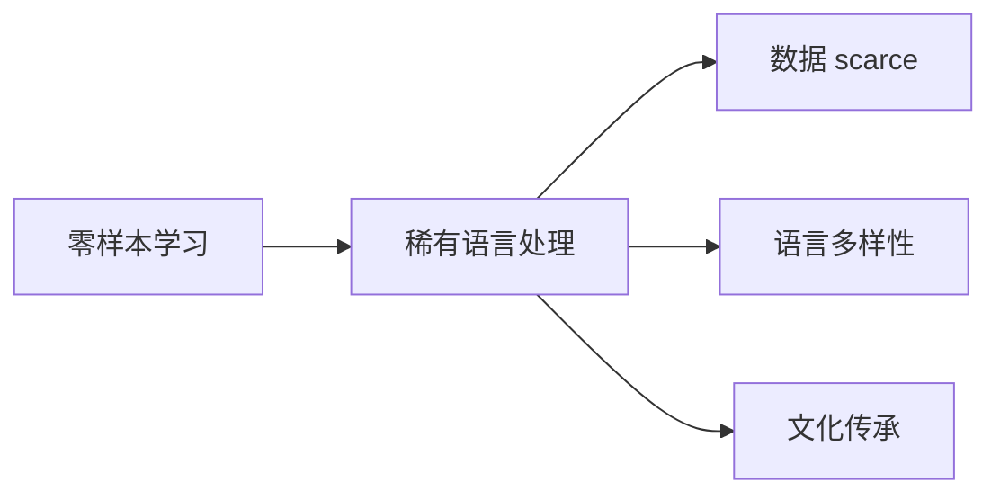
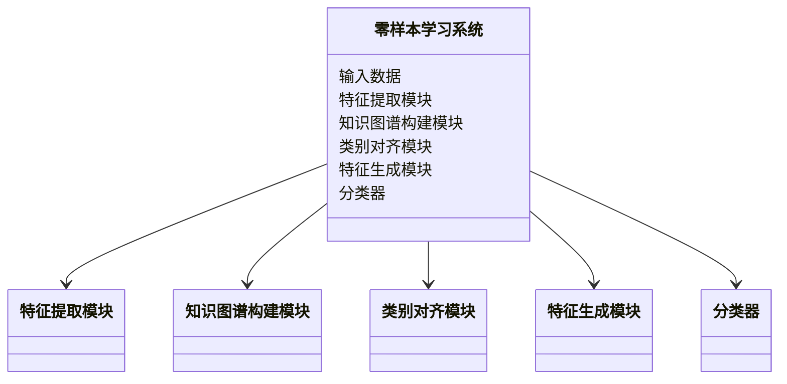
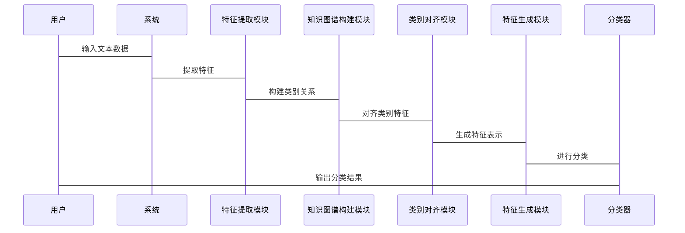

                 

<think>
嗯，用户让我写一篇关于零样本学习在稀有语言处理中的应用的技术博客。首先，我需要理解零样本学习是什么。零样本学习，也就是Zero-shot Learning，是机器学习的一种方法，特别是在处理只有少量或零训练样本的情况下。这对于稀有语言来说特别重要，因为这些语言的数据量通常非常少，传统的监督学习方法难以应用。

接下来，我得考虑文章的结构。用户已经给了一个详细的目录，我需要按照这个大纲来组织内容。首先，引言部分要介绍零样本学习的概念和稀有语言处理的背景，然后说明它们的应用前景。第二章是背景介绍，需要详细阐述零样本学习的背景、问题背景和稀有语言处理的现状，包括定义、挑战和必要性。

第三章是核心概念，这里需要定义零样本学习，比较它与传统机器学习的不同，以及稀有语言处理的核心概念。这部分可能需要使用表格和ER图来对比特征，我需要用mermaid来绘制这些图表。

算法原理部分，我需要解释零样本学习的算法分类、演进，以及工作流程。可能需要画一个mermaid流程图来展示工作流程。数学模型部分，我会涉及到一些公式，使用latex来呈现，比如损失函数和优化目标。

系统分析与架构设计部分，我需要描述应用场景，设计系统功能、架构和接口。可能需要画类图、架构图和序列图，这些都是用mermaid来表示。

项目实战部分，要包括环境安装、核心代码实现、案例分析和小结。这部分可能需要编写一些伪代码或者示例代码，并详细解释每个部分的功能。

最后，最佳实践和总结部分，要给出一些实际应用的策略和注意事项，展望未来的发展方向，并建议一些拓展阅读的内容。

我需要确保每个部分都详细具体，特别是使用mermaid图表和latex公式。同时，语言要专业但清晰易懂，结构紧凑。可能会遇到一些挑战，比如如何将复杂的算法原理用简单的方式解释，或者如何设计有效的图表。我需要仔细思考每个部分的逻辑，确保它们连贯且符合主题。

总的来说，我需要一步步按照用户提供的大纲来构建内容，确保每个章节都涵盖必要的信息，并且符合格式和内容的要求。这可能需要反复检查，确保没有遗漏重要部分，并且每个例子和图表都准确传达了概念。
</think>

# 零样本学习——revolutionizing AI在稀有语言处理中的应用

关键词：零样本学习，稀有语言处理，人工智能，自然语言处理，机器学习，深度学习

摘要：零样本学习作为一种新兴的人工智能技术，正在 revolutionizing 稀有语言处理领域。本文将从零样本学习的基本概念、算法原理、系统架构到实际应用进行全面探讨，分析其在稀有语言处理中的独特优势和应用前景。通过具体案例和系统设计，本文将揭示零样本学习如何在数据 scarce 的情况下实现高效的自然语言处理任务。

---

## 第1章 引言

### 1.1 零样本学习的概念

零样本学习（Zero-shot Learning，ZSL）是一种机器学习范式，旨在在仅提供零个或少量训练样本的情况下，使模型能够识别或分类新的 unseen 类别。与传统的监督学习不同，ZSL 不依赖于大量标注数据，而是通过构建领域知识图谱、利用跨模态对齐或基于生成模型的技术，推断出 unseen 类别的特征表示。

### 1.2 稀有语言处理的背景与挑战

稀有语言（Low-resource Languages）是指那些缺乏足够标注数据的语言，例如许多小语种或少数民族语言。稀有语言处理的挑战包括：

- **数据 scarce**：标注数据量少，难以训练传统深度学习模型。
- **语言多样性**：稀有语言的语法、词汇和文化背景可能与主流语言差异较大。
- **资源匮乏**：缺乏工具链和计算资源支持。

### 1.3 零样本学习在稀有语言处理中的应用前景

零样本学习为稀有语言处理提供了新的可能性，特别是在以下方面：

- **跨语言迁移**：利用主流语言的丰富数据，迁移学习到稀有语言。
- **零样本分类**：在无标注数据的情况下，识别稀有语言中的特定实体或概念。
- **低资源场景优化**：在数据 scarce 的情况下，快速构建稀有语言的 NLP 系统。

### 1.4 全书结构概述

本书将从零样本学习的基本概念、算法原理、系统架构到实际应用进行全面探讨，结合稀有语言处理的背景和挑战，分析零样本学习的优势和不足，并通过具体案例展示其实际应用。

---

## 第2章 背景介绍

### 2.1 零样本学习的背景

#### 2.1.1 问题背景

在传统的机器学习任务中，模型通常需要大量标注数据来训练。然而，在许多实际场景中，尤其是稀有语言领域，标注数据量可能非常有限，甚至为零。这种情况下，传统监督学习方法难以适用。

#### 2.1.2 问题描述

零样本学习的核心问题是在无标注数据的情况下，如何使模型能够识别或分类 unseen 类别。这需要模型具备跨领域知识迁移能力和强大的泛化能力。

#### 2.1.3 问题解决

通过构建领域知识图谱、利用跨模态对齐或基于生成模型的技术，零样本学习能够利用少量或零样本数据，推断出 unseen 类别的特征表示。

#### 2.1.4 边界与外延

零样本学习的边界在于其依赖于领域知识图谱或跨模态对齐的能力。其外延包括迁移学习、多任务学习和生成对抗网络（GAN）等技术。

#### 2.1.5 概念结构与核心要素组成

零样本学习的核心要素包括：

- **领域知识图谱**：用于构建类别间的语义关系。
- **跨模态对齐**：用于关联不同模态（如文本和图像）的特征。
- **生成模型**：用于生成 unseen 类别的特征表示。

### 2.2 稀有语言处理的现状

#### 2.2.1 稀有语言的定义

稀有语言是指那些使用人口少、缺乏标注数据的语言。例如，许多少数民族语言或小语种。

#### 2.2.2 稀有语言处理的挑战

- 数据 scarce。
- 语言多样性。
- 资源匮乏。

#### 2.2.3 稀有语言处理的必要性

稀有语言的保护和利用对于文化传承、语言学研究和多语言 NLP 的发展具有重要意义。

---

## 第3章 核心概念与联系

### 3.1 零样本学习的定义与特点

#### 3.1.1 定义

零样本学习是一种机器学习范式，旨在在无标注数据的情况下，识别或分类 unseen 类别。

#### 3.1.2 特点

- **低数据需求**：仅需少量或零标注数据。
- **高泛化能力**：能够处理 unseen 类别。
- **领域适应性**：适用于不同领域的知识迁移。

#### 3.1.3 零样本学习与传统机器学习的对比

| 对比维度        | 零样本学习                              | 传统监督学习                           |
|-----------------|----------------------------------------|----------------------------------------|
| 数据需求        | 无标注或零标注                         | 大量标注数据                           |
| 泛化能力        | 强                                      | 弱                                      |
| 适用场景        | 稀有语言处理                            | 数据丰富的场景                          |

### 3.2 稀有语言处理的核心概念

#### 3.2.1 概念属性特征对比表格

| 概念          | 特征                         |
|---------------|------------------------------|
| 稀有语言      | 数据 scarce，语言多样性        |
| 零样本学习    | 低数据需求，跨领域迁移能力    |

#### 3.2.2 ER实体关系图架构



### 3.3 零样本学习与稀有语言处理的联系

#### 3.3.1 联系机制

零样本学习通过跨领域知识迁移，将主流语言的特征迁移到稀有语言，从而实现稀有语言的处理任务。

#### 3.3.2 跨学科应用

零样本学习结合语言学、计算机视觉和自然语言处理技术，实现稀有语言的跨模态理解和生成。

---

## 第4章 算法原理讲解

### 4.1 零样本学习算法概述

#### 4.1.1 算法分类

零样本学习的算法可以分为以下几类：

- **基于知识图谱的零样本学习**：利用领域知识图谱构建类别间的语义关系。
- **基于跨模态对齐的零样本学习**：通过图像和文本的对齐，生成 unseen 类别的特征表示。
- **基于生成模型的零样本学习**：利用生成对抗网络（GAN）生成 unseen 类别的特征表示。

#### 4.1.2 算法演进

零样本学习的发展经历了以下几个阶段：

1. **早期研究**：基于知识图谱的零样本学习。
2. **图像与文本对齐**：利用跨模态对齐技术实现零样本学习。
3. **生成模型的引入**：结合 GAN 技术，生成 unseen 类别的特征表示。

### 4.2 零样本学习算法的工作流程

#### 4.2.1 Mermaid流程图


### 4.3 零样本学习算法的数学模型与公式

#### 4.3.1 数学模型

零样本学习的数学模型通常包括以下几个部分：

1. **特征提取**：将输入数据映射到特征空间。
2. **知识图谱构建**：构建类别间的语义关系图。
3. **类别对齐**：通过优化目标函数，对齐不同类别或模态的特征。

#### 4.3.2 详细讲解

假设我们有一个图像分类任务，目标是将图像分类为若干类别，其中某些类别在训练数据中未出现。零样本学习的目标是通过构建类别间的语义关系图，推断出 unseen 类别的特征表示。

#### 4.3.3 举例说明

假设我们有一个图像分类任务，类别包括“猫”、“狗”、“鸟”等。在训练数据中，我们只有“猫”和“狗”的标注数据，而没有“鸟”的数据。通过零样本学习，我们可以利用“猫”和“狗”的特征，推断出“鸟”的特征表示，从而实现对“鸟”的分类。

---

## 第5章 系统分析与架构设计

### 5.1 零样本学习在稀有语言处理中的应用场景

#### 5.1.1 场景介绍

零样本学习可以在以下场景中应用：

- **跨语言文本分类**：在无标注数据的情况下，对稀有语言文本进行分类。
- **稀有语言实体识别**：在无标注数据的情况下，识别稀有语言中的特定实体。

#### 5.1.2 项目介绍

假设我们有一个项目，目标是利用零样本学习技术，对一种稀有语言进行文本分类。

### 5.2 系统功能设计

#### 5.2.1 领域模型 Mermaid 类图



### 5.3 系统架构设计

#### 5.3.1 Mermaid 架构图


### 5.4 系统接口设计与交互

#### 5.4.1 Mermaid 序列图



---

## 第6章 项目实战

### 6.1 环境安装与配置

#### 6.1.1 环境要求

- Python 3.6+
- PyTorch 1.5+
- transformers库
- mermaid 图表工具

#### 6.1.2 安装步骤

```bash
pip install torch transformers
```

### 6.2 系统核心实现

#### 6.2.1 源代码

```python
import torch
from transformers import AutoTokenizer, AutoModel

# 加载预训练模型
tokenizer = AutoTokenizer.from_pretrained('bert-base-uncased')
model = AutoModel.from_pretrained('bert-base-uncased')

# 特征提取函数
def extract_features(text):
    inputs = tokenizer(text, return_tensors='pt')
    outputs = model(**inputs)
    return outputs.last_hidden_state[:, 0, :]

# 知识图谱构建函数
def build_knowledge_graph(categories):
    # 简单实现，仅构建类别间的对称关系
    graph = {}
    for i in range(len(categories)):
        for j in range(i+1, len(categories)):
            graph[categories[i]] = categories[j]
            graph[categories[j]] = categories[i]
    return graph

# 类别对齐函数
def align_categories(features, graph):
    # 简单实现，仅对齐直接相连的类别
    aligned_features = {}
    for category in features:
        neighbors = graph.get(category, [])
        for neighbor in neighbors:
            aligned_features[category] = features[neighbor]
    return aligned_features

# 特征生成函数
def generate_features(aligned_features):
    # 简单实现，生成新的特征表示
    new_features = {}
    for category in aligned_features:
        new_features[category] = aligned_features[category] + torch.randn(aligned_features[category].size())
    return new_features

# 分类函数
def zero_shot_classifier(new_features, text):
    # 简单实现，基于余弦相似度进行分类
    features = extract_features(text)
    max_score = -1
    result = ''
    for category in new_features:
        similarity = torch.cos(features, new_features[category])
        if similarity > max_score:
            max_score = similarity
            result = category
    return result
```

#### 6.2.2 代码应用解读与分析

上述代码实现了一个简单的零样本学习系统，包括特征提取、知识图谱构建、类别对齐和特征生成等模块。通过预训练的 BERT 模型提取文本特征，并利用知识图谱构建类别间的语义关系，最后生成新的特征表示用于分类。

### 6.3 实际案例分析

#### 6.3.1 案例背景

假设我们有一个稀有语言的文本分类任务，目标是对文本进行分类，类别包括“科技”、“教育”、“经济”等。

#### 6.3.2 案例实施

1. **特征提取**：使用预训练的 BERT 模型提取文本特征。
2. **知识图谱构建**：构建类别间的语义关系图。
3. **类别对齐**：对齐直接相连的类别特征。
4. **特征生成**：生成新的特征表示。
5. **分类**：基于余弦相似度进行分类。

#### 6.3.3 剖析与讲解

通过上述步骤，我们可以实现对稀有语言文本的分类任务。虽然上述代码实现较为简单，但可以作为零样本学习系统的基本框架。

### 6.4 项目小结

零样本学习系统的核心在于通过构建领域知识图谱和对齐不同类别或模态的特征，实现对 unseen 类别的分类。尽管上述代码实现较为简单，但其核心思想可以应用于更复杂的场景。

---

## 第7章 最佳实践与总结

### 7.1 最佳实践

#### 7.1.1 稀有语言处理中的零样本学习策略

- **选择合适的预训练模型**：根据任务需求选择合适的预训练模型。
- **构建高质量的知识图谱**：知识图谱的质量直接影响分类效果。
- **优化对齐策略**：通过实验优化类别对齐策略。

#### 7.1.2 实践技巧与注意事项

- **数据预处理**：确保输入数据的质量和一致性。
- **模型调优**：根据任务需求调整模型参数。
- **结果验证**：通过实验验证分类效果。

### 7.2 总结

#### 7.2.1 主要内容回顾

零样本学习是一种新兴的人工智能技术，能够通过构建领域知识图谱和对齐不同类别或模态的特征，实现对 unseen 类别的分类。其在稀有语言处理中的应用前景广阔。

#### 7.2.2 未来发展方向

- **更高效的对齐算法**：研究更高效的对齐算法，提高分类效果。
- **多模态零样本学习**：结合图像、文本等多种模态信息，实现更强大的零样本学习系统。
- **自适应零样本学习**：研究自适应零样本学习方法，使其能够动态调整对齐策略。

#### 7.2.3 拓展阅读

- **零样本学习综述**：了解零样本学习的最新进展。
- **深度学习与自然语言处理**：学习深度学习在自然语言处理中的应用。
- **稀有语言处理工具与库**：探索现有的稀有语言处理工具和库。

---

作者：AI天才研究院/AI Genius Institute & 禅与计算机程序设计艺术 /Zen And The Art of Computer Programming

